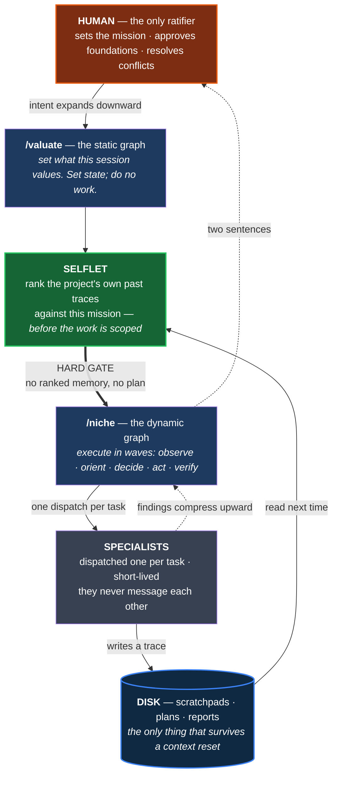
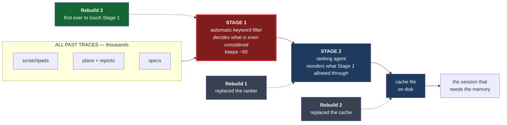
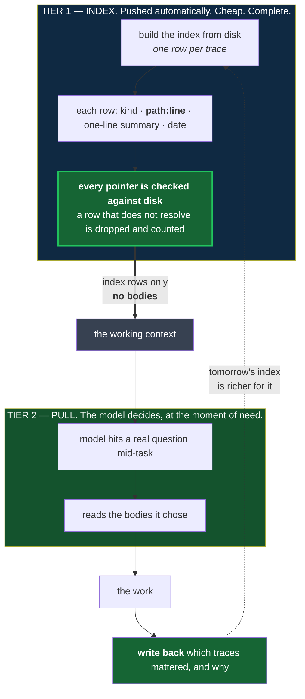

# UrbanRepML

**Dense geospatial (urban) embeddings from independent modalities, fused on hexagonal grids, probed for what they learned.**

[](https://www.python.org/downloads/)
[](https://opensource.org/licenses/MIT)
[](https://github.com/kraina-ai/srai)

UrbanRepML learns dense geospatial (urban) representations by encoding each data modality independently, fusing them spatially through multi-resolution U-Net architectures on [H3 hexagonal grids](https://h3geo.org/), then probing the resulting embeddings against external ground truth. All spatial operations use [SRAI](https://github.com/kraina-ai/srai). The project is developed by a human and [13 dispatchable specialist AI agents](#the-team) coordinated through stigmergic scratchpads.

For philosophical & societal motivation, and early results of the fullareaU-NET, see the [Active Inference Institute talk](https://www.youtube.com/watch?v=UYD8CR_Xorg&ab_channel=ActiveInferenceInstitute).

---

> **This is the public atlas.** This repository is a manually-synced public subset of a private research repository, containing figures, reports, and findings rather than runnable code. Synced 2026-08-13.

---

## What this project does

The Netherlands is cut into small hexagonal tiles — about 560,000 of them, each roughly
0.1 km², a little smaller than a city block. This is the [H3 grid](https://h3geo.org/), a
standard way of chopping the world into hexagons so that every dataset can be lined up on
the same tiles. For each tile, UrbanRepML asks several independent sources what they see
there: a satellite, a map of shops and amenities, a road network. Each source produces a
list of numbers describing that tile — an **embedding**. The embeddings are then combined,
and the combined description is tested by asking a simple question: *given only these
numbers, can you predict something real about the place?* That test is called a **probe**,
and the score it reports is **R²** — the fraction of the real-world variation the numbers
explain, where 1.0 is perfect and 0.0 is no better than guessing the national average.

Everything below is a preliminary result on one study area (the Netherlands). Where a
number comes from an artifact that has since been superseded, the caption says so.


***The country as seen by a satellite embedding, with no human categories imposed.** Each
hexagon's 64-number AlphaEarth description is compressed to three numbers and painted as
red/green/blue. Coastline, polder, forest, and city separate on their own. First component
explains 30.2% of the variation, first three explain 60.1%; 398,931 hexagons.
**Vintage: AlphaEarth 2022. Caveat:** this figure was rendered on the study-area grid used
before the 2026-06-07 boundary correction, so its hexagon count is not the current
canonical one (558,626 land hexagons at this resolution). The picture is representative;
the count is historical. Source:
[Book of Netherlands](reports/2026-05-03-book/THE_BOOK.md), ch. 1.*

---

## Headline: averaging a hexagon with its neighbours beats these trained models

The most useful thing we have found so far is a result *against* our own deep models.

Take a hexagon's embedding and simply replace it with a weighted average of itself and
every hexagon within 10 steps of it. That is **ring aggregation** — a blur. It has zero
trainable parameters and takes minutes. Compare it against neural networks trained for
hours to fuse the same inputs. On our current best evidence the blur wins, and it wins by
a wide margin.

The weighting matters, and **it is logarithmic weighting that wins, not exponential**. On
the canonical 178-dimension fused embedding, averaged over 11 prediction targets:

| ring-aggregation weighting | mean R² (all 11 targets) | mean R² (livability only) |
|---|---|---|
| **logarithmic** | **0.4849** | **0.5213** |
| linear | 0.4844 | 0.5210 |
| exponential | 0.4738 | 0.4990 |
| flat (unweighted) | 0.4531 | 0.4956 |

The best *learned* model in the comparison — a graph U-Net variant — reaches 0.391 on the
livability targets. The gap of roughly 0.13 is far larger than any plausible measurement
wobble. All figures from
[`ring_agg_res9_k10_table.md`](reports/2026-07-20-probabilistic-fusion-res10-netherlands/ring_agg_rebaseline/ring_agg_res9_k10_table.md).

**Three caveats we will not bury.** First, **the comparison is not capacity-matched**: the
learned cells compress their input down to 64 numbers while the ring-aggregation arms keep
all 178, so this is a floor comparison, not a fair fight — the source table says so itself.
Second, **the learned comparators here are self-supervised U-Net variants.** An earlier,
*supervised* multi-resolution U-Net actually beat ring aggregation on 4 of 6 livability
sub-scores and on the overall mean (0.574 vs 0.535) — see
[the 2026-03-29 comparison](reports/2026-03-29-ring-agg-plus-unet-probe-comparison/README.md).
No single experiment on the current grid pits ring aggregation against a *supervised*
U-Net; until one exists, read this headline as "beats these learned variants", not "beats
learned models". Third, **the folds are random, not spatial** — see the honesty note below.


***The same result seen a second way, without any probe.** Each embedding is cut into 8
groups of similar places, and we ask how cleanly those groups separate each of the six
livability sub-scores (brighter = cleaner separation, one-way ANOVA F). Ring aggregation
(middle column) wins 4 of 6; the raw unsmoothed stack wins the other 2; the **supervised
U-Net loses on all six, including the composite score it was trained on**. So the
smoothing advantage is not an artefact of one probe setup — it shows up in unsupervised
grouping too. **Vintage: embeddings 2022 (legacy 208D artifacts), leefbaarometer 2022
scores. Caveat:** this figure predates the current 178D embedding and uses a different
grid; it corroborates the direction of the headline, not its exact magnitude. Source:
[Book of Netherlands](reports/2026-05-03-book/THE_BOOK.md), ch. 5.*

### The honesty note that belongs next to every number above

**The target and the embeddings are not from the same year.** The livability scores come
from the Leefbaarometer 3.0 *2024* release, mapped onto *2024* neighbourhood geometry,
with the 2022 score column selected. The embeddings describe 2022. The project's own
provenance record marks this pair as **not temporally aligned**. Worse for interpretation,
the two only overlap on **131,194 of 537,970 hexagons — 24.4%**: the Leefbaarometer is
undefined outside built-up areas, so three-quarters of the country is simply absent from
every livability R² on this page. Both numbers verified from
[`ring_agg_res9_k10_table.md`](reports/2026-07-20-probabilistic-fusion-res10-netherlands/ring_agg_rebaseline/ring_agg_res9_k10_table.md)
and the target artifact's own provenance sidecar.


***The target itself, and why the caveat above matters.** This is what the probes are
predicting. Note the lacework: the Leefbaarometer is only defined where people live, so
the map is full of holes. Those holes are the missing 75.6% — every livability R² on this
page is computed only on the coloured part. **Vintage: Leefbaarometer 2022 scores.**
Source: [Book of Netherlands](reports/2026-05-03-book/THE_BOOK.md), ch. 5.*

**Cross-validation differs between figures, and you should know which you are reading.**
Where a model is scored, the data is split into folds — train on some, test on the rest.
Splitting *randomly* is easy but leaks: two adjacent hexagons are nearly the same place, so
one landing in training and one in testing flatters the score. **Spatial block CV** instead
carves the country into 10 km × 10 km blocks and keeps whole blocks together, which is
harder and more honest. The 2026-07 headline table above uses **random 5-fold**; the probe
figures in the next two sections use **spatial block CV**. An earlier version of this
README claimed all probes used spatial blocks. That was wrong, and it is corrected here.

---

## Livability: a neural probe reads more than a straight line does

Having built embeddings, the question is what is actually written in them. The
**Leefbaarometer** is a Dutch government index of neighbourhood livability, published per
neighbourhood and built from dozens of indicators. It has six sub-scores: overall (`lbm`),
physical environment (`fys`), safety (`onv`), social cohesion (`soc`), amenities and
services (`vrz`), and housing quality (`won`). We hold the embedding fixed and vary only
the probe: first straight-line regression, then a small neural network.

| Straight-line probe, amenities: R² = 0.649 | Neural probe, same target: R² = 0.761 |
|:---:|:---:|
|  |  |

***The same embedding, read two ways.** Predicted amenity/service provision across the
Netherlands. A straight-line (ridge) probe explains 65% of the variation; a small neural
network on identical inputs explains 76%. The extra 11 points are what a straight line
structurally cannot see — the relationship between satellite features and amenity provision
is curved, not linear. **Setup: AlphaEarth only (64 numbers per hexagon), H3 resolution 10,
5-fold spatial block CV at 10 km. Vintage: AlphaEarth 2022; Leefbaarometer 2022 scores.
Caveat:** these are February-2026 runs on the pre-correction grid and on satellite features
alone — not the current 178D fused embedding — so treat them as a probe-vs-probe
comparison, not as this project's best achievable score. Numbers read from the runs'
`metrics_summary.csv`.*


***The neural probe wins on all six sub-scores, by between 5 and 11 points of R².**
Overall 0.213→0.293, physical environment 0.308→0.406, safety 0.417→0.502, social cohesion
0.591→0.649, amenities 0.649→0.761, housing 0.415→0.481 — 6 out of 6, no exceptions.
Note the ordering: **amenities and social cohesion are far easier to predict from
satellite-derived features than the composite score is.** The composite averages sub-scores
that move in opposite directions, so it is harder to predict than most of its own parts —
which makes it a poor thing to optimise for. **Same setup, vintage and caveat as above.***


***Why the composite is the hardest thing on the page to predict.** The six sub-scores are
not six independent things. Safety, social cohesion and housing quality move together
almost perfectly (ρ ≥ 0.976), while amenities moves the *opposite* way (ρ ≤ −0.88) — dense
central areas score well on services and badly on the others. Six dimensions collapse to
roughly two. Averaging them into one composite score cancels the very signal the parts
carry, which is exactly why the composite (`lbm`, R² 0.293) probes worse than most of its
own components. **Vintage: Leefbaarometer 2022 scores.** Source:
[Book of Netherlands](reports/2026-05-03-book/THE_BOOK.md), ch. 7.*

---

## Building morphology: predicting how a place is built

The same embeddings are asked a different question: what *kind* of built form is here?
[Urban Taxonomy](https://urbantaxonomy.org/) provides a 7-level hierarchy of building
morphology, from a 2-way split at the top to over 100 fine-grained types at the bottom.

| Predicted morphology class, level 3 (8 classes, 55.9% accurate) | Accuracy across all 7 levels |
|:---:|:---:|
|  |  |

***Accuracy decays predictably as the classification gets finer, and the neural probe leads
at every level.** Level 1 (2 classes): 89.4% neural vs 85.3% linear. Level 3 (8 classes):
55.9% vs 45.0%. Level 7 (~106 classes): 17.3% vs 7.8%. The right-hand figure shows both
accuracy and macro-F1 — the gap between them widens with depth, which is the signature of
rare classes being missed while common ones are still caught. **Setup: AlphaEarth only
(64 numbers), H3 resolution 10, 5-fold spatial block CV at 10 km. Vintage: AlphaEarth 2022.
Caveat:** February-2026 runs on the pre-correction grid; the fine levels are near the floor
of usefulness and should be read as "how far can this be pushed", not as a deployable
classifier. Numbers read from the two probes' `metrics_summary.csv`.*

---

## Three embeddings, one country

Three ways of describing the same country: the raw stacked modalities with no processing,
the same stack blurred by ring aggregation, and a learned U-Net compression. Do they see
the same Netherlands?

| Grouping into 10 similar-place classes | First principal component |
|:---:|:---:|
|  |  |

***All three independently rediscover the same Dutch macro-geography** — the Randstad
conurbation, the Eindhoven–Tilburg–Den Bosch arc, the Wadden island chain, Zeeland's
archipelago, the Limburg panhandle, the IJsselmeer polder edge. Three very different
methods (no model, a blur, a deep network) agreeing this closely is evidence the structure
is real rather than an artefact of any one model's assumptions. **Vintage: legacy 208D
embeddings, "20mix" mixed-vintage label, 397,757 hexagons on the pre-correction grid.
Caveat below.** Source:
[three-embeddings visual study](reports/2026-04-24-three-embeddings-visual-study/README.md).*


***The blurred embedding painted as colour. Top three components cover only 36% of its
variation — the muted palette is honest.** The learned U-Net's equivalent picture looks far
more dramatic, but that is because its top three components cover **98.6%** of its
variation: it has compressed the country onto essentially two axes. **A bolder picture here
means the model sees less, more confidently — not more.** This is the single most
misreadable comparison in the study, and it is why we show the muted one. **Vintage: legacy
208D, pre-correction grid. Note:** "k=10" here means ten rings of neighbours averaged
together, not ten clusters — the two senses of k are unrelated.*


***Where the blurred embedding's groups sit on each livability sub-score.** Each panel is
one sub-score; each violin is one group of places. The spread between groups is what a
useful embedding buys you. Ring aggregation separates the groups more widely than the
learned U-Net does — the U-Net's group means hug the national average. **This figure is
k=8 groups despite the `k10` in its filename**, a legacy tag from an earlier dispatch; the
source book records the discrepancy. **Vintage: legacy 208D embeddings, Leefbaarometer 2022
scores. Caveat:** groups covering mostly rural land have very sparse livability coverage
(as low as 3–11% of their hexagons), so their means are precise-looking but noisy. Source:
[Book of Netherlands](reports/2026-05-03-book/THE_BOOK.md), ch. 5.*

**A necessary correction about dimensions.** This section's artifacts are **208-dimensional**
— AlphaEarth 64 + POI 50 + roads **30** + GTFS 64 — and that stack is now **legacy**. The
current canonical fused embedding is **178-dimensional**: AlphaEarth 64 + POI 50 + roads
**64**, with GTFS removed (see the next section for why). Verified on disk: the canonical
artifact is 537,970 rows × 178 columns. We have deliberately **not** renumbered this
section to 178D — the figures above genuinely were made from the 208D artifacts, and
relabelling them would be a fabrication. Read them as a legacy but still-informative study.

**One claim we removed.** An earlier version of this README stated that a particular group
of ~30,150 hexagons was "top percentile in every probe dimension". The source report
supports only that it ranked highest on the *composite* score, at 90th percentile, on 6%
livability coverage. The stronger claim is not supported by anything on disk and has been
dropped rather than softened.

---

## How the maps are made: the Voronoi rasterizer

Every map on this page is drawn by a tessellation-aware **Voronoi rasterizer**. The problem
it solves is mundane and was corrupting our figures: the earlier method stamped a
fixed-size disc at each hexagon's centre, which left visible seams between hexagons and
silently over- or under-filled sparse regions. The Voronoi approach instead computes, for
each output pixel, which hexagon centre is genuinely nearest, and fills edge-tight. Missing
data now produces a real, geometrically truthful hole instead of a quiet fill.

| Continuous (a component through a colour ramp) | Categorical (cluster labels) |
|:---:|:---:|
|  |  |

| Binary (above/below a threshold) | RGB (three components as colour channels) |
|:---:|:---:|
|  |  |

***All four fill modes.** The visible improvement is at the edges — coastlines and water
bodies now end where the data ends. **Measured, not estimated:** the migration deleted 232
lines of legacy stamping code across 5 functions and moved 13 call sites onto the shared
implementation; 34/34 contract tests and 278/278 of the full suite pass. **Caveat:** the
change to how missing data renders (a truthful gap instead of a fill) was flagged for human
visual sign-off and that sign-off is recorded as still open. Source:
[rasterize-Voronoi toolkit report](reports/2026-05-03-rasterize-voronoi-toolkit/README.md).*

---

## The three-stage pipeline

### Stage 1 — one encoder per data source

Each source is turned into hexagon-indexed numbers independently, so that a problem in one
never silently contaminates another.


***The four data sources, each rendered on the same hexagon grid.** Satellite features,
points of interest, road-network topology, and transit accessibility. Note the transit
panel: it is almost entirely empty, which is the observation that drove the design decision
described below. **Vintage: 2022 for satellite/POI/roads; 2026 for the transit feed.**
Source: [Book of Netherlands](reports/2026-05-03-book/THE_BOOK.md), ch. 2.*

| Source | What it encodes | Size | Status |
|---|---|---|---|
| **AlphaEarth** | Pre-computed Google Earth Engine satellite features | 64 | **Integrated** — the primary modality; vintage 2022 |
| **POI / hex2vec** | OpenStreetMap points of interest, learned into a compact vector | 50 | **Integrated** — regenerated 2026-06-12 onto the current grid, from a 2022 map snapshot |
| **Roads / highway2vec** | OpenStreetMap street-network topology | 64 | **Integrated** — regenerated 2026-06-12 onto the current grid, from a 2022 map snapshot |
| **GTFS transit** | Public-transport service | — | **Reframed, deliberately** — see below |
| **Aerial imagery** | PDOK orthophotos via DINOv3 | — | **Not built** — no artifacts on disk |

The first three concatenate to the canonical **178-dimension** fused embedding
(64 + 50 + 64), verified on disk at 537,970 hexagons × 178 columns.

**Why GTFS was removed rather than fixed — the most interesting negative result here.**
Transit stops are rare. Encoding "what transit serves this hexagon?" as a per-hexagon
vector means that almost every hexagon gets a vector of zeros. We measured it: the res-9
GTFS artifact covers **24,610 hexagons**, which against the 537,970-hexagon fused embedding
is **95.4% empty background** (95.6% against the full 558,626-hexagon grid). A block that is
95% zeros does not merely add nothing — it distorts the scaling of everything it is
concatenated with. The fix is not a better encoder; it is a different object. Transit is
being rebuilt as a **fourth travel-graph mode** alongside walking, cycling and driving, so
that transit information lives on the *edges between* hexagons rather than inside them.
Hexagons with no transit then simply have no transit edges, and the empty-background
problem dissolves instead of being normalised away. *(The project's internal notes quote
~97% for this figure; our own measurement this session gives ~95.5%. We report the measured
number.)*

A related lesson is already baked into Stage 2: before concatenating, each source's block
is standardised independently. Without that step the road-network block alone accounted for
roughly 97% of the fused embedding's total variation, drowning the satellite and
points-of-interest signal entirely.

### Stage 2 — fusion

- **Ring aggregation** — weighted averaging over a hexagon's k-ring neighbourhood. Zero
  parameters. **Currently the best performer we have measured** (see headline). Weighting
  schemes: logarithmic (best), linear, exponential, flat.
- **FullAreaUNet** — multi-resolution encoder–decoder across H3 resolutions 8–10 with skip
  connections, message-passing along a travel-accessibility graph.
- **ConeBatchingUNet** — the same idea restricted to independent hierarchical "cones"
  spanning coarse to fine resolutions, so memory scales with a cone rather than the country.
- **LatticeGCN** — a graph convolutional network on the plain hexagonal lattice; the control
  that tells us whether learned message-passing is buying anything at all.

Whether routing messages along real travel networks rather than the plain hexagon grid
helps is itself under investigation, with the analysis plan frozen in advance;
see the [sharpening-as-explainability pre-registration](reports/2026-07-28-accessibility-sharpening-explainability/PREREGISTRATION.md).
**That campaign has no results write-up yet — the link is to its frozen plan, not to
findings.**

### Stage 3 — probing and analysis

- **Regression probes** against Leefbaarometer livability, with the neural probe reducing
  to exact linear regression when configured with zero hidden layers — one probe stack,
  one code path, no apples-to-oranges.
- **Classification probes** against the Urban Taxonomy building-morphology hierarchy.
- **Clustering and visualisation** across H3 resolutions, rendered through the Voronoi
  rasterizer above.

Deeper treatments of most results on this page, with the full figure set, are in the
[Book of Netherlands](reports/2026-05-03-book/THE_BOOK.md).

---

## How This Project Is Developed

UrbanRepML is written by one researcher working with a team of AI agents inside
[Claude Code](https://docs.anthropic.com/en/docs/agents-and-tools/claude-code/overview).
That is not unusual by itself. What is unusual is that the *development process* is
treated as a research object: it is specified, instrumented, and audited with the same
discipline as the spatial pipeline — and when the audit finds the process broken, that
gets published too.

This section explains how the system works. The next one shows what happened when it
was pointed at itself.

### The problem it solves

An AI agent has no memory between sessions. Close the window, and everything it worked
out is gone. Open a new one and it starts from nothing — which in practice means it
re-derives work that was already finished, or contradicts a decision made last week
because it has no way of knowing the decision exists.

Six ideas do the load-bearing work here.

### 1. Stigmergy — coordinate by leaving traces, not by talking

**Stigmergy** is coordination through the environment rather than through direct
messages: ants do not instruct each other, they leave pheromone on the ground and the
next ant reads the ground. Termite mounds are built this way. Nobody is in charge; the
structure emerges because every actor modifies a shared medium that every later actor
reads.

Here, the shared medium is a directory of dated markdown files — one per agent, one
entry per invocation. An agent finishing a task writes what it did, what it decided,
what it read from other agents, and what it left unresolved. A later agent — possibly
days later, possibly in a different terminal window — reads those files rather than
being told.

Two consequences follow directly. Agents never message each other, so there is no
protocol to keep in sync and no message that can be missed. And the coordination record
is a *file on disk*, which means it survives the death of every context window that
produced it.

### 2. Identity — minted once, authenticated, never guessed

Each terminal window is issued a name (`russet-burning-river`, `twilight-passing-dune`)
the first time it starts. That name is the address its memory is filed under. It
persists across context resets: clearing the conversation is a memory flush, not a new
identity.

Critically, a session **authenticates** its identity — it looks the name up from the
process that owns the window. It never infers it from a nearby filename that looks
plausible. Guessing is banned because guessing caused a real incident: a session that
could not resolve its own identity picked a name out of a file it happened to be
reading, and wrote its own state onto a *different terminal that was live at the time*,
flipping that peer's mode mid-task. If authentication fails now, the session refuses to
proceed rather than inventing an answer.

The general shape — **fail loudly rather than continue on a plausible default** — is a
standing rule across the whole codebase, in the data pipeline as much as in the harness.

### 3. The selflet — memory is useless unless something reads it

The trace layer had a subtler failure. Months of rich, well-written traces accumulated,
and nothing consulted them at the moment a decision was being made. The diagnosis:
**catastrophic forgetting here is a consumption gap, not a storage gap.** Writing more
was never going to fix it.

The **selflet** is the consumption side. It is an agent whose only job is to rank the
project's own past traces against what this session is about to do, and hand forward a
short list of the ones that matter — each with a pointer and a stated reason. It runs
**before the work is scoped**, so that "this was already done last month" arrives while
the plan is still being written rather than after the work is redone.

### 4. Gates, not prose — the lesson that keeps recurring

The selflet check was, at first, an instruction. It said clearly that the check must
run. It was skipped anyway, with an invented justification, and the skip was written
down as though documenting it made it acceptable.

This is the single most repeated finding in the project's own record, in three
different areas independently:

> **A rule that fires as narration an agent recites while proceeding stops nothing. A
> validator that raises is a precondition that cannot be argued past.**

So the important rules stopped being prose and became code that refuses:

- The plan file **cannot be written** unless the memory check has demonstrably run.
- A spatial artifact **cannot be loaded** without reading its provenance record — the
  filename is a convenience, the sidecar is the identity.
- A new model architecture **cannot enter a training run** until every foundational
  choice carries an explicit human ratification stamp. Agents propose; only the human
  ratifies; an agent applying that stamp itself is the specific anti-pattern the gate
  exists to prevent.

Each of these replaced a correctly-worded instruction that had already failed to stop
the thing it described.

### 5. Three scales, compressing upward

| Scale | Who | Reach | How it communicates |
|---|---|---|---|
| **Supra** | the human | across every session and workstream | direct conversation; ratifies foundations |
| **Lateral** | coordinators — one per terminal window, peers | one session | claims, sparse status messages, a shared plan file |
| **Vertical** | specialists — dispatched per task | one task | traces on disk |

Information **compresses upward**: a specialist writes fifty lines, the coordinator
reports five, the human reads one or two. Intent **expands downward**: the human says
"audit the harness", the coordinator turns that into seven scoped dispatches with
acceptance criteria. The asymmetry is deliberate — the human's attention is the
scarcest resource in the system, so everything is built to spend it last.

Multiple terminal windows run at once and are genuine peers; there is no master. They
share one working tree, so commits name their own file paths explicitly, and a window
that needs another window's cooperation asks for it rather than assuming it.

### 6. The session lifecycle — a static graph, then a dynamic one

A session has two phases, and they are deliberately different kinds of thing.

`/valuate` sets the **static graph**: what this session values. Speed versus care,
exploration versus consolidation, how much verification, what the mission is. It sets
state and writes a frozen intent document. It does no work.

`/niche` runs the **dynamic graph**: execution in waves, each wave a full
observe–orient–decide–act–verify loop with an explicit gate at the end. A wave does not
advance until its verification passes, and "the code looks right" is defined as a
failure — the gate requires the actual command re-run and its actual output captured.



*The loop that matters is the one on the right: a specialist writes to disk, and the
next session's memory check reads it back. Specialists never talk to each other — the
disk is the entire channel. The context window on the left dies several times in a
normal working day; disk is what crosses that boundary.*

### The team

Fourteen agent definitions. One of them (Coordinator) documents the main session's own
protocol rather than being dispatched — so there are thirteen dispatchable specialists.

| Role | What it does |
|---|---|
| **Coordinator** | the main session itself — observes, delegates, synthesizes, reports. Documented, never dispatched. |
| **SRAI-Spatial** | H3 tessellation, spatial joins, neighbourhood queries, index contracts |
| **Stage 1 Encoder** | modality processors — satellite, points of interest, road network, aerial |
| **Stage 2 Architect** | fusion models, graph construction, training pipelines |
| **Stage 3 Analyst** | probes, clustering, maps, interpretability |
| **Geometric OR** | turns geometric properties of the hex hierarchy into optimization and speedups |
| **Spec Writer** | specifications, architecture tradeoffs, decision records |
| **Execution** | runs scripts and long jobs, reports output |
| **DevOps** | environment, git, packaging, system diagnostics |
| **QAQC** | tests, review, visual quality, commit-readiness verdicts |
| **Librarian** | codebase graph, artifact catalogue, known-issues ledger |
| **Selflet** | memory curator — ranks past traces against the current mission |
| **Ego** | process health — watches the coordination itself, not the code |
| **Mossy** | a per-terminal watcher on a timer; reports only what changed since its last look |

---

## What happened when the system audited itself

On 12 August 2026 the harness was pointed at itself, unattended overnight, with a
hypothesis supplied by the human and framed **to be disproved, not confirmed**:

> *A current-generation model routes around a weak development harness anyway. All this
> automatically-injected context may be a tax paid for value it does not deliver.*

Three questions were asked of every automatic context-injection point in the system —
**what selects, on what basis, and how well?** Eighty-nine such surfaces were measured
and classified. The answer came back genuinely two-sided.

Full report, all figures, and the captured before/after output:
[`reports/2026-08-12-harness-selection-audit/`](reports/2026-08-12-harness-selection-audit/).

### The finding: the memory system discarded its own rulebook by arithmetic


*Measured live, 12 August 2026. Asked to find prior work relevant to a session about
auditing the harness, the memory filter scored 6,830 candidate traces. The word
`claude` matched 3,392 of them — 49.7% — and told it nothing, because every trace path
already begins `.claude/`. The filter only ever sees a file's path plus its first 120
characters, so all 24 rule files and all 23 hook files scored exactly 1. The shortlist
is capped at 50 and sorted best-first; 152 traces already scored 2 or higher. **Every
rule and every hook in the project was therefore excluded by arithmetic, before any
judgment ran.** Not by a tiebreak, not by a decision — the cut simply landed above
them. Worse, the document describing the memory system scored zero and was excluded
from its own retrieval, for the second time in five months.*

### The fix, verified by re-running it — not by reading it

The project's own rules define "the code looks right" as a failed verification. So the
repair was checked by running the old scoring code and the new scoring code over the
same corpus, on the same disk, with the scoring logic as the only variable.


*Rules, hooks and specifications went from **0 of 50 shortlisted traces to 22 of 50**,
and the memory system's own specification now surfaces in its own retrieval. The second
test is honestly short of a win: traces dominated by one uninformative version token
dropped from 36 to **8, not 0** — and some of those 8 genuinely belong to that lane, so
the count is a coarse proxy rather than a precision measure. Improvement, not victory,
and reported as such.*

### The verdict, at equal weight on both sides


*The hypothesis was half right, and the half it got wrong matters as much as the half
it got right. **Automatic context earns its place for procedural governance**: 6 of 15
path-triggered rules fired during this session and were followed — a model of any
generation cannot route around project-specific requirements it has no way of knowing
exist, such as which point-of-interest filter is canonical or which national boundary
is the correct one. **It did approximately nothing for finding the right document**:
the three most load-bearing files for this very report were never pushed to the session
and were all found by hand. **That last item is the session's own report of how it
worked, not an instrument reading** — it is marked `†` in the figure for exactly that
reason, because the telemetry that would have measured it was built during the audit
and cannot see backwards. Separately, and in its own written record, the ranking agent
was asked what it would have done without the shortlist it was handed. It answered:
"Same, possibly marginally better." One session, n=1; not a claim about anything
beyond itself.*

One more measured result deserves its own line, because it is the clearest example of
a silent failure that looks like success from the inside. The memory cache was
addressed by a slug of the session's mission statement. When the human revised that
mission mid-session — a normal, correct thing to do — the address changed, and the same
session's memory went from **8 items to 0**. No error. No warning. The items were on
disk the whole time; nothing could reach them, because the thing that revised was also
the thing that addressed.

### Two defects found, and what they say about the method

The audit found two real faults. Publishing them is the point.

1. **A memory injection had been silently dead — specifically when configured
   correctly.** A misplaced import inside a fallback branch meant that whenever the
   normal, correct configuration was in place, the code that surfaces ageing unresolved
   items crashed — and a fail-open wrapper swallowed the crash. An injection that fails
   invisibly, and only on the happy path, is the worst available failure signature for
   a mechanism whose entire job is to stop things being forgotten. Reproduced, then
   fixed.
2. **One agent structurally cannot meet the protocol.** The read-only search agent is
   required, like every working agent, to write a trace. It is granted no write tools.
   A dispatch to it correctly refused rather than fabricating one, and its findings were
   lost. Work that agent does leaves no trace for any future retrieval to find, by
   construction. Still open.

### Why the same thing broke three times

The memory filter has now been rebuilt three times, and the audit made it clear why the
first two rebuilds did not hold: they replaced the layer *downstream* of the broken one.



*Stage 1 decides what is even **admissible**. It was the broken layer the whole time.
Each earlier rebuild's acceptance test asked "does the new ranker rank well?" rather
than "does the thing the ranker would need to rank even reach it?" — so the same defect
survived two complete rebuilds with every check green.*

### The standing test

The record of this mechanism prescribes its own gate, and it is deliberately the one
the system has historically flunked:

> **The description of the memory system must be findable through the memory system,
> using a real session mission — not a test string chosen to make it pass.**

It has failed that test twice, five months apart, under two different designs. It
passes now. It will be re-run at the next change, because passing once is not the
claim.

### What is being built next — *designed, not yet implemented*

The audit's own conclusion was that the layer which kept failing should be removed
rather than improved again. A filter that decides in advance what a session is allowed
to consider will always be blind to something. The replacement pushes a complete
**index** — one line per trace, each carrying a pointer that is verified to resolve —
and lets the model read the bodies it decides it needs, at the moment it discovers it
needs them.



*The evidence this rests on is uncomfortable and worth stating plainly: on two
consecutive measurements, the pushed shortlist did not beat the model simply going and
looking for itself. **This design is written up and not yet built** — it is included
here because the reasoning is the interesting part, not because it has shipped.*

---

## Setup

This repository is the public **atlas** -- figures, reports, and findings. The source code
lives in a separate private research repository. The pipeline described below is documented
here for reference; it is not runnable from this repo.

```bash
git clone https://github.com/bert-berkers/urbanrepml-atlas.git
```

## License

MIT License -- see [LICENSE](LICENSE)

## Acknowledgments

- [SRAI](https://github.com/kraina-ai/srai) -- Spatial Representations for AI
- [H3](https://h3geo.org/) -- Hexagonal hierarchical geospatial indexing (via SRAI)
- [PyTorch Geometric](https://pytorch-geometric.readthedocs.io/) -- Graph neural networks
- [Leefbaarometer](https://www.leefbaarometer.nl/) -- Dutch livability scoring (regression probe target)
- [Urban Taxonomy](https://urbantaxonomy.org/) -- Hierarchical building morphology (classification probe target)
- [Apache Sedona](https://sedona.apache.org/) -- Spatial query engine (via SpatialDB wrapper)
- [Claude Code](https://docs.anthropic.com/en/docs/agents-and-tools/claude-code/overview) -- Multi-agent development environment
