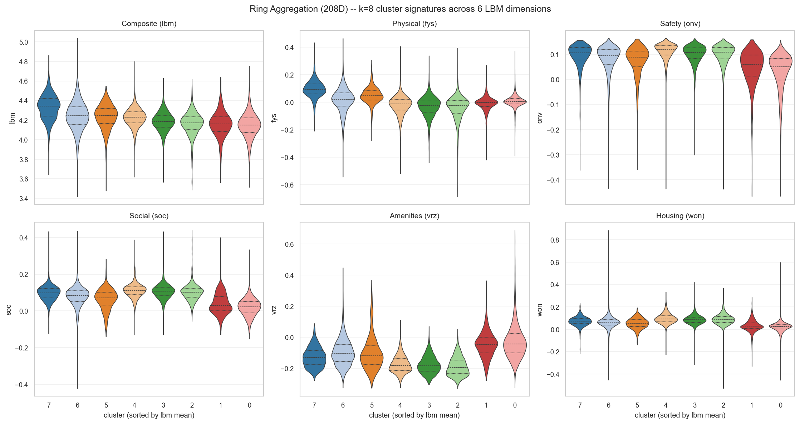
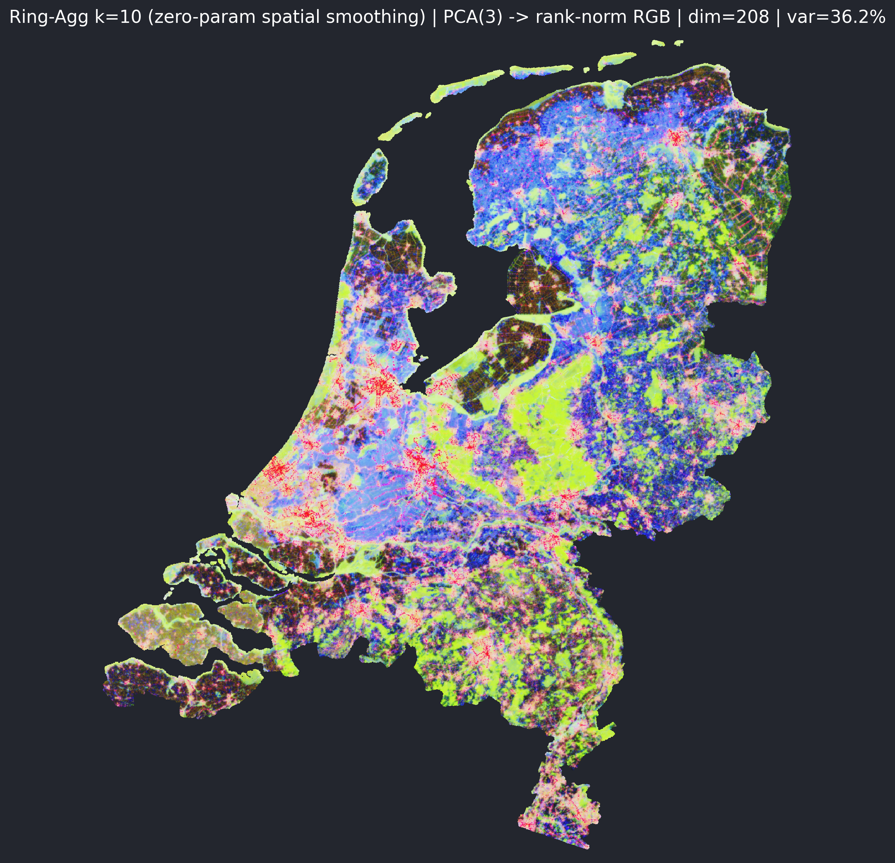
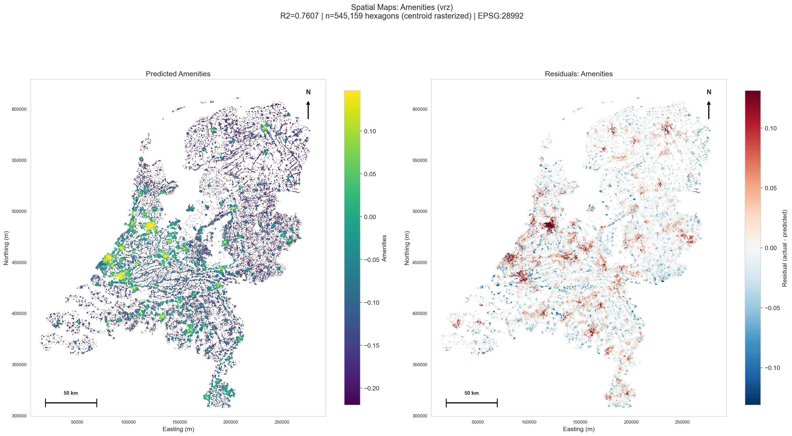
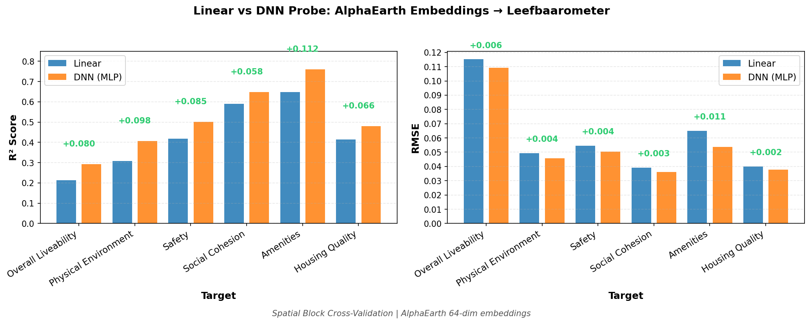
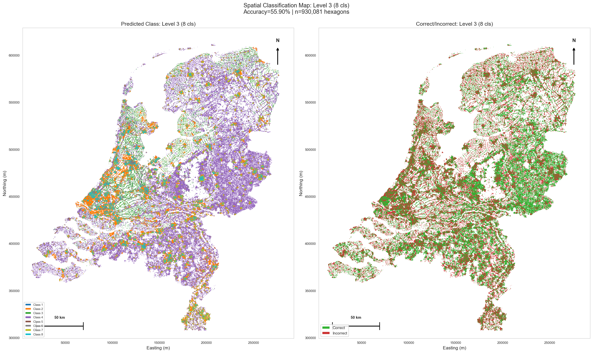
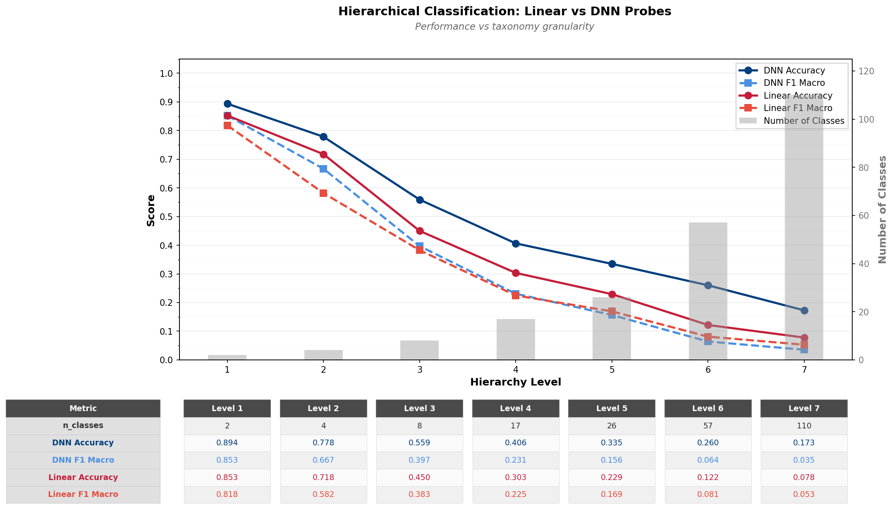
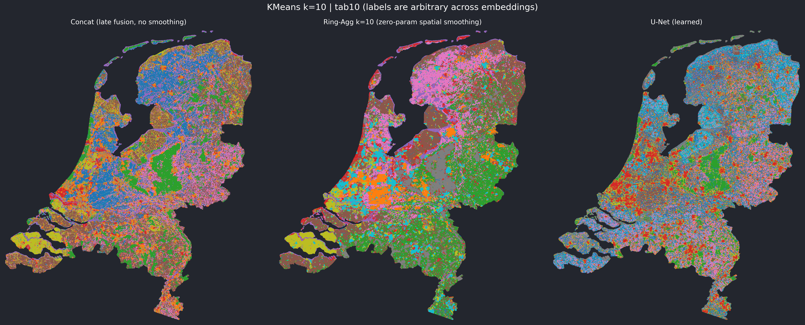

# UrbanRepML

**Dense geospatial (urban) embeddings from independent modalities, fused on hexagonal grids, probed for what they learned.**

[](https://www.python.org/downloads/)
[](https://opensource.org/licenses/MIT)
[](https://github.com/kraina-ai/srai)

UrbanRepML learns dense geospatial (urban) representations by encoding each data modality independently, fusing them spatially through multi-resolution U-Net architectures on [H3 hexagonal grids](https://h3geo.org/), then probing the resulting embeddings against external ground truth. All spatial operations use [SRAI](https://github.com/kraina-ai/srai). The project is developed by a human and [12 specialist AI agents](#multi-agent-development) coordinated through stigmergic scratchpads.

For philosophical & societal motivation, and early results of the fullareaU-NET, see the [Active Inference Institute talk](https://www.youtube.com/watch?v=UYD8CR_Xorg&ab_channel=ActiveInferenceInstitute).

---

> **This is the public atlas.** This repository is a manually-synced public subset of a private research repository, containing figures, reports, and findings rather than runnable code. Synced 2026-08-13. The "Project Structure" section below describes the private repo's code layout for reference; those directories are not present here.

---

## Preliminary Results

The Netherlands study area covers ~398K land-bearing H3 resolution-9 hexagons (out of ~868K in the full tessellation, the rest are over water) with 64-dimensional AlphaEarth embeddings (pre-computed Google Earth Engine features). All probes use spatial block cross-validation to prevent geographic leakage.


*The Netherlands rendered as embedding: top-3 principal components of the 64D AlphaEarth satellite features at H3 resolution 9, mapped to RGB. PC1 alone explains 30.2% of variance; PC1–3 together cover 60.1%. 398,931 land-bearing hexagons. From [The Book of Netherlands](reports/2026-05-03-book/THE_BOOK.md).*

### Headline: Ring Aggregation Beats Learned U-Nets on Physical-Environment Probes

The strongest finding so far is a non-result for the deep model. Replacing each hex's embedding with a weighted k=10 ring average — exponential decay weights, zero learned parameters — outperforms the multi-resolution supervised U-Net on the Physical Environment (`fys`) Leefbaarometer target: **R²=0.452 vs 0.354** (DNN probe, 5-fold spatial-block CV, 74D AlphaEarth+Roads input held constant). The U-Net wins the *correlated* targets (`lbm`, `onv`, `vrz`) where multi-resolution hierarchy helps, but loses cleanly on `fys`, which is geographically orthogonal to the urban-rural axis and rewards local smoothing instead.

Per-cluster signature analysis at k=10 separates a peak-liveability cohort (cluster 7, n=30,150 hexes, mean LBM 4.343 — top percentile in every probe dimension) from a deprived-cluster cohort that all three embeddings independently re-discover.

| Ring-Agg k=10 — multi-score signature violins | Ring-Agg — PCA(3) → rank-norm RGB (var=36.2%) |
|:---:|:---:|
|  |  |

The practical takeaway: a learned model's parameter budget is not free — for targets that respond to local averaging, the parameters can actively interfere. See [`reports/2026-03-29-ring-agg-plus-unet-probe-comparison/README.md`](reports/2026-03-29-ring-agg-plus-unet-probe-comparison/README.md) for the full table and the per-target breakdown.

### Livability Regression: Linear vs DNN Probes

Probing embeddings against [Leefbaarometer](https://www.leefbaarometer.nl/) livability indicators reveals that nonlinearity matters. For the Amenities target, the linear probe achieves R²=0.65 while the DNN probe reaches R²=0.76 -- the MLP captures spatial patterns that ridge regression cannot.

| Linear Probe -- Amenities (R²=0.65) | DNN Probe -- Amenities (R²=0.76) |
|:---:|:---:|
|  |  |

Across all 6 Leefbaarometer targets, the DNN consistently outperforms linear probes:



### Building Morphology Classification

The same embeddings can predict hierarchical [Urban Taxonomy](https://urbantaxonomy.org/) classes (building morphology). A 7-level hierarchy ranges from 2 classes at the coarsest level to 106+ at the finest. DNN probes consistently outperform logistic regression, and accuracy degrades gracefully as the number of classes grows exponentially.

| DNN Probe — Level-3 Spatial Map (8 classes, 56% accuracy) | Hierarchical Accuracy Comparison |
|:---:|:---:|
|  |  |

### Three Embeddings, One Country

Comparing the late-fusion concat (208D, no smoothing), Ring Aggregation k=10 (208D, zero-parameter spatial smoothing), and the supervised multi-resolution U-Net (64D, learned compression) at H3 resolution 9 reveals what each statistical lens emphasises. All three independently re-discover the same Dutch macro-geography: the Randstad, the south-east urban arc through Eindhoven–Tilburg–Den Bosch, the Wadden chain, Zeeland's archipelago, the Limburg peninsula, and the IJsselmeer's polder boundary.

| K-Means clusters (3-way) | PC1 → turbo (3-way) |
|:---:|:---:|
|  |  |

What they disagree on is informative. **The U-Net's 64D representation is effectively rank-3** — PC1+PC2+PC3 cover 98.6% of variance, vs ~36% for concat and ring-agg. The U-Net has learned to compress, but its PC1 folds a north–south latitude term *additively* into the urbanization axis. Concat's PC1 is a clean urbanization index that lights up Groningen and Eindhoven on the same scale; the U-Net dims northern cities by their regional baseline.

Per-cluster Leefbaarometer means corroborate the probe results: ring-agg's per-cluster LBM range is 0.20 (the widest of the three), vs U-Net's 0.15. Spatial smoothing produces clusters that align more cleanly with liveability-relevant geographic structure than learned compression does. See [`reports/2026-04-24-three-embeddings-visual-study/README.md`](reports/2026-04-24-three-embeddings-visual-study/README.md).

---

## Voronoi Rasterizer

Every map in this README — and in the [Book of Netherlands](reports/2026-05-03-book/THE_BOOK.md) atlas — is rendered through a tessellation-aware Voronoi rasterizer (`utils/visualization.py`, shipped 2026-05-03). The earlier centroid-splat approach stamped a fixed disc per hex, leaving visible gaps at boundaries and quietly truncating sparse regions. The Voronoi rasterizer instead builds a clipped Voronoi cell per H3 centroid and fills it edge-tight, with four modes:

- **Continuous** -- scalar values mapped through a colormap (e.g. PC1 → turbo)
- **Categorical** -- discrete cluster labels mapped through a categorical palette
- **Binary** -- above/below threshold splits with two-tone fills
- **RGB** -- three principal components mapped to channels for perceptual maps

| Voronoi continuous mode (PC1 → turbo) | Voronoi categorical mode (k=10 clusters) |
|:---:|:---:|
|  |  |

The migration deleted 232 lines of legacy stamp code and migrated 13 callers across the codebase. NaN hexes now produce geometrically truthful gaps rather than silent fills. Test suite: 34/34 contract tests + 278/278 full suite green. See [`reports/2026-05-03-rasterize-voronoi-toolkit/README.md`](reports/2026-05-03-rasterize-voronoi-toolkit/README.md) and `specs/rasterize_voronoi.md`.

---

## Three-Stage Pipeline

### Stage 1: Modality Encoders

Each modality is processed independently into H3-indexed embeddings:

| Modality | Source | Status |
|----------|--------|--------|
| **AlphaEarth** | Google Earth Engine pre-computed embeddings | Working (64-dim) |
| **Aerial Imagery** | PDOK Netherlands orthophotos via DINOv3 | Partial |
| **POI** | OpenStreetMap points, categorical density | Partial |
| **Roads** | OSM network topology, connectivity metrics | Partial |
| **GTFS** | Transit stops, accessibility potential | Planned |

### Stage 2: Fusion

Four architectures fuse modality embeddings using H3 hierarchy and accessibility graphs:

- **RingAggregation** -- zero-parameter spatial smoothing via weighted k-ring neighbourhood averaging. Current best performer on the Physical Environment leefbaarometer probe (see headline result above). Weighting schemes: exponential, logarithmic, linear, flat.
- **FullAreaUNet** -- processes entire study area with lateral accessibility graph. Multi-resolution encoder-decoder (res 8-10) with skip connections.
- **ConeBatchingUNet** -- hierarchical cones (res 5 to 10), each ~1,500 hexagons. Memory-efficient and parallelizable. Most promising future direction.
- **LatticeGCN** -- GCN on H3 hexagonal lattice with reconstruction loss. Baseline for validating learned message-passing.

### Stage 3: Analysis

Post-training probing and visualization:

- **Regression probes** -- Linear (Ridge/Lasso) and DNN (MLP) against Leefbaarometer livability scores with spatial block CV
- **Classification probes** -- Logistic regression and DNN against hierarchical [Urban Taxonomy](https://urbantaxonomy.org/) (building morphology)
- **Clustering** -- Hierarchical multi-scale clustering across H3 resolutions with landscape visualization

---

## Multi-Agent Development

UrbanRepML is developed by a human working with 12 specialist AI agents coordinated through [Claude Code](https://docs.anthropic.com/en/docs/agents-and-tools/claude-code/overview). The agents communicate across sessions via scratchpad files -- a form of [stigmergy](https://en.wikipedia.org/wiki/Stigmergy) where agents leave traces in the environment rather than messaging each other directly.

**The agents:**

| Role | What it does |
|------|-------------|
| Coordinator | OODA loop: observe scratchpads, orient, decide priorities, delegate |
| SRAI-Spatial | Spatial operations, H3 tessellation, SRAI compliance |
| Stage 1 Encoder | Modality processing pipelines |
| Stage 2 Architect | Fusion model design and training |
| Stage 3 Analyst | Probes, clustering, visualization |
| Spec Writer | Architecture specs and design tradeoffs |
| Execution | One-off scripts, data wrangling, ad hoc tasks |
| DevOps | Git, CI, packaging, file operations |
| QAQC | Code review, test coverage, commit-readiness verdicts |
| Librarian | Maintains codebase graph, tracks module interfaces |
| Ego | Process health assessments, flags coordination failures |
| Plan | Session planning, wave structure, dependency ordering |

The coordination infrastructure includes session-start hooks that auto-inject context, path-scoped rules that surface relevant conventions when touching specific code, and scratchpad enforcement gates that block agents from completing without logging their work. See `specs/claude_code_multi_agent_setup.md` for the full architecture.

---

## Setup

This repository is the public **atlas** — figures, reports, and findings. The source code
lives in a separate private research repository. The pipeline described below is documented
here for reference; it is not runnable from this repo.

```bash
git clone https://github.com/bert-berkers/urbanrepml-atlas.git
```

## Project Structure

```
UrbanRepML/
├── stage1_modalities/   # Modality encoders (AlphaEarth, POI, Roads, Aerial)
├── stage2_fusion/       # Fusion models, data loading, graph construction
├── stage3_analysis/     # Probes, clustering, visualization
├── scripts/             # Processing and training scripts
├── utils/               # StudyAreaPaths, SpatialDB, shared utilities
├── specs/               # Architecture decision documents
├── tests/               # Import smoke tests, H3 compliance
├── .claude/             # Multi-agent infrastructure (hooks, rules, skills, scratchpads)
├── data/                # Study-area organized data (not in repo)
└── docs/                # Images and documentation for GitHub
```

Study areas are self-contained under `data/study_areas/{name}/` with standardized subdirectories for boundaries, tessellations, embeddings, cones, fused results, analysis outputs, and plots.

## License

MIT License -- see [LICENSE](LICENSE)

## Acknowledgments

- [SRAI](https://github.com/kraina-ai/srai) -- Spatial Representations for AI
- [H3](https://h3geo.org/) -- Hexagonal hierarchical geospatial indexing (via SRAI)
- [PyTorch Geometric](https://pytorch-geometric.readthedocs.io/) -- Graph neural networks
- [Leefbaarometer](https://www.leefbaarometer.nl/) -- Dutch livability scoring (regression probe target)
- [Urban Taxonomy](https://urbantaxonomy.org/) -- Hierarchical building morphology (classification probe target)
- [Apache Sedona](https://sedona.apache.org/) -- Spatial query engine (via SpatialDB wrapper)
- [Claude Code](https://docs.anthropic.com/en/docs/agents-and-tools/claude-code/overview) -- Multi-agent development environment

