# UrbanRepML

**Dense geospatial (urban) embeddings from independent modalities, fused on hexagonal grids, probed for what they learned.**

[](https://www.python.org/downloads/)
[](https://opensource.org/licenses/MIT)
[](https://github.com/kraina-ai/srai)

UrbanRepML learns dense geospatial (urban) representations by encoding each data modality independently, fusing them spatially through multi-resolution U-Net architectures on [H3 hexagonal grids](https://h3geo.org/), then probing the resulting embeddings against external ground truth. All spatial operations use [SRAI](https://github.com/kraina-ai/srai). The project is developed by a human and [13 dispatchable specialist AI agents](#how-this-project-is-developed) coordinated through stigmergic scratchpads.

For philosophical & societal motivation, and early results of the fullareaU-NET, see the [Active Inference Institute talk](https://www.youtube.com/watch?v=UYD8CR_Xorg&ab_channel=ActiveInferenceInstitute).

---

> **This is the public atlas.** This repository is a manually-synced public subset of a private research repository, containing figures, reports, and findings rather than runnable code. Synced 2026-08-13.

---

## What this project does

The Netherlands is cut into small hexagonal tiles — about 560,000 of them, each roughly
0.1 km², a little smaller than a city block. This is the [H3 grid](https://h3geo.org/), a
standard way of chopping the world into hexagons so that every dataset can be lined up on
the same tiles. For each tile, UrbanRepML asks several independent sources what they see
there: a satellite, a map of shops and amenities, a road network. Each source produces a
list of numbers describing that tile — an **embedding**. The embeddings are then combined,
and the combined description is tested by asking a simple question: *given only these
numbers, can you predict something real about the place?* That test is called a **probe**,
and the score it reports is **R²** — the fraction of the real-world variation the numbers
explain, where 1.0 is perfect and 0.0 is no better than guessing the national average.

Everything below is a preliminary result on one study area (the Netherlands). Where a
number comes from an artifact that has since been superseded, the caption says so.


***The country as seen by a satellite embedding, with no human categories imposed.** Each
hexagon's 64-number AlphaEarth description is compressed to three numbers and painted as
red/green/blue. Coastline, polder, forest and city separate on their own. The first
component explains 30.2% of the variation, the first three explain 60.1%, over 398,931
hexagons. The satellite data is from 2022. This was rendered on the study-area grid used
before the 2026-06-07 boundary correction, so the hexagon count is not the current canonical
one (558,626 land hexagons at this resolution) — the picture holds, the count is historical.
Source: [Book of Netherlands](reports/2026-05-03-book/THE_BOOK.md), ch. 1.*

---

## The grid everything sits on

Before any of the results, the tiling. Every map on this page is drawn on the same H3
tessellation, and the choice of resolution decides what a map can possibly show.


***The working scale, drawn over Amsterdam.** These are H3 resolution-9 cells, mean area
0.105 km² — a block or two of city. Everything downstream is computed per cell on exactly this
tiling, which is what lets a satellite pixel, an OSM shop and a road segment be talked about in
the same sentence. Drawn May 2026 from the study-area grid in use at the time, before the
2026-06-07 boundary correction; the geometry of an H3 cell doesn't change with the study
boundary, only how many of them fall inside it. Source:
[Book of Netherlands](reports/2026-05-03-book/THE_BOOK.md), ch. 1.*


***Five resolutions over one place.** Each step down the hierarchy replaces a parent hexagon
with about seven children, so cell counts run 408 at resolution 5, 2,647 at 6, 17,969 at 7,
124,575 at 8, and 868,239 at 9 — mean areas 252.9 km² down to 0.105 km². Those counts cover the
Dutch bounding box as the book measured it in May 2026, not the current land-only boundary,
which holds 558,626 cells at resolution 9. The hierarchy is the reason the U-Net can be trained
at three scales at once and the reason cone-shaped subsets of the country can be batched
independently. Source: [Book of Netherlands](reports/2026-05-03-book/THE_BOOK.md), ch. 1,
tessellation table.*

---

## Headline: averaging a hexagon with its neighbours beats these trained models

The most useful thing we've found so far is a result *against* our own deep models.

Take a hexagon's embedding and simply replace it with a weighted average of itself and
every hexagon within 10 steps of it. That is **ring aggregation** — a blur. It has zero
trainable parameters and takes minutes. Compare it against neural networks trained for
hours to fuse the same inputs. On our current best evidence the blur wins, and it wins by
a wide margin.

The weighting matters, and it's logarithmic weighting that wins, not exponential. On the
canonical 178-dimension fused embedding, averaged over 11 prediction targets:

| ring-aggregation weighting | mean R² (all 11 targets) | mean R² (livability only) |
|---|---|---|
| **logarithmic** | **0.4849** | **0.5213** |
| linear | 0.4844 | 0.5210 |
| exponential | 0.4738 | 0.4990 |
| flat (unweighted) | 0.4531 | 0.4956 |

The best *learned* model in the comparison — a graph U-Net variant — reaches 0.391 on the
livability targets. The gap of roughly 0.13 is far larger than any plausible measurement
wobble. All figures from
[`ring_agg_res9_k10_table.md`](reports/2026-07-20-probabilistic-fusion-res10-netherlands/ring_agg_rebaseline/ring_agg_res9_k10_table.md).

Three things bound that claim. The comparison is not capacity-matched: the learned cells
compress their input down to 64 numbers while the ring-aggregation arms keep all 178, so
this is a floor comparison rather than a fair fight, and the source table says so itself.
The learned comparators are also all self-supervised U-Net variants. An earlier *supervised*
multi-resolution U-Net beat ring aggregation on 4 of 6 livability sub-scores and on the
overall mean, 0.574 vs 0.535 — see
[the 2026-03-29 comparison](reports/2026-03-29-ring-agg-plus-unet-probe-comparison/README.md).
No single experiment on the current grid pits ring aggregation against a supervised U-Net,
so until one exists this headline means "beats these learned variants", not "beats learned
models". And the folds here are random rather than spatial, which the next section gets into.

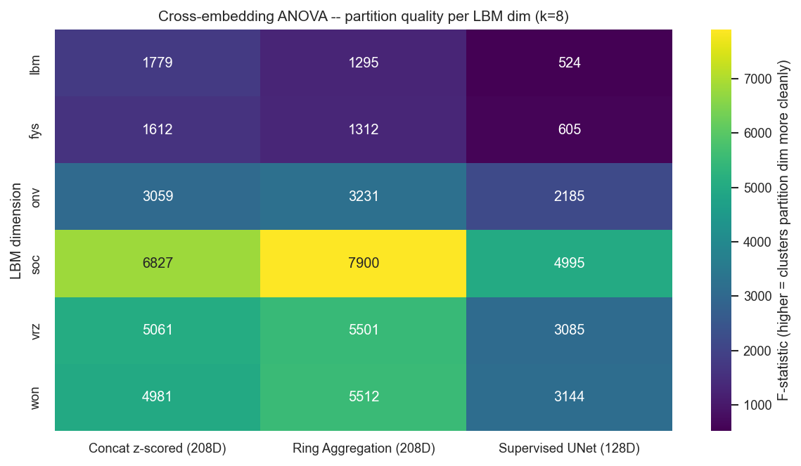

***The same result seen a second way, without any probe.** Each embedding is cut into 8
groups of similar places, and we ask how cleanly those groups separate each of the six
livability sub-scores (brighter = cleaner separation, one-way ANOVA F). Ring aggregation in
the middle column wins 4 of 6. The raw unsmoothed stack wins the other 2. The supervised
U-Net loses on all six, including the composite score it was trained on. So the smoothing
advantage isn't an artefact of one probe setup; it shows up in unsupervised grouping too.
This uses the legacy 208D embeddings from 2022 against 2022 leefbaarometer scores, on a
different grid from the current 178D work, so it corroborates the direction of the headline
rather than its exact magnitude. Source:
[Book of Netherlands](reports/2026-05-03-book/THE_BOOK.md), ch. 5.*

### What these numbers rest on

The target and the embeddings are not from the same year. The livability scores come from
the Leefbaarometer 3.0 *2024* release, mapped onto *2024* neighbourhood geometry, with the
2022 score column selected. The embeddings describe 2022. The project's own provenance
record marks this pair as not temporally aligned.

Coverage is the bigger problem. The two only overlap on 131,194 of 537,970 hexagons, which
is 24.4%. The Leefbaarometer is undefined outside built-up areas, so three-quarters of the
country is absent from every livability R² on this page. Both numbers come from
[`ring_agg_res9_k10_table.md`](reports/2026-07-20-probabilistic-fusion-res10-netherlands/ring_agg_rebaseline/ring_agg_res9_k10_table.md)
and the target artifact's own provenance sidecar.

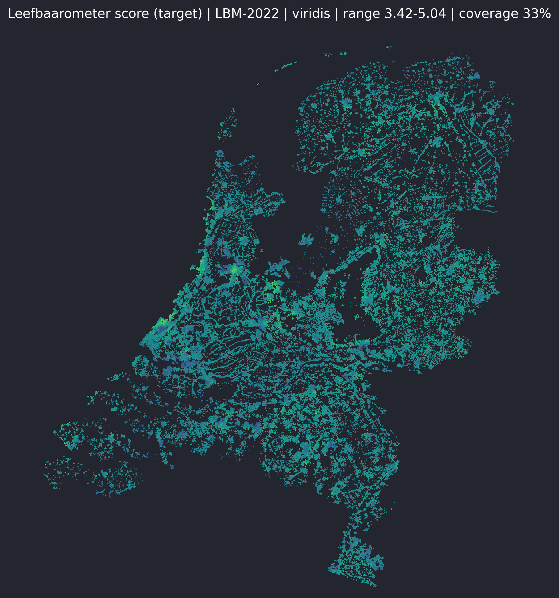

***The target itself.** This is what the probes are predicting, using the 2022 Leefbaarometer
scores. Note the lacework: the index is only defined where people live, so the map is full of
holes. Those holes are the missing 75.6%, and every livability R² on this page is computed
only on the coloured part.
Source: [Book of Netherlands](reports/2026-05-03-book/THE_BOOK.md), ch. 5.*

Cross-validation also differs between figures. Where a model is scored, the data is split
into folds — train on some, test on the rest. Splitting randomly is easy but leaks, because
two adjacent hexagons are nearly the same place, and one landing in training while the other
lands in testing flatters the score. **Spatial block CV** carves the country into
10 km × 10 km blocks and keeps whole blocks together, which is harder. The 2026-07 headline
table above uses random 5-fold. The probe figures in the next two sections use spatial block
CV. An earlier version of this README claimed all probes used spatial blocks; that was wrong.

---

## Livability: a neural probe reads more than a straight line does

So what is actually written in these embeddings? The **Leefbaarometer** is a Dutch government
index of neighbourhood livability, published per neighbourhood and built from dozens of
indicators. It has six sub-scores: overall (`lbm`), physical environment (`fys`), safety
(`onv`), social cohesion (`soc`), amenities and services (`vrz`), and housing quality (`won`).
We hold the embedding fixed and vary only the probe — first straight-line regression, then a
small neural network.

| Straight-line probe, amenities: R² = 0.649 | Neural probe, same target: R² = 0.761 |
|:---:|:---:|
|  |  |

***The same embedding, read two ways.** Predicted amenity and service provision across the
Netherlands. A straight-line (ridge) probe explains 65% of the variation; a small neural
network on identical inputs explains 76%. The extra 11 points are what a straight line
structurally cannot see, since the relationship between satellite features and amenity
provision is curved rather than linear. Both runs use AlphaEarth alone, 64 numbers per
hexagon, at H3 resolution 10 with 5-fold spatial block CV at 10 km, against 2022 satellite
data and 2022 Leefbaarometer scores. They date from February 2026, on the pre-correction grid
and on satellite features only rather than the current 178D fused embedding, so this is a
probe-vs-probe comparison and not the project's best achievable score. Numbers read from the
runs' `metrics_summary.csv`.*


***The neural probe wins on all six sub-scores, by between 5 and 11 points of R².**
Overall 0.213→0.293, physical environment 0.308→0.406, safety 0.417→0.502, social cohesion
0.591→0.649, amenities 0.649→0.761, housing 0.415→0.481. Six out of six, no exceptions.
The ordering is worth a second look. Amenities and social cohesion are far easier to predict
from satellite-derived features than the composite score is. The composite averages
sub-scores that move in opposite directions, so it comes out harder to predict than most of
its own parts, which makes it a poor thing to optimise for. Same setup, same data and the
same limits as the figure above.*


***Why the composite is the hardest thing on the page to predict.** The six sub-scores are
not six independent things. Safety, social cohesion and housing quality move together almost
perfectly (ρ ≥ 0.976), while amenities moves the opposite way (ρ ≤ −0.88): dense central
areas score well on services and badly on the others. Six dimensions collapse to roughly two.
Averaging them into one composite cancels the very signal the parts carry, which is why the
composite (`lbm`, R² 0.293) probes worse than most of its own components. Leefbaarometer 2022
scores. Source: [Book of Netherlands](reports/2026-05-03-book/THE_BOOK.md), ch. 7.*

### The prediction, and where it goes wrong

Scores tell you how much a probe gets right. They don't tell you *where* it misses, and the
where is often the more informative half. These two maps come from the simplest possible probe:
a ridge regression fitted straight onto the ring-aggregated embedding with no held-out split at
all.

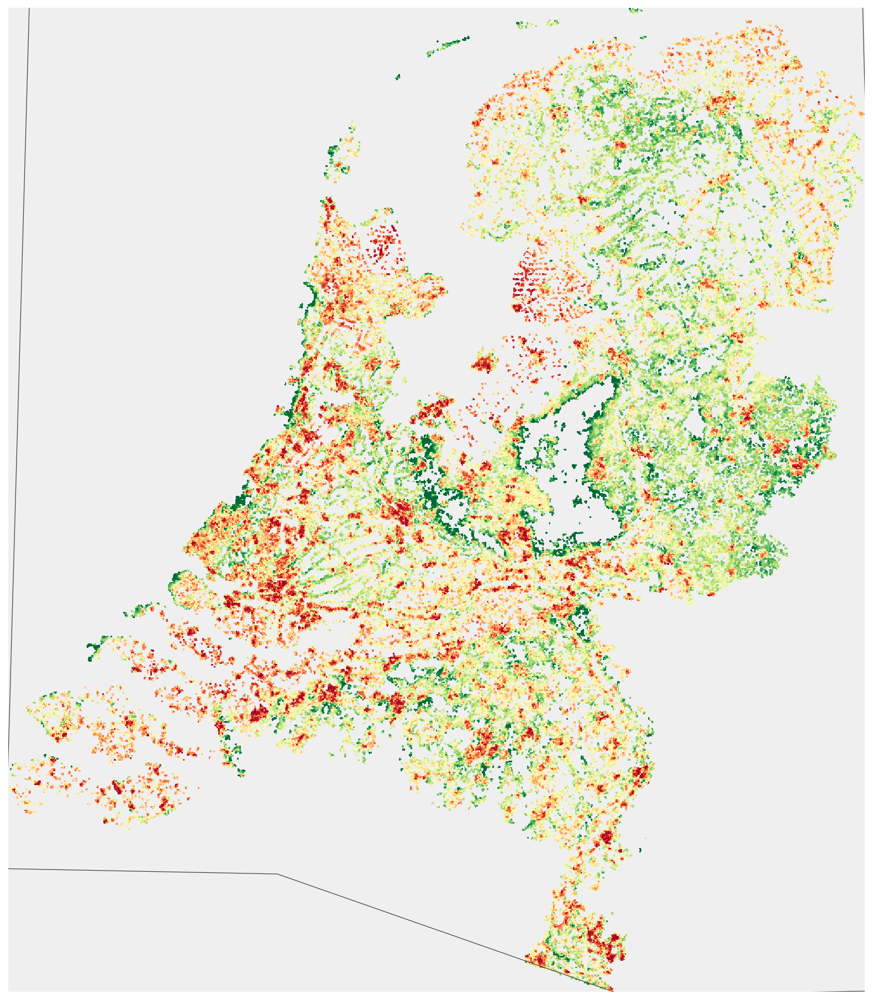

***The liveability composite as the embedding sees it.** A ridge regression with α = 1.0 was
fitted from the ring-aggregation embedding to the 2022 Leefbaarometer composite and its output
painted back onto the grid, green high and red low. It reproduces the broad national pattern —
the Randstad's inner cores reading low, the suburban ring around them reading high. Read the
in-sample R² of 0.306 as a description of this picture, not as a performance claim: the model
was scored on the same hexagons it was fitted on, so there is no cross-validation here at all,
and the honest cross-validated numbers are the ones in the tables above. Legacy 208D
"20mix" embedding on the pre-correction grid, rendered 2026-05-03. Provenance from the figure's
own `lbm_prediction_res9.png.provenance.yaml`.*

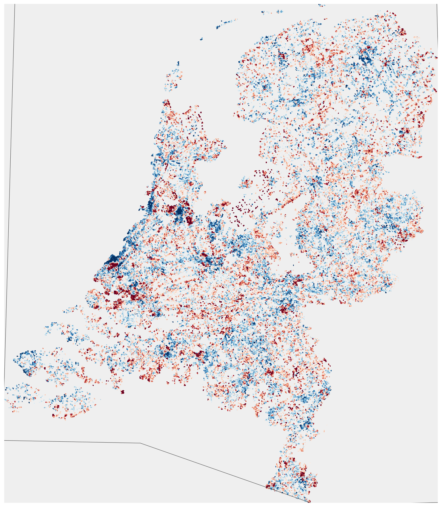

***What the embedding can't say.** Prediction minus target, centred on zero and clipped at
±0.206, so red is where the model is too optimistic about a place and blue where it is too
pessimistic. The interesting thing is that the error has structure. If the embedding carried
everything the Leefbaarometer carries, this map would be static; instead whole districts lean
one way, which is a picture of the index's social and administrative content — things a
satellite, a shop and a road cannot see. Same fit, same legacy embedding and grid as the map
above.*

---

## Building morphology: predicting how a place is built

The same embeddings are asked a different question: what *kind* of built form is here?
[Urban Taxonomy](https://urbantaxonomy.org/) provides a 7-level hierarchy of building
morphology, from a 2-way split at the top to over 100 fine-grained types at the bottom.

| Predicted morphology class, level 3 (8 classes, 55.9% accurate) | Accuracy across all 7 levels |
|:---:|:---:|
|  |  |

***Accuracy decays predictably as the classification gets finer, and the neural probe leads
at every level.** Level 1 (2 classes): 89.4% neural vs 85.3% linear. Level 3 (8 classes):
55.9% vs 45.0%. Level 7 (~106 classes): 17.3% vs 7.8%. The right-hand figure shows accuracy
alongside macro-F1, and the gap between them widens with depth — the signature of rare
classes being missed while common ones are still caught. AlphaEarth alone again (64 numbers),
H3 resolution 10, 5-fold spatial block CV at 10 km, 2022 satellite data, February-2026 runs
on the pre-correction grid. The fine levels sit near the floor of usefulness; read them as
how far this can be pushed rather than as a deployable classifier. Numbers read from the two
probes' `metrics_summary.csv`.*

---

## Three embeddings, one country

Three ways of describing the same country: the raw stacked modalities with no processing,
the same stack blurred by ring aggregation, and a learned U-Net compression. Do they see
the same Netherlands?

| Grouping into 10 similar-place classes | First principal component |
|:---:|:---:|
|  |  |

***All three independently rediscover the same Dutch macro-geography:** the Randstad
conurbation, the Eindhoven–Tilburg–Den Bosch arc, the Wadden island chain, Zeeland's
archipelago, the Limburg panhandle, the IJsselmeer polder edge. Three very different methods
— no model, a blur, a deep network — agreeing this closely is evidence the structure is real
rather than an artefact of any one model's assumptions. These are the legacy 208D embeddings
carrying the "20mix" mixed-vintage label, 397,757 hexagons on the pre-correction grid; the
note at the end of this section says more. Source:
[three-embeddings visual study](reports/2026-04-24-three-embeddings-visual-study/README.md).*


***The blurred embedding painted as colour.** Its top three components cover only 36% of the
variation, which is why the palette comes out muted. The learned U-Net's equivalent picture
looks far more dramatic, but that's because its top three components cover 98.6% of its
variation: it has compressed the country onto essentially two axes. A bolder picture here
means the model sees less, more confidently. That's the most misreadable comparison in the
study, and it's why the muted one is the one shown. Legacy 208D, pre-correction grid. One
naming trap: "k=10" here means ten rings of neighbours averaged together, not ten clusters —
the two senses of k are unrelated.*


***Where the blurred embedding's groups sit on each livability sub-score.** Each panel is one
sub-score, each violin one group of places, and the spread between groups is what a useful
embedding buys you. Ring aggregation separates the groups more widely than the learned U-Net
does; the U-Net's group means hug the national average. The figure shows k=8 groups despite
the `k10` in its filename, a legacy tag from an earlier dispatch that the source book records.
Legacy 208D embeddings, Leefbaarometer 2022 scores. Groups covering mostly rural land have
very sparse livability coverage, as low as 3–11% of their hexagons, so their means look
precise but are noisy. Source:
[Book of Netherlands](reports/2026-05-03-book/THE_BOOK.md), ch. 5.*

A note on dimensions. Everything in this section comes from 208-dimensional artifacts —
AlphaEarth 64 + POI 50 + roads 30 + GTFS 64 — and that stack is now legacy. The current
canonical fused embedding is 178-dimensional: AlphaEarth 64 + POI 50 + roads 64, GTFS removed
(the next section explains why). On disk the canonical artifact is 537,970 rows × 178 columns.
We haven't renumbered this section to 178D, because the figures really were made from the
208D artifacts and relabelling them would be a fabrication. Read them as a legacy but
still-informative study.

An earlier version of this README stated that a particular group of ~30,150 hexagons was "top
percentile in every probe dimension". The source report supports only that it ranked highest
on the composite score, at 90th percentile, on 6% livability coverage. Nothing on disk
supports the stronger claim, so it has been dropped.

---

## Cutting the country into types

Clustering is the cheapest interrogation an embedding submits to. You ask it to sort every
hexagon into k groups of similar places, then look at whether the groups mean anything. There
is no ground truth involved and nothing is fitted to a target, so what comes out is the
embedding's own opinion about which parts of the country resemble each other.

The number of groups is a choice, and it is not a neutral one. These three maps are the same
embedding cut three ways.

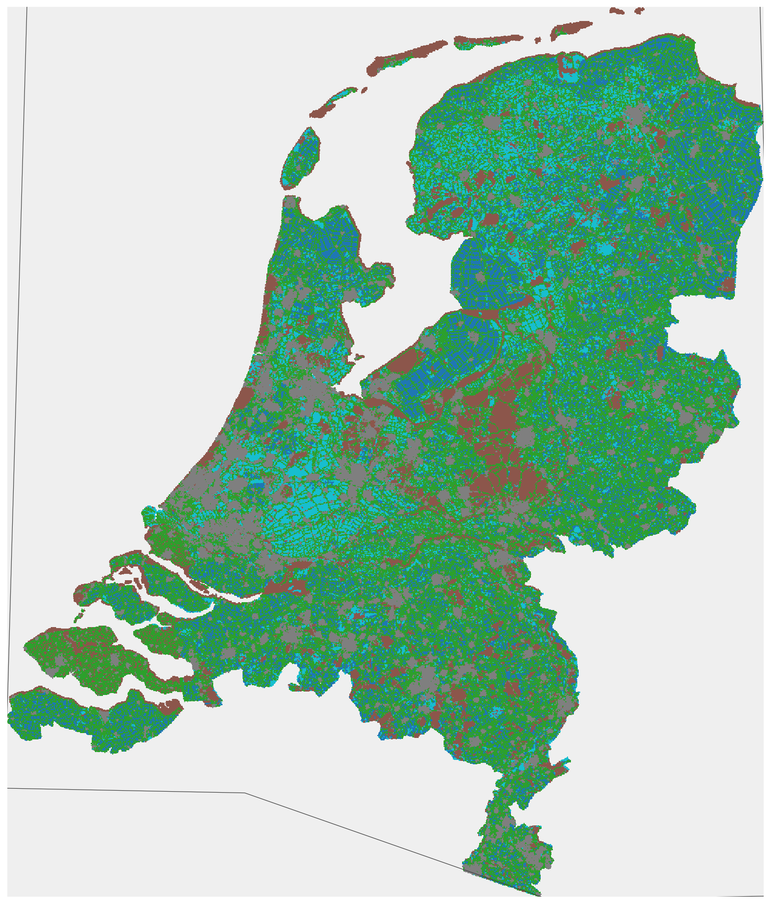

***Five groups.** MiniBatchKMeans with seed 42 on the trained U-Net's resolution-9 embedding,
each hexagon painted by which group it landed in. At five, the split is essentially
water-adjacent, rural, suburban, urban, and industrial-or-infrastructural. Colours are
categorical — two adjacent colours mean nothing beyond "not the same group". Rendered through
the Voronoi rasterizer at 250 m pixels, 2026-05-03, on the legacy "20mix" U-Net artifact and
the pre-correction grid.*

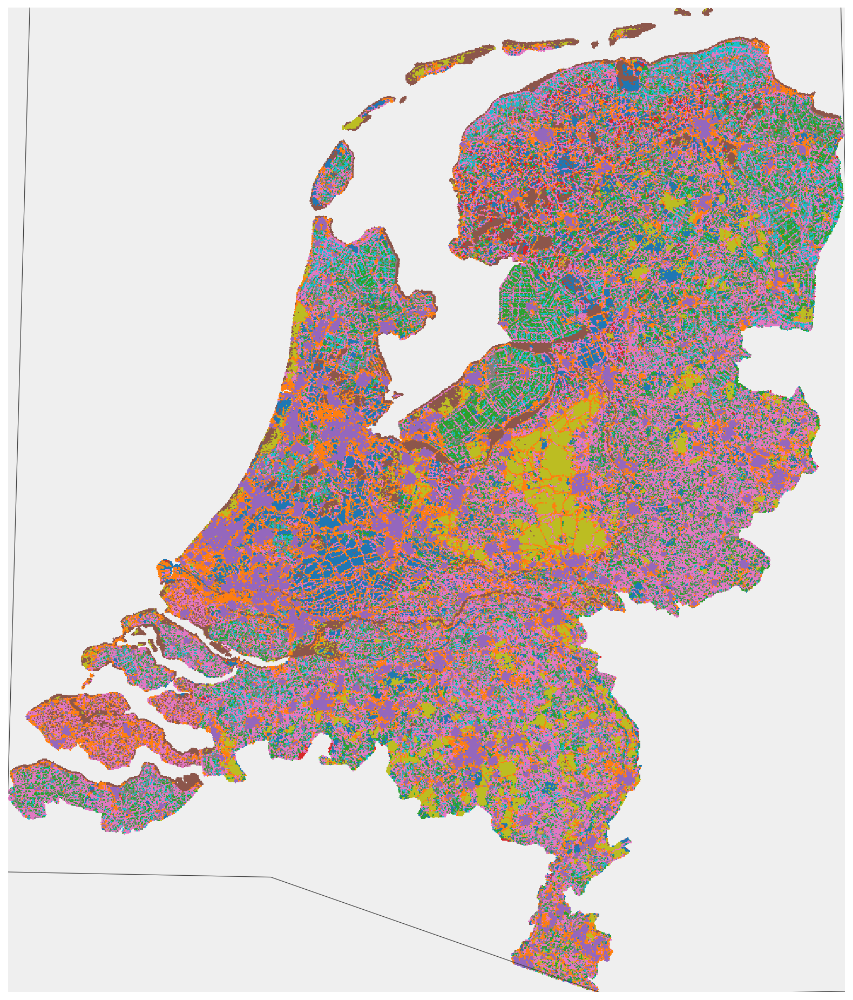

***Ten groups.** The same embedding, the same seed, twice the budget. What the extra groups buy
is mostly resolution inside the rural mass rather than inside the cities: reclaimed polder
separates from old sand-soil farmland, the Wadden and Zeeland coastal fringes split off from
each other. That ordering is itself a finding — the embedding considers the countryside more
internally varied than the built-up areas, at this scale.*

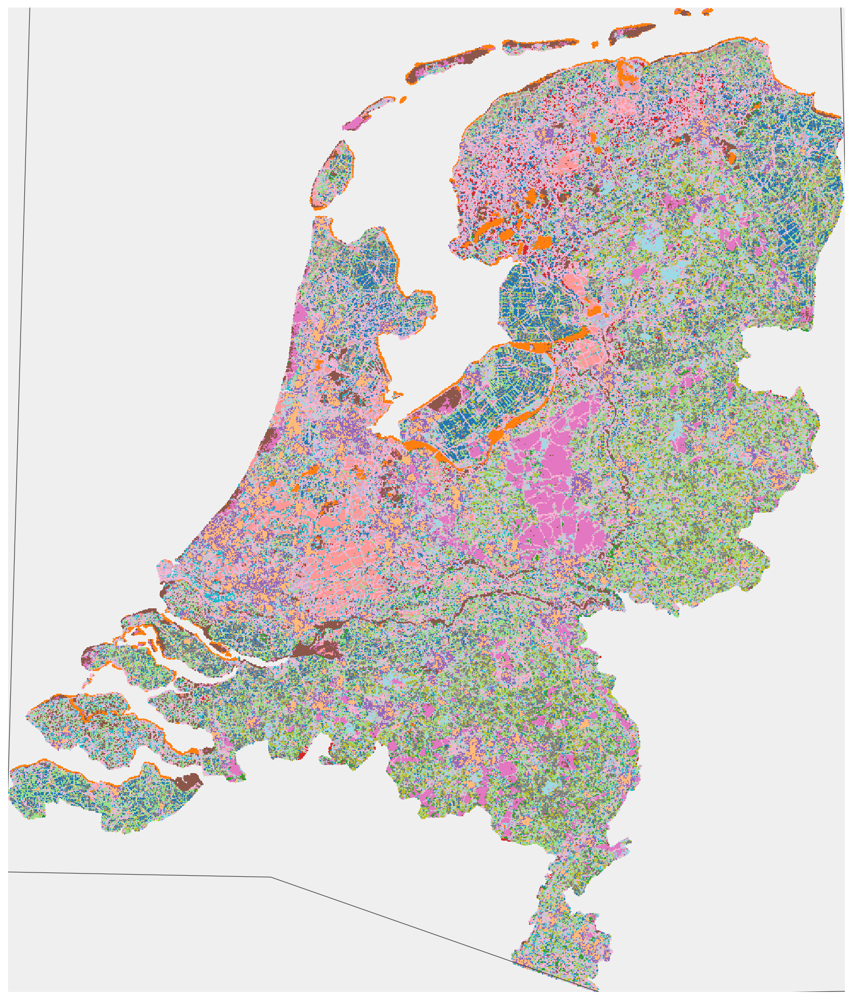

***Twenty groups.** Past about ten the map starts to fragment, and it is worth being honest that
we cannot point to a k that is right. A sweep of k from 2 to 15 on a related embedding found the
three standard quality metrics disagreeing with each other: silhouette peaks at k = 2,
Calinski-Harabasz also at k = 2, Davies-Bouldin at k = 6. No elbow, no consensus. So the
practical answer is to pick k for what you want to do downstream rather than expecting the
geometry to nominate one. Sweep numbers from
[Book of Netherlands](reports/2026-05-03-book/THE_BOOK.md), ch. 7; the three maps are legacy
U-Net "20mix" res9, seed 42.*

---

## Sharpening vs smoothing: we tried the opposite and it lost

Ring aggregation blurs — it blends each hexagon into its neighbourhood. The obvious next
question is whether the *opposite* operation helps. **Sharpening** (technically *unsharp
masking*, the same operation photo editors use) does this: compute the local average,
subtract it, then add the leftover difference back amplified by a gain λ. Low λ is a light
touch; high λ makes each hexagon stand out hard against its surroundings. The intuition is
appealing — many urban properties are *sharp*, changing block to block, so a blurred
description should track them poorly and re-amplifying the fine detail should help.

We wrote that intuition down as a prediction *before running anything* — a
**pre-registration**, which fixes the hypotheses, the success thresholds, and even which
targets count as "sharp" in advance, so no favourable slice can be selected afterwards.
Then we ran 648 probe evaluations and reported all of them.

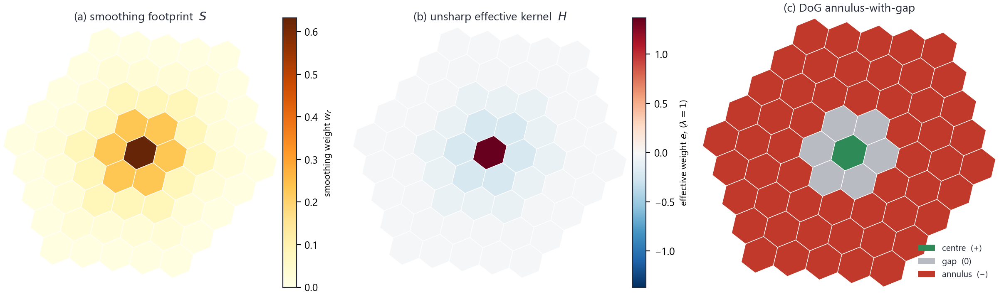

***What the two operations actually do, drawn on real hexagons.** Left is smoothing: positive
weight spread over the neighbourhood. Middle is unsharp masking, a strong positive centre with
a negative surround, so a hexagon gets pushed away from whatever its neighbours look like.
Right is an annulus variant tested as an exploratory arm. This is the instrument, not a
result. Source: [sharpen-vs-smooth](reports/2026-07-19-sharpen-vs-smooth/README.md).*

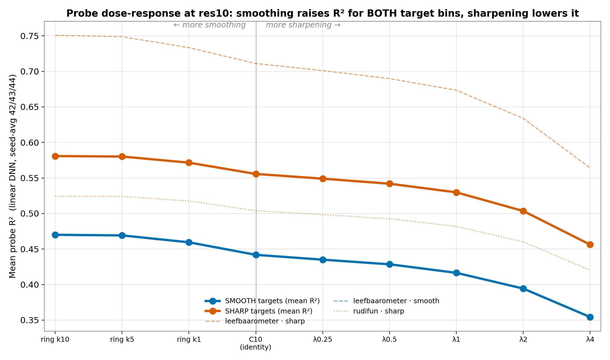

***The intuition is falsified, in the exact way the pre-registration named in advance.**
Sharpening costs accuracy at every dose and smoothing gains at every dose, including on the
targets pre-selected for being spatially sharp, where the sharp-bin mean R² *rises*
0.5556 → 0.5715 → 0.580 → 0.581 (first step +0.016). The predicted "sharpening helps sharp
targets" interaction is rejected: β₃ = −0.0031, 95% confidence interval [−0.0124, +0.0042],
against a pre-set minimum meaningful effect of 0.005. Every arm's ΔR² is negative. A separate
check confirms the operator genuinely sharpens at all 15 of 15 dose steps, so the null is
about the world and not about the tool. This ran over 3,752,940 hexagons at H3 resolution 10
in 178 dimensions, 14 arms × 648 probe cells, 3 seeds. The embeddings are 2022; the RUDIFUN
density target is 2022 and aligned, while leefbaarometer 2024 and urban taxonomy 2025 are not.
Linear probes only, and random folds rather than spatial blocks. Numbers from
[sharpen-vs-smooth](reports/2026-07-19-sharpen-vs-smooth/README.md).*

For liveability, density and building morphology, a hexagon's neighbourhood is not noise
sitting on top of its signal. The neighbourhood *is* signal. These are partly properties of
the surroundings, so high-pass filtering throws away the context the prediction depends on.
The dose axis is asymmetric too: smoothing's gains saturate by about 5 rings, while
sharpening's costs keep growing all the way out.

A related null sits next to this one. We also asked whether routing information along real
travel networks — walk, bike, drive — rather than the plain hexagon grid helps. Across five
training objectives and three seeds, the travel-graph and plain-grid versions scored the same
to within noise. That comes from a companion campaign summarised in the
[sharpening-as-explainability pre-registration](reports/2026-07-28-accessibility-sharpening-explainability/PREREGISTRATION.md),
not from anything re-derived here. The follow-up asks the better question, which is not
whether it scores higher but what it changes about the representation, and its plan is frozen
in advance. It has no results write-up yet, so the link goes to the plan.

---

## What the travel graph changes: maps you are asked to judge

Two models, trained identically, differing only in what they pass messages along. One uses the
plain hexagon lattice — every cell talks to its six neighbours. The other uses an accessibility
graph built from real walking, cycling and driving times, so two cells connected by a road talk
even when a canal sits between them. Their probe scores came out the same to within noise. That
is a null on the question "does it predict better", and it says nothing at all about the more
interesting question: does the accessibility version encode something *different*?

The way to ask that is to try to explain one representation with the other. Fit a ridge
regression from the lattice model's 64 numbers to the accessibility model's 64 numbers,
out-of-fold, and look at what's left over. If the leftover is near zero the graph swap was
cosmetic — the accessibility embedding is a linear re-description of the lattice one. If the
leftover is large and lands somewhere sensible, the graph put something new in. Across five
training objectives and three seeds, the fraction of variance the linear map cannot reach runs
from 0.041 for the plain objective to 0.539 for the Poisson-VAE. A directional prediction made
before the run — that every functional arm would land between 0.001 and 0.5 — was contradicted
by that Poisson-VAE number, and is recorded as contradicted rather than rounded into agreement.

Then it becomes a looking problem, and this is where these maps come in. The pre-registration
names them the campaign's **primary channel for practical significance**, states in advance that
no numeric threshold could settle it, and commits to two questions:

1. does the leftover land where accessibility should land — along corridors, around stations,
   across the Randstad — or is it diffuse?
2. does the difference in local contrast show an interpretable spatial pattern, or speckle?

A human reading these maps is the verdict. That verdict has not been made. They are published
here in the state the campaign left them, which is why this section asks rather than concludes.

### Three views of one leftover

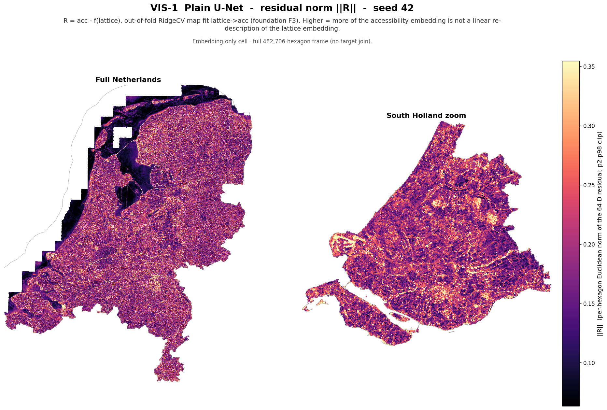

***How much the two models disagree, hexagon by hexagon.** Each cell is coloured by the length of
its leftover vector after the accessibility representation is predicted from the lattice one —
bright means the linear map failed there. Full Netherlands on the left, South Holland enlarged on
the right, with colour limits computed once on the national frame and reused for the zoom so the
two panels are directly comparable. This is the plain U-Net objective at seed 42, over all
482,706 resolution-9 hexagons in Dutch RD New, on 2022 data. For this arm the linear map already
explains 96% of the accessibility representation, so what is bright here is the last 4%.*

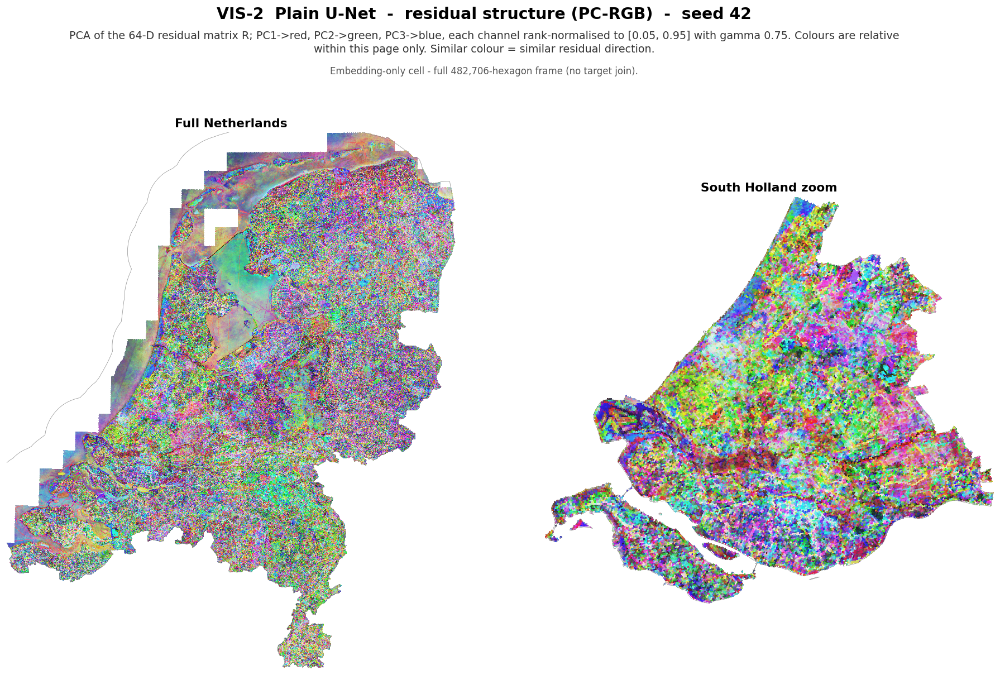

***The same leftover, coloured by direction instead of size.** Its three strongest components are
rank-normalised and painted onto red, green and blue, so hexagons sharing a colour are ones whose
disagreement points the same way. Size and direction answer different questions: the previous map
shows where the two models part company, this one shows whether they part company in the same
manner in different places. Coherent colour patches mean structure; a uniform speckle would mean
the leftover is noise. Same run, same frame, same 2022 vintage.*

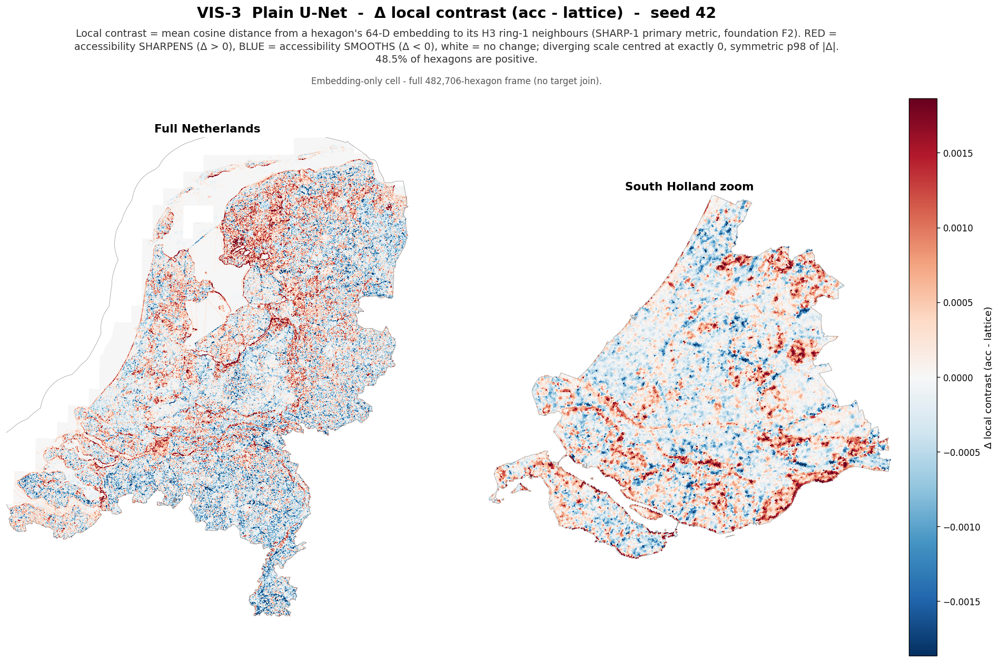

***Whether the travel graph sharpens or blurs.** Local contrast here is the cosine distance
between a hexagon and its immediate ring of neighbours, measured separately in both models and
subtracted, accessibility minus lattice, on a red-blue scale centred exactly on zero. Red means
the accessibility version makes a hexagon stand out more from its surroundings than the lattice
version does; blue means it smooths it in. Given the sharpening result in the section above,
which direction dominates here is worth more than its magnitude.*

### The same question, four other objectives

The five arms differ in what the model is asked to optimise while training, and they disagree
strongly about how much the graph swap changes. Below is the leftover-magnitude view for the
other four.

| Poisson-VAE — 0.539 unexplained | NAG-S0, orthogonal core — 0.113 |
|:---:|:---:|
| 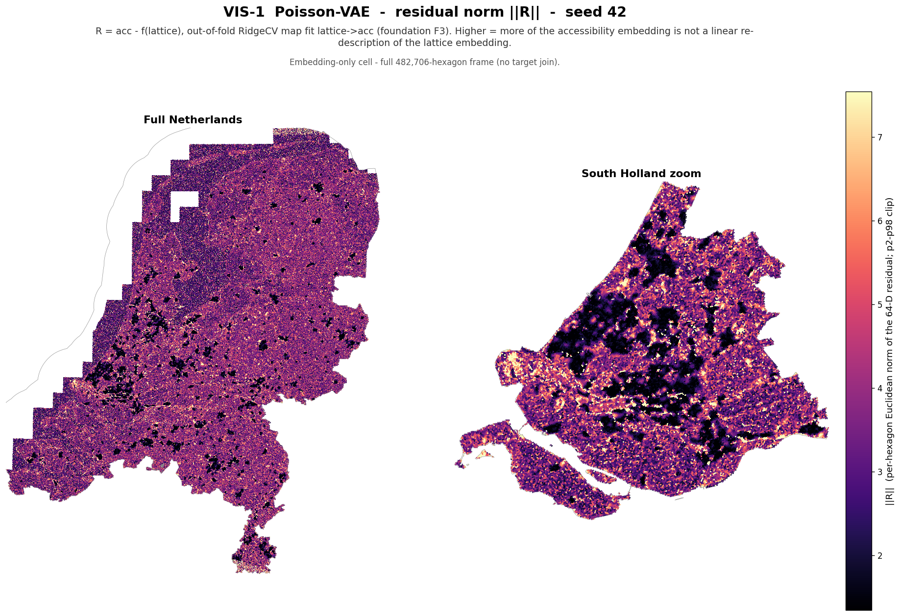 | 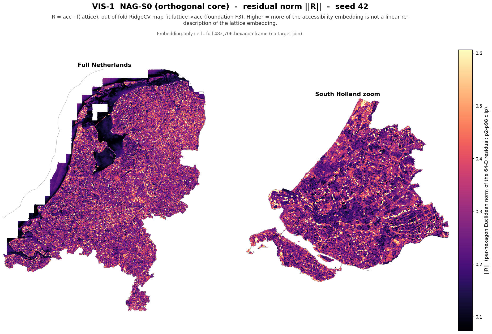 |

| NAG-S1, paper-faithful — 0.048 | Gaussian-VAE — 0.971, and see the caveat |
|:---:|:---:|
| 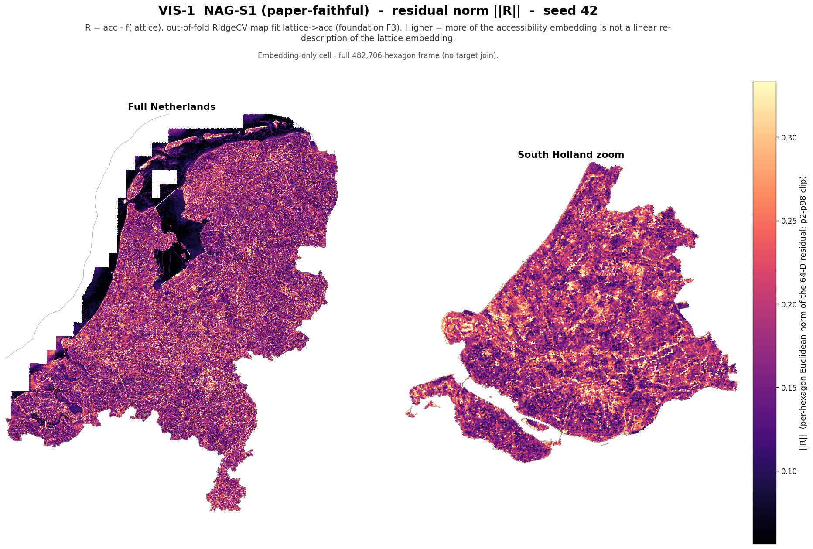 | 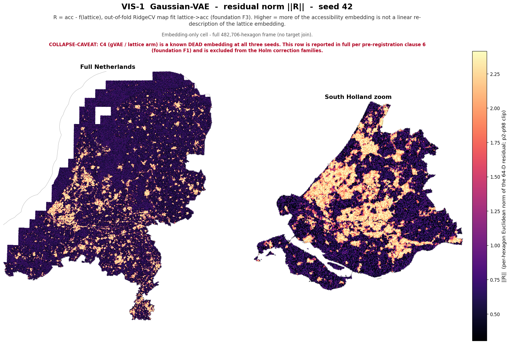 |

***Four objectives, four different answers about how much the graph matters.** The number in each
label is the fraction of the accessibility representation the lattice representation cannot
linearly reach, averaged over seeds 42–44. The Poisson-VAE and the Gaussian-VAE both come out
high, and only one of those is meaningful. The Gaussian-VAE's lattice arm collapsed during
training — near-zero variance across most of its dimensions — so its 0.971 measures a dead
embedding against a live one, which is collapse, not accessibility. The campaign pre-declared
that handling: run the row, publish it, tag every one of its numbers, and exclude it from all
three statistical families. It is shown here because a collapsed arm makes a dramatic map, and
knowing what that looks like is worth something. All four are seed 42, 482,706 hexagons at
resolution 9, 2022 data.*

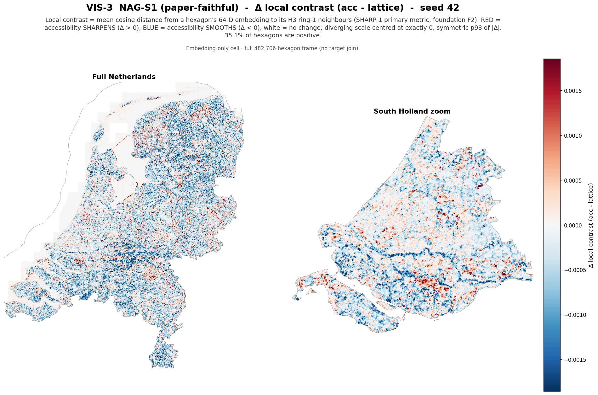

***The contrast question again, on the objective closest to the source paper.** NAG-S1 is the
paper-faithful arm and has one of the smallest leftovers of the five, at 0.048, which makes it
the strictest place to look for a graph effect: if something shows up here it is not an artefact
of an unusual training objective. Same construction as the plain contrast map above — cosine
distance to the neighbour ring, accessibility minus lattice, centred at zero. Every figure in
this section was rendered by
[`2026-07-28-acc-residual-map-battery.py`](reports/2026-07-28-accessibility-sharpening-explainability/maps/2026-07-28/index.md)
at 2000×2400 per panel and carries its own provenance sidecar.*

---

## Geo-MPC: predictive coding on hexagons, and why it hasn't worked yet

Everything above learns by backpropagation: make a prediction, measure the error, push the error
backwards through the whole network. Predictive coding is a different bet. The model holds several
partial views of the same scene and has each one try to predict the others. When a prediction misses,
only the units involved in that particular prediction adjust, using information they already have
locally. There is no global backward pass. That locality is the appeal — it is closer to what cortex
is thought to do, and it parallelises differently.

Geo-MPC is our port of one specific paper in that family: *Meta-Representational Predictive Coding*
by Ororbia, Friston and Rao (arXiv:2503.21796). <!-- src: reports/2026-07-13-mpc-mnist-vanilla-reproduction/README.md (glossary, "MPC (Meta-Representational Predictive Coding)") --> In the paper the model
never sees a whole image. It takes a small glimpse around a fixation point, splits that glimpse into
six parallel views at different levels of detail, and lets them predict each other. Then it jumps the
fixation somewhere else and does it again — ten of these saccades per image. What it learns is
whatever internal code makes those cross-view predictions cheap. No labels are involved anywhere;
labels only show up afterwards, in a small classifier trained on the frozen features to measure
whether they carry anything.

Porting that to the Netherlands means deciding two things the paper cannot decide for you. What is
the image? We chose the ring of hexagons within eight steps of an anchor hexagon — about 217 cells,
roughly 4 km across. And what is a glimpse? A windmill: three concentric rings around the fixation
form the fovea, and six angular wedges reach outward into the rest of the ring. Each of those nine
pieces is the plain average of its hexagons' 178-number input vector, so the model sees nine coarse
summaries of the same patch of country at different scales and directions. A saccade is a jump of the
fixation to another hexagon inside the same ring. <!-- src: reports/2026-07-20-geo-mpc-windmill-hillclimb/README.md §"Terminology, with pictures" -->

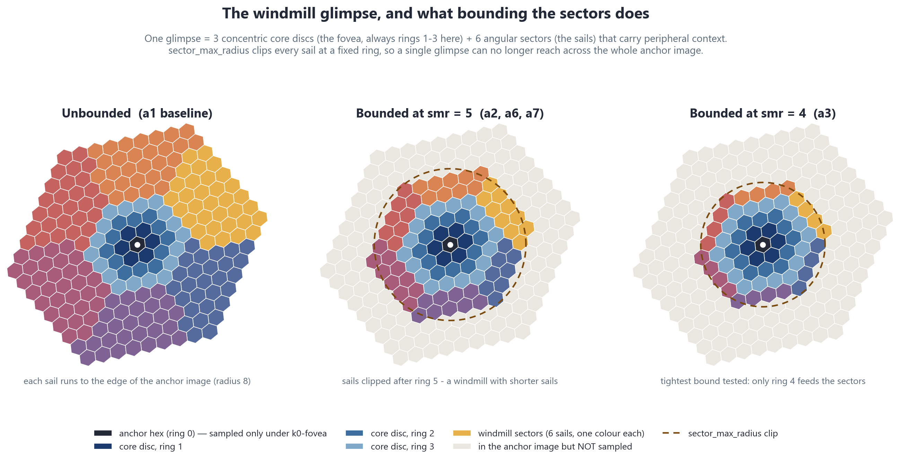

*One glimpse. The three concentric core rings around the anchor are the fovea, and they alone form
the embedding that gets read out. The six sails reach outward and never enter the readout directly —
they only shape how the fovea settles. Drawn on real H3 resolution-9 cells from a South Holland
anchor, so the hexagons tile exactly. The right panel shows the sails clipped at a fixed radius, one
of the variants tested below.* <!-- src: reports/2026-07-20-geo-mpc-windmill-hillclimb/figures/fig01_windmill_bounded_geometry.png.provenance.yaml + README §Terminology -->

### What a training run is

A run works through the 34,302 hexagons of South Holland at resolution 9, treating each in turn as an
anchor. <!-- src: reports/2026-07-20-geo-mpc-windmill-hillclimb/README.md §"The full map suite" ("full 34,302-hex anchor grid") --> For each anchor it draws ten fixations, builds the nine-stream windmill at each, and runs
two alternating phases. First it freezes the weights and lets its internal state relax until the total
cross-stream prediction error — the free energy — stops falling; twenty small integration steps by
default. Then it freezes that settled state and nudges the weights once, by a local Hebbian rule.
Think, then learn. Five passes over the province, batches of a hundred, seed 42. On the workstation
GPU a run takes six to eleven minutes. <!-- src: reports/2026-07-20-geo-mpc-windmill-hillclimb/README.md §"The seven arms" (trainer defaults; wall column 383–661 s) -->

The input is the same 178 numbers used everywhere else on this page: 64 satellite dimensions from
AlphaEarth, 50 from points of interest, 64 from the road network, all 2022. The output is the three
core streams' latents stacked into a 192-number embedding per hexagon. To score it we freeze that
embedding and fit ridge regressions to eight things we did not train on — liveability, health,
greenness, proximity, air quality, income, building morphology, cadastral density — under spatial
five-fold cross-validation, and report out-of-fold R². <!-- src: reports/2026-07-20-geo-mpc-windmill-hillclimb/README.md §"The seven arms" (8 non-circular targets, Family-1 metric) -->

Every comparison below is against that same architecture with **random, untrained weights**. That is
the only honest baseline for a model whose sampling geometry does a lot of work before any learning
happens.

### Four attempts

The first one was not this. In June we built and trained a model called DistantGapMPC across several
sessions: it encoded a hexagon's own resolution-9, -8 and -7 values into a 64-number latent and
predicted its resolution-6 and -5 parent averages. An audit read it line by line against the paper
and found it internally consistent with its own specification, but noted that nobody had ever asked
whether that specification was MRPC. It had no glimpse, no saccade, no action, no settling — and it
predicted across scales of a single modality, where the paper's whole premise is streams that carry
genuinely independent content. The foundational questions went back to a human instead of being
closed by the system that raised them, and the ~5,200 lines were deleted at commit `cab305a`.
<!-- src: PRIVATE reports/2026-06-14-distant-gap-mpc-implementation-audit/README.md §(a) claims-vs-reality table, §(c) faithfulness gaps 2/3/4, §(d) open questions (not published; atlas is findings-only); deletion commit cab305a cited in .claude/rules/novel-research-escalate-dont-default.md §Why -->
That is why nothing novel trains here now without a specification a human has signed.

Then MNIST, to test the mechanism where the answer is known. [We rebuilt the paper's model on digits,
backprop-free, following the recipe](reports/2026-07-13-mpc-mnist-vanilla-reproduction/README.md). It reached 62.5% where the paper reports 97.5%.
<!-- src: reports/2026-07-13-mpc-mnist-vanilla-reproduction/README.md §"The headline result" (62.48% vs 97.50 ± 0.15) --> Every
mechanism checked out — sparsity exact, settling monotonic, filters diverse and never collapsing —
but free energy climbed over training instead of falling, from 49.5 to 91.3 across five epochs, while
the representation's quality stayed flat at 44.7%, 43.5%, 46.9% for epochs 0, 2 and 4. So it was not
decaying. It was low from the first epoch and stayed there. <!-- src: same README, §"drift or low ceiling" table -->

A follow-up audit built two independent descriptions of the model — one from the paper, one from our
code — and joined them line by line to find where the 35 points went.
<!-- src: PRIVATE reports/2026-07-15-mpc-mnist-fidelity-audit/README.md (header) (not published; atlas is findings-only) --> The answer was mostly not the
learning rule. It was where the model is allowed to look. Reading the *same trained weights* at one
central fixation instead of ten random ones took it from 33.5% to 79.3%. Stopping the settling at the
free-energy minimum instead of overshooting added another 6 points, to 85.5%. Then the twist: scored
the paper's own way, with a nearest-neighbour readout rather than a linear one, the model reads 63.6%
— the linear head had been flattering it, and the real gap to 97.5% is wider than it looked.
<!-- src: reports/2026-07-17-mpc-mnist-technical-report/figures/chain_numbers.yaml — nodes control_random 33.5, control_central 79.3, t15_central 85.5, h13_knn 63.6, paper_target 97.5 -->

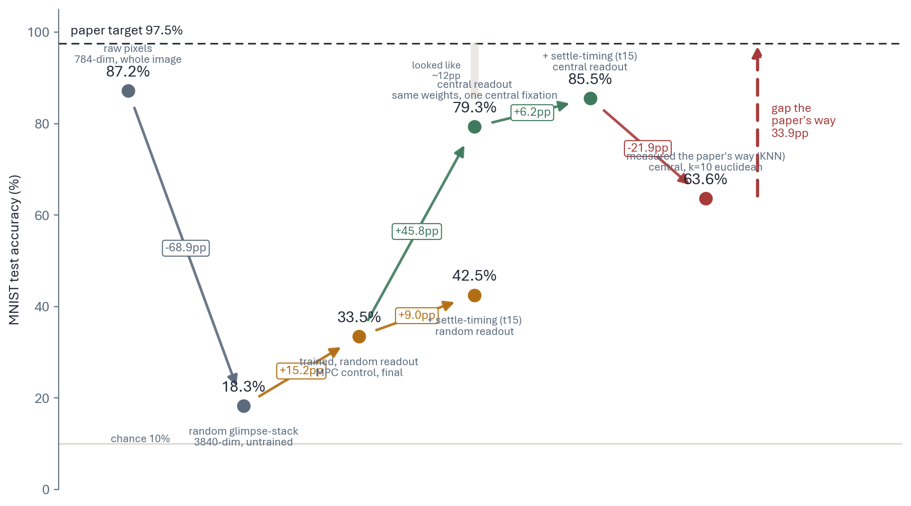

*Where the 35 points go. Raw pixels through a plain classifier reach 87.2%; forcing the model to see
only foveated random glimpses drops that to 18.3% before any learning happens, which is the cost of
throwing away location. Self-supervised training recovers some of it, changing where the model looks
recovers much more, and the last node is the reminder that the readout we used was the generous one.*
<!-- src: reports/2026-07-17-mpc-mnist-technical-report/figures/chain_numbers.yaml, every node's `source:` field names a committed run JSON -->

That lesson — calibration and looking policy first, architecture second — is what went back onto the
hexagons in July as the windmill hillclimb: seven variants, one lever each, then combinations.

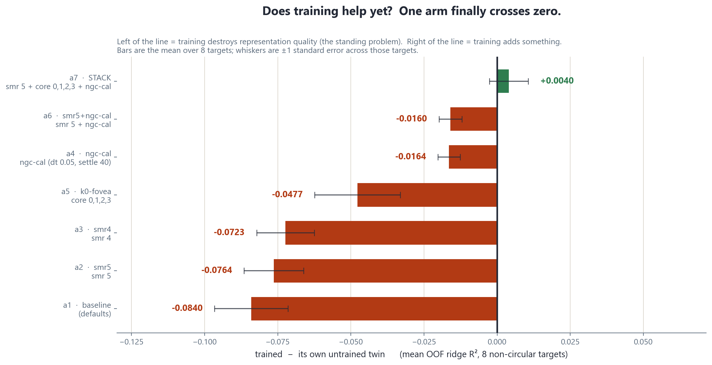

*Six of seven variants get worse by training. Each bar is one variant's downstream R² minus that same
variant's own untrained starting point. The baseline loses 0.084. Six arms are unambiguously below
zero — no target improves in any of them, and |t| runs from 3.3 to 7.5. Only the seventh, everything
stacked, lands at +0.0040, with a spread across targets of ±0.019, four of eight targets positive and
t = 0.60. That is a coin flip at one seed. The claim it supports is that training has stopped being
destructive, not that it has started helping.* <!-- src: reports/2026-07-20-geo-mpc-windmill-hillclimb/README.md §"How much of a7's win is real?" table + §"Read this honestly" -->

The surprise is which lever mattered. The glimpse geometry — bounding how far the sails reach, adding
the anchor cell to the fovea — was the thing everyone expected to matter, and it was the smallest
effect, worth +0.008 to +0.012 on its own. What removed 81% of the damage was letting the model settle
twice as long before each weight update and updating half as fast: −0.084 to −0.016 from those two
numbers alone. <!-- src: reports/2026-07-20-geo-mpc-windmill-hillclimb/README.md §"Discussion — MNIST-lessons transfer scorecard" -->

So we swept them. Four settling depths crossed with three update rates, plus the sail-length axis, all
at the winning geometry. The gradient is a flat noise floor: the best cell in the whole space reaches
+0.0058 against its own untrained twin, versus +0.0040 for the arm we started from, at t = 1.13 and
p = 0.30 — and that is the largest |t| anywhere in the swept space. Every one of the sixteen arms is
statistically indistinguishable from zero. Settling eight times deeper buys nothing.
<!-- src: reports/2026-07-21-geo-mpc-sensitivity/README.md §"The verdict, in five lines" items 2–4 -->

### What it looks like on the ground

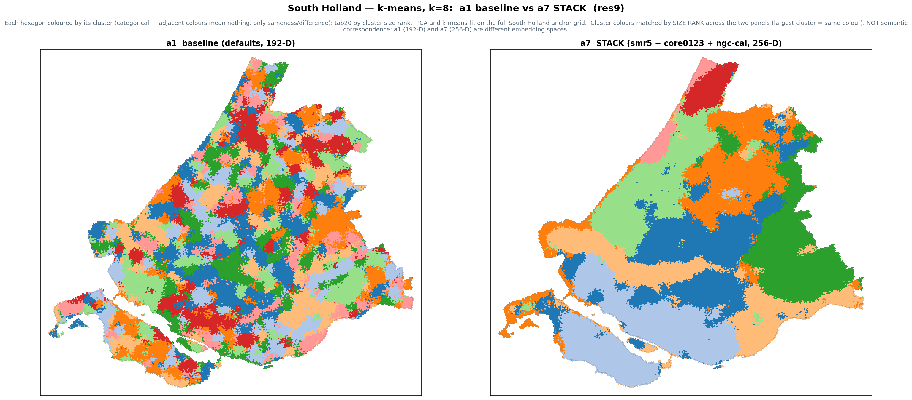

*Eight k-means clusters over South Holland's 34,302 hexagons, baseline on the left and the stacked
variant on the right. The baseline is speckle — a representation dominated by per-fixation noise. The
stacked variant separates the dune coast, the green interior of the Groene Hart, the Rijnmond port
corridor and the Westland glasshouse belt. Part of that is deeper settling acting as a smoother, and
no metric is attached to this figure. The two panels are different embedding spaces, 192 and 256
numbers wide, so cluster colours are matched by size rank only; compare the shape of the boundaries,
not which colour is which.* <!-- src: reports/2026-07-20-geo-mpc-windmill-hillclimb/README.md §"The full map suite — a1 vs a7, at two scales", incl. the colour-matching caveat -->

### Where it stands

The best representation this architecture has produced still has random, untrained weights. Read out
from the anchor cell alone it scores 0.474 across the target battery, ahead of ring aggregation at
0.467 and ahead of the raw 178-number input at 0.447. Set against its own untrained twin under a
matched readout, both averaged over ten fixations, training costs it 0.081 — from 0.431 down to 0.350.
<!-- src: reports/2026-07-10-mpc-consolidated-report/mpc_lane_consolidated_report.tex :459-463 (the 0.431 / 0.447 / 0.467 / 0.474 series) + results table :871-895 -- champion = anchor readout K=1, 256D, 0.474; random-weights average = K=10 averaged, 192D, 0.431; EM-trained = 192D, 0.350. The 0.431/0.350 pair is readout- and dimension-matched; 0.474 is an anchor readout and must NOT be differenced against 0.350 (anchor is worth ~0.04 on identical weights). --> A
dimension-matched control — the same input expanded to 256 numbers through a random matrix and a
nonlinearity, so it has the width and the nonlinear basis but none of the spatial construction —
reaches 0.428. <!-- src: same .tex :796–798 --> The windmill sampling geometry is doing real work. The
Hebbian learning rule on top of it is currently taking that work back out.

As of [the sensitivity sweep on 2026-07-21](reports/2026-07-21-geo-mpc-sensitivity/README.md) that is where it sits: net-erosive against its own untrained
initialisation in nearly every configuration tested, with one arm marginally across zero and no
configuration anywhere in the swept space distinguishable from no effect. The two knobs that produced
almost all of the improvement are at their asymptote. Whatever fixes this is not a knob.
<!-- src: reports/2026-07-21-geo-mpc-sensitivity/README.md §"The verdict, in five lines" item 5 -->

---

## How the maps are made: the Voronoi rasterizer

Every map on this page is drawn by a tessellation-aware **Voronoi rasterizer**. The problem
it solves is mundane and was corrupting our figures: the earlier method stamped a
fixed-size disc at each hexagon's centre, which left visible seams between hexagons and
silently over- or under-filled sparse regions. The Voronoi approach instead computes, for
each output pixel, which hexagon centre is genuinely nearest, and fills edge-tight. Missing
data now produces a real, geometrically truthful hole instead of a quiet fill.

| Continuous (a component through a colour ramp) | Categorical (cluster labels) |
|:---:|:---:|
|  |  |

| Binary (above/below a threshold) | RGB (three components as colour channels) |
|:---:|:---:|
|  | 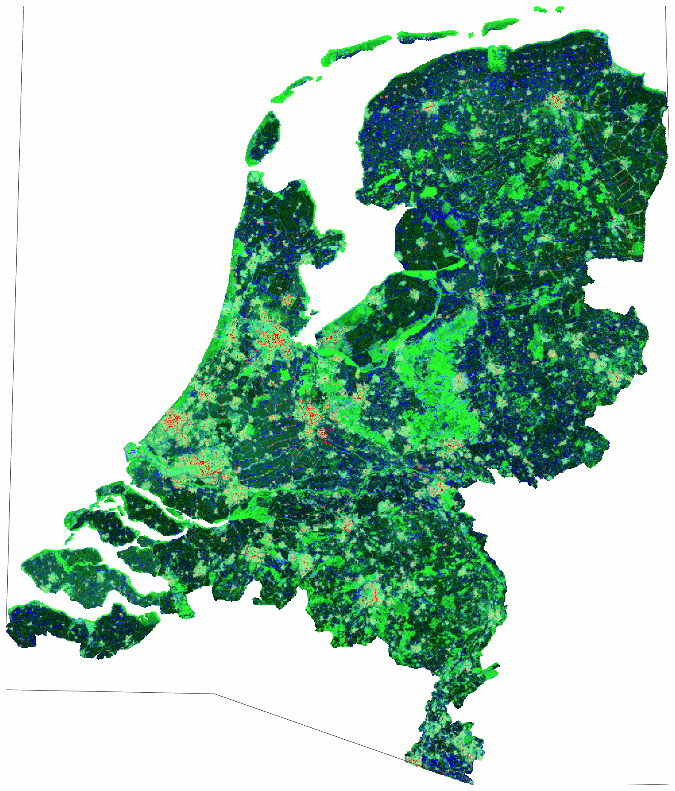 |

***All four fill modes.** The visible improvement is at the edges: coastlines and water bodies
now end where the data ends. The migration deleted 232 lines of legacy stamping code across 5
functions and moved 13 call sites onto the shared implementation, with 34/34 contract tests
and 278/278 of the full suite passing. The change to how missing data renders — a truthful gap
instead of a fill — was flagged for human visual sign-off, and that sign-off is still open.
Source: [rasterize-Voronoi toolkit report](reports/2026-05-03-rasterize-voronoi-toolkit/README.md).*

---

## Methodology and notation

Seven operations account for everything above. Each one is written here in symbols and then
in words directly underneath, so that a claim made in a caption can be checked against a
formula rather than against another caption. Someone who skips the mathematics entirely
should still be able to follow the page from the sentences.

| symbol | meaning |
|---|---|
| $i, j$ | hexagons (H3 cells) |
| $r$ | H3 resolution; 9 throughout unless a figure says otherwise |
| $d(i,j)$ | grid distance — how many steps from $i$ to $j$ across shared hexagon edges |
| $N_k(i)$ | the ring of hexagons at exactly distance $k$ from $i$ |
| $x_i$ | the embedding vector of hexagon $i$ |
| $n$ | how many hexagons are in the frame |
| $K$ | how many rings a neighbourhood operator reaches — never a number of clusters |
| $w_k$ | the weight given to ring $k$ |
| $S(\cdot)$ | a smoothing operator (ring aggregation) |
| $\lambda$ | sharpening gain |
| $H_\lambda(\cdot)$ | the unsharp sharpening operator |
| $R$ | the residual matrix left when one representation is predicted from another |
| $W$ | a ring-1 adjacency matrix whose rows sum to one |
| $F$ | free energy, the scalar Geo-MPC minimises |

### Rings and the hierarchy

Everything below is defined on two relations between hexagons. The first is distance within a
resolution:

$$N_k(i) = \{\, j : d(i,j) = k \,\}, \qquad D_K(i) = \bigcup_{k=0}^{K} N_k(i)$$

A ring is the set of hexagons exactly $k$ steps away, and a disc is everything out to $k$ steps.
Away from the twelve pentagons the grid cannot avoid, $|N_k(i)| = 6k$ and $|D_K(i)| = 1 + 3K(K+1)$,
so a disc of radius 10 holds 331 hexagons. The neighbourhood grows quadratically, which is worth
holding onto when reading the headline result below.

The second relation is across resolutions. Each hexagon has one parent one resolution coarser,
and each parent has seven children:

$$\pi_r : \mathcal{H}_r \to \mathcal{H}_{r-1}, \qquad \big|\pi_r^{-1}(p)\big| = 7$$

This is why the cell counts in the tessellation figure multiply by about seven per step. It is
also the relation the multi-resolution U-Net walks when it trains at three scales at once, and
the one the cone batching uses to cut the country into independent pieces.

### Per-block standardisation and the 178-dimension stack

Three sources are fused: AlphaEarth with 64 columns, hex2vec with 50, highway2vec with 64. Each
column $c$ of block $m$ is standardised using only the rows $S_m$ where that block is not
all-zero,

$$\tilde{X}^{(m)}_{ic} = \frac{X^{(m)}_{ic} - \mu_{mc}}{\sigma_{mc}}, \qquad \mu_{mc} = \frac{1}{|S_m|}\sum_{i \in S_m} X^{(m)}_{ic}$$

with $\sigma_{mc}$ the matching standard deviation over $S_m$, and a column of zero spread left
untouched. The three standardised blocks are then laid side by side:

$$X = \big[\, \tilde{X}^{(\mathrm{AE})},\ \tilde{X}^{(\mathrm{hex2vec})},\ \tilde{X}^{(\mathrm{roads})} \,\big] \in \mathbb{R}^{n \times 178}, \qquad 64 + 50 + 64 = 178$$

Put each source on a common scale, then concatenate. Computing the scale from non-empty rows only
matters for the sparse sources, which are zero-filled where they have no data: were those empty
rows allowed into the mean, the block would end up standardised around its own absence.

Before per-block standardisation the road-network block carried 97% of the total variance of the
stack, so any model reading the fused vector was substantially reading roads alone. The concat step now measures each block's share,

$$v_m = \frac{\sum_{c \in m} \mathrm{Var}(X_{\cdot c})}{\sum_{c} \mathrm{Var}(X_{\cdot c})}$$

and flags any block that climbs above a set ceiling.

### Ring aggregation

This is the operator behind the headline section. First the mean over one ring, restricted to the
hexagons
$\mathcal{I}$ actually present in the frame:

$$\bar{x}_k(i) = \frac{1}{|N_k(i) \cap \mathcal{I}|} \sum_{j \in N_k(i) \cap \mathcal{I}} x_j$$

then a weighted sum of those ring means:

$$S_K(x)_i = \sum_{k=0}^{K} w_k\, \bar{x}_k(i), \qquad \sum_{k=0}^{K} w_k = 1$$

Every hexagon is replaced by a weighted blend of itself, the average of its six immediate
neighbours, the average of the twelve in the next ring, and so on out to ring $K$. Rings are
averaged before they are weighted, so the outer rings' much larger populations do not
automatically outvote the centre. At the edge of the study area a ring can come back empty; the
operator then substitutes the hexagon's own vector, so the weight is spent rather than silently
dropped.

The $k$ in "ring aggregation $k=10$" is the number of rings the average reaches. It is not a
number of clusters and this is not $k$-means — a $k$ of 10 means each hexagon is blended with the
330 others within ten steps of it, a patch a few kilometres across.

The four schemes differ only in how fast weight falls off with distance. Each $\tilde{w}_k$ below
is divided by its own sum to give $w_k$:

| scheme | $\tilde{w}_k$ | outermost ring at $K=10$ |
|---|---|---|
| logarithmic | $1/\log_2(k+2)$ | 28% of the centre's weight |
| linear | $1 - k/K$ | zero, exactly at ring $K$ |
| exponential | $e^{-k}$ | 0.005% of the centre's weight |
| flat | $1$ | the same as every other ring |

Logarithmic and linear keep the distant rings meaningfully in the average, and they are the two
that score highest. Exponential decays so steeply that by ring 10 it has almost returned the
unsmoothed hexagon, which is the plain reading of why it trails despite being the scheme one
would reach for first. Flat treats a hexagon ten steps away as worth exactly as much as an
immediate neighbour, and comes last.

### Unsharp masking

The opposite operation, tested in the sharpening campaign:

$$H_\lambda(x) = x + \lambda\,\big(x - S(x)\big) = (1+\lambda)\,x - \lambda\,S(x)$$

Subtract a hexagon's neighbourhood average from it to isolate what is locally distinctive, then
add that difference back amplified by $\lambda$. At $\lambda = 0$ nothing happens; larger $\lambda$
pushes each hexagon harder away from whatever surrounds it. The surround $S$ was frozen as the
$K=10$ exponential ring-aggregation arm, and $\lambda$ ran over 0.25, 0.5, 1, 2 and 4.

The pre-registration did not ask whether sharpening raises average accuracy. It asked whether the
benefit *grows* with how spatially sharp a target is, which makes the hypothesis an interaction
term. With $\mathrm{sharp}_c \in \{0,1\}$ a binning of target column $c$ fixed before any probe
ran, and $\Delta R^2_c(\lambda)$ the change in probe accuracy against the unsharpened baseline:

$$\Delta R^2_c(\lambda) = \beta_0 + \beta_1 \lambda + \beta_2\,\mathrm{sharp}_c + \beta_3\,\big(\lambda \cdot \mathrm{sharp}_c\big) + \varepsilon$$

$\beta_3$ is the entire hypothesis. A positive $\beta_3$ would mean each extra unit of sharpening
buys more accuracy on sharp targets than on smooth ones. The smallest $\beta_3$ that would count
as real rather than noise was fixed in advance at 0.005 per unit $\lambda$ — a threshold written
down while no measured value existed. It came out at $-0.0031$, with a 95% interval of
$[-0.0124, +0.0042]$ that straddles zero and lies inside the threshold, which is why the
interaction is reported as rejected rather than as merely unsupported.

### The residual subspace

This is what every accessibility map above is built on.

Two 64-dimension representations over the same 482,706 hexagons: $X^{\mathrm{lat}}$ from the model
passing messages along the plain hexagon lattice, $Y^{\mathrm{acc}}$ from the model passing them
along the travel graph. Split the hexagons into five spatial folds. Within each fold, standardise
on the training rows, fit a ridge regression whose penalty is chosen internally from
$\{0.1, 1, 10, 100, 1000\}$, predict the held-out rows, and map back to the original units.
Stacking those held-out predictions gives $\hat{f}(X^{\mathrm{lat}})$, and

$$R = Y^{\mathrm{acc}} - \hat{f}\big(X^{\mathrm{lat}}\big) \in \mathbb{R}^{n \times 64}$$

$$f_{\mathrm{resid}} = 1 - R^2_{\mathrm{oof}}\big(Y^{\mathrm{acc}},\ \hat{f}(X^{\mathrm{lat}})\big)$$

with that $R^2$ weighted across the 64 output dimensions by their variance.

A residual subspace is what one representation still holds after the other has been used to
predict it as well as any linear map can. If swapping the lattice for the travel graph merely
rearranged information both models already had, the ridge recovers it and $R$ collapses toward
zero. Whatever survives is by construction not linearly reachable from the lattice
representation. $f_{\mathrm{resid}}$ reports that leftover as a fraction — 0 means fully
explained, 1 means the linear map achieved nothing. Because the predictions are made on hexagons
the ridge never saw, a large leftover cannot be manufactured by overfitting.

The three map views are three readings of that same $R$. The first is its length per hexagon,

$$\rho_i = \| R_i \|_2$$

which is how far off the linear map was at hexagon $i$ — the size of the disagreement. The second
takes the first three principal components $u^{(1)}, u^{(2)}, u^{(3)}$ of $R$, replaces each value
by its rank among all $n$, and paints the three onto colour channels:

$$\mathrm{rgb}_i = \Big(\, \mathrm{rank}\big(u^{(1)}\big)_i,\ \mathrm{rank}\big(u^{(2)}\big)_i,\ \mathrm{rank}\big(u^{(3)}\big)_i \,\Big) \big/ n$$

That is direction rather than size: two hexagons share a colour when their disagreements point
the same way, so coherent patches mean structure and uniform speckle would mean noise. The third
measures how much a hexagon stands out from its immediate neighbours, in each model separately,
and subtracts:

$$c_i(x) = 1 - \hat{x}_i^{\top} (W\hat{x})_i, \qquad D_i = c_i(\mathrm{acc}) - c_i(\mathrm{lat})$$

with $\hat{x}_i = x_i / \|x_i\|$ and $W$ the ring-1 adjacency normalised so each row sums to one.
$c_i$ is the mean cosine distance between hexagon $i$ and each of its six neighbours taken one at
a time. Writing it against the mean of the neighbours' unit vectors is an identity rather than an
approximation, which is what lets it run as a single sparse matrix multiply over 482,706 rows; it
is not the cosine distance to the neighbourhood mean vector, which is a different quantity. A
positive $D_i$ means the travel graph made that hexagon stand out more than the lattice did.

### Probe accuracy and the fold scheme

Every probe score on this page is out-of-fold:

$$R^2 = 1 - \frac{\sum_i (y_i - \hat{y}_i)^2}{\sum_i (y_i - \bar{y})^2}$$

evaluated only on hexagons held out of the fit. Zero means the model does no better than
predicting the national average everywhere. Negative values are possible and mean it does worse
than that.

Spatial block cross-validation reprojects the hexagon centroids to Dutch RD New (EPSG:28992),
lays a 10 km × 10 km grid over them, and assigns whole blocks — not individual hexagons — at
random to one of five folds. Two adjacent hexagons are nearly the same place, so letting one land
in training while its neighbour lands in testing inflates the score; keeping blocks intact removes
most of that.

The page is not uniform on this, and it matters when comparing a number in one section against a
number in another. The livability and morphology probes, the accessibility residual fits and the
Geo-MPC arms all use five spatial folds. The headline ring-aggregation table and the whole
sharpening campaign use random five-fold instead — the sharpening pre-registration names spatial
CV as explicitly outside its scope. Random folds give the more generous number of the two, so
those figures are not directly comparable with the spatial-block ones.

### Geo-MPC: settle, then update

Symbols here follow the paper and the code rather than the rest of this section, so $W_v$ and
$R_{vq}$ below are a stream's weight matrices and have nothing to do with the adjacency $W$ or the
residual $R$ above.

A glimpse is a set of $V$ streams, nine by default. Stream $v$ carries an observable $g_v$, which
is the plain mean of the input vectors of the hexagons in its ring or wedge, and a latent
$z_v \in \mathbb{R}^{64}$. Two kinds of error are defined on them:

$$e_v = z_v - W_v\,g_v, \qquad e_{vq} = z_q - \big( R_{vq}\,\phi(z_v) + A_{vq}\,a \big)$$

The first is how badly a stream's latent matches what its own patch of country says. The second
is how badly stream $v$ predicts stream $q$'s latent, given the saccade $a$ that brought the model
here; $\phi$ keeps only the largest few entries of a latent and zeroes the rest. Free energy adds
both, weighted by fixed precisions $\sigma$ and $\sigma_C$:

$$F = \frac{1}{2\sigma}\sum_{v} \| e_v \|^2 \;+\; \frac{1}{2\sigma_C}\sum_{(v,q)} \| e_{vq} \|^2$$

One number for how badly the nine views currently disagree, and the only thing the model ever
minimises. Thinking is gradient descent on it with the weights held still, starting the latents
from zero and taking twenty small Euler steps of size $\mathrm{d}t$:

$$z_v \leftarrow z_v + \mathrm{d}t\left( -\frac{1}{\sigma}\,e_v + \frac{1}{\sigma_C}\Big(\sum_{q} R_{vq}^{\top} e_{vq}\Big) \odot \phi'(z_v) \right)$$

Learning then holds the settled latents still and nudges the weights once, at step size $\eta$,
averaged over the batch, with decay $\lambda_w$ and a column-norm constraint $\Pi$:

$$W_v \leftarrow \Pi\!\left( W_v + \frac{\eta}{\tau_w}\Big( -\lambda_w W_v + \big\langle e_v\, g_v^{\top} \big\rangle_B \Big) \right)$$

and identically for $R_{vq}$ using $\langle e_{vq}\,\phi(z_v)^{\top} \rangle_B$ and for $A_{vq}$
using $\langle e_{vq}\,a^{\top} \rangle_B$. Every update is an outer product of an error with an
activity that the same two streams already hold. Nothing propagates backwards through the
network, which is the whole point of the approach.

Free energy descends and plateaus in every arm run so far. The level it plateaus at is not a
quality score and cannot be compared between arms, because a ten-stream model settling for forty
steps is minimising a different quantity than a nine-stream one settling for twenty.

Arms are compared on one statistic instead. Freeze an arm's embedding, fit ridge regressions to
eight targets it never trained on under five-fold spatial CV, and subtract the same measurement
made on the identical architecture with random untrained weights:

$$\Delta = \frac{1}{8}\sum_{t=1}^{8} R^2_t(\text{trained}) \;-\; \frac{1}{8}\sum_{t=1}^{8} R^2_t(\text{untrained twin})$$

Positive means learning added something the sampling geometry had not already provided by itself.
Negative means the training erased signal that random weights preserved. One arm of the seven
above reaches positive, by 0.004.

---

## The three-stage pipeline

### Stage 1 — one encoder per data source

Each source is turned into hexagon-indexed numbers independently, so that a problem in one
never silently contaminates another.

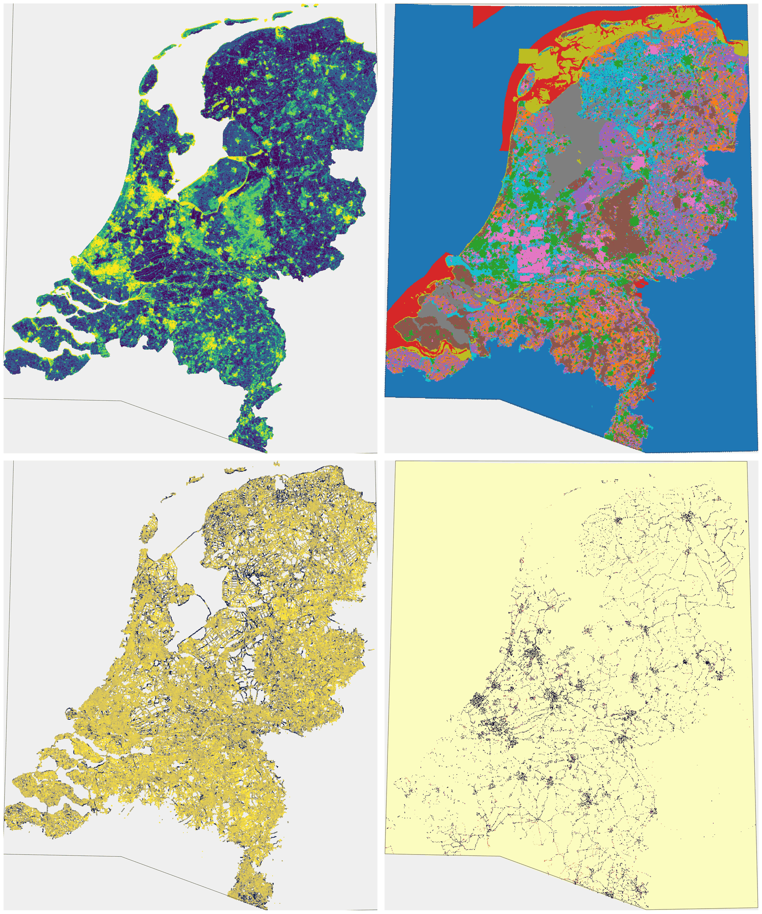

***The four data sources, each rendered on the same hexagon grid.** Satellite features, points
of interest, road-network topology and transit accessibility. Look at the transit panel: it is
almost entirely empty, and that observation drove the design decision described below. The
satellite, POI and roads data are from 2022; the transit feed is 2026.
Source: [Book of Netherlands](reports/2026-05-03-book/THE_BOOK.md), ch. 2.*

Each panel above deserves its own page, because the four modalities are unalike in ways that
decide how they must be handled downstream. What follows is one map per source, all four drawn
in May 2026 on the pre-correction grid, all four using the Voronoi rasterizer at 250 m pixels.

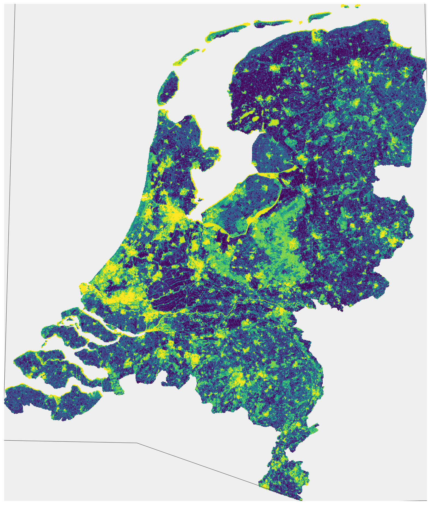

***Satellite features, compressed to one number per hexagon.** AlphaEarth gives 64 numbers per
cell, learned by Google from Earth Engine imagery; this is their first principal component, which
carries 30.2% of the variation, with the first three together carrying 60.1%. It reads as a
continuous land-cover gradient rather than a set of categories, which is the point — nobody told
it what a forest is. It covers 398,931 hexagons, 45.9% of the book's grid, because AlphaEarth is
land-only and the rest is water, tideflat, or foreign territory clipped from the bounding box.
Vintage 2022.*


***What the map of shops and amenities knows, grouped into ten kinds of place.** POI features are
learned into 50 numbers per hexagon by hex2vec, then cut into ten groups by k-means at seed 42.
This is the most variance-rich of the four sources — first component 27.1%, first three 45.7% —
and the most categorically structured map of the set, which is why it is shown as groups rather
than as a gradient. One caveat that matters: this render predates the coverage-capped POI filter
the project adopted on 2026-06-05, and its source artifact carries no filter identifier, which by
this project's own convention marks it as the retired unfiltered baseline. That baseline lets
province-scale polygons like nature reserves paint enormous uniform swathes. Read the shape of
the urban groups, not the extent of the rural ones.*

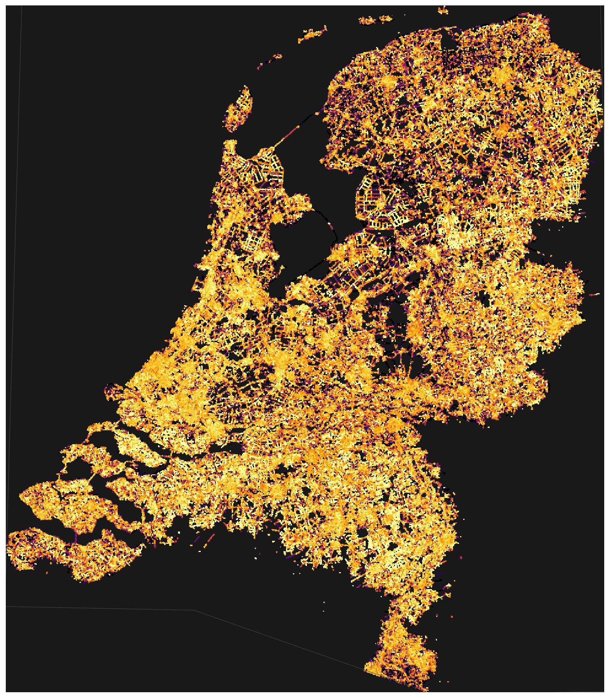

***The road network, which turns out to be almost one-dimensional.** Highway2vec encodes street
topology per hexagon; its first principal component alone carries 96.5% of the variation and the
first three carry 99.1%. That single axis runs from high-throughput corridor to local street, so
this map is close to a complete description of what the roads block contains. It covers 252,177
hexagons, 29% of the grid — roads exist where people build them. This is the 30-dimension roads
encoder; the current one is 64-dimensional and was regenerated onto the corrected grid in June
2026.*

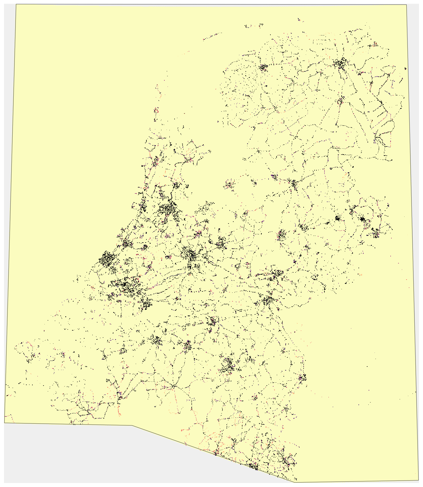

***The picture that ended the transit modality.** 843,629 of 868,239 hexagons — 97.17% — hold an
identical "no transit here" vector, so what this map mostly shows is the shape of that background
against a thin bright minority near stops and stations. The first component takes 74.1% of the
variation, and what it is really encoding is presence versus absence. A block that is 97% one
constant value does not just contribute nothing to a concatenation, it distorts the scaling of
everything beside it. Transit is being rebuilt as a graph instead, which is described below. The
feed is 2026, unlike the 2022 vintage of the other three.*

| Source | What it encodes | Size | Status |
|---|---|---|---|
| **AlphaEarth** | Pre-computed Google Earth Engine satellite features | 64 | **Integrated** — the primary modality; vintage 2022 |
| **POI / hex2vec** | OpenStreetMap points of interest, learned into a compact vector | 50 | **Integrated** — regenerated 2026-06-12 onto the current grid, from a 2022 map snapshot |
| **Roads / highway2vec** | OpenStreetMap street-network topology | 64 | **Integrated** — regenerated 2026-06-12 onto the current grid, from a 2022 map snapshot |
| **GTFS transit** | Public-transport service | — | **Reframed as a graph** — see below |
| **Aerial imagery** | PDOK orthophotos via DINOv3 | — | **Not built** — no artifacts on disk |

The first three concatenate to the canonical **178-dimension** fused embedding
(64 + 50 + 64), verified on disk at 537,970 hexagons × 178 columns.

Why GTFS was removed rather than fixed is the most interesting negative result here. Transit
stops are rare. Encoding "what transit serves this hexagon?" as a per-hexagon vector means
almost every hexagon gets a vector of zeros. We measured it: the res-9 GTFS artifact covers
24,610 hexagons, which against the 537,970-hexagon fused embedding is 95.4% empty background
(95.6% against the full 558,626-hexagon grid). A block that is 95% zeros doesn't just add
nothing, it distorts the scaling of everything it's concatenated with. So the fix isn't a
better encoder, it's a different object. Transit is being rebuilt as a fourth travel-graph
mode alongside walking, cycling and driving, which puts transit information on the *edges
between* hexagons rather than inside them. Hexagons with no transit then have no transit
edges, and the empty-background problem dissolves instead of being normalised away. *(The
project's internal notes quote ~97% for this figure; our own measurement gives ~95.5%, which
is the number used above.)*

A related lesson is already baked into Stage 2: before concatenating, each source's block
is standardised independently. Without that step the road-network block alone accounted for
roughly 97% of the fused embedding's total variation, drowning the satellite and
points-of-interest signal entirely.

### Stage 2 — fusion

- **Ring aggregation** — weighted averaging over a hexagon's k-ring neighbourhood. Zero
  parameters, and currently the best performer we've measured (see headline). Weighting
  schemes: logarithmic (best), linear, exponential, flat.
- **FullAreaUNet** — multi-resolution encoder–decoder across H3 resolutions 8–10 with skip
  connections, message-passing along a travel-accessibility graph.
- **ConeBatchingUNet** — the same idea restricted to independent hierarchical "cones"
  spanning coarse to fine resolutions, so memory scales with a cone rather than the country.
- **LatticeGCN** — a graph convolutional network on the plain hexagonal lattice; the control
  that tells us whether learned message-passing is buying anything at all.

#### What the hierarchy buys

The U-Net is trained across three H3 resolutions at once and emits a 64-number embedding at each
of them. Reading the same trained model at each level is the clearest way to see what "scale"
means for an embedding.

| Resolution 7 — 8,728 cells | Resolution 8 — 58,041 cells | Resolution 9 — 397,757 cells |
|:---:|:---:|:---:|
| 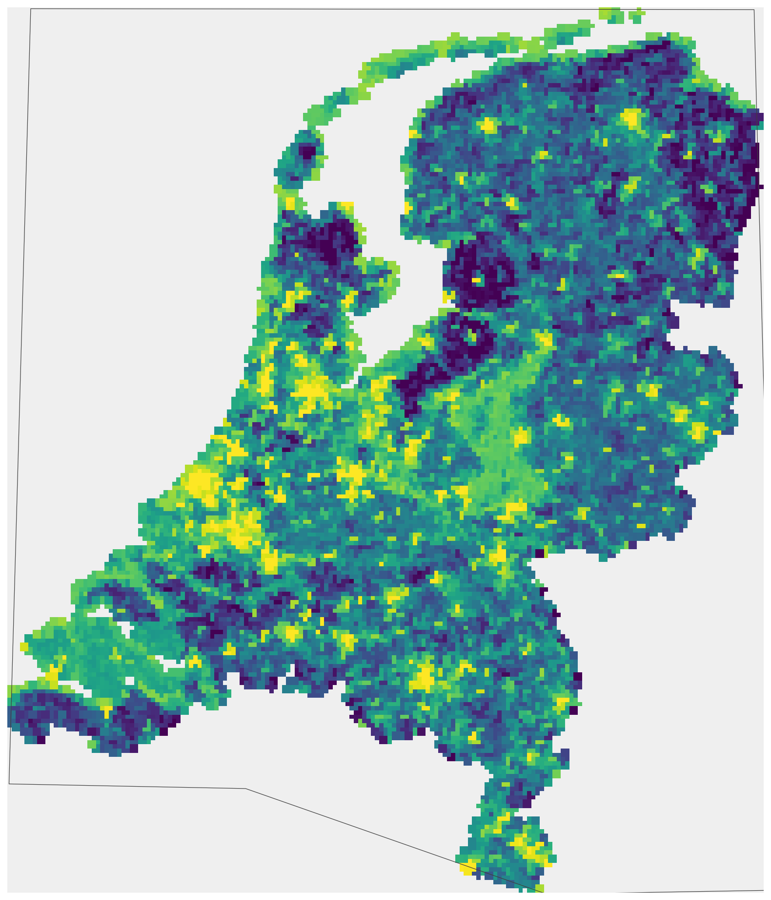 |  |  |

***One trained model, read at three scales.** These are the same network's first principal
component at its three exits, coarse to fine, mean cell area 5.16 km² down to 0.105 km². At
resolution 7 you get provinces; at 8, cities separate from countryside; at 9, neighbourhood
texture appears. At the finest level that first component alone accounts for 62.5% of the model's
64-number output, which is a warning as much as a result — the training has squeezed most of what
it learned onto a single urban-to-rural axis. Rendered May 2026 from the legacy "20mix" U-Net
artifact on the pre-correction grid. Source:
[Book of Netherlands](reports/2026-05-03-book/THE_BOOK.md), ch. 4.*

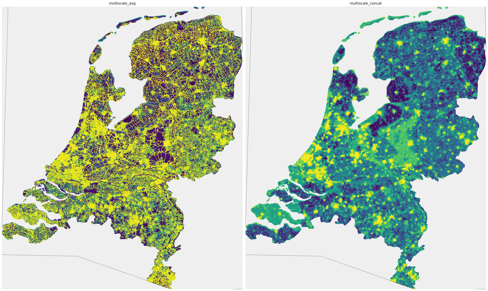

***Two ways of folding three scales back into one.** The three exits have to be recombined before
anything downstream can use them, and the choice is not cosmetic. Averaging them, left, keeps 64
numbers per hexagon and preserves the per-scale grain. Stacking them, right, gives 192 numbers and
produces visibly larger coherent regions, because the coarse exits contribute a low-frequency
component that survives the merge. The stacked version is the one fed to the liveability probes.
Both panels are at resolution 9 on the legacy artifact and grid.*

Whether routing messages along real travel networks rather than the plain hexagon grid helps
is itself under investigation, with the analysis plan frozen in advance; see the
[sharpening-as-explainability pre-registration](reports/2026-07-28-accessibility-sharpening-explainability/PREREGISTRATION.md).
That campaign has no results write-up yet, so the link goes to its frozen plan rather than to
findings.

### Stage 3 — probing and analysis

- **Regression probes** against Leefbaarometer livability. The neural probe reduces to exact
  linear regression when configured with zero hidden layers, so the linear and neural results
  come off one probe stack and one code path.
- **Classification probes** against the Urban Taxonomy building-morphology hierarchy.
- **Clustering and visualisation** across H3 resolutions, rendered through the Voronoi
  rasterizer above.

Deeper treatments of most results on this page, with the full figure set, are in the
[Book of Netherlands](reports/2026-05-03-book/THE_BOOK.md).

---

## How This Project Is Developed

UrbanRepML is written by one researcher working with a team of AI agents inside
[Claude Code](https://docs.anthropic.com/en/docs/agents-and-tools/claude-code/overview).
What makes it worth a note here is that the development process is treated as a research
object in its own right: it is specified, instrumented, and audited with the same
discipline as the spatial pipeline.

The problem it solves is that an AI agent has no memory between sessions. Close the
window and everything it worked out is gone; open a new one and it re-derives finished
work, or contradicts a decision made last week because it has no way of knowing the
decision exists.

The fix is **stigmergy** — coordination through the environment rather than through
direct messages. Ants do not instruct each other; they leave pheromone on the ground and
the next ant reads the ground. Here the shared medium is a directory of dated markdown
files: an agent finishing a task writes what it did, what it decided, and what it left
unresolved, and later agents read those files rather than being told. Agents never
message each other, so there is no protocol to keep in sync and no message that can be
missed.

Each terminal window is issued a name the first time it starts, and that name is the
address its memory is filed under. A session **authenticates** that name from the
process that owns the window rather than inferring it from a plausible-looking file —
guessing is banned because a session that guessed once wrote its own state onto a
different terminal that was live at the time.

Storing traces turned out to be the easy half. Months of well-written traces accumulated
and nothing consulted them at the moment a decision was being made: the forgetting was a
**consumption gap**, not a storage gap, and writing more was never going to fix it. So
one agent — the **selflet** — does nothing but rank the project's own past traces against
what this session is about to do, and hand forward a short list with pointers and
reasons. It runs *before the work is scoped*, so "this was already done last month"
arrives while the plan is still being written rather than after the work is redone.

That check began life as an instruction. It was skipped anyway, with an invented
justification, and the skip was written down as though documenting it made it
acceptable. This is the most repeated finding in the project's own record:

> **A rule that fires as narration an agent recites while proceeding stops nothing. A
> validator that raises is a precondition that cannot be argued past.**

So the load-bearing rules stopped being prose and became code that refuses. The plan file
cannot be written unless the memory check has demonstrably run. A spatial artifact cannot
be loaded without reading its provenance record — the filename is a convenience, the
sidecar is the identity. A new model architecture cannot enter a training run until every
foundational choice carries an explicit human ratification stamp. Each of these replaced a
correctly-worded instruction that had already failed to stop the thing it described.

Thirteen dispatchable specialists sit under the coordinator — spatial operations, the
three pipeline stages, specification, review, memory curation, and process health among
them — each dispatched per task, each short-lived, each leaving a trace.

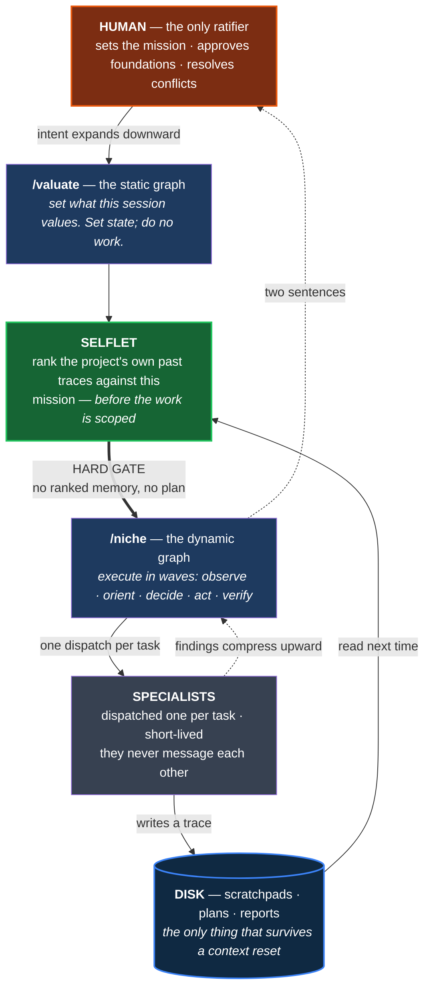
```mermaid
flowchart TB
    H["<b>HUMAN</b> — the only ratifier<br/>sets the mission · approves foundations · resolves conflicts"]
    V["<b>/valuate</b> — the static graph<br/><i>set what this session values. Set state; do no work.</i>"]
    SEL["<b>SELFLET</b><br/>rank the project's own past traces against this<br/>mission — <i>before the work is scoped</i>"]
    N["<b>/niche</b> — the dynamic graph<br/><i>execute in waves: observe · orient · decide · act · verify</i>"]
    SP["<b>SPECIALISTS</b><br/>dispatched one per task · short-lived<br/>they never message each other"]
    D[("<b>DISK</b> — scratchpads · plans · reports<br/><i>the only thing that survives a context reset</i>")]

    H -->|"intent expands downward"| V
    V --> SEL
    SEL ==>|"HARD GATE<br/>no ranked memory, no plan"| N
    N -->|"one dispatch per task"| SP
    SP -->|"writes a trace"| D
    D -->|"read next time"| SEL
    SP -.->|"findings compress upward"| N
    N -.->|"two sentences"| H

    style H fill:#7c2d12,color:#fff,stroke:#ea580c,stroke-width:2px
    style D fill:#0f2942,color:#fff,stroke:#3b82f6,stroke-width:2px
    style SEL fill:#166534,color:#fff,stroke:#22c55e,stroke-width:2px
    style V fill:#1e3a5f,color:#fff
    style N fill:#1e3a5f,color:#fff
    style SP fill:#374151,color:#fff
```

*The loop that matters is on the right: a specialist writes to disk, and the next
session's memory check reads it back. The context window dies several times in a normal
working day; disk is what crosses that boundary.*

The process is audited with the same discipline as the pipeline. The most recent audit
turned the system on itself — measuring what its own memory machinery actually selects,
against a hypothesis supplied to be disproved — and is published in full, including the
two defects it found and the places where the evidence is a session's self-report rather
than an instrument reading: [`reports/2026-08-12-harness-selection-audit/`](reports/2026-08-12-harness-selection-audit/).

---

## Setup

This repository is the public **atlas** -- figures, reports, and findings. The source code
lives in a separate private research repository. The pipeline described below is documented
here for reference; it is not runnable from this repo.

```bash
git clone https://github.com/bert-berkers/urbanrepml-atlas.git
```

## License

MIT License -- see [LICENSE](LICENSE)

## Acknowledgments

- [SRAI](https://github.com/kraina-ai/srai) -- Spatial Representations for AI
- [H3](https://h3geo.org/) -- Hexagonal hierarchical geospatial indexing (via SRAI)
- [PyTorch Geometric](https://pytorch-geometric.readthedocs.io/) -- Graph neural networks
- [Leefbaarometer](https://www.leefbaarometer.nl/) -- Dutch livability scoring (regression probe target)
- [Urban Taxonomy](https://urbantaxonomy.org/) -- Hierarchical building morphology (classification probe target)
- [Apache Sedona](https://sedona.apache.org/) -- Spatial query engine (via SpatialDB wrapper)
- [Claude Code](https://docs.anthropic.com/en/docs/agents-and-tools/claude-code/overview) -- Multi-agent development environment
