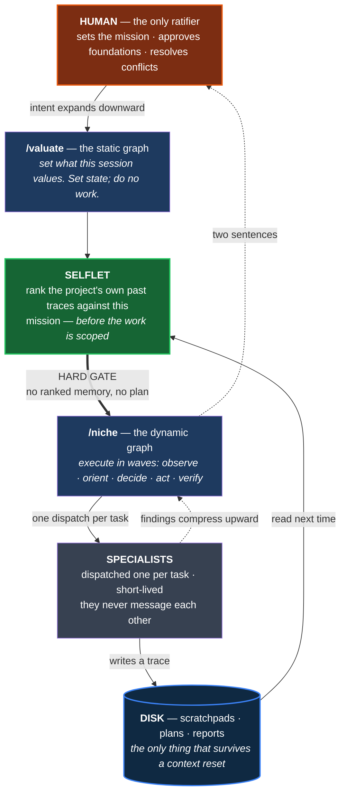

# UrbanRepML

**Dense geospatial (urban) embeddings from independent modalities, fused on hexagonal grids, probed for what they learned.**

[](https://www.python.org/downloads/)
[](https://opensource.org/licenses/MIT)
[](https://github.com/kraina-ai/srai)

UrbanRepML learns dense geospatial (urban) representations by encoding each data modality independently, fusing them spatially through multi-resolution U-Net architectures on [H3 hexagonal grids](https://h3geo.org/), then probing the resulting embeddings against external ground truth. All spatial operations use [SRAI](https://github.com/kraina-ai/srai). The project is developed by a human and [13 dispatchable specialist AI agents](#how-this-project-is-developed) coordinated through stigmergic scratchpads.

For philosophical & societal motivation, and early results of the fullareaU-NET, see the [Active Inference Institute talk](https://www.youtube.com/watch?v=UYD8CR_Xorg&ab_channel=ActiveInferenceInstitute).

---

> **This is the public atlas.** This repository is a manually-synced public subset of a private research repository, containing figures, reports, and findings rather than runnable code. Synced 2026-08-13.

---

## What this project does

The Netherlands is cut into small hexagonal tiles — about 560,000 of them, each roughly
0.1 km², a little smaller than a city block. This is the [H3 grid](https://h3geo.org/), a
standard way of chopping the world into hexagons so that every dataset can be lined up on
the same tiles. For each tile, UrbanRepML asks several independent sources what they see
there: a satellite, a map of shops and amenities, a road network. Each source produces a
list of numbers describing that tile — an **embedding**. The embeddings are then combined,
and the combined description is tested by asking a simple question: *given only these
numbers, can you predict something real about the place?* That test is called a **probe**,
and the score it reports is **R²** — the fraction of the real-world variation the numbers
explain, where 1.0 is perfect and 0.0 is no better than guessing the national average.

Everything below is a preliminary result on one study area (the Netherlands). Where a
number comes from an artifact that has since been superseded, the caption says so.


***The country as seen by a satellite embedding, with no human categories imposed.** Each
hexagon's 64-number AlphaEarth description is compressed to three numbers and painted as
red/green/blue. Coastline, polder, forest, and city separate on their own. First component
explains 30.2% of the variation, first three explain 60.1%; 398,931 hexagons.
**Vintage: AlphaEarth 2022. Caveat:** this figure was rendered on the study-area grid used
before the 2026-06-07 boundary correction, so its hexagon count is not the current
canonical one (558,626 land hexagons at this resolution). The picture is representative;
the count is historical. Source:
[Book of Netherlands](reports/2026-05-03-book/THE_BOOK.md), ch. 1.*

---

## Headline: averaging a hexagon with its neighbours beats these trained models

The most useful thing we have found so far is a result *against* our own deep models.

Take a hexagon's embedding and simply replace it with a weighted average of itself and
every hexagon within 10 steps of it. That is **ring aggregation** — a blur. It has zero
trainable parameters and takes minutes. Compare it against neural networks trained for
hours to fuse the same inputs. On our current best evidence the blur wins, and it wins by
a wide margin.

The weighting matters, and **it is logarithmic weighting that wins, not exponential**. On
the canonical 178-dimension fused embedding, averaged over 11 prediction targets:

| ring-aggregation weighting | mean R² (all 11 targets) | mean R² (livability only) |
|---|---|---|
| **logarithmic** | **0.4849** | **0.5213** |
| linear | 0.4844 | 0.5210 |
| exponential | 0.4738 | 0.4990 |
| flat (unweighted) | 0.4531 | 0.4956 |

The best *learned* model in the comparison — a graph U-Net variant — reaches 0.391 on the
livability targets. The gap of roughly 0.13 is far larger than any plausible measurement
wobble. All figures from
[`ring_agg_res9_k10_table.md`](reports/2026-07-20-probabilistic-fusion-res10-netherlands/ring_agg_rebaseline/ring_agg_res9_k10_table.md).

**Three caveats we will not bury.** First, **the comparison is not capacity-matched**: the
learned cells compress their input down to 64 numbers while the ring-aggregation arms keep
all 178, so this is a floor comparison, not a fair fight — the source table says so itself.
Second, **the learned comparators here are self-supervised U-Net variants.** An earlier,
*supervised* multi-resolution U-Net actually beat ring aggregation on 4 of 6 livability
sub-scores and on the overall mean (0.574 vs 0.535) — see
[the 2026-03-29 comparison](reports/2026-03-29-ring-agg-plus-unet-probe-comparison/README.md).
No single experiment on the current grid pits ring aggregation against a *supervised*
U-Net; until one exists, read this headline as "beats these learned variants", not "beats
learned models". Third, **the folds are random, not spatial** — see the honesty note below.


***The same result seen a second way, without any probe.** Each embedding is cut into 8
groups of similar places, and we ask how cleanly those groups separate each of the six
livability sub-scores (brighter = cleaner separation, one-way ANOVA F). Ring aggregation
(middle column) wins 4 of 6; the raw unsmoothed stack wins the other 2; the **supervised
U-Net loses on all six, including the composite score it was trained on**. So the
smoothing advantage is not an artefact of one probe setup — it shows up in unsupervised
grouping too. **Vintage: embeddings 2022 (legacy 208D artifacts), leefbaarometer 2022
scores. Caveat:** this figure predates the current 178D embedding and uses a different
grid; it corroborates the direction of the headline, not its exact magnitude. Source:
[Book of Netherlands](reports/2026-05-03-book/THE_BOOK.md), ch. 5.*

### The honesty note that belongs next to every number above

**The target and the embeddings are not from the same year.** The livability scores come
from the Leefbaarometer 3.0 *2024* release, mapped onto *2024* neighbourhood geometry,
with the 2022 score column selected. The embeddings describe 2022. The project's own
provenance record marks this pair as **not temporally aligned**. Worse for interpretation,
the two only overlap on **131,194 of 537,970 hexagons — 24.4%**: the Leefbaarometer is
undefined outside built-up areas, so three-quarters of the country is simply absent from
every livability R² on this page. Both numbers verified from
[`ring_agg_res9_k10_table.md`](reports/2026-07-20-probabilistic-fusion-res10-netherlands/ring_agg_rebaseline/ring_agg_res9_k10_table.md)
and the target artifact's own provenance sidecar.


***The target itself, and why the caveat above matters.** This is what the probes are
predicting. Note the lacework: the Leefbaarometer is only defined where people live, so
the map is full of holes. Those holes are the missing 75.6% — every livability R² on this
page is computed only on the coloured part. **Vintage: Leefbaarometer 2022 scores.**
Source: [Book of Netherlands](reports/2026-05-03-book/THE_BOOK.md), ch. 5.*

**Cross-validation differs between figures, and you should know which you are reading.**
Where a model is scored, the data is split into folds — train on some, test on the rest.
Splitting *randomly* is easy but leaks: two adjacent hexagons are nearly the same place, so
one landing in training and one in testing flatters the score. **Spatial block CV** instead
carves the country into 10 km × 10 km blocks and keeps whole blocks together, which is
harder and more honest. The 2026-07 headline table above uses **random 5-fold**; the probe
figures in the next two sections use **spatial block CV**. An earlier version of this
README claimed all probes used spatial blocks. That was wrong, and it is corrected here.

---

## Livability: a neural probe reads more than a straight line does

Having built embeddings, the question is what is actually written in them. The
**Leefbaarometer** is a Dutch government index of neighbourhood livability, published per
neighbourhood and built from dozens of indicators. It has six sub-scores: overall (`lbm`),
physical environment (`fys`), safety (`onv`), social cohesion (`soc`), amenities and
services (`vrz`), and housing quality (`won`). We hold the embedding fixed and vary only
the probe: first straight-line regression, then a small neural network.

| Straight-line probe, amenities: R² = 0.649 | Neural probe, same target: R² = 0.761 |
|:---:|:---:|
|  |  |

***The same embedding, read two ways.** Predicted amenity/service provision across the
Netherlands. A straight-line (ridge) probe explains 65% of the variation; a small neural
network on identical inputs explains 76%. The extra 11 points are what a straight line
structurally cannot see — the relationship between satellite features and amenity provision
is curved, not linear. **Setup: AlphaEarth only (64 numbers per hexagon), H3 resolution 10,
5-fold spatial block CV at 10 km. Vintage: AlphaEarth 2022; Leefbaarometer 2022 scores.
Caveat:** these are February-2026 runs on the pre-correction grid and on satellite features
alone — not the current 178D fused embedding — so treat them as a probe-vs-probe
comparison, not as this project's best achievable score. Numbers read from the runs'
`metrics_summary.csv`.*


***The neural probe wins on all six sub-scores, by between 5 and 11 points of R².**
Overall 0.213→0.293, physical environment 0.308→0.406, safety 0.417→0.502, social cohesion
0.591→0.649, amenities 0.649→0.761, housing 0.415→0.481 — 6 out of 6, no exceptions.
Note the ordering: **amenities and social cohesion are far easier to predict from
satellite-derived features than the composite score is.** The composite averages sub-scores
that move in opposite directions, so it is harder to predict than most of its own parts —
which makes it a poor thing to optimise for. **Same setup, vintage and caveat as above.***


***Why the composite is the hardest thing on the page to predict.** The six sub-scores are
not six independent things. Safety, social cohesion and housing quality move together
almost perfectly (ρ ≥ 0.976), while amenities moves the *opposite* way (ρ ≤ −0.88) — dense
central areas score well on services and badly on the others. Six dimensions collapse to
roughly two. Averaging them into one composite score cancels the very signal the parts
carry, which is exactly why the composite (`lbm`, R² 0.293) probes worse than most of its
own components. **Vintage: Leefbaarometer 2022 scores.** Source:
[Book of Netherlands](reports/2026-05-03-book/THE_BOOK.md), ch. 7.*

---

## Building morphology: predicting how a place is built

The same embeddings are asked a different question: what *kind* of built form is here?
[Urban Taxonomy](https://urbantaxonomy.org/) provides a 7-level hierarchy of building
morphology, from a 2-way split at the top to over 100 fine-grained types at the bottom.

| Predicted morphology class, level 3 (8 classes, 55.9% accurate) | Accuracy across all 7 levels |
|:---:|:---:|
|  |  |

***Accuracy decays predictably as the classification gets finer, and the neural probe leads
at every level.** Level 1 (2 classes): 89.4% neural vs 85.3% linear. Level 3 (8 classes):
55.9% vs 45.0%. Level 7 (~106 classes): 17.3% vs 7.8%. The right-hand figure shows both
accuracy and macro-F1 — the gap between them widens with depth, which is the signature of
rare classes being missed while common ones are still caught. **Setup: AlphaEarth only
(64 numbers), H3 resolution 10, 5-fold spatial block CV at 10 km. Vintage: AlphaEarth 2022.
Caveat:** February-2026 runs on the pre-correction grid; the fine levels are near the floor
of usefulness and should be read as "how far can this be pushed", not as a deployable
classifier. Numbers read from the two probes' `metrics_summary.csv`.*

---

## Three embeddings, one country

Three ways of describing the same country: the raw stacked modalities with no processing,
the same stack blurred by ring aggregation, and a learned U-Net compression. Do they see
the same Netherlands?

| Grouping into 10 similar-place classes | First principal component |
|:---:|:---:|
|  |  |

***All three independently rediscover the same Dutch macro-geography** — the Randstad
conurbation, the Eindhoven–Tilburg–Den Bosch arc, the Wadden island chain, Zeeland's
archipelago, the Limburg panhandle, the IJsselmeer polder edge. Three very different
methods (no model, a blur, a deep network) agreeing this closely is evidence the structure
is real rather than an artefact of any one model's assumptions. **Vintage: legacy 208D
embeddings, "20mix" mixed-vintage label, 397,757 hexagons on the pre-correction grid.
Caveat below.** Source:
[three-embeddings visual study](reports/2026-04-24-three-embeddings-visual-study/README.md).*


***The blurred embedding painted as colour. Top three components cover only 36% of its
variation — the muted palette is honest.** The learned U-Net's equivalent picture looks far
more dramatic, but that is because its top three components cover **98.6%** of its
variation: it has compressed the country onto essentially two axes. **A bolder picture here
means the model sees less, more confidently — not more.** This is the single most
misreadable comparison in the study, and it is why we show the muted one. **Vintage: legacy
208D, pre-correction grid. Note:** "k=10" here means ten rings of neighbours averaged
together, not ten clusters — the two senses of k are unrelated.*


***Where the blurred embedding's groups sit on each livability sub-score.** Each panel is
one sub-score; each violin is one group of places. The spread between groups is what a
useful embedding buys you. Ring aggregation separates the groups more widely than the
learned U-Net does — the U-Net's group means hug the national average. **This figure is
k=8 groups despite the `k10` in its filename**, a legacy tag from an earlier dispatch; the
source book records the discrepancy. **Vintage: legacy 208D embeddings, Leefbaarometer 2022
scores. Caveat:** groups covering mostly rural land have very sparse livability coverage
(as low as 3–11% of their hexagons), so their means are precise-looking but noisy. Source:
[Book of Netherlands](reports/2026-05-03-book/THE_BOOK.md), ch. 5.*

**A necessary correction about dimensions.** This section's artifacts are **208-dimensional**
— AlphaEarth 64 + POI 50 + roads **30** + GTFS 64 — and that stack is now **legacy**. The
current canonical fused embedding is **178-dimensional**: AlphaEarth 64 + POI 50 + roads
**64**, with GTFS removed (see the next section for why). Verified on disk: the canonical
artifact is 537,970 rows × 178 columns. We have deliberately **not** renumbered this
section to 178D — the figures above genuinely were made from the 208D artifacts, and
relabelling them would be a fabrication. Read them as a legacy but still-informative study.

**One claim we removed.** An earlier version of this README stated that a particular group
of ~30,150 hexagons was "top percentile in every probe dimension". The source report
supports only that it ranked highest on the *composite* score, at 90th percentile, on 6%
livability coverage. The stronger claim is not supported by anything on disk and has been
dropped rather than softened.

---

## Sharpening vs smoothing: we tried the opposite and it lost

Ring aggregation blurs — it blends each hexagon into its neighbourhood. The obvious next
question is whether the *opposite* operation helps. **Sharpening** (technically *unsharp
masking*, the same operation photo editors use) does this: compute the local average,
subtract it, then add the leftover difference back amplified by a gain λ. Low λ is a light
touch; high λ makes each hexagon stand out hard against its surroundings. The intuition is
appealing — many urban properties are *sharp*, changing block to block, so a blurred
description should track them poorly and re-amplifying the fine detail should help.

We wrote that intuition down as a prediction *before running anything* — a
**pre-registration**, which fixes the hypotheses, the success thresholds, and even which
targets count as "sharp" in advance, so no favourable slice can be selected afterwards.
Then we ran 648 probe evaluations and reported all of them.


***What the two operations actually do, drawn on real hexagons.** Left: smoothing — positive
weight spread over the neighbourhood. Middle: unsharp masking — a strong positive centre
with a negative surround, so a hexagon is pushed away from whatever its neighbours look
like. Right: an annulus variant tested as an exploratory arm. **This is the instrument, not
a result.** Source: [sharpen-vs-smooth](reports/2026-07-19-sharpen-vs-smooth/README.md).*


***The intuition is falsified, in the exact way the pre-registration named in advance.**
Sharpening costs accuracy at every dose; smoothing gains at every dose — **including on the
targets pre-selected for being spatially sharp**, where the sharp-bin mean R² *rises*
0.5556 → 0.5715 → 0.580 → 0.581 (first step +0.016). The predicted "sharpening helps sharp
targets" interaction is rejected: β₃ = −0.0031, 95% confidence interval [−0.0124, +0.0042],
against a pre-set minimum meaningful effect of 0.005. Every single arm's ΔR² is negative.
**The instrument works** — a separate check confirms the operator genuinely sharpens at all
15 of 15 dose steps — so the null is about the world, not the tool. **Setup: 3,752,940
hexagons at H3 resolution 10, 178 dimensions, 14 arms × 648 probe cells, 3 seeds. Vintage:
embeddings 2022; RUDIFUN density target 2022 (aligned), leefbaarometer 2024 and urban
taxonomy 2025 (not aligned — declared, not hidden). Caveat: linear probes only, and random
folds rather than spatial blocks.** Numbers from
[sharpen-vs-smooth](reports/2026-07-19-sharpen-vs-smooth/README.md).*

**What this means.** For liveability, density, and building morphology, a hexagon's
neighbourhood is not noise sitting on top of its signal — **the neighbourhood *is* signal.**
These are partly properties of the surroundings, so high-pass filtering throws away exactly
the context the prediction depends on. The dose axis is also asymmetric: smoothing's gains
saturate by about 5 rings, while sharpening's costs keep growing all the way out.

**A related null.** We also asked whether routing information along *real travel networks*
(walk, bike, drive) rather than the plain hexagon grid helps. Reported in the
[sharpening-as-explainability pre-registration](reports/2026-07-28-accessibility-sharpening-explainability/PREREGISTRATION.md):
across five training objectives and three seeds, the travel-graph and plain-grid versions
scored the same to within noise. **That is a second-hand summary of a companion campaign,
not a result we re-derived here.** The follow-up asks the better question — not "does it
score higher?" but "what does it change about the representation?" — and its plan is frozen
in advance. **It has no results write-up yet; the link is to the plan.**

---

## Geo-MPC: a different kind of model, honestly not working yet

This one is in progress and currently negative. It is here because the negative result is
the interesting part.

Everything above learns by **backpropagation** — make a prediction, measure the error, push
the error backwards through the whole network. **Predictive coding** is a different idea,
closer to how brains are theorised to work: the model continuously predicts what it expects
to see, and each part updates itself using only *local* information about how wrong its own
prediction was. No global error signal, no backpropagation. **Geo-MPC** ports that idea onto
hexagons. The model "looks at" one anchor hexagon at a time through a **windmill glimpse** —
a few concentric rings around the anchor form the *fovea* (the part that is actually read
out), and six angular wedges reach outward and shape how the fovea settles. It then jumps to
another anchor, like an eye making saccades.


***What one glimpse is.** Concentric core rings around the anchor hexagon (the fovea, which
alone forms the readout) plus six outward sectors, shown with and without a radius bound.
Drawn on actual H3 resolution-9 cells from a South Holland anchor, so the hexagons tile
exactly. **This is the architecture, not a result.** Source:
[geo-MPC windmill hillclimb](reports/2026-07-20-geo-mpc-windmill-hillclimb/README.md).*


***Six of seven configurations get worse by training.** Each bar is one variant's downstream
accuracy *minus that same variant's own untrained, random-weights starting point*. The
baseline loses 0.084 R² by training. Six arms are unambiguously below zero (0 of 8 targets
improved, |t| between 3.3 and 7.5). Only the seventh — everything stacked — lands at
**+0.0040**, and we will not oversell it: spread ±0.019, 4 of 8 targets positive, t = 0.60,
**statistically indistinguishable from zero, at a single seed.** The defensible claim is
"training is no longer *destructive*", not "training now helps". **Setup: South Holland, H3
resolution 9, 34,302 anchor hexagons, 178-dimension input, seed 42, spatial 5-fold
cross-validation. Vintage: 2022 throughout.***

**The surprise inside the negative.** The variable everyone expected to matter — the glimpse
geometry — was the *smallest* lever (+0.008 to +0.012). What actually moved things was
unglamorous numerical calibration: letting the model settle twice as long before updating,
and updating half as fast. That alone removed 81% of the damage (−0.084 → −0.016). A sweep
over those two knobs has never been run and is the obvious next experiment.

**The sharpest fact.** Across the wider Geo-MPC investigation, the *best* representation this
architecture has produced is the one with **random, untrained weights** — 0.474 mean R²,
ahead of ring aggregation at 0.467 and the raw input at 0.447, while the trained version sits
at 0.350
([consolidated report](reports/2026-07-10-mpc-consolidated-report/README.md)). So the useful
structure is in the *sampling geometry*, and the learning rule is currently removing it.

**And the part that is easy to leave out.** An earlier version of this thread was built and
trained over several sessions before anyone checked it against the paper it claimed to
implement. An audit found it internally consistent and faithful to its *own* specification,
but flagged that whether that specification matched the paper's idea had never been
answered — it had no saccade loop, no action-conditioning, no iterative settling, and it
predicted across *scales of one modality* rather than across genuinely independent input
streams. Those foundational questions were handed back to a human rather than closed by the
system that raised them, and the code was deleted (commit `cab305a`, ~5,200 lines)
([implementation audit](reports/2026-06-14-distant-gap-mpc-implementation-audit/README.md)).
That episode is why this project now requires a human-ratified specification before a novel
method is allowed to train at all.

---

## How the maps are made: the Voronoi rasterizer

Every map on this page is drawn by a tessellation-aware **Voronoi rasterizer**. The problem
it solves is mundane and was corrupting our figures: the earlier method stamped a
fixed-size disc at each hexagon's centre, which left visible seams between hexagons and
silently over- or under-filled sparse regions. The Voronoi approach instead computes, for
each output pixel, which hexagon centre is genuinely nearest, and fills edge-tight. Missing
data now produces a real, geometrically truthful hole instead of a quiet fill.

| Continuous (a component through a colour ramp) | Categorical (cluster labels) |
|:---:|:---:|
|  |  |

| Binary (above/below a threshold) | RGB (three components as colour channels) |
|:---:|:---:|
|  |  |

***All four fill modes.** The visible improvement is at the edges — coastlines and water
bodies now end where the data ends. **Measured, not estimated:** the migration deleted 232
lines of legacy stamping code across 5 functions and moved 13 call sites onto the shared
implementation; 34/34 contract tests and 278/278 of the full suite pass. **Caveat:** the
change to how missing data renders (a truthful gap instead of a fill) was flagged for human
visual sign-off and that sign-off is recorded as still open. Source:
[rasterize-Voronoi toolkit report](reports/2026-05-03-rasterize-voronoi-toolkit/README.md).*

---

## The three-stage pipeline

### Stage 1 — one encoder per data source

Each source is turned into hexagon-indexed numbers independently, so that a problem in one
never silently contaminates another.


***The four data sources, each rendered on the same hexagon grid.** Satellite features,
points of interest, road-network topology, and transit accessibility. Note the transit
panel: it is almost entirely empty, which is the observation that drove the design decision
described below. **Vintage: 2022 for satellite/POI/roads; 2026 for the transit feed.**
Source: [Book of Netherlands](reports/2026-05-03-book/THE_BOOK.md), ch. 2.*

| Source | What it encodes | Size | Status |
|---|---|---|---|
| **AlphaEarth** | Pre-computed Google Earth Engine satellite features | 64 | **Integrated** — the primary modality; vintage 2022 |
| **POI / hex2vec** | OpenStreetMap points of interest, learned into a compact vector | 50 | **Integrated** — regenerated 2026-06-12 onto the current grid, from a 2022 map snapshot |
| **Roads / highway2vec** | OpenStreetMap street-network topology | 64 | **Integrated** — regenerated 2026-06-12 onto the current grid, from a 2022 map snapshot |
| **GTFS transit** | Public-transport service | — | **Reframed, deliberately** — see below |
| **Aerial imagery** | PDOK orthophotos via DINOv3 | — | **Not built** — no artifacts on disk |

The first three concatenate to the canonical **178-dimension** fused embedding
(64 + 50 + 64), verified on disk at 537,970 hexagons × 178 columns.

**Why GTFS was removed rather than fixed — the most interesting negative result here.**
Transit stops are rare. Encoding "what transit serves this hexagon?" as a per-hexagon
vector means that almost every hexagon gets a vector of zeros. We measured it: the res-9
GTFS artifact covers **24,610 hexagons**, which against the 537,970-hexagon fused embedding
is **95.4% empty background** (95.6% against the full 558,626-hexagon grid). A block that is
95% zeros does not merely add nothing — it distorts the scaling of everything it is
concatenated with. The fix is not a better encoder; it is a different object. Transit is
being rebuilt as a **fourth travel-graph mode** alongside walking, cycling and driving, so
that transit information lives on the *edges between* hexagons rather than inside them.
Hexagons with no transit then simply have no transit edges, and the empty-background
problem dissolves instead of being normalised away. *(The project's internal notes quote
~97% for this figure; our own measurement this session gives ~95.5%. We report the measured
number.)*

A related lesson is already baked into Stage 2: before concatenating, each source's block
is standardised independently. Without that step the road-network block alone accounted for
roughly 97% of the fused embedding's total variation, drowning the satellite and
points-of-interest signal entirely.

### Stage 2 — fusion

- **Ring aggregation** — weighted averaging over a hexagon's k-ring neighbourhood. Zero
  parameters. **Currently the best performer we have measured** (see headline). Weighting
  schemes: logarithmic (best), linear, exponential, flat.
- **FullAreaUNet** — multi-resolution encoder–decoder across H3 resolutions 8–10 with skip
  connections, message-passing along a travel-accessibility graph.
- **ConeBatchingUNet** — the same idea restricted to independent hierarchical "cones"
  spanning coarse to fine resolutions, so memory scales with a cone rather than the country.
- **LatticeGCN** — a graph convolutional network on the plain hexagonal lattice; the control
  that tells us whether learned message-passing is buying anything at all.

Whether routing messages along real travel networks rather than the plain hexagon grid
helps is itself under investigation, with the analysis plan frozen in advance;
see the [sharpening-as-explainability pre-registration](reports/2026-07-28-accessibility-sharpening-explainability/PREREGISTRATION.md).
**That campaign has no results write-up yet — the link is to its frozen plan, not to
findings.**

### Stage 3 — probing and analysis

- **Regression probes** against Leefbaarometer livability, with the neural probe reducing
  to exact linear regression when configured with zero hidden layers — one probe stack,
  one code path, no apples-to-oranges.
- **Classification probes** against the Urban Taxonomy building-morphology hierarchy.
- **Clustering and visualisation** across H3 resolutions, rendered through the Voronoi
  rasterizer above.

Deeper treatments of most results on this page, with the full figure set, are in the
[Book of Netherlands](reports/2026-05-03-book/THE_BOOK.md).

---

## How This Project Is Developed

UrbanRepML is written by one researcher working with a team of AI agents inside
[Claude Code](https://docs.anthropic.com/en/docs/agents-and-tools/claude-code/overview).
What makes it worth a note here is that the development process is treated as a research
object in its own right: it is specified, instrumented, and audited with the same
discipline as the spatial pipeline.

The problem it solves is that an AI agent has no memory between sessions. Close the
window and everything it worked out is gone; open a new one and it re-derives finished
work, or contradicts a decision made last week because it has no way of knowing the
decision exists.

The fix is **stigmergy** — coordination through the environment rather than through
direct messages. Ants do not instruct each other; they leave pheromone on the ground and
the next ant reads the ground. Here the shared medium is a directory of dated markdown
files: an agent finishing a task writes what it did, what it decided, and what it left
unresolved, and later agents read those files rather than being told. Agents never
message each other, so there is no protocol to keep in sync and no message that can be
missed.

Each terminal window is issued a name the first time it starts, and that name is the
address its memory is filed under. A session **authenticates** that name from the
process that owns the window rather than inferring it from a plausible-looking file —
guessing is banned because a session that guessed once wrote its own state onto a
different terminal that was live at the time.

Storing traces turned out to be the easy half. Months of well-written traces accumulated
and nothing consulted them at the moment a decision was being made: the forgetting was a
**consumption gap**, not a storage gap, and writing more was never going to fix it. So
one agent — the **selflet** — does nothing but rank the project's own past traces against
what this session is about to do, and hand forward a short list with pointers and
reasons. It runs *before the work is scoped*, so "this was already done last month"
arrives while the plan is still being written rather than after the work is redone.

That check began life as an instruction. It was skipped anyway, with an invented
justification, and the skip was written down as though documenting it made it
acceptable. This is the most repeated finding in the project's own record:

> **A rule that fires as narration an agent recites while proceeding stops nothing. A
> validator that raises is a precondition that cannot be argued past.**

So the load-bearing rules stopped being prose and became code that refuses. The plan file
cannot be written unless the memory check has demonstrably run. A spatial artifact cannot
be loaded without reading its provenance record — the filename is a convenience, the
sidecar is the identity. A new model architecture cannot enter a training run until every
foundational choice carries an explicit human ratification stamp. Each of these replaced a
correctly-worded instruction that had already failed to stop the thing it described.

Thirteen dispatchable specialists sit under the coordinator — spatial operations, the
three pipeline stages, specification, review, memory curation, and process health among
them — each dispatched per task, each short-lived, each leaving a trace.



*The loop that matters is on the right: a specialist writes to disk, and the next
session's memory check reads it back. The context window dies several times in a normal
working day; disk is what crosses that boundary.*

The process is audited with the same discipline as the pipeline. The most recent audit
turned the system on itself — measuring what its own memory machinery actually selects,
against a hypothesis supplied to be disproved — and is published in full, including the
two defects it found and the places where the evidence is a session's self-report rather
than an instrument reading: [`reports/2026-08-12-harness-selection-audit/`](reports/2026-08-12-harness-selection-audit/).

---

## Setup

This repository is the public **atlas** -- figures, reports, and findings. The source code
lives in a separate private research repository. The pipeline described below is documented
here for reference; it is not runnable from this repo.

```bash
git clone https://github.com/bert-berkers/urbanrepml-atlas.git
```

## License

MIT License -- see [LICENSE](LICENSE)

## Acknowledgments

- [SRAI](https://github.com/kraina-ai/srai) -- Spatial Representations for AI
- [H3](https://h3geo.org/) -- Hexagonal hierarchical geospatial indexing (via SRAI)
- [PyTorch Geometric](https://pytorch-geometric.readthedocs.io/) -- Graph neural networks
- [Leefbaarometer](https://www.leefbaarometer.nl/) -- Dutch livability scoring (regression probe target)
- [Urban Taxonomy](https://urbantaxonomy.org/) -- Hierarchical building morphology (classification probe target)
- [Apache Sedona](https://sedona.apache.org/) -- Spatial query engine (via SpatialDB wrapper)
- [Claude Code](https://docs.anthropic.com/en/docs/agents-and-tools/claude-code/overview) -- Multi-agent development environment
