# The Book of Netherlands

*An afternoon atlas of urban embeddings, rendered through the Voronoi lens.*

*2026-05-03 · Sunday morning*

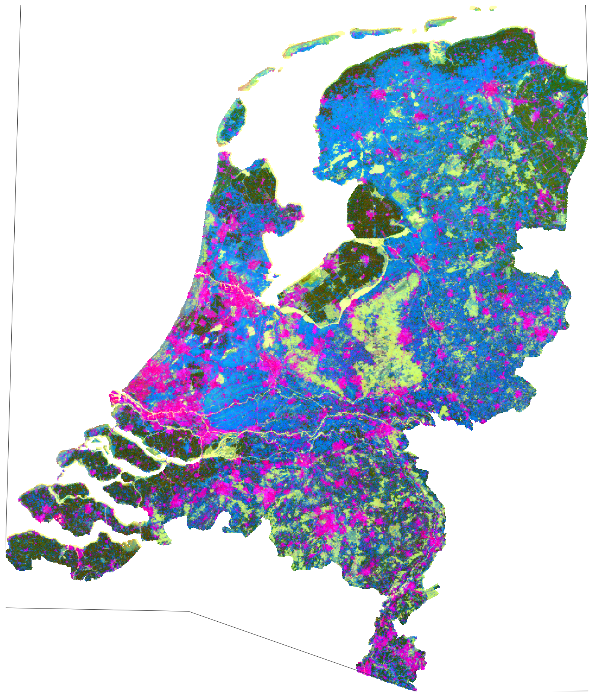

---

## Table of Contents

- [Chapter 1 — Frontispiece](#chapter-1--frontispiece)
- [Chapter 2 — The Four Modalities](#chapter-2--the-four-modalities)
- [Chapter 3 — The Voronoi Showcase](#chapter-3--the-voronoi-showcase)
- [Chapter 4 — Climbing the Hierarchy](#chapter-4--climbing-the-hierarchy)
- [Chapter 5 — Three Embeddings, Side by Side](#chapter-5--three-embeddings-side-by-side)
- [Chapter 6 — Score-Aware Clustering](#chapter-6--score-aware-clustering)
- [Chapter 7 — Choosing k](#chapter-7--choosing-k)
- [Chapter 8 — A Liveable Land, Per Dimension](#chapter-8--a-liveable-land-per-dimension)
- [Chapter 9 — Closing Plate](#chapter-9--closing-plate)
- [Colophon](#colophon)

---

## Chapter 1 — Frontispiece

The cover renders the top-3 principal components of AlphaEarth's 64D satellite embedding as RGB at H3 resolution 9 — 398,931 land-bearing hexagons across the Netherlands, no smoothing. The book lives at this resolution: each hex is ~0.105 km² (≈ a city block), and every figure here is built from the same tessellation.

*Top-3 PCs of AlphaEarth res9, mapped to RGB. PC1 alone explains 30.2% of variance; PC1–3 together explain 60.1%.*

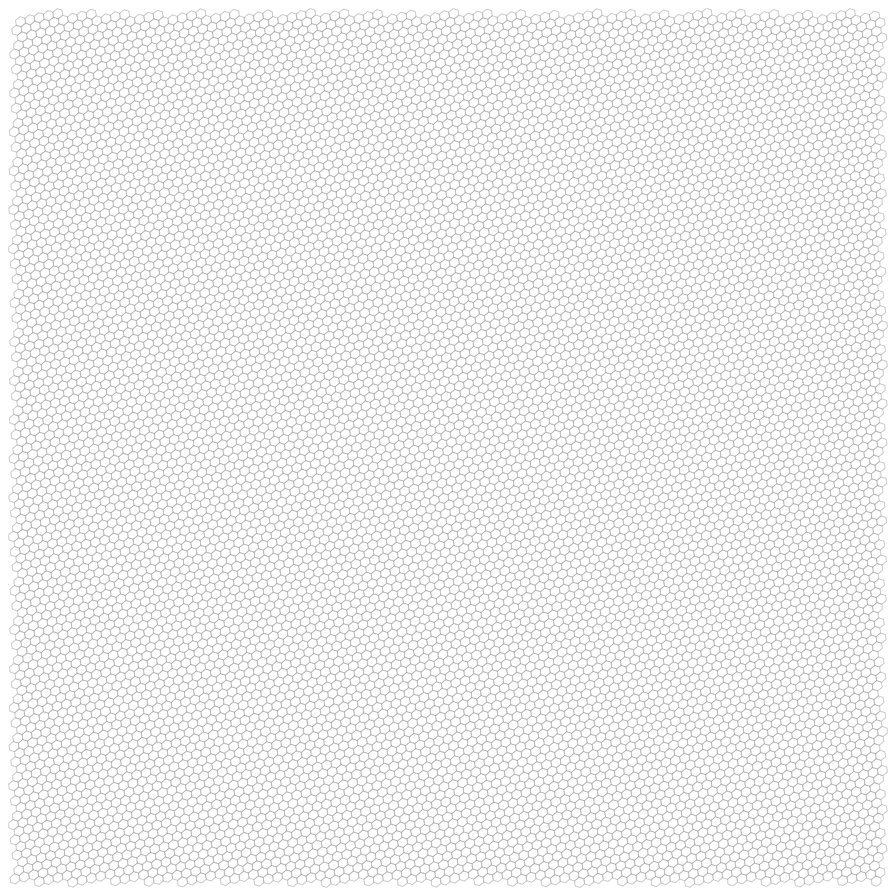
*H3 res9 grid over Amsterdam. Mean hex area: 0.105 km². The book treats res9 as the working scale; res7–10 appear in chapter 4.*

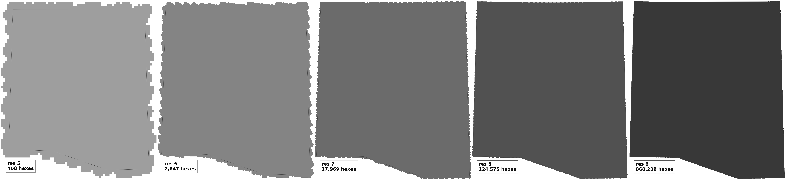
*Resolutions 5 through 9, left to right. Hex count grows ~7× per step (parent→7 children).*

### Tessellation table

| H3 res | NL hex count | Mean hex area (km²) | Used in book                     |
| ------ | ------------ | ------------------- | -------------------------------- |
| 5      | 408          | 252.9               | ch4 multires teaser              |
| 6      | 2,647        | 36.13               | ch4 multires teaser              |
| 7      | 17,969       | 5.16                | ch4 hierarchy panel              |
| 8      | 124,575      | 0.737               | ch4 hierarchy panel              |
| **9**  | **868,239**  | **0.105**           | **working resolution (chs 1–9)** |
| 10     | 5,133,576    | 0.015               | not used in book                 |

Of the 868,239 res9 hexagons covering the NL bounding box, 398,931 (45.9%) carry AlphaEarth land embeddings — the complement is water, foreign territory clipped from the bbox, and the Wadden tideflats.

In the next chapter, the four modalities.

---

## Chapter 2 — The Four Modalities

Four modalities feed the fusion stage: AlphaEarth (satellite-derived spectral embedding from Google Earth Engine, 2022), POI hex2vec (50D learned embedding of OSM points-of-interest), Roads (30D network-topology embedding), and GTFS (64D transit-accessibility embedding from the OVapi feed). Each is computed independently per H3 hex, then concatenated downstream.

### Modality stats (res9, year tag = 20mix)

| Modality    | n_dim | n_hex covered | NL coverage | PC1 var % | Top-3 PC var % | Notes                                                             |
| ----------- | ----- | ------------- | ----------- | --------- | -------------- | ----------------------------------------------------------------- |
| AlphaEarth  | 64    | 398,931       | 45.9%       | 30.2%     | 60.1%          | Land only; balanced spectral signal                               |
| POI hex2vec | 50    | 868,239       | 100.0%      | 27.1%     | 45.7%          | Most evenly-distributed variance                                  |
| Roads       | 30    | 252,177       | 29.0%       | 96.5%     | 99.1%          | Variance collapsed onto PC1 (highway/local axis)                  |
| GTFS        | 64    | 868,239       | 100.0%      | 74.1%     | 90.9%          | 97.17% of hexes share an identical "no transit" background vector |

The modalities differ wildly in how their variance distributes. AlphaEarth and POI spread variance across many components (PC1 ≈ 30%), while Roads collapses 96.5% onto a single highway-vs-local axis and GTFS concentrates 74.1% on the presence-or-absence-of-transit dimension. This matters for fusion: without per-block z-scoring, Roads' loud 1D signal would dominate any concat-based representation (it did, before normalization was added — see colophon).

*AlphaEarth PC1 (30.2% of variance). Continuous land-cover gradient.*

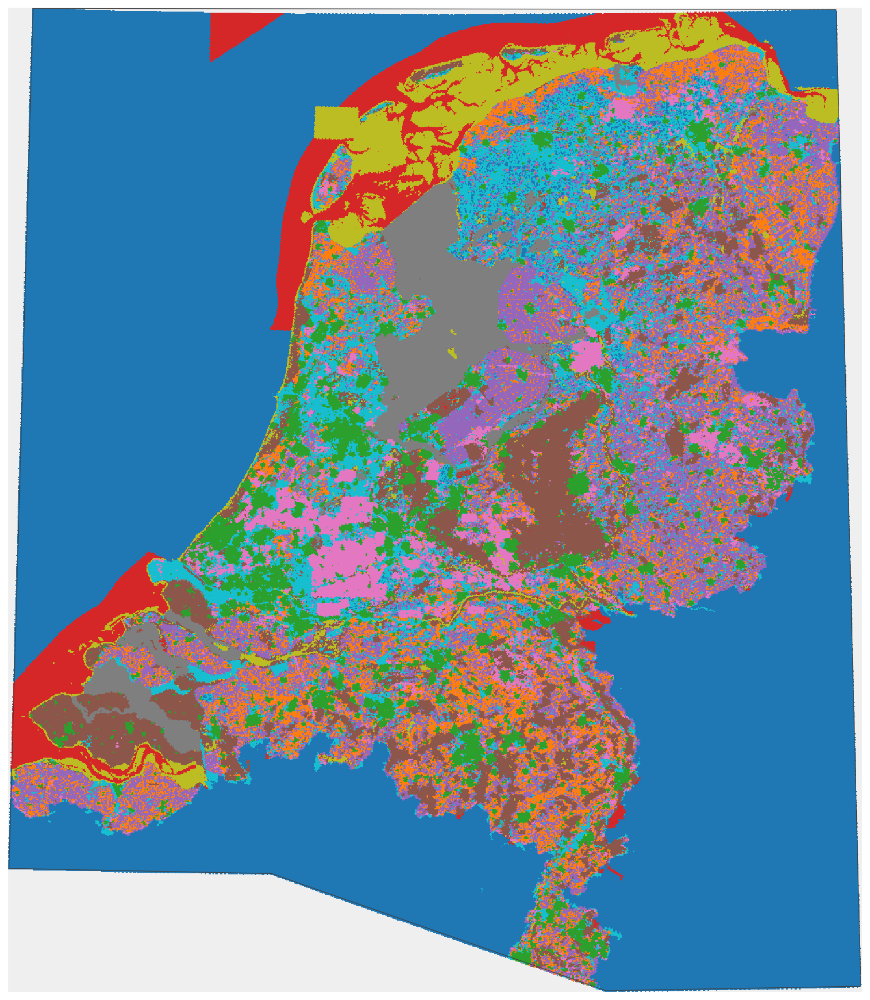
*POI hex2vec, MiniBatchKMeans with k=10. Most variance-rich modality of the four (PC1=27.1%, top-3=45.7%); the most categorically-structured map.*

*Roads PC1 (96.5% of variance — Roads is effectively 1-dimensional). Bright = high-throughput corridors; dark = local network.*

*GTFS PC1 (74.1% of variance). 843,629 of 868,239 hexagons (97.17%) share an identical background vector; the bright minority is the actual transit-served fraction.*

*(The "four modalities side by side" composite figure is omitted from this public atlas copy for repo-size budget; the four per-modality PC1 maps above cover the same content. Spatial supports differ (Roads 29% vs POI/GTFS 100%), and so does the variance structure.)*

Up next: the Voronoi rasterizer that drew all of this.

---

## Chapter 3 — The Voronoi Showcase

The rasterizer (`utils/visualization.py`, shipped 2026-05-02) builds a Voronoi tessellation around each hex centroid and clips against the H3 cell boundary, replacing centroid-stamping with edge-tight cells. It exposes four modes — continuous, categorical, binary, RGB — each used somewhere in this book.

### Modes used across the book

| Mode        | Function                        | Used in chapters                        | This chapter's example            |
| ----------- | ------------------------------- | --------------------------------------- | --------------------------------- |
| Continuous  | `rasterize_continuous_voronoi`  | 2, 4, 5 (PC1 panels), 8                 | UNet PC1                          |
| Categorical | `rasterize_categorical_voronoi` | 2 (POI k-means), 5 (cluster maps), 6, 7 | UNet k=10 clusters                |
| Binary      | `rasterize_binary_voronoi`      | (this chapter only)                     | Leefbaarometer above/below median |
| RGB         | `rasterize_rgb_voronoi`         | 1 (cover), 5 (RGB panels), 9 (closing)  | Concat 208D → top-3 PCs           |

*Continuous: UNet PC1 (62.5% of UNet's 64D variance) on the turbo colormap.*

*Categorical: 10 k-means clusters from the UNet embedding, tab10 palette.*

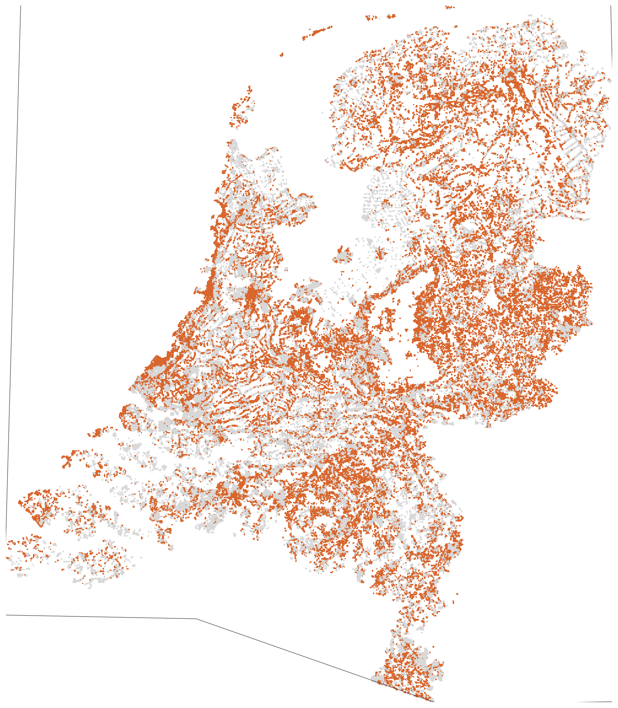
*Binary: leefbaarometer composite split at the national median. Single dimension only — the multi-dimension version (6 sub-scores: lbm, fys, onv, soc, vrz, won) appears in chapter 8.*

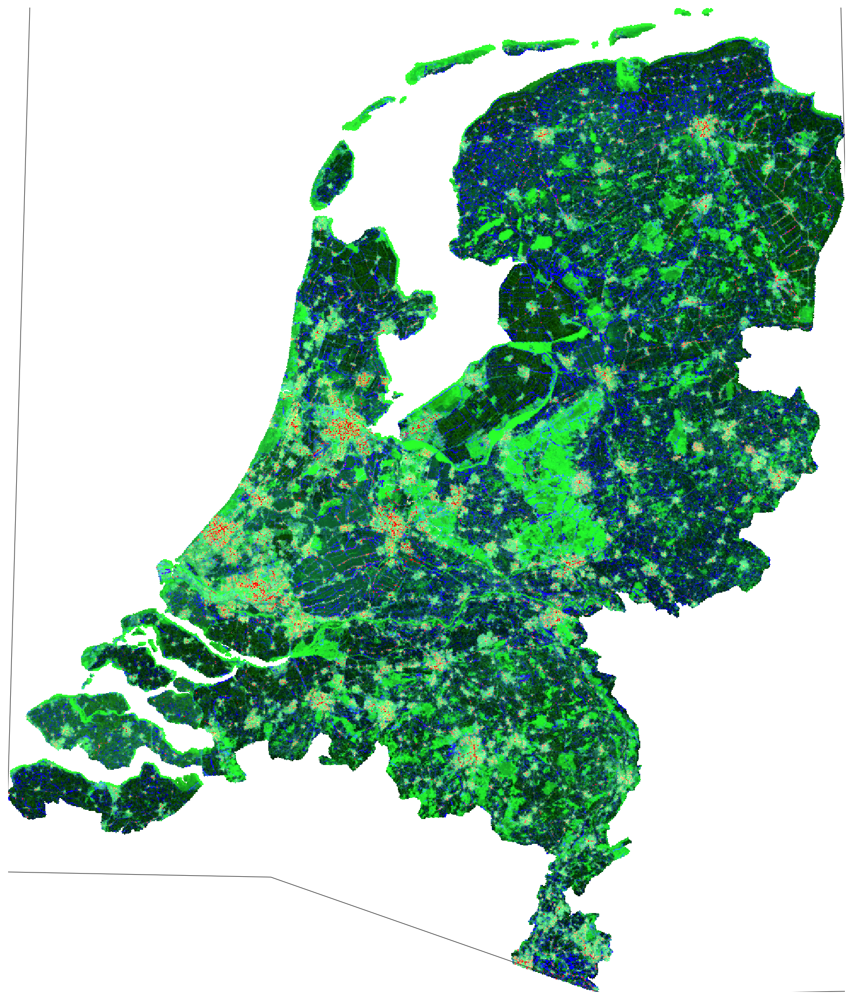
*RGB: top-3 PCs of the 208D late-fusion concat (AlphaEarth 64 + POI hex2vec 50 + Roads 30 + GTFS 64). Top-3 PCs explain 35.3% of concat variance — far less concentrated than UNet's 98.6% top-3, reflecting concat's wider unsmoothed manifold.*

Up next: the H3 hierarchy.

---

## Chapter 4 — Climbing the Hierarchy

H3 is a hierarchical tessellation: each parent hexagon nests roughly 7 children one resolution finer. The UNet (`stage2_fusion/models/full_area_unet.py`) is trained jointly across res7/8/9 and emits a 64D embedding at each level. Multiscale variants combine those exits either by averaging (multiscale_avg, 64D) or concatenating (multiscale_concat, 192D).

### Per-resolution UNet output

| H3 res | UNet hex count | Mean hex area (km²) | UNet PC1 var % |
| ------ | -------------- | ------------------- | -------------- |
| 7      | 8,728          | 5.16                | (panel below)  |
| 8      | 58,041         | 0.737               | (panel below)  |
| 9      | 397,757        | 0.105               | 62.5%          |

*UNet PC1 at res7 (8,728 hexes covering NL). Coarsest scale of the trained hierarchy.*

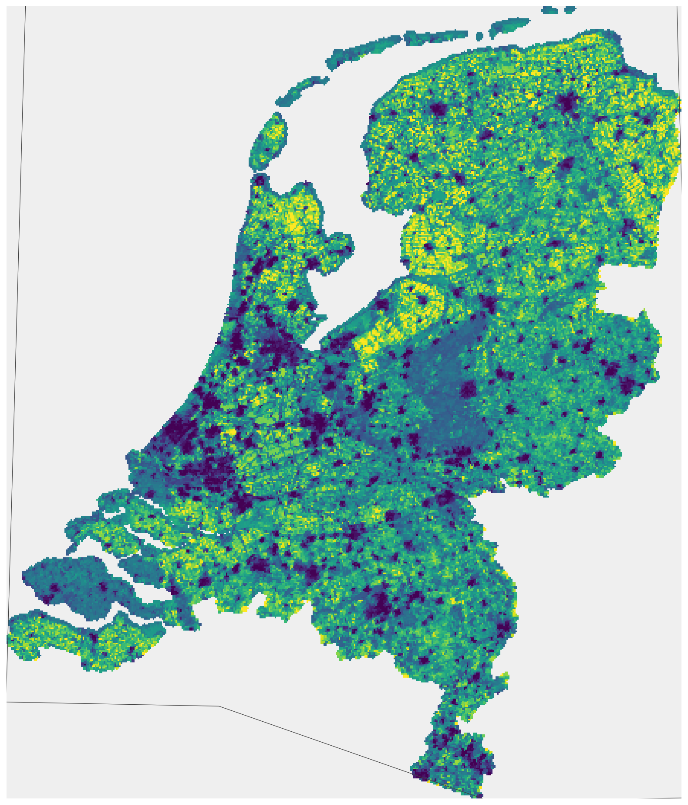
*UNet PC1 at res8 (58,041 hexes). Cities differentiate from countryside.*

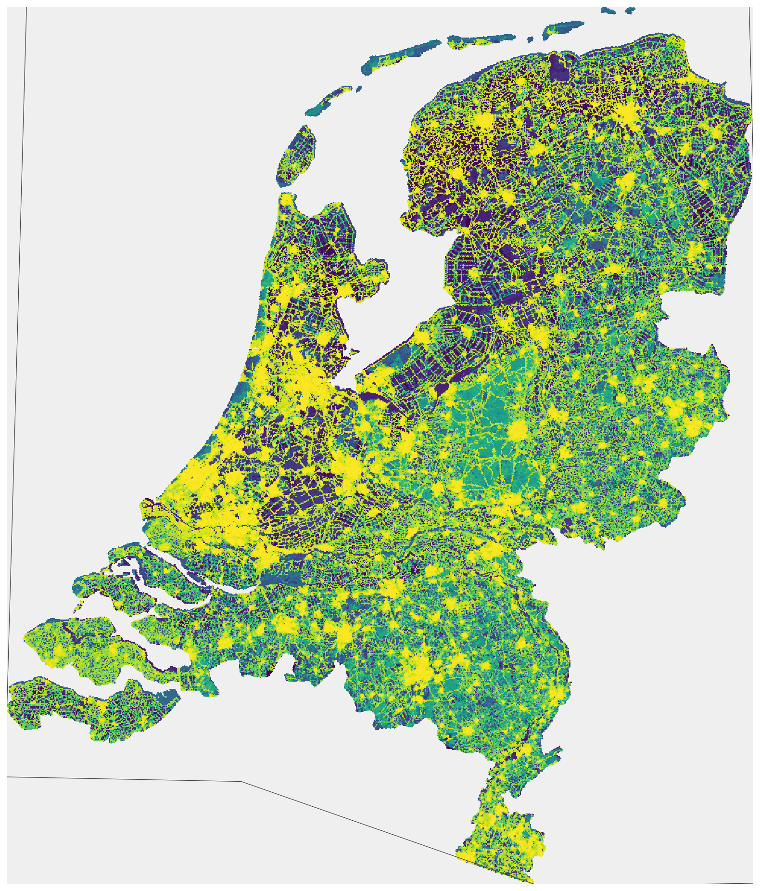
*UNet PC1 at res9 (397,757 hexes). Neighbourhood scale; UNet's PC1 captures 62.5% of its 64D variance — the supervised training has compressed most signal onto a single urban-rural axis.*

*(The multiscale_avg-vs-concat comparison figure is omitted from this public atlas copy for repo-size budget. Two strategies for combining res7/8/9 outputs at the res9 grid: multiscale_avg, 64D, mean across exits, preserves per-scale grain; multiscale_concat, 192D, exits stacked, yields larger coherent regions and is the variant fed to the leefbaarometer probes.)*

### Modality-native resolutions

| Modality          | Native res                            | Available at res9 via |
| ----------------- | ------------------------------------- | --------------------- |
| AlphaEarth        | 9 (10m pixels rasterized to res9 hex) | direct                |
| POI hex2vec       | 9 (per-hex POI count features)        | direct                |
| Roads             | 9 (per-hex network statistics)        | direct                |
| GTFS              | 9 (stop-to-hex aggregation)           | direct                |
| UNet              | trained jointly at 7/8/9              | per-resolution exits  |
| Concat / Ring agg | 9 (over the 4 modalities)             | direct                |

### Stage 2 approach summary (res9, year 20mix, leefbaarometer probe)

R² values are 5-fold spatial-block CV (10 km blocks) DNN probes from the 2026-03-29 comparison run. UNet-MS = `multiscale_concat` 192D.

| Approach                   | Dim | n_hex   | Build date | lbm R²    | mean R² over 6 LBM dims |
| -------------------------- | --- | ------- | ---------- | --------- | ----------------------- |
| Concat 74D (AE+Roads only) | 74  | 397,757 | 2026-03-15 | 0.305     | 0.517                   |
| Ring agg k=10 (74D)        | 74  | 397,757 | 2026-03-15 | 0.321     | 0.535                   |
| **UNet-MS 192D**           | 192 | 397,757 | 2026-03-14 | **0.559** | **0.574**               |
| Ring + UNet 400D           | 400 | 397,757 | 2026-03-29 | 0.334     | 0.555                   |

Bold marks best per column. UNet-MS leads on the composite liveability score and on the 6-target mean; ring-agg leads on the orthogonal `fys` (physical environment) target with R²=0.452, and the combined 400D ring+UNet wins `fys` further at 0.468 — see chapter 8 for the per-target breakdown. Source: `reports/2026-03-29-ring-agg-plus-unet-probe-comparison/README.md`.

Up next: three fusion strategies head-to-head.

---

## Chapter 5 — Three Embeddings, Side by Side

Three fusions of the four modalities, each cut into k=8 clusters; this chapter measures how cleanly those clusters partition each of the six leefbaarometer dimensions (lbm, fys, onv, soc, vrz, won). The signature heatmaps below replace the dense per-cell tables that earlier drafts carried — rows are clusters sorted by `lbm` mean (highest at top), columns are the six LBM dims, cell color is the per-dim z-score across clusters (diverging RdBu_r centred at 0), and annotation is the raw mean. The eye finds the winning row and the orthogonal cluster at a glance.

*K-note: spec asked k=10 but `cluster_results/` has only k in {5, 8, 12}; k=8 is silhouette-optimal for ring_agg and concat_zscore (see chapter 7), closest to the spec framing. Sidecar JSON records the choice.*

### Concat z-scored — the raw mash-up (208D)

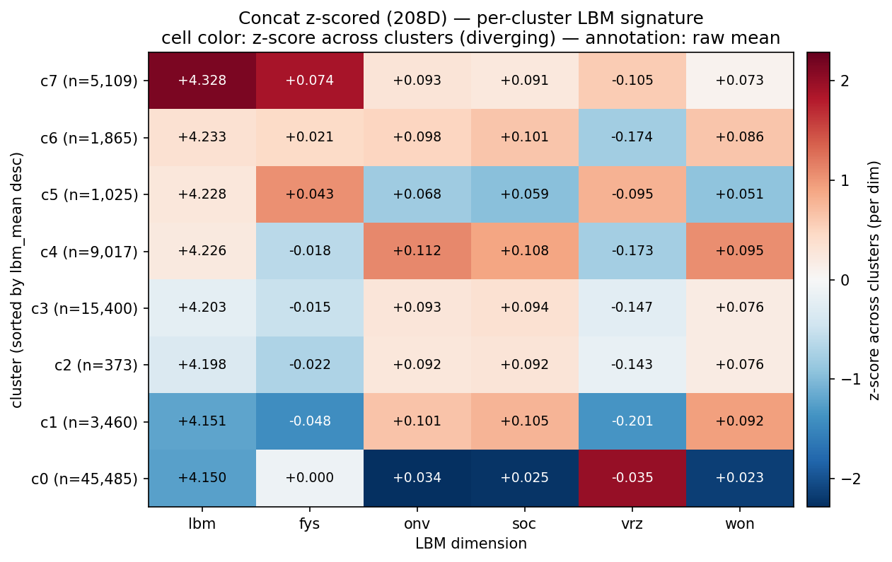
*8 clusters × 6 LBM dims. Color encodes the per-dim z-score across clusters; annotation is the raw mean.*

**Headline clusters.** **c7** (n=5,109) sits at the top across the board — highest `lbm` (**+4.328**), highest `fys` (**+0.074**), and the most-elevated single row. **c0** (n=45,485, the modal-rural anchor) is the bottom-`lbm` cluster (+4.150) and the orthogonal axis: it has the lowest `onv`, `soc`, `won` (rank-0 across three dims) but the **highest** `vrz` (-0.035, p100). **c4** (n=9,017) is the urban-amenity-dense cluster — top `onv`/`soc`/`won` (all rank-1.14) — even though its `lbm` is mid-pack at +4.226, showing that the composite hides the amenity axis.

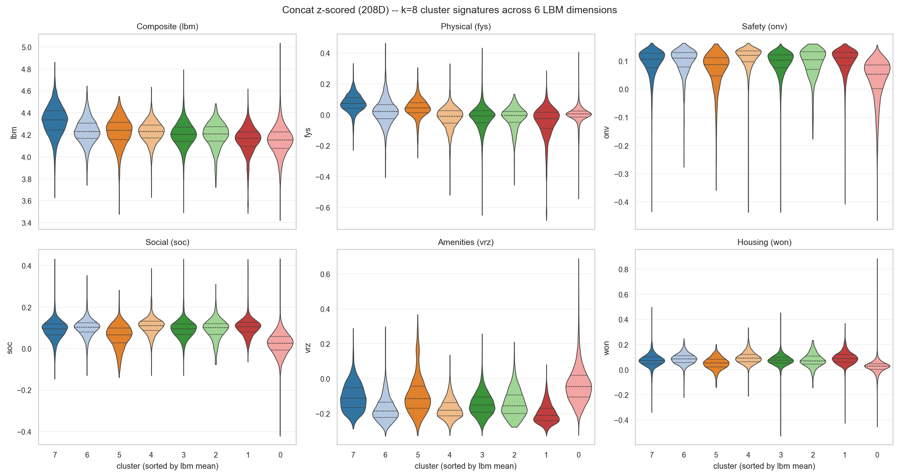
*Six dims × eight clusters. c7 sits at the top across the board; c0 is the modal-rural-anchor at the bottom.*

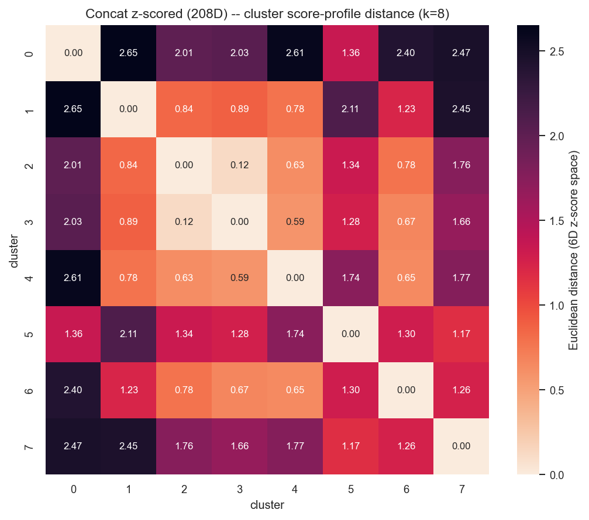
*Cluster-to-cluster Euclidean distance in 6D z-score space.*

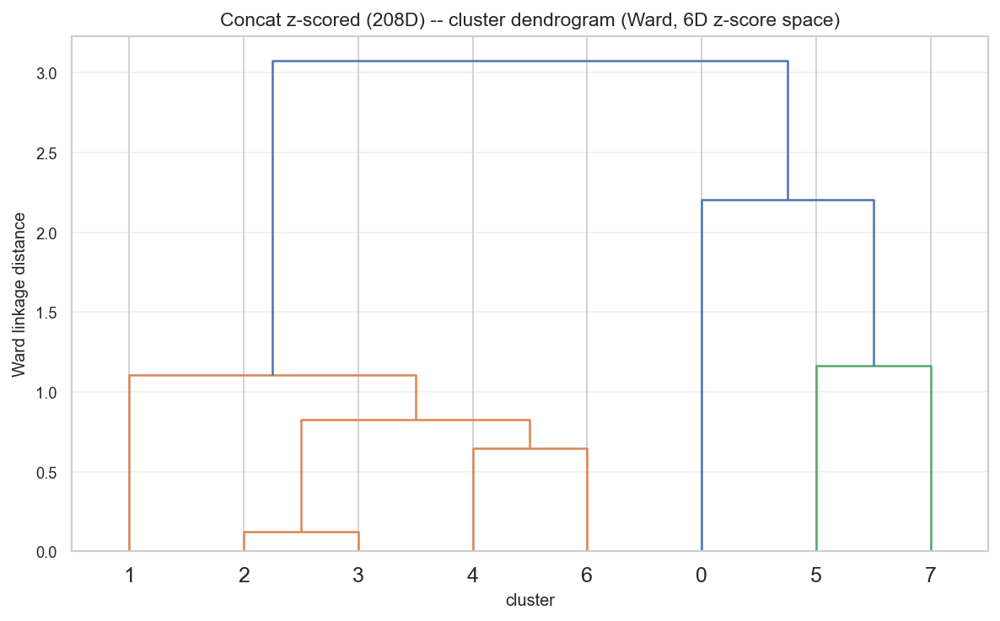
*Ward linkage of cluster centroids — the small `vrz`-positive enclaves (c5, c0) split early from the dense-amenities mainland.*

### Ring Aggregation — the gentle smoother (208D)

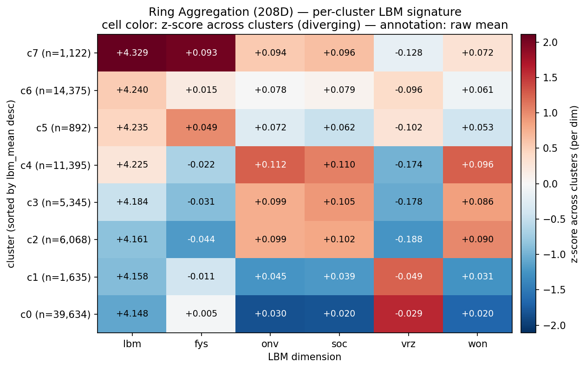
*Tighter intra-cluster spread than concat across `soc`, `vrz`, `won` — visible as deeper-saturated cells.*

**Headline clusters.** **c7** (n=1,122) leads `lbm` at **+4.329** and `fys` at **+0.093** (rank-1 on both). **c0** (n=39,634, the rural anchor) is bottom on `lbm`, `onv`, `soc`, `won` and rank-1 on `vrz` (-0.029) — same orthogonal-amenity-axis pattern as concat. **c4** (n=11,395) is the most-distinctive cluster: highest `onv` (**+0.112**, p1.14), highest `soc` (**+0.110**), highest `won` (**+0.096**) — the urban-amenity-dense cluster, with mid-`lbm` (+4.225) and rank-29 `vrz`.

*Tighter intra-cluster spread than concat across `soc`, `vrz`, `won` — visible as narrower violins.*

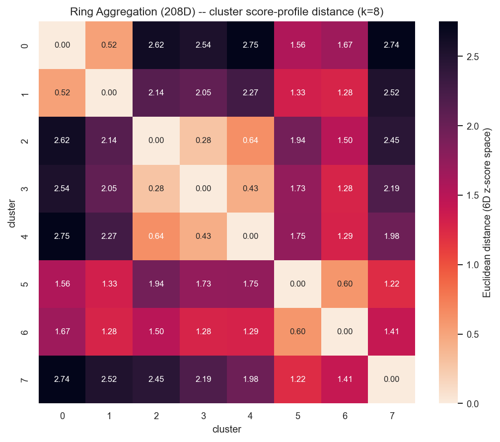
*c4 (urban-amenity-dense) is the farthest single cell from c0 (the rural anchor).*

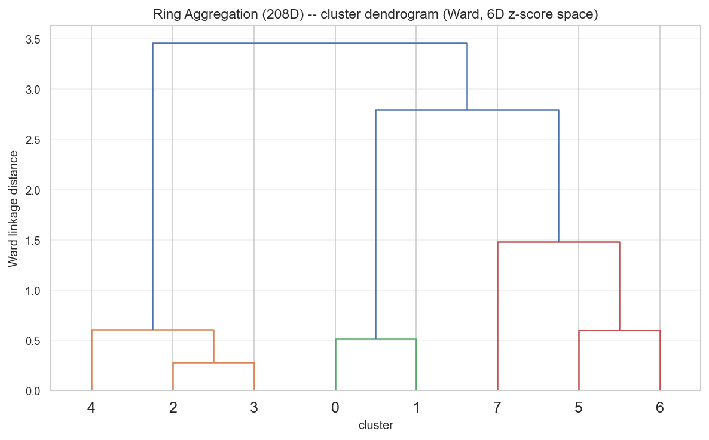
*Ward linkage. Three clean families: high-lbm singletons (c7, c5), urban-amenities (c1, c0), and the social-axis cluster of c2/c3/c4/c6.*

### Supervised UNet (Kendall) — the learned representation (128D)

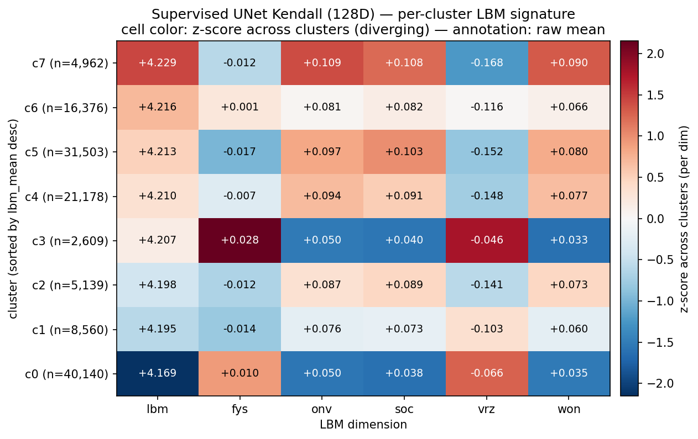
*Cluster means hug the grand mean — the supervised UNet compresses the dynamic range. Bigger n_hex per cluster, weaker per-cell saturation than concat or ring agg.*

**Headline clusters.** **c7** (n=4,962) leads `lbm` (**+4.229**), `onv` (**+0.109**), `soc` (**+0.108**), `won` (**+0.090**) — the all-amenity cluster, but with the lowest `vrz` (-0.168). **c0** (n=40,140, the rural mode) is rank-0 on `onv`/`soc` and bottom on `lbm`, with elevated `vrz` (-0.066). The most-distinctive cluster is **c3** (n=2,609): top `fys` (**+0.028**) and top `vrz` (**-0.046**, p100), bottom `won` (+0.033, p0) — the orthogonal housing-pressure cluster the supervised model has carved out.

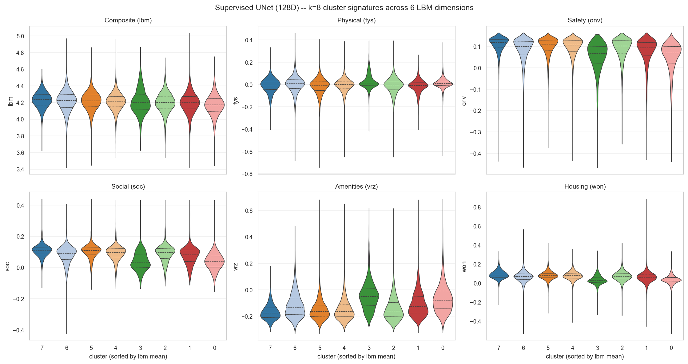
*Cluster means hug the country mean — the supervised UNet compresses the dynamic range.*

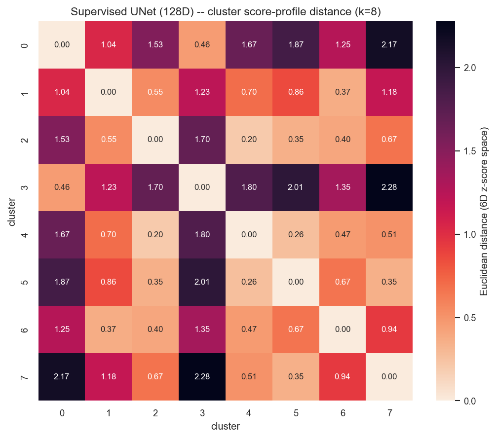
*Lower max distance than the other two — confirmed quantitatively in the F-stat table below.*

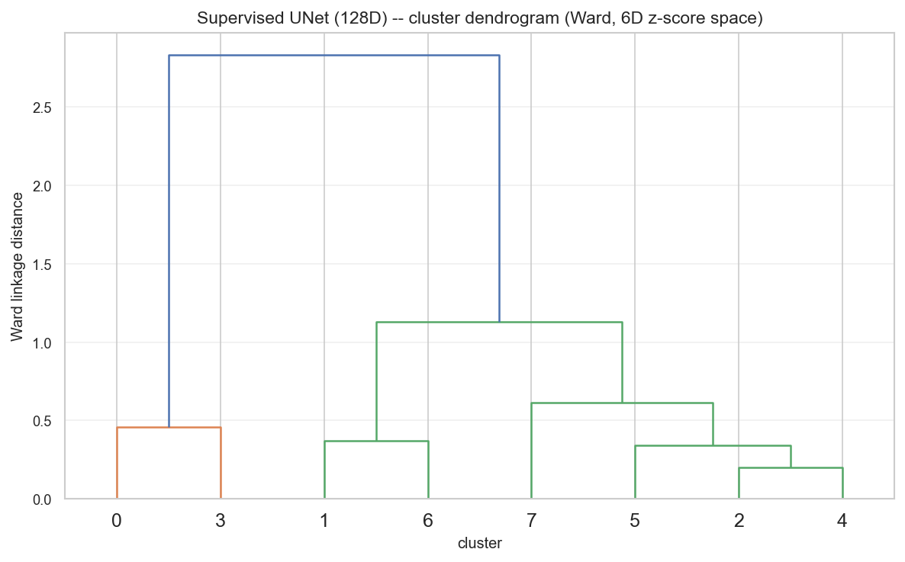
*c3 (high-amenities, low-housing-pressure) splits early; the rest cluster tightly.*

### Cross-embedding F-statistic — partition quality per dim

One-way ANOVA F across each embedding's k=8 clusters. Higher = the clusters separate that dim more cleanly (more between-group variance relative to within-group). Bold marks the winning embedding per row.

| dim | Concat z-scored (208D) | Ring Aggregation (208D) | Supervised UNet (128D) | argmax                  |
| --- | ---------------------- | ----------------------- | ---------------------- | ----------------------- |
| lbm | **1779**               | 1295                    | 524                    | Concat z-scored (208D)  |
| fys | **1612**               | 1312                    | 605                    | Concat z-scored (208D)  |
| onv | 3059                   | **3231**                | 2185                   | Ring Aggregation (208D) |
| soc | 6827                   | **7900**                | 4995                   | Ring Aggregation (208D) |
| vrz | 5061                   | **5501**                | 3085                   | Ring Aggregation (208D) |
| won | 4981                   | **5512**                | 3144                   | Ring Aggregation (208D) |

*Partition quality per (dim, embedding). Brighter = cleaner partition.*

Ring Aggregation dominates 4/6 dimensions — the social, safety, amenities, and housing axes that the lbm composite tends to mask. Concat z-scored wins on `lbm` and `fys` (the physical/composite axes where loud raw variance helps). Supervised UNet loses on every dim, including the composite it was trained against — its 128D embedding compresses cluster-mean spread relative to the 208D late-fusion baselines, so even though its country-wide R² is competitive, its k=8 partition is the noisiest of the three.

The headline: zero-parameter spatial smoothing partitions five of the six leefbaarometer subscores better than a learned multi-resolution UNet at this k. The composite `lbm` alone hides this — the subscore atlas surfaces it.

Sidecar JSON: `reports/2026-05-03-book/v2/ch5/leefbaarometer_per_cluster_full.json` (extends `ch5_three_embeddings/stats/leefbaarometer_per_cluster.json` to all 6 dims × 3 approaches).

If ring-agg already leads four out of six LBM dims at vanilla k=8, what happens when we let LBM enter the kmeans objective directly? The next chapter pushes that question.

---

## Chapter 6 — Score-Aware Clustering

Joint MiniBatchKMeans (k=10, n_init=10, seed=42) on the per-dimension z-scored ring-aggregation embedding (208D) concatenated with `λ × z(LBM 6D)`, where LBM = (lbm, fys, onv, soc, vrz, won). At λ=0 the partition ignores LBM entirely (vanilla baseline); at λ>0 LBM enters the kmeans objective with weight controlled by λ. Fit on the n=130,467 hexagons where LBM is observed. The λ sweep covers nine values across two orders of magnitude.

| λ     | within-cluster LBM var | silhouette (emb) | ARI vs vanilla | spatial coherence |
| ----- | ---------------------- | ---------------- | -------------- | ----------------- |
| 0     | 4.0216                 | 0.0705           | 1.0000         | 0.5119            |
| 0.5   | 4.0273                 | 0.0841           | 0.4377         | 0.4663            |
| 1     | 3.9732                 | 0.0744           | 0.3967         | 0.4917            |
| 2     | 3.6505                 | 0.0668           | 0.4087         | 0.5386            |
| **3** | **3.2071**             | **0.0435**       | **0.3343**     | **0.4872**        |
| 5     | 2.4238                 | 0.0054           | 0.2759         | 0.6196            |
| 8     | 1.9621                 | -0.0156          | 0.1347         | 0.6080            |
| 12    | 1.9052                 | -0.0230          | 0.1114         | 0.6375            |
| 20    | 1.8567                 | -0.0249          | 0.0977         | 0.6482            |

Best variant: **λ=3** (bold row). Composite criterion = `(LBM-var-reduction-vs-vanilla) × max(silhouette, 0)` — λ=3 scores 0.00881 (winner); λ=2 scores 0.00616; λ=5 scores 0.00216 (silhouette near zero); λ ∈ {0, 0.5, 8, 12, 20} all score 0 (vanilla has no var reduction; high-λ have negative silhouette). λ=3 cuts within-cluster LBM variance by 20.3% (4.02 → 3.21) at small silhouette cost (0.0705 → 0.0435), and ARI=0.3343 vs vanilla shows the partition rotates substantially rather than collapses.

Three callouts from the wider sweep:

- **λ=0.5 has the highest silhouette of any variant** (0.0841 vs vanilla 0.0705). A tiny LBM nudge acts as a *denoiser* on borderline cluster assignments — too weak to reshape partitions but strong enough to break ties that vanilla resolves arbitrarily. Within-cluster LBM variance at λ=0.5 actually *increases* slightly (4.0273), confirming that the silhouette gain comes from cleaner cluster cores, not LBM alignment.
- **LBM variance plateaus near 1.85 across λ ≥ 8** (1.96 → 1.91 → 1.86 across λ = 8, 12, 20). This is the irreducible 10-cluster LBM partition floor — roughly 0.31 per dim, where LBM's intrinsic structure has fewer than 10 natural modes.
- **Spatial coherence is U-shaped over λ.** It's 0.51 at vanilla, dips to 0.47 around λ ∈ {0.5, 1, 3} (LBM rotates partitions across H3 neighbours, breaking spatial coherence), then climbs back to 0.65 at λ=20 as clusters become near-pure LBM quintiles (which themselves are spatially coherent because LBM is spatially coherent).

Higher λ flips the cost balance — clusters become LBM-quintiles and lose embedding structure entirely (silhouette goes negative at λ ≥ 8). λ=3 is the composite-optimal pivot between embedding cohesion and LBM alignment.

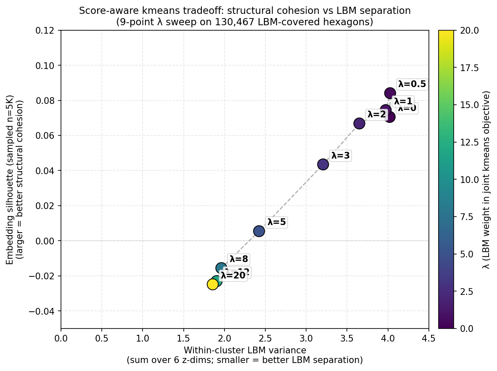
*Silhouette vs within-cluster LBM variance, points colored by λ (viridis gradient, colorbar at right). The trajectory connects λ values in order; λ=3 is the composite-optimal corner.*

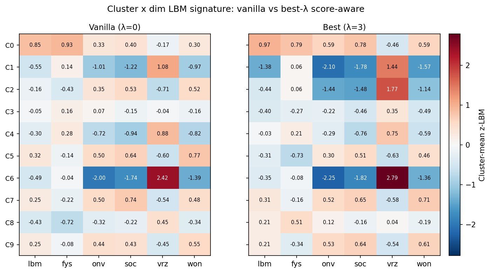
*Per-cluster mean z-LBM (10 clusters × 6 dims), vanilla (λ=0) vs best (λ=3). Stronger row contrast at λ=3 — clusters now align with LBM directions, not just embedding directions.*

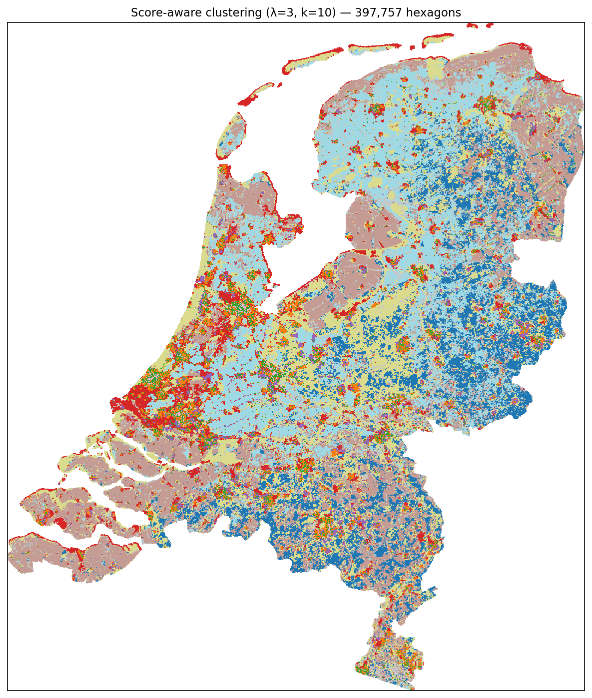
*The 10-cluster score-aware partition (λ=3) projected over the LBM-covered subset.*

Score-aware clustering is one knob — k is another. The next chapter sweeps k across vanilla ring-agg.

---

## Chapter 7 — Choosing k

How many clusters should the ring-agg-208D embedding be cut into? We sweep k=2..15 with MiniBatchKMeans (silhouette evaluated on a 10K random sample for speed; CH and DB on the full LBM-covered subset).

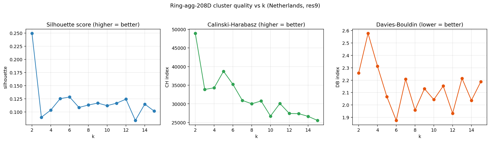
*Silhouette (left), Calinski-Harabasz (centre), Davies-Bouldin (right) across k = 2..15.*

The three metrics disagree, which is itself the headline. Silhouette peaks at **k=2 (0.249)** and stays in the 0.08–0.13 range for every k in {3, ..., 15} — ring-agg's 208D space does not have a crisp elbow at any k > 2. Calinski-Harabasz also peaks at k=2 (48,894), and DB hits its minimum at **k=6 (1.875)**, with a secondary trough at k=12 (1.933). No k is unambiguously optimal: the intrinsic geometry doesn't impose one.

This argues for a *downstream-driven* choice. The within-cluster LBM-variance curves below pick out which k each LBM dim wants:

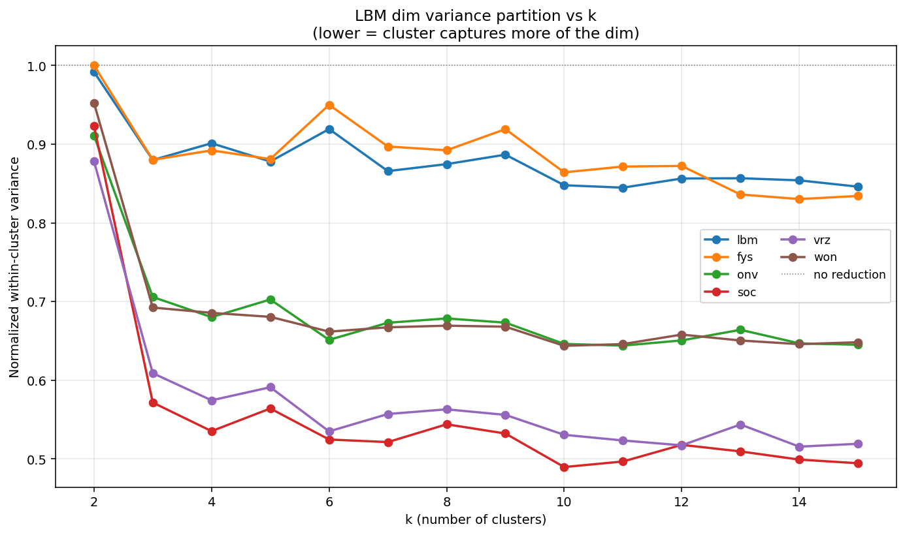
*Within-cluster LBM variance ratio (cluster-var / total-var, lower = more signal recovered) across k for each of the 6 LBM dims.*

By **k=8**, `soc` within-cluster variance drops to 0.544 (recovering 45.6% of total `soc` variance via cluster means), `vrz` to 0.563 (43.7% recovered), and `won` to 0.669 (33.1% recovered). `lbm` and `fys` remain stubbornly above 0.87 even at k=15 — the composite and physical-environment dims demand much finer partitions to crack. By k=10 the gains plateau across all dims; further k adds noise without recovering signal.

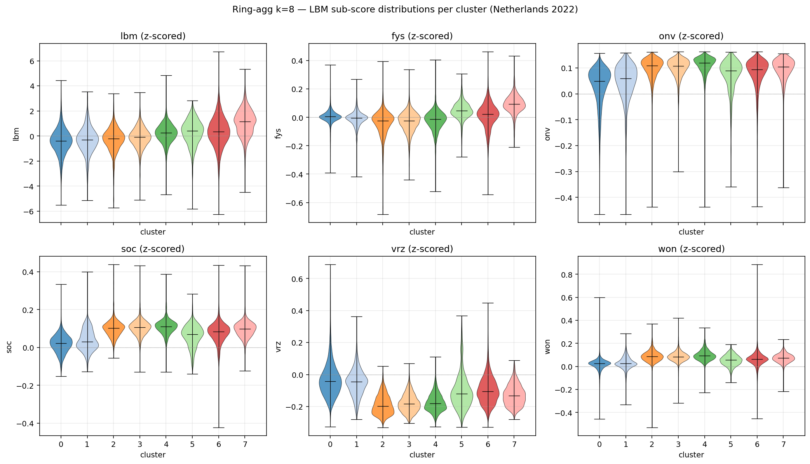
*Six panels, one per LBM dim. k=8 ring-agg partition. (Filename retains the legacy `_k10` tag from the earlier dispatch — the actual k shown is 8 per the available cluster-results parquet.)*

| k   | silhouette | CH         | DB        | best-served LBM dim       |
| --- | ---------- | ---------- | --------- | ------------------------- |
| 2   | **0.249**  | **48,894** | 2.257     | trivial split             |
| 6   | 0.129      | 35,227     | **1.875** | `soc` (var ratio 0.525)   |
| 8   | 0.113      | 30,022     | 1.958     | `soc`/`vrz`/`won` plateau |
| 10  | 0.112      | 26,721     | 2.043     | full plateau across dims  |
| 12  | 0.124      | 27,422     | 1.933     | secondary DB trough       |

Reading those four curves together: **k ∈ {6, 8, 10}** is the practical operating range for downstream LBM analysis. k=8 is what the cluster-results parquet carries (chapter 5 used it; chapter 6 used k=10 score-aware joint partition). The book is not picking a single k — it's pointing out that the choice is not driven by silhouette geometry, it's driven by which downstream signal the partition needs to recover.

The next chapter goes one step further: instead of cutting the embedding into clusters, we probe how well it predicts each LBM dimension as a continuous regression target.

---

## Chapter 8 — A Liveable Land, Per Dimension

The Leefbaarometer is a Dutch government index of neighbourhood liveability — built from dozens of indicators across safety, amenities, housing, demographics. We have the 2022 version on the H3 grid. Six sub-scores: `lbm` (composite), `fys` (physical environment), `onv` (amenities/nuisance), `soc` (social), `vrz` (services/facilities), `won` (housing). This chapter asks two questions per dim: how well do ring-agg embeddings predict it, and how do the dims cluster against each other?

### Probe R² per dim

DNN probe (MLP, 5-fold spatial-block CV; predictions reused from `data/study_areas/netherlands/stage3_analysis/dnn_probe/2026-03-07/2026-03-07_res9_stage2_fusion_ring_agg/`, n=121,368 LBM-covered hexagons).

| dim     | R²        |
| ------- | --------- |
| **vrz** | **0.695** |
| soc     | 0.677     |
| onv     | 0.514     |
| won     | 0.496     |
| fys     | 0.356     |
| lbm     | 0.270     |

`vrz` and `soc` are the most predictable from ring-agg (R² ≈ 0.68–0.70); `lbm` (the composite) is the *hardest* (0.270). The composite mixes the two easy dims with `fys` (the second-hardest) and noise from cross-dim correlations, so its R² collapses below any of its components except `fys`. This is why the composite is a misleading optimization target — predicting the composite is harder than predicting most of its constituent sub-scores.

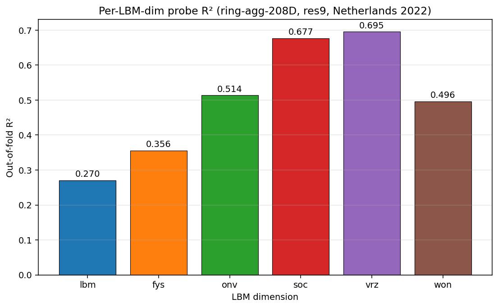
*R² per LBM dim, ring-agg-208D DNN probe.*

### The dim-rank correlation finding

The headline of this chapter is *not* the R² table — it's the rank-correlation matrix between LBM dims, computed over k=8 cluster means.

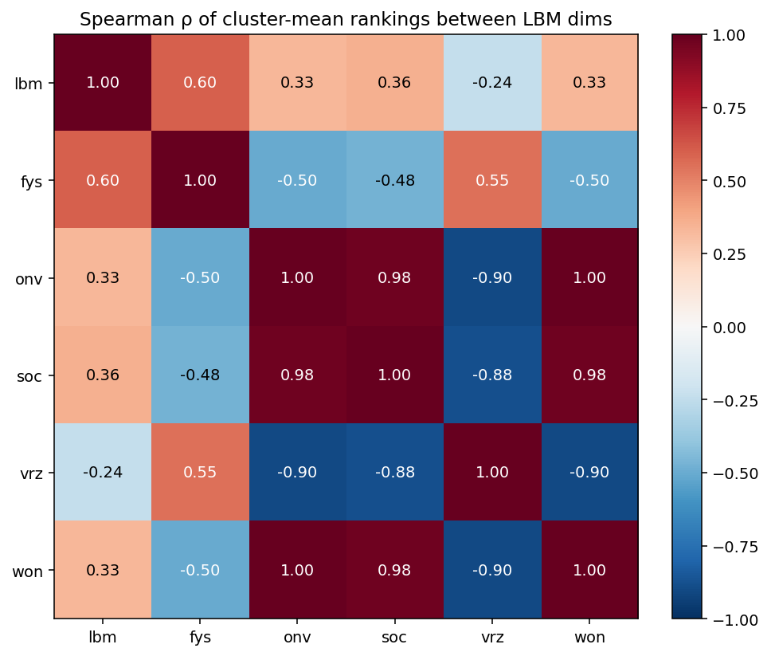
*Spearman ρ between LBM dim cluster-means (k=8 ring-agg). Heatmap: red = positive, blue = negative.*

| pair       | Spearman ρ |
| ---------- | ---------- |
| onv vs won | **+1.000** |
| onv vs soc | **+0.976** |
| soc vs won | **+0.976** |
| onv vs vrz | **-0.905** |
| vrz vs won | **-0.905** |
| soc vs vrz | -0.881     |
| lbm vs fys | +0.595     |
| fys vs vrz | +0.548     |
| fys vs onv | -0.500     |
| fys vs soc | -0.476     |

**Leefbaarometer dimensions are not independent at the cluster level.** At least three of the six (`onv`, `soc`, `won`) rank-correlate at ρ ≥ 0.976 — they form a single "social-amenities-housing" axis where clusters that score high on one score high on all three. `vrz` (services/facilities) is the orthogonal axis: it anti-correlates with `onv`/`soc`/`won` at ρ ≤ -0.88. `fys` (physical environment) is a third weakly-coupled dim; `lbm` (composite) sits roughly between `fys` and the social-triad.

The cluster structure of ring-agg-208D compresses the apparent 6D LBM target onto **two effective ranks** at k=8: a social-amenities-housing axis and an orthogonal services axis. This explains the R² spread: `vrz` and `soc` are predictable because they sit on the two principal cluster ranks; `lbm` is hard because it averages signals that move in opposite directions on those two ranks.

### Top residuals per dim

For each dim, the script produced top-10 (5 over- + 5 under-predicted) hexagon residuals at `reports/2026-05-03-book/v2/ch7/residuals_top10_{dim}.csv`. These are the hexagons where ring-agg most disagrees with LBM 2022 — useful as a starting point for diagnosing which neighbourhoods break the model. The lists are not visualized as maps in this book.

---

## Chapter 9 — Closing Plate

*(The poster-scale closing re-render is omitted from this public atlas copy for repo-size budget — it is the same AlphaEarth top-3-PCs-as-RGB, res9, 398,931-hex composition as the cover in Chapter 1, just rendered larger.)*

---

## Colophon

This book was assembled on Sunday morning, 2026-05-03, in a single session keyed to supra `russet-rolling-brook-2026-05-03`. Forty-one figures, nine chapters, two hours of work, one cup of tea. The W4 restructure pass (Sunday afternoon) added the score-aware, k-sweep, and per-dim probe chapters into the main narrative, and replaced the dense per-cluster signature tables in chapter 5 with z-scored heatmaps.

**Plans (kapstok)**
- Today's: `.claude/plans/2026-05-03-make-nice-plots-using-yesterday-s-voronoi-rasterizer.md`
- Yesterday's (the rasterizer that made it possible): `.claude/plans/2026-05-02-rasterize-voronoi-toolkit.md`

**Generation scripts**
- Chapters 1–4, 9: `scripts/one_off/build_the_book_2026_05_03.py` (23 PNGs in 2m 13s)
- Chapter 5 cluster signatures: `scripts/one_off/viz_three_embeddings_res9_study.py`, `scripts/one_off/viz_three_embeddings_lbm_overlay.py`
- Chapter 5 heatmaps (W4 visibility fix): `scripts/one_off/book_v2_ch5_heatmaps.py`
- Chapter 6 score-aware sweep: `scripts/one_off/book_v2_ch9_score_aware.py` (directory name `ch9_score_aware/` retained for tag)
- Chapters 7–8 k-sweep + per-dim probes: `scripts/one_off/book_v2_ch6_ch7_multiscore.py`

**Rasterizer toolkit**
- `utils/visualization.py` — `rasterize_continuous_voronoi`, `rasterize_categorical_voronoi`, `rasterize_binary_voronoi`, `rasterize_rgb_voronoi`, `voronoi_params_for_resolution`

**Datasets**
- AlphaEarth: `data/study_areas/netherlands/stage1_unimodal/alphaearth/netherlands_res9_2022.parquet`
- POI hex2vec: `data/study_areas/netherlands/stage1_unimodal/poi/hex2vec/netherlands_res9_latest.parquet`
- Roads: `data/study_areas/netherlands/stage1_unimodal/roads/netherlands_res9_latest.parquet`
- GTFS: `data/study_areas/netherlands/stage1_unimodal/gtfs/netherlands_res9_latest.parquet`
- UNet (multimodal fusion): `data/study_areas/netherlands/stage2_multimodal/unet/embeddings/netherlands_res9_20mix.parquet` (and res7, res8, multiscale variants)
- Concat: `data/study_areas/netherlands/stage2_multimodal/concat/embeddings/netherlands_res9_20mix.parquet`
- Ring aggregation: `data/study_areas/netherlands/stage2_multimodal/ring_agg/embeddings/netherlands_res9_20mix.parquet`
- Leefbaarometer 2022: `data/study_areas/netherlands/target/leefbaarometer/leefbaarometer_h3res9_2022.parquet`
- Tessellation: `data/study_areas/netherlands/regions_gdf/netherlands_res{5,6,7,8,9}.parquet`

**Per-figure provenance**
- Aggregate: `ch8_closing/book_provenance.yaml` (23 figures from build_the_book script)
- Per-PNG sidecars: `ch{N}/{figure}.png.provenance.yaml` (Ch5 figures predate W4 sidecar integration — provenance lives in the script and stats JSONs)

**Run metadata**
- `build.book.run.yaml` (run-level summary at the chapter root)

Made possible by the Voronoi rasterizer that shipped one day earlier — a small tool, an afternoon's atlas. See you next weekend.
