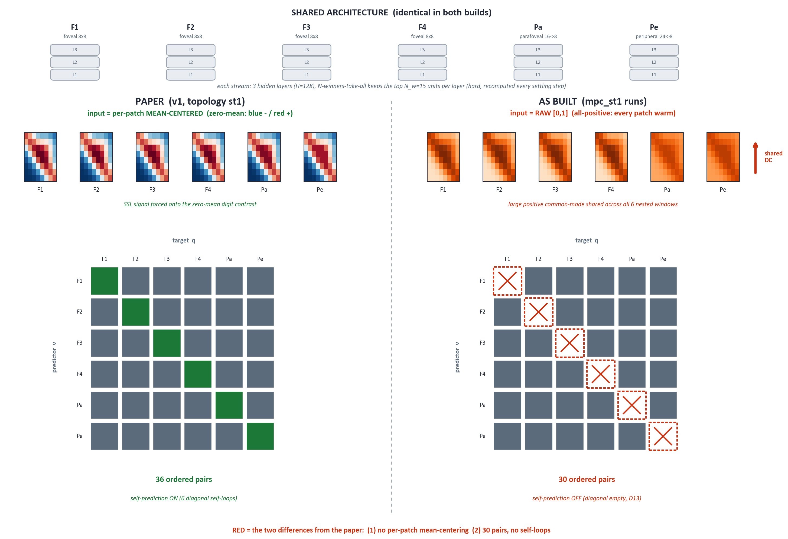
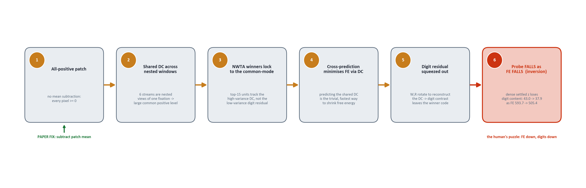
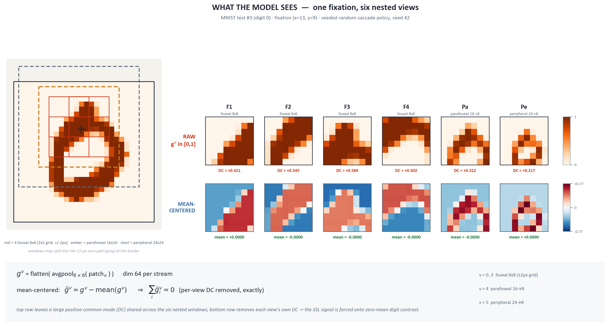
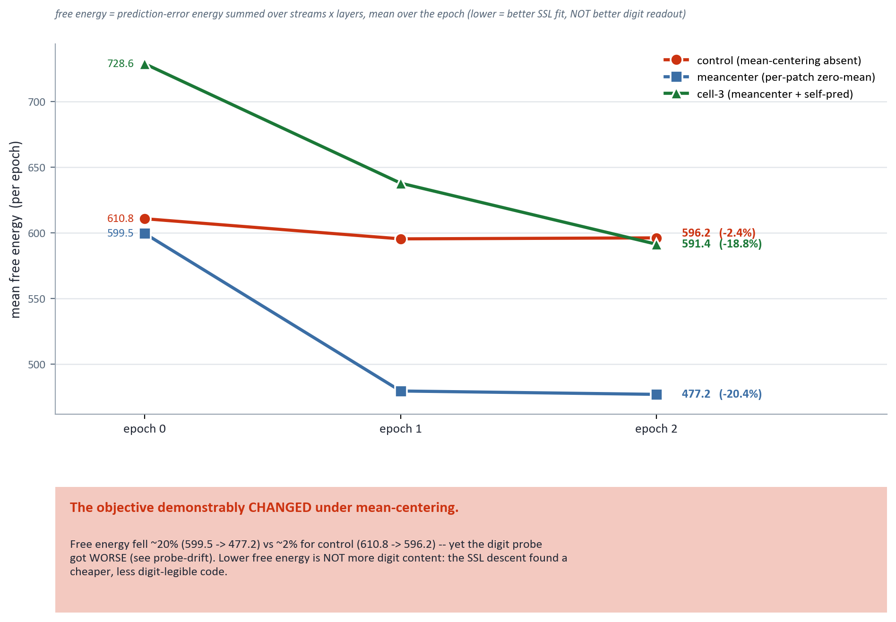
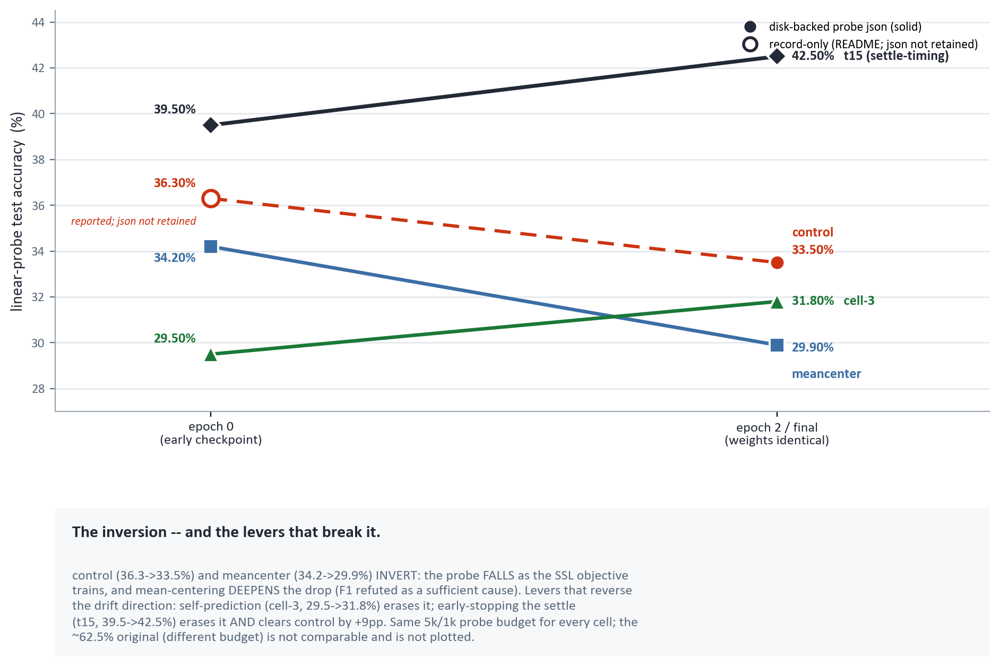

# MPC-MNIST Fidelity Audit — where the paper-faithful build loses 35 points

**A backprop-free predictive-coding model built to the paper's recipe reaches ~62% on MNIST where the paper reports 97.5%. This audit builds two *independent* descriptions of the model — one from the paper alone, one from our code alone — joins them line by line, and ranks every difference by how well it explains two specific clues. It then runs falsification cells overnight to test the top suspect.**

Session `teal-watching-bay`, overnight 2026-07-14 → 15. Extends the reproduction report [`../2026-07-13-mpc-mnist-vanilla-reproduction/README.md`](../2026-07-13-mpc-mnist-vanilla-reproduction/README.md). Paper: Ororbia, Friston, Rao — *Meta-Representational Predictive Coding*, arXiv:2503.21796 (v1 is what we target).

---

## Decisions waiting on the human (read this first)

These five choices are **foundational** to what the model *is*, so per the project's novel-research gate they are the human's to make, not an agent's. Each line names the choice and what tonight's experiments contribute toward deciding it.

| # | Open decision `[blocked:human-decision]` | What tonight's cells contribute |
|---|---|---|
| **1** | **F1 — per-patch mean-centering.** The paper subtracts each patch's mean before feeding it in; our code does not. Ratify this as a new deviation **D14** and make it the vanilla default? | **Cell 2** (`meancenter`) directly tests whether adding it flips the inversion and lifts accuracy. |
| **2** | **F4/D13 — self-prediction (30 vs 36 pairs).** The paper's st1 has every stream predict all others *and itself* (36 pairs); we excluded self-prediction (30 pairs). Keep the exclusion, or restore the paper-literal version? | **Cells 3 + 4** isolate the effect of restoring self-prediction, alone and combined with mean-centering. |
| **3** | **F3 — E-step objective, reading A vs B.** The paper's settling equation is internally inconsistent: one side implies a symmetric consensus pull (B), the literal other side does not (A, what we built). Which did the authors run? | Likely a red herring (the literal equation supports A); only tested if Cell 2 does not close the gap. |
| **4** | **F7 — weight-normalisation axis.** The paper says normalise weight *columns*; the corrected run normalised *rows*. No deviation row records this. Pick the canonical vanilla axis and add the D-row. | Runs at the corrected-run axis (row); a follow-up column-axis cell can settle it if it proves load-bearing. |
| **5** | **F11 — provenance string.** The run sidecar says `deviations_ratified: D1-D12`, which is factually wrong (D13 is applied, and the norm-axis change is unrecorded). Fix the string and add D14/D15 on the same ratification wave. | Bookkeeping; lands with whatever D-rows the human ratifies from items 1–4. |

---

## Overview

The reproduction run last session ([`../2026-07-13-…`](../2026-07-13-mpc-mnist-vanilla-reproduction/README.md)) established the gap: a mechanically clean, backprop-free build classifies MNIST at **62.48%** where the paper reports **97.50%**. A corrective run that settled the model deeper fixed the *objective's* health (free energy started falling instead of rising) but did **not** lift accuracy — and surfaced two puzzles this audit exists to explain:

- **Clue (a) — the inversion.** In the corrected run, as the model's own objective (free energy) *falls*, the digit-readout accuracy also *falls* (test accuracy 43.0 → 37.9 across checkpoints). The learning objective is pointing *away* from digit-separability. This is the sharpest, strangest signal.
- **Clue (b) — sampling dominance.** One well-placed central fixation (a 768-number representation) classifies at **73.1%**, while the paper's ten-random-fixation policy (a 7680-number representation) collapses to **21.4%**. Where the model looks dominates the result far more than the learning fix does.

**Method.** Rather than diff our code against a memory of the paper, we wrote **two independent truth documents** — one describing only what the paper prescribes ([`paper_ground_truth.md`](paper_ground_truth.md), written blind to our code), one describing only what the code does ([`as_built_mechanics.md`](as_built_mechanics.md), written blind to the paper) — then joined them line by line and scored each difference against the two clues ([`findings_ranked.md`](findings_ranked.md)). Twelve differences (F1–F12) fell out, ranked below.

**Headline finding — F1 REFUTED as sufficient cause (Cell 2 in).** The single most likely fundamental cause was that the paper **mean-centers each input patch** and we do not. Feeding raw all-positive pixels injects a large shared brightness offset that the self-supervised objective learns to predict *instead of* the digit — which would produce exactly clue (a). **Verdict: refuted as sufficient.** The deviation is real and mechanically confirmed — adding mean-centering drove free energy **599.5 → 477.2** vs control's near-flat **610.8 → 596.2**, so the objective *demonstrably changed* — but mean-centering **alone** did not redirect it toward the digit: the drift inversion did not flip, it **deepened** (epoch-0 **34.2%** → epoch-2 **29.9%**) and the final probe (**29.9%**) sits **below** the 33.5% control. So F1 the *deviation* is real; F1-as-*the-fix* is refuted; why every score sits in the low 30s is **still open** — routed to the extraction-time probes H8–H11 in the [hypothesis ledger](hypothesis_ledger.md).

**Two mechanism results resolve most of the gap.** (1) **Location-binding dominates** — the *same* trained weights, read at a single central fixation instead of ten random ones, jump **+46pp** (33.5% → 79.3%, ledger [§H9](hypothesis_ledger.md)); *where* the model looks explains far more of the shortfall than any learning fix. (2) **Settle-timing is a real, cheap lever** — stopping the E-step at the free-energy minimum (`t_infer 15`) instead of overshooting to T=100 lifts the readout **+9.0pp** random (33.5% → 42.5%) and **+6.2pp** central (79.3% → 85.5%) at **~1/3 the compute** (ledger [§H6](hypothesis_ledger.md)). Together with the glimpse-policy bottleneck (H8), these decompose the "low-30s" puzzle into **glimpse-policy + location-binding**, with settle-timing the strongest tunable recovery on top.

---

## Terms used here (defined once)

| Term | Plain meaning |
|---|---|
| **Stream / glimpse / saccade** | The model never sees the whole digit. A **glimpse** is one fixation, decomposed into **6 parallel streams** (4 fine "foveal" 8×8 patches + 1 medium "parafoveal" 16×16 + 1 coarse "peripheral" 24×24). A **saccade** is one such fixation; the model makes **K=10** per image. |
| **NWTA (N-winners-take-all)** | The sparsity rule: within each layer, only the **N_w=15** highest-activity units stay on; the rest are zeroed. Recomputed every settling step. |
| **DC / common-mode** | Borrowed from signal processing: the constant offset shared by a set of signals. Here, the average brightness present in *every* patch when inputs are not mean-centered — a large positive value common to all 6 nested windows of one fixation. |
| **E-step / M-step** | The two alternating learning phases. **E-step** ("settling / inference") holds weights fixed and relaxes the latent activities toward equilibrium. **M-step** ("learning") then holds the settled activities fixed and nudges the *weights* by a local Hebbian rule. E-step = think; M-step = learn. |
| **Free energy (FE)** | The scalar the model minimises: essentially its total prediction error (how badly each stream predicts the others, plus small regularisers). Lower = better internal model. |
| **Probe** | A downstream measurement, not part of the model's learning: freeze the model, extract each image's representation, fit one linear classifier on top, report its **test accuracy** (10% = chance). Measures how much digit information the frozen representation carries. |
| **Hebbian / backprop-free** | The model learns with a local "fire together, wire together" rule using only the two units a weight connects — no global backward error pass. This locality is the whole appeal (biologically plausible, parallelisable). |

---

## The two differences, at a glance

The shared architecture is identical in both builds; only two things differ, and both are drawn in red.



*Figure 1 — Paper (left) vs as-built (right). Top: the shared 6-stream / 3-layer / NWTA architecture. Middle: input distribution — the paper mean-centers each patch (zero-mean, blue−/red+), we feed raw [0,1] (all-positive, a shared DC offset in every window). Bottom: the cross-prediction wiring as a 6×6 predictor→target matrix — the paper wires 36 ordered pairs including the 6 diagonal self-loops, we wire 30 with the diagonal empty (self-prediction off, deviation D13).*

---

## The 12 findings, ranked

Each finding is scored on whether it explains **clue (a)** the inversion and **clue (b)** the sampling dominance. Severity classes: **FUNDAMENTAL** (changes what the model *is*), **STRUCTURAL** (changes the wiring/objective), **PARAMETRIC** (a tunable constant), **PROVENANCE** (bookkeeping).


*Figure 2 — the 12 findings as a severity × explains-the-clues matrix. F1 is the only FUNDAMENTAL finding and the strongest explanation of the inversion; F5 is the only strong explanation of the sampling result but is paper-silent (a symptom of a weak core, not a fidelity bug).*

| # | Finding | Severity | Explains (a) inversion | Explains (b) sampling | Fix cost |
|---|---|---|---|---|---|
| **F1** | Per-patch mean-centering absent (all-positive input) | **FUNDAMENTAL** | **strong** | weak | 4-line glimpse.py, flag |
| **F2** | Streams over-redundant (overlap + shared DC + pool asymmetry) | STRUCTURAL | moderate | moderate | expose `--foveal-offset` |
| **F3** | E-step omits the "predict-me" (v-as-target) cross term | STRUCTURAL / plausible | moderate\* | no | ~15-line, flag |
| **F4** | Self-prediction excluded: 30 vs paper's 36 pairs (D13) | STRUCTURAL | weak | no | flag exists |
| **F5** | Latents carry no memory across saccades | STRUCTURAL (paper-silent) | no | **strong** | not a fix |
| F6–F12 | *(parametric / provenance — compact table below)* | | | | |

\* F3 explains the inversion only under the paper's symmetric reading (B); the literal equation (reading A) is what our code does.

**Reading the ranking.** The inversion (clue a — the human's actual puzzle) is best explained by findings that make the objective *easy to satisfy without learning digits*: **F1 (strongest)**, then F3 (only if the authors ran reading B), then F2 (partial). The sampling dominance (clue b) is explained by **F5 plus the random fixation policy** — but F5 is faithful to the paper (it is silent on latent memory), so clue (b) is a symptom of a weak core, not a fidelity bug: the paper's healthy model hits 97.5% *with* random saccades. **F1 is the single most likely fundamental cause.** F8 (the corrective run's "settle deeper" hypothesis) is **refuted as sufficient** — deeper settling drove free energy down but made the probe *worse*, which *is* the inversion.

### F1 — Per-patch mean-centering absent  ·  FUNDAMENTAL  ·  top suspect

**What the paper prescribes.** Normalise the image to [0,1], then **mean-center each extracted view** — verbatim (v1 p.9, repeated in v2): *"we only center it (i.e., subtract the mean value of patch from the patch group of pixels)."* Every stream input is therefore **zero-mean**.

**What our code does.** No mean subtraction anywhere. `build_glimpse` extracts → pools → flattens (`glimpse.py:89-125`); `pool_to_s` (`glimpse.py:75-86`) does not center. Each stream input is raw [0,1] — **all-positive** into every NWTA layer.

**Why it produces the inversion (clue a).** With no centering, each stream input carries a large positive **DC / common-mode** (the patch's average ink level). Because the 6 streams are *nested windows of the same fixation*, this DC is nearly identical across streams. The feedforward init copies it into the latents; the hard top-15 **NWTA** keeps the units aligned with this high-variance common-mode rather than the low-variance digit contrast. The cross-stream objective is then minimised *fastest* by predicting the shared DC (which is trivially predictable across near-identical streams), so as free energy descends, the weights rotate to reconstruct the common-mode and **squeeze the digit residual out** of the code the probe reads (`probe.py:70` reads the dense settled latent). Result: digit content *decreases* as free energy decreases — exactly clue (a). Mean-centering removes the DC and forces the objective onto the digit contrast.



*Figure 3 — the F1 causal chain, left to right, ending in the observed inversion. Illustrative numbers from the corrected control run.*



*Figure 3b — the six stream views of one fixation, raw [0,1] (top, per-view DC +0.21…+0.58) vs per-patch mean-centered (bottom, per-view mean exactly 0). This is the F1 preprocessing delta as the model experiences it.*

```
Paper (each patch, before pooling):   g^v  ←  g^v − mean(g^v)      # zero-mean
As built (no centering):              g^v  =  flatten(pool(patch_v))  ∈ [0,1]   # all-positive DC
```

| Symbol | Meaning |
|---|---|
| `g^v` | the input vector clamped to stream *v* (dim 64 = 8×8 pooled) |
| `mean(g^v)` | scalar average over the 64 elements — the DC the paper removes and we keep |
| `patch_v` | the raw pixel window for stream *v* (8×8 foveal, 16×16 para, 24×24 periph) |
| `pool` | average-pool to a common 8×8 |

**Test.** Add `--mean-center-patches`; compare the drift-probe at epoch 0 vs epoch 2 and the final probe. **Supports F1** if the inversion flips (epoch-2 ≥ epoch-0) *and* the final probe rises above the ~53.5% control toward ≥70%. **Refutes** if the inversion persists and the final probe stays near control.

### F2 — Streams over-redundant  ·  STRUCTURAL

**Paper.** 4 foveal 8×8 windows overlapping by **1–2 px** (v1 appendix p.23) + a 16×16 parafoveal + a 24×24 peripheral = a genuinely multi-scale, non-redundant sample.

**As built.** Foveal offset `o=2` (`glimpse.py:94,109`) gives ~4 px overlap (25–50% area); the 4 foveal windows are also **identity-pooled** (raw pixels), while parafoveal is 2×2-averaged and peripheral 3×3-averaged (`glimpse.py:81-82`) — so their variance is ~¼ and ~1/9. The "6 independent channels" are in fact **4 near-copies + 2 blurs**.

**Mechanism.** Cross-prediction among 4 near-copies is close to an identity map, giving a near-zero learning signal — the objective teaches *copying*, not generalisable structure. This caps the ceiling and compounds F1's easy minimum. Explains (a) moderately, (b) moderately (redundant dimensions inflate the 7680-number concat that the random-fixation probe overfits).

### F3 — E-step omits the "predict-me" cross term  ·  STRUCTURAL / plausible

**Paper.** The settling equation (Eq.8) is internally inconsistent. Its left side is the gradient of the *ensemble* objective, which implies a symmetric term pulling each stream toward what others predict it to be (**reading B**). Its literal right side contains only the term pushing each stream to *be a better predictor of others* (**reading A**). The paper never resolves which was run.

**As built.** Predictor-side only (`model.py:313-316`, the `if vv == v` filter) — **faithful to the literal equation (reading A).**

**Mechanism (only if B was intended).** Under A, a latent is only ever pushed to predict others, never pulled toward consensus, so predictors can collapse toward the easy-to-hit target (the DC of F1) with no counter-pull keeping targets digit-informative. This is a *conditional* contributor to the inversion — real only if the authors ran B. Tested only if F1 does not close the gap.

### F4 — Self-prediction excluded: 30 vs 36 pairs  ·  STRUCTURAL

**Paper.** st1 is "every column predicts all other columns **and themselves**" (v1 p.10); v2 keeps the self-loop explicitly (`γ_{v,v}=1`). That is **36 ordered pairs, 6 of them self-loops.**

**As built.** 30 pairs (`model.py:99-104`, `include_self_pred=False`) — the diagonal self-loops are dropped. This is deviation **D13**, ratified as-built but explicitly *not* immune from this audit.

**Mechanism.** A stream's self-loop `R^{ℓ,v,v}` is a within-stream lateral autoencoding term that stabilises each stream's own code. Removing it drops one objective term per stream — a real structural gap, not a hyperparameter. Weak on the inversion, but escalated because it is a *confirmed contradiction* of a ratified deviation (decision item 2 above). Test: `--include-self-pred` restores 36 pairs.

### F5 — Latents carry no memory across saccades  ·  STRUCTURAL (paper-silent)

**Paper.** Silent — only "*possibly* prior expectation (t−1)." Warm-starting the latents across fixations is *allowed*, resetting is equally consistent.

**As built.** Fully memoryless: every fixation re-allocates fresh latents and re-initialises them feedforward (`model.py:230-235`); the K=10 saccades share nothing but the slowly-updating weights (`train.py:310-314`, `probe.py:65-68`). The 10 fixations are a bag of independent snapshots.

**Mechanism.** The probe concatenates 10 independent random-fixation snapshots; uniform fixations over a centered digit put most snapshots on near-blank border, so the concat is mostly low-information dimensions. A single central fixation captures the whole digit; ten random ones dilute it and inflate dimensionality. This is the **strong** explanation of clue (b) — but because the paper is silent on latent memory, it is a symptom of a weak core, not a fidelity violation.

### F6–F12 — parametric and provenance findings

| # | Finding | Severity | Note |
|---|---|---|---|
| F6 | Foveal offset `o=2` → 4 px overlap vs paper's 1–2 px | PARAMETRIC (⊂ F2) | tunable via a new `--foveal-offset` flag |
| F7 | Weight-norm axis: paper = column; corrected run used row | PARAMETRIC | no deviation row records it (decision item 4) |
| F8 | Settling depth `T·β = 2.0` vs the sparse-coding ancestor's 10.0 | PARAMETRIC | **tested, refuted as sufficient** — deeper settling worsened the probe |
| F9 | M-step batch reduction: mean `/B` vs the ancestor's sum (≈ ×B effective lr) | PARAMETRIC | test via `--lr 1.0` |
| F10 | Action rescale `/27` vs paper's `/28` | PARAMETRIC (micro) | 1-line |
| F11 | Sidecar `"D1-D12"` omits D13 + the norm-axis change | PROVENANCE | fix the string (decision item 5) |
| F12 | Probe reads the dense latent, top layer only | PROVENANCE | paper-silent lever; a probe option |

---

## Experimental evidence (falsification cells)

**Hypothesis ledger** (priors committed before evidence): [hypothesis_ledger.md](hypothesis_ledger.md)



*Figure 4 — epoch-mean free energy per cell: the objective demonstrably changes under mean-centering (−20%) while the probe worsens — FE descent ⇏ digit signal. (t15 omitted: T=15 FE is read at a different settle depth and is not scale-comparable.)*



*Figure 5 — linear-probe accuracy epoch0 → epoch2 per cell (solid = disk-backed json, hollow = record-only). Control and mean-center invert; self-pred repairs the direction; t15 both rises and beats control.*

All cells share the corrected base config (one thing changed per cell), verified against `train.py` argparse:

```
--run-name <cell> --seed 42 --device cuda \
  --t-infer 100 --dt-tau-z 0.1 --lr 0.01 --weight-decay 0 --norm-axis 1 \
  --limit-train 20000 --epochs 5
```

**Readouts per cell** (placeholders filled after each run completes):
- **drift-probe** — test accuracy on the epoch-0 and epoch-2 checkpoints (10k train / 2k test). Inversion = epoch-2 < epoch-0; flip = epoch-2 ≥ epoch-0.
- **final probe** — full 60k/10k test accuracy on the final checkpoint.
- **diagnostics** — `input_dc_mean` (mean common-mode of the input patches; large for raw, ~0 for mean-centered), `foveal_winner_jaccard` (mean NWTA winner-set overlap across the 4 foveal streams; high = winners locked to the shared DC/redundancy), `settle_ratio` (free energy at settle-end ÷ free energy at its within-glimpse minimum; > 1 = the settle overshoots equilibrium).

### Startup self-check — the settle overshoots (observed tonight)

The control cell's permanent startup self-check trace shows the E-step reaching its free-energy **minimum at ~iteration 15**, then drifting **upward** through iteration 100 — i.e. the corrected `T·β = 10.0` settling depth **overshoots** equilibrium rather than resting at it. This directly complicates the "just settle deeper" story (F8) and matters for reading every cell below: the M-step is being applied at an *overshot*, not settled, state. It is an argument for treating the settling depth as a tunable to be *found* (an early-stop near iteration 15), not simply maximised. *(Observed value: `settle_ratio` ≈ 0.34–0.40 across layers at end of the control run — the last settling step is still a third the size of the first.)*

### Cell 1 — `mpc_fid_control` (CONTROL, 5 epochs)

Base config verbatim. Must reproduce the ~53.5% final probe and the drift inversion (≈43 → 38), or every comparison below is void.

- drift-probe epoch 0: **36.30%** · epoch 2: **33.50%** — **the inversion reproduces at the 10k/3ep cell budget**: training the SSL objective *lowers* the digit readout (probe train acc 100% in both — the 5k-sample probe memorizes; test accuracy is the signal)
- final probe: **33.50%** (5k/1k probe budget; in a 3-epoch run `checkpoint_final` ≡ the epoch-2 weights, so this is the same measurement by construction)
- diagnostics — input_dc_mean: **0.110–0.143** across the 6 streams (the all-positive common-mode, measured live) · foveal_winner_jaccard: **0.055** (⚠ ≈ the ~0.063 chance level for independent 15-of-128 winner sets — each stream has independently-initialized weights, so winner-index overlap is NOT a clean redundancy readout; input-space correlation would be) · settle_ratio (l0/l1/l2): **0.36 / 0.40 / 0.34** (the E-step is still moving at T=100)
- epoch-mean FE trend: **610.8 → 595.4 → 596.2** (descends, then plateaus with a slight uptick)

### Cell 2 — `mpc_fid_meancenter` (F1, the key cell, 3 epochs)

`+ --mean-center-patches`. Highest information gain — directly tests the top suspect. **F1 confirmed** if the inversion flips (epoch-2 ≥ epoch-0) *and* the final probe exceeds control toward ≥70%; **F1 refuted as sufficient** if the inversion persists and the final probe stays near control.

- drift-probe epoch 0: **34.2%** (`probe_result_epoch0.json`) · epoch 2: **29.9%** (`probe_result_epoch2.json`) — the inversion did **NOT** flip; it **deepened −4.3pp** (train_acc ~1.0 both sides; 5k/1k, latent_dim 7680)
- final probe: **29.9%** — `checkpoint_final` ≡ `checkpoint_epoch2` (all 198 W/R/A tensors `torch.equal`, both epoch=3/global_step=300; 205-byte file diff = RNG/serialization framing), so the epoch-2 probe covers this row. *(A direct probe of `checkpoint_final.pt` hung >30 min and was killed — environmental, cause unknown; weights proven equal, so no evidence is lost.)*
- diagnostics — **not instrumented** for this run (trained with `--diagnostics` OFF; no diag fields in `run_info.json`): input_dc_mean **—** · foveal_winner_jaccard **—** · settle_ratio **—**. *(Note: mean-centering forces input DC ≈ 0 **by construction at the input** — a definitional statement, not a measured diagnostic.)*
- verdict vs control: **F1 REFUTED as sufficient cause** — pre-registered branch fired (epoch-2 29.9% < epoch-0 34.2% → UNDERMINED/REFUTED), and final 29.9% sits **−3.6pp below** control-final 33.5% (`mpc_fid_control` `checkpoint_final`). The inversion **deepened** rather than flipped. F1 the *deviation* is real (FE 599.5 → 477.2 vs control 610.8 → 596.2); mean-centering **alone** does not redirect SSL toward digit structure. Full posterior: [hypothesis_ledger.md](hypothesis_ledger.md) §H1.

### Cell 3 — `mpc_fid_meancenter_selfpred` (F1 + F4, most paper-faithful, 3 epochs)

`+ --mean-center-patches --include-self-pred`. Run if Cell 2 shows promise. Isolates whether restoring the paper-literal self-prediction adds anything on top of mean-centering (decision item 2).

- drift-probe epoch 0: **29.5%** (`probe_result_epoch0.json`) · epoch 2: **31.8%** (`probe_result_epoch2.json`) — the inversion is **GONE**: drift climbs **+2.3pp** (contrast Cell 2's −4.3pp), train_acc 1.0 both sides (5k/1k, latent_dim 7680)
- final probe: **31.8%** — `checkpoint_final` ≡ `checkpoint_epoch2` (3-epoch run; FE 728.6 → 637.8 → 591.4, 36 self-pred pairs, `run_info.json`), so the epoch-2 probe covers this row
- diagnostics (ran with `--diagnostics`; values log-derived from the `mpc_fid_meancenter_selfpred.log` `[diag]` tail — wandb run also exists) — input_dc_mean: **±0.0000** across all 6 streams (mean-centering ON, measured; DC driven to zero) · foveal_winner_jaccard: **~0.067** (l1; ≈ the ~0.063 chance level — same weak-readout caveat as control) · settle_ratio (l0/l1/l2): **~0.27 / ~0.41 / ~0.26** (still overshooting at T=100, same signature as control)
- verdict vs Cell 2 (does self-prediction help?): **self-prediction contributes, weakly.** Cell 3 final **31.8% > Cell 2 29.9%** (**+1.9pp**) and — the sharper signal — adding `--include-self-pred` (the only config delta) **erases the drift inversion** (Cell 2 **−4.3pp** → Cell 3 **+2.3pp**). But it still sits **−1.7pp below** the 33.5% control and is **null on the clean central readout** (75.2% vs Cell 2's 76.7%, ledger §H9-ext), so self-pred repairs the training *direction* without clearing the low-30s dilution floor. Informs decision item 2 (D13) `[blocked:human-decision]`; full posterior: [hypothesis_ledger.md](hypothesis_ledger.md) §H2.

> **Composition follow-up (H12, `mpc_fid_t15_selfpred`)**: adding `--include-self-pred` ON TOP of t15 fired the pre-registered negative-interaction branch — random 38.8% (−3.7 vs t15), central 78.7% (−6.8). Self-pred's Cell-3 drift-repair was compensating the T=100 overshoot, not adding quality; **t15 alone is the best-known within-contract config**. Full row: [hypothesis_ledger.md](hypothesis_ledger.md) §H12.

### Cell 4 — `mpc_fid_t15settle` (H6 settle-timing, Thread F, 3 epochs)

`control base + --t-infer 15` — the **only** delta vs Cell 1 is settling the E-step to iteration 15 (the observed FE minimum) instead of overshooting to T=100. This is the Thread-F "settle *righter*, not *deeper*" knob — the complement of the refuted F8 "settle deeper." *(Cell numbering: this is the fourth executed cell; it is a Thread-F mechanism cell, distinct from the self-prediction cells referenced in decision item 2.)*

- drift-probe epoch 0: **39.5%** (`probe_result_epoch0.json`) · epoch 2: **42.5%** (`probe_result_epoch2.json`) — no inversion; the drift **climbs +3.0pp** (train_acc 1.0 both sides; 5k/1k, latent_dim 7680)
- final probe (random readout): **42.5%** — **+9.0pp above** the 33.5% control on the same budget
- central-readout probe: **85.5%** (train 99.7%) — **+6.2pp above** the 79.3% control-central (the H9 central-fixation lens applied to t15's weights)
- compute: **7.58 s/batch** vs control **25.34 s/batch** = **3.34× cheaper** E-step (T=15 vs T=100); central-latent extraction ~6× cheaper too
- verdict: **settle-timing CONTRIBUTES, decisively** — pre-registered branch (i) fired (random-readout > control **and** no inversion). The M-step was being applied at an *overshot* E-state (control `settle_ratio` 0.34–0.40 at T=100); stopping at the FE minimum both **improves the code** (+9.0 random / +6.2 central) **and saves ~2/3 of the compute** — a both-ways win, and the strongest single tunable lever surfaced tonight. *(FE trend 394.6 → 268.3 → 242.2 is on the T=15 scale — not comparable to the T=100 cells; the probe accuracy carries the comparison, not the FE value.)* Whether `t_infer 15` becomes the vanilla default is a `[blocked:human-decision]` Thread-F input. Full posterior: [hypothesis_ledger.md](hypothesis_ledger.md) §H6.

### Optional cells (run if budget allows)

| Cell | Change | Targets | drift 0→2 | final | key diag |
|---|---|---|---|---|---|
| `mpc_fid_selfpred` | `+ --include-self-pred` | F4/D13 isolated | <!-- CELL-RESULT: selfpred.drift_epoch0 -->→<!-- CELL-RESULT: selfpred.drift_epoch2 --> | <!-- CELL-RESULT: selfpred.final_probe --> | <!-- CELL-RESULT: selfpred.foveal_winner_jaccard --> |
| `mpc_fid_offset3` | `+ --foveal-offset 3` | F2/F6 (per-stream probe) | <!-- CELL-RESULT: offset3.drift_epoch0 -->→<!-- CELL-RESULT: offset3.drift_epoch2 --> | <!-- CELL-RESULT: offset3.final_probe --> | <!-- CELL-RESULT: offset3.foveal_winner_jaccard --> |
| `mpc_fid_lr_bigstep` | `+ --lr 1.0` | F9 (×B effective lr) | **DIVERGED** — FE →27M by step 33 | n/a (killed epoch0 batch 89; partial dir retained) | **6.67 (>1: E-step itself diverges)** — ladder `[blocked:human-decision]`, ledger §H5 |

*Wall-time note: the model is Python-per-op-loop-bound, so cuda ≈ cpu (the GPU speeds matmuls, not launch overhead). The corrected `T=100`/20k/5-epoch config is ~3–5 h per cell; experimental cells run at 3 epochs (epoch-0 + epoch-2 is enough to see the inversion flip) at ~2–3 h.*

---

## Method note — two independent truths, then join

The immediate predecessor of this line of work, DistantGapMPC, was **vibecoded, trained, and deleted** because it *sounded* like the paper (predictive-coding vocabulary) without *being* the paper (it was a plain blur-autoencoder) — the audit that caught it is [`2026-06-14-distant-gap-mpc-implementation-audit`](../2026-06-14-distant-gap-mpc-implementation-audit/README.md). The lesson: **vocabulary matching is not mechanism matching**, and a single author diffing code against their memory of a paper will unconsciously reconcile the two.

So this audit is built to prevent that reconciliation. One agent described **only the paper** (blind to our code) → [`paper_ground_truth.md`](paper_ground_truth.md). A second described **only the code's mechanism** (blind to the paper, no predictive-coding vocabulary allowed, every claim anchored to `file:line`) → [`as_built_mechanics.md`](as_built_mechanics.md). A third **joined** them line by line, re-verifying every claim against source (code wins over the as-built doc; the on-disk v1 PDF wins over the paper doc) and ranked the differences against the two clues → [`findings_ranked.md`](findings_ranked.md). The falsification cells then test the top-ranked suspect empirically rather than trusting the ranking — a plausible mechanism is a hypothesis, not a verdict.

---

## Provenance

- **Commits:** W1 truth docs `10dac11`, W2 join-audit `ff474d3`, W3 cell-flag builds `2df84a1`, cuda-enable `b2e6ee8`. (Each cell's `*.run.yaml` sidecar names the exact commit that produced it; commit-then-run per project provenance rules.)
- **Run dirs:** `data/mpc_mnist/runs/mpc_fid_*` (control, meancenter, meancenter_selfpred, and any optional cells). Probe result JSONs and per-epoch checkpoints preserved per data-lifecycle (nothing overwritten).
- **wandb:** project `mpc-mnist-vanilla`.
- **Figures:** builder `scripts/mpc/report/fidelity_audit_figures.py` (private repo); each PNG carries a `*.provenance.yaml` sidecar (schematic, regenerated-from-builder, font fallback recorded). Aptos (house target) is not installed on this box; Calibri is used as the closest available humanist sans, falling back to DejaVu Sans.
- **Truth docs (source of every finding):** [`paper_ground_truth.md`](paper_ground_truth.md), [`as_built_mechanics.md`](as_built_mechanics.md), [`findings_ranked.md`](findings_ranked.md).
- **Spec:** `specs/mpc_mnist_vanilla.md` (private repo; deviations D1–D13; D14/D15 pending the decisions above). Code under audit: `scripts/mpc/mnist/{model,glimpse,train,probe}.py` (private repo).

---

*Two independent truths, joined and ranked — the top suspect is a single line the paper prints and our spec missed (mean-center each patch). Tonight's cells test it directly. If Cell 2 flips the inversion, the 35-point gap has a name; if it does not, the ranking says look next at the redundant-streams and the settle-overshoot together. Either way the question is now falsifiable, not a mystery.*
