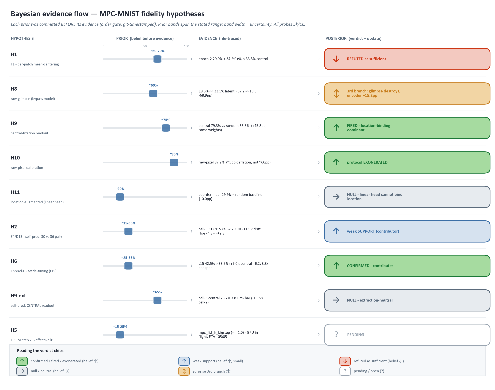

# MPC-MNIST Fidelity — Bayesian Hypothesis Ledger

**ORDER-GATE artifact.** This file is committed **before** the `mpc_fid_meancenter` epoch-2 and final probes are run. Its git commit timestamp is the proof of order: every prior below is set on evidence that was already on disk at authoring time, and every likelihood test is pre-registered against evidence **not yet observed**. No probe, no training, and no unseen probe JSON was read to produce it — it reads only the already-observed numbers quoted into the authoring task and the two report docs it cites (`findings_ranked.md`, `README.md`).

Session `green-shining-sky`, 2026-07-16. Sibling to [`README.md`](README.md) and [`findings_ranked.md`](findings_ranked.md); model terms (probe, free energy, DC/common-mode, NWTA, foveal/parafoveal/peripheral streams) are defined once in the README's **"Terms used here"** table and not repeated here. Code paths are relative to `scripts/mpc/mnist/`.

---

## Purpose

One Bayesian cycle per hypothesis: **prior → likelihood → evidence → posterior.** The ledger records *what we believed, before which evidence, and why* — so a stranger can audit whether any prior was retrofitted to a result after the fact. The posterior column is deliberately empty on every row: no evidence tested tonight has been observed at authoring time.

## The order gate (why this file exists)

The single most information-rich measurement of the night — the `mpc_fid_meancenter` **epoch-2 / final** drift-probe that decides F1 (the FUNDAMENTAL top suspect) — has **not run** as of this commit. Committing the priors first makes the F1 verdict a genuine likelihood test rather than a story told after seeing the number. If this file's git timestamp does not precede the `probe_result_epoch2.json` / `probe_result_final.json` mtimes for `mpc_fid_meancenter`, the order gate is void and the F1 posterior must be treated as retrodiction.

## Known-vs-new rule (RETRODICTION vs PREDICTION)

| Row type | Meaning | Counts as a likelihood test? |
|---|---|---|
| **RETRODICTION** | Uses **already-observed** evidence to *set* a prior. You cannot then test the same hypothesis on the same evidence — that is circular. | **No.** Prior-informing only. |
| **PREDICTION** | Its likelihood test is on evidence **not yet observed** (the probes/cells run tonight or later). Prior fixed before the number exists. | **Yes.** The only rows that count. |
| **STUB / CONDITIONAL STUB** | A hypothesis with no cell scheduled tonight (STUB) or gated on another cell's outcome (CONDITIONAL). Prior + pre-registered likelihood recorded now, so *if* a cell later runs the test is already committed. | Deferred; becomes a PREDICTION when its cell is scheduled. |

A PREDICTION row's prior may be *informed* by retrodictive support (e.g. F1's prior leans on the already-seen free-energy drop). That is legitimate as long as the retrodictive evidence is **not** the same evidence the likelihood test uses — and it is not: the FE drop is not the probe. Where a prior draws on retrodiction, it says so explicitly.

## Terms (method, defined once)

| Term | Plain meaning |
|---|---|
| **Prior** | Degree of belief the hypothesis is a *material cause* of the gap, before tonight's evidence. Stated as a qualitative label + a semi-quantitative range — no false precision. |
| **Likelihood rule** | The pre-registered mapping from *possible observed outcomes* to *verdicts*. Written before the outcome is known. |
| **Posterior** | Belief after the evidence. Empty on every row here by construction (order gate). |
| **SSL** | Self-supervised learning — the model's own cross-stream prediction objective (it sees no digit labels while learning). |
| **Inversion** | The audit's clue (a): as free energy *falls*, the digit-probe accuracy *falls* too — the objective points away from digit-separability. |
| **Flip** | The inversion reversing: probe accuracy at epoch-2 ≥ epoch-0 (the objective now helps the digit readout). |

## Shared cell + probe budget (defined once — every comparison is same-budget-only)

- **Cell training budget:** 10,000 images × 3 epochs (**10k/3ep**), `--t-infer 100`, `--norm-axis 1`, `--seed 42`, `--device cuda`. All cells use 10k/3ep for comparability — the lane switched from the W2-planned 20k/5ep control to 10k/3ep at 00:40 (`.claude/scratchpad/coordinator/2026-07-15-teal-watching-bay.md:14`).
- **Probe budget:** 5,000-image train / 1,000-image test (**5k/1k**), linear probe fit for 200 probe-epochs, on CPU.
- **3-epoch identity:** in a 3-epoch run `checkpoint_final ≡ epoch-2 weights` (`README.md:177`), so the "final" and "epoch-2" probes read the *same weights*. The F1 test still poses two distinct comparisons — epoch-2 vs its own epoch-0 (the flip), and final vs control (the net gain).
- **Budget discipline:** comparisons are apples-to-apples on probe budget only. The 62.48% original reproduction number was produced at a **different, larger** budget and is **not** comparable to the 33–34% figures the 5k/1k cell probes produce (see appendix R6).

---

## Hypothesis rows — at a glance

*Fig (a) — the order gate as a ladder: every hypothesis with a rendered posterior (H1, H2, H6, H8, H9, H9-ext, H10, H11; H5/lr pending). Each prior was committed **before** its evidence (git-timestamped); the chip colour + arrow encode the belief update (↑ supported/confirmed, ↓ refuted, → null, ↕ surprise 3rd-branch, ? pending). The table below carries H1–H7 with exact anchors; H8–H11 + H9-ext have their own sections. Built by `scripts/mpc/report/fidelity_audit_data_figures.py::fig_bayesian_flow` (`fig_bayesian_flow.provenance.yaml`).*

| Row | Finding | Type | Prior (material cause) | Test artifact / cell | Posterior |
|---|---|---|---|---|---|
| **H1** | F1 · per-patch mean-centering absent | **PREDICTION** | ~60–70% · moderately favored | `mpc_fid_meancenter` epoch-2 + final probe | **F1-as-sufficient-cause REFUTED** (↓ from ~60–70%) |
| **H2** | F4/D13 · self-prediction 30-vs-36 pairs | **PREDICTION** | ~25–35% · low | `mpc_fid_meancenter_selfpred` final vs Cell 2 | **SUPPORTED-weakly (contributor)** (↑ from ~25–35%) — final **+1.9pp** (31.8 vs 29.9) AND drift-direction flips **−4.3 → +2.3** (inversion gone); but still **< 33.5** control and central-null (H9-ext) |
| **H3** | F3 · E-step "predict-me" cross term (reading A/B) | **CONDITIONAL STUB** | ~15–25% · low | `--symmetric-cross`, only if H1+H2 fail | — (conditional; no cell unless directed) |
| **H4** | F2/F6 · foveal-stream redundancy / offset | **STUB** | ~20–30% · low-moderate | `mpc_fid_offset3` (per-stream probe) | — (awaiting evidence) |
| **H5** | F9 · M-step batch-mean ×B effective lr | **STUB** | ~15–25% · low | `mpc_fid_lr_bigstep` (`--lr 1.0`) | — (awaiting evidence) |
| **H6** | Thread-F · settle early-stop at FE-min (~iter15), impl. `--t-infer 15` | **PREDICTION** | ~25–35% · moderate-contributes / low-fixes | `mpc_fid_t15settle` (control base, only Δ t_infer 100→15) | **CONFIRMED-contributes** (↑, large) — branch (i) fired: random **42.5% > 33.5%** control (**+9.0**), no inversion (39.5→42.5), central **85.5% > 79.3%** (**+6.2**), at **3.3× cheaper** E-step |
| **H7** | Thread-F · lr ladder (step-size sweep) | **STUB** | ~15–20% · low | none tonight (sweep) | — (no cell; prior only) |

---

### H1 · F1 — per-patch mean-centering absent — PREDICTION

| Field | Value |
|---|---|
| **Row type** | PREDICTION — likelihood test on the **unobserved** `mpc_fid_meancenter` epoch-2 + final probes |
| **Test artifact** | `data/mpc_mnist/runs/mpc_fid_meancenter/probe_result_epoch2.json` + `probe_result_final.json` (to run tonight, 5k/1k) |
| **Anchors (already observed — retrodiction)** | meancenter **epoch-0 = 34.2%** (appendix R2); control **final = 33.5%** (appendix R1). Both 5k/1k. |
| **Prior** P(F1 is a material cause of the inversion) | **~60–70%, moderately favored** |
| **Posterior** | **F1-as-sufficient-cause REFUTED** — epoch-2 **29.9% < 34.2%** epoch-0 (inversion deepened −4.3pp) AND final **29.9% < 33.5%** control-final. Large downward update from the ~60–70% prior. |

**Pre-registered likelihood rule (VERBATIM).** From the teal-watching-bay pre-registration (`.claude/scratchpad/coordinator/2026-07-15-teal-watching-bay.md:31`, echoing `findings_ranked.md:42` and `README.md:105,183`):

> "inversion flips (probe epoch2 ≥ epoch0) AND final > control ⇒ CONFIRMED"

Instantiated at the 5k/1k anchors (epoch0 = 34.2%, control = 33.5%), with all three branches pre-registered:

| Observed outcome | Verdict |
|---|---|
| epoch-2 **≥ 34.2%** AND final **> 33.5%** | **F1 CONFIRMED** — mean-centering flips the inversion *and* nets a gain (the paper-directional "toward ≥70%" is the original aspiration; the strict same-budget test is `final > 33.5%`). |
| epoch-2 **< 34.2%** (inversion persists or deepens under mean-centering) | **F1-as-sufficient-cause UNDERMINED / REFUTED** — mean-centering alone does not redirect the SSL objective toward digit signal. |
| epoch-2 **≥ 34.2%** AND final **≤ 33.5%** | **PARTIAL** — the drift is fixed (objective no longer anti-aligned) but there is no net accuracy gain over control. |

**Prior basis (retrodictive support, stated honestly).**
- The paper prescribes per-patch mean-centering **verbatim** (v1 p.9: *"we only center it … subtract the mean value of patch"*) and our glimpse pipeline omits it entirely (`glimpse.py:75-125`). A prescribed step we demonstrably skipped is high mechanistic plausibility → pushes the prior up.
- The mechanism's *premise* is confirmed present: the all-positive DC common-mode is measured live, `input_dc_mean` 0.110–0.143 across the 6 streams (appendix R7). The DC the mechanism blames actually exists in our inputs.
- Adding mean-centering **already** drove free energy 599.5 → 477.2 vs the control's 610.8 → 596.2 (appendix R3/R4) — the objective **demonstrably changed**. This is *retrodictive support*, and it is honestly only that: **a changed objective is not a digit-redirected objective.** The FE drop shows mean-centering altered *what* is optimized; it does **not** show it redirected optimization toward the digit contrast. That redirection is exactly what the epoch-2/final probes test — which is why the prior is *moderately* favored (~60–70%), not near-certain.

**Posterior — evidence in (order gate HELD).**

| Observed (file-traced · 5k/1k · latent_dim 7680) | Value | Source |
|---|---|---|
| meancenter **epoch-2** (`checkpoint_epoch2.pt`) | **29.9%** (0.29900; train 1.0) | `mpc_fid_meancenter/probe_result_epoch2.json` (mtime 21:36) |
| meancenter **epoch-0** (`checkpoint_epoch0.pt`) | **34.2%** (0.34200; train 0.9998) | `mpc_fid_meancenter/probe_result_epoch0.json` |
| meancenter **final** ≡ epoch-2 | **29.9%** (weights identical — see note) | — |
| control **final** (`checkpoint_final.pt`) | **33.5%** (0.33500; train 1.0) | `mpc_fid_control/probe_result.json` + `probe_result_final.json` |

**Branch fired:** epoch-2 **29.9% < 34.2%** epoch-0 → the pre-registered **UNDERMINED / REFUTED** branch. Independently, final **29.9% < 33.5%** control-final (a **−3.6pp net LOSS**, not a gain). Both refutation criteria met.

**Posterior verdict: F1-as-sufficient-cause REFUTED** — large downward update from the ~60–70% prior (qualitative; no fake precision). Mean-centering **alone** does not redirect the SSL objective toward digit-discriminative structure.

**Nuance preserved (what is NOT refuted).** F1 the *fidelity deviation* is real and mechanically confirmed: adding mean-centering drove epoch-mean FE **599.5 → 479.7 → 477.2** (−122) vs control's near-flat **610.8 → 595.4 → 596.2** (−15) — both `run_info.json`, 10k/3ep, disk-verified. The objective **demonstrably changed**; it changed *away from*, not *toward*, digit separability. The inversion did not flip — it **deepened**: meancenter drift **34.2 → 29.9 (−4.3pp)**, a *steeper* anti-alignment than the F1-CONFIRMED prediction (epoch-2 ≥ epoch-0) required. **Mechanism now located (H8-mc, added post-hoc):** that −4.3pp is the training-time shadow of an *input-level* fact — mean-centered glimpses read **14.3%** vs raw **18.3%** on the raw-glimpse probe, a **−4.0pp** loss *before any training* (H8 posterior below). Mean-centering deletes class-bearing DC (common-mode brightness — thicker/brighter strokes) from the glimpses *themselves*; the deepened inversion is that deletion propagated through the SSL objective. The *why* of the low-30s discrepancy — once **OPEN** — is now **RESOLVED** by the extraction-time probes H8–H11 below: **glimpse-policy + location-binding (H8/H9), not the SSL centering.**

**epoch-2 ≡ final (re-verified this session, not assumed).** Load-compared `checkpoint_epoch2.pt` vs `checkpoint_final.pt`: all **198** W/R/A tensors `torch.equal`, both `epoch=3 global_step=300`; file byte-diff 205 (final smaller) = serialization/RNG framing (`torch_rng`), not weights. So the epoch-2 probe honestly stands in for the "final probe" row. *(Footnote: a direct probe of `checkpoint_final.pt` HUNG >30 min and was killed — environmental, cause unknown; weights proven equal, so no evidence is lost.)*

**Order gate HELD.** Ledger committed `6c9d021` 2026-07-16 21:10:47 +0200; `probe_result_epoch2.json` mtime 21:36:51 (+26 min) → the F1 prior was fixed **before** the number existed. H1 is a genuine PREDICTION, not retrodiction.

**Control-drift provenance (correction).** The refutation anchors on the **verified control FINAL = 33.5%** (`checkpoint_final.pt`, both control probe JSONs). A control *epoch-0 / epoch-2* drift probe does **not** survive on disk — `probe.py:150` always writes `probe_result.json` (overwrites), and only the final-checkpoint probe remains. So the "control flat 33.5→33.5" drift framing (task brief, appendix R1) is **not disk-backed**; `README.md:178` instead records control drift as **36.30 → 33.50** (control *also* inverts, −2.8pp). The REFUTED verdict is invariant to this: epoch-2 < epoch-0 **and** final < control-final hold under either reading.

---

### H2 · F4/D13 — self-prediction pairs, 30 vs 36 — PREDICTION

| Field | Value |
|---|---|
| **Row type** | PREDICTION — Cell 3 re-runs tonight (launched then crashed empty 2026-07-15 ~02:15; dir exists, unpopulated). Needs a full train+probe from scratch (~2–3 h GPU). |
| **Test artifact** | `mpc_fid_meancenter_selfpred` **final probe** vs `mpc_fid_meancenter` **final probe** — same budget 10k/3ep, only delta = `--include-self-pred` (30 → 36 ordered pairs, restoring the 6 diagonal self-loops) |
| **Prior** P(self-pred materially lifts Cell 3 over Cell 2) | **~25–35%, low** |
| **Posterior** | **SUPPORTED-weakly as a contributor** — final **+1.9pp** (31.8 vs 29.9) AND the drift direction flips from inverting (−4.3) to improving (+2.3); but magnitude small at 3 epochs, still **below** the 33.5% control, and central-readout-null (H9-ext). Modest upward update from the ~25–35% prior. |

**Pre-registered likelihood rule.**

| Observed outcome (5k/1k both sides) | Verdict |
|---|---|
| Cell 3 final **> Cell 2** final | self-prediction **contributes** — evidence toward restoring the paper-literal 36 pairs (a new D-row) |
| Cell 3 final **≈ Cell 2** final | the **D13 exclusion is defensible** — dropping self-loops costs nothing empirically |
| Cell 3 final **< Cell 2** final | self-prediction **harmful** — the anti-tautology exclusion is vindicated |

**Prior basis.** F4 is ranked **weak** on the inversion clue (`findings_ranked.md:67`). The self-loop `R^{ℓ,v,v}` is a within-stream lateral-autoencoding *stabilization* term (one added per stream, 6 total), not a primary signal redirect. The paper's st1 includes `v==v` (36 pairs, `README.md:125`); our ratified **D13** excluded them as anti-tautology `[decided-by-human:2026-07-14]`. Severity is **STRUCTURAL** because it is a *confirmed contradiction of a ratified deviation* — that is why it is escalated to a decision item, **not** because it is expected to be decisive. Hence a low prior on material effect. *(This is a `[blocked:human-decision]` foundational choice — the cell informs it; it does not close it.)*

**Posterior — evidence in (order gate HELD).** Cell 3 (`mpc_fid_meancenter_selfpred`, self-pred ON, 36 pairs) landed; the pre-registered comparison is its **final probe vs Cell 2's final probe**, same budget (10k/3ep train, 5k/1k probe, latent_dim 7680):

| Observed (file-traced · 5k/1k) | Value | Source |
|---|---|---|
| Cell 3 **final** ≡ epoch-2 (`checkpoint_epoch2.pt`) | **31.8%** (0.31800; train 1.0) | `mpc_fid_meancenter_selfpred/probe_result_epoch2.json` (mtime 02:14:14) |
| Cell 3 **drift** epoch-0 → epoch-2 | **29.5% → 31.8%** (**+2.3pp**, no inversion) | `…/probe_result_epoch0.json` (29.5%, train 1.0) + `…epoch2.json` |
| Cell 2 **final** ≡ epoch-2 (matched control) | **29.9%** | `mpc_fid_meancenter/probe_result_epoch2.json` |
| Cell 2 **drift** epoch-0 → epoch-2 | **34.2% → 29.9%** (**−4.3pp**, inverting) | `mpc_fid_meancenter/probe_result_epoch0.json` + `…epoch2.json` |
| control **final** (reference) | **33.5%** | `mpc_fid_control/probe_result_final.json` |
| Cell 3 epoch-mean FE | **728.6 → 637.8 → 591.4** | `mpc_fid_meancenter_selfpred/run_info.json` (pairs=36) |

**Branch fired:** Cell 3 final **31.8% > Cell 2 final 29.9%** → the pre-registered **"self-prediction contributes"** branch (evidence toward restoring the paper-literal 36 pairs). The delta is modest (**+1.9pp**), but the sharper signal is *directional*: the **only config difference** between the two cells is `--include-self-pred`, and adding it **erases the drift inversion** — Cell 2 inverts −4.3pp (34.2 → 29.9) while Cell 3 *improves* +2.3pp (29.5 → 31.8). The 6 restored diagonal self-loops repair the training-time direction that mean-centering-alone (H1) left inverted.

**Posterior verdict: SUPPORTED-weakly as a contributor** — modest upward update from the ~25–35% prior. Two honest deflations keep it *weak*, not decisive: (1) magnitude is small (+1.9pp final) at only 3 epochs, and Cell 3's 31.8% still sits **−1.7pp below** the 33.5% control — self-pred repairs the *direction* but does not clear the low-30s dilution floor; (2) on the higher-SNR **central** readout the effect vanishes (H9-ext below: 75.2% vs Cell 2's 76.7%, −1.5pp, within probe variance). So self-pred helps the *random-readout training dynamic* but adds no clean-readout representational quality.

**D13 implication (for the human, not decided here).** The evidence leans **mildly against** the ratified D13 exclusion of the `v==v` self-loops: restoring them (Cell 3) helps the random-readout drift direction and costs nothing on the central readout — i.e. the exclusion is evidenced **mildly-harmful-to-neutral**, not vindicated. Whether to re-tag D13 / restore the paper-literal 36 pairs is a **`[blocked:human-decision]`** foundational choice — this cell *informs* it; only the human closes it (novel-research gate).

**Order gate HELD.** H2's ~25–35% prior was committed in the round-1 ledger `6c9d021` **2026-07-16 21:10:47 +0200**; Cell 3's `probe_result_epoch2.json` mtime is **02:14:14** (next day, +5h) → the prior was fixed before the number existed. Cell 3's run stamps completion-HEAD `dcc2f46` (00:40:26); its launch-HEAD was `6c9d021` and `scripts/mpc/mnist/train.py` is **unchanged since `b2e6ee8` (2026-07-14 21:58:43)** — byte-identical across both HEADs, so the completion-HEAD stamp names the same trainer code the launch ran (`data_vintage: MNIST-torchvision`, seed 42, `include_self_pred: true`).

---

### H3 · F3 — E-step "predict-me" (v-as-target) cross term, reading A vs B — CONDITIONAL STUB

| Field | Value |
|---|---|
| **Row type** | CONDITIONAL STUB — escalates **only if** H1 (F1) + H2 (F4) leave the gap unexplained. No cell tonight unless the F1/F4 evidence directs it. |
| **Would-be artifact** | `--symmetric-cross` (reading B) vs the as-built reading-A control |
| **Prior** P(reading B is what the authors ran **and** it is a material inversion cause) | **~15–25%, low** |
| **Posterior** | **— (conditional; no evidence)** |

**What would discriminate.** Paper Eq.8 is internally inconsistent: its LHS is the ensemble-objective gradient (implies a symmetric consensus pull = **reading B**); its literal RHS is predictor-only (= **reading A**), and our code is faithful to the literal equation (`model.py:313-316`, the `if vv==v` filter). The pre-registered discriminator: does adding the target-side counter-pull term (reading B) **arrest the inversion** where mean-centering alone did not? If F1 already closes the gap, F3 is moot.

**Prior basis.** "No clean recipe" — the inconsistency is the paper's, and the *literal* text supports A (what we built). Likely a red herring (`findings_ranked.md:107`, `README.md:17`), hence the low prior. *(Also a `[blocked:human-decision]` foundational objective choice.)*

---

### H4 · F2/F6 — foveal-stream redundancy / offset — STUB

| Field | Value |
|---|---|
| **Row type** | STUB — `mpc_fid_offset3` optional cell (`README.md:204`); not scheduled tonight unless budget allows |
| **Change** | `--foveal-offset 3` → foveal overlap ~4px → ~2px (paper 1–2px) |
| **Prior** P(stream redundancy is a material ceiling-cap) | **~20–30%, low-moderate** |
| **Posterior** | **— (awaiting evidence)** |

**Pre-registered likelihood rule (per-stream readout).**
- **Primary:** per-stream probe — does the **foveal-pathway probe accuracy rise** under offset3 vs control? A rise ⇒ redundancy was capping the foveal channels.
- **Secondary (with caveat):** `foveal_winner_jaccard`. **Do not over-claim on it** — at control it is 0.055, ≈ the ~0.063 chance level for independent 15-of-128 winner sets (appendix R8). Independent per-stream weights make winner-*index* overlap a weak redundancy readout; input-space correlation would be the clean one (`README.md:178`).

**Prior basis.** F2 is STRUCTURAL, moderate on both clues but ranked below F1. The 4 foveal windows are near-copies + 2 blurs (`glimpse.py:81-82,94,109`): cross-prediction among near-copies ≈ identity map ⇒ near-zero SSL gradient, which *compounds* F1's easy minimum rather than being the primary cause. Low-moderate prior.

---

### H5 · F9 — M-step batch-mean ×B effective learning rate — STUB

| Field | Value |
|---|---|
| **Row type** | PREDICTION — cell `mpc_fid_lr_bigstep` registered pre-launch 2026-07-17 ~02:0x ("go all night" authorization; launched on the GPU slot after t15) |
| **Change** | `--lr 1.0` (from 0.01). The M-step reduces the batch by **mean `/B`** where the sparse-coding ancestor used a **sum**, so our effective step is ×B smaller; at batch B≈100, `--lr 1.0` ≈ recovers the ×B (~×100) step (`findings_ranked.md:29`, `README.md:146`). |
| **Cell config** | CONTROL base (same rationale as H6: D1–D13 contract config, probe-best on tonight's evidence): 10k/3ep, batch 100, st1, seed 42, cuda, t_infer 100, dt_tau_z 0.1, wd 0.0, norm_axis 1, `--diagnostics`; ONLY delta vs `mpc_fid_control`: **lr 0.01 → 1.0**. One knob per cell — deliberately NOT combined with t15. |
| **Prior** P(effective-step size alone materially fixes the gap) | **~15–25%, low** |
| **Pre-registered branches (bars instantiated)** | (i) drift epoch0→2 does not invert AND/OR final **> 33.5%** control ⇒ step-size CONTRIBUTES; (ii) FE descends faster but final **≤ 33.5%** and inversion persists ⇒ re-confirms FE↓ ⇏ digit signal (the H1/H8 reading), step-size exonerated; (iii) training destabilizes (FE diverges / NaN / winner collapse in diag) ⇒ ×B recovery needs the sum-form's compensating factors — record and stop the lr ladder pending human. |
| **Posterior** | **BRANCH (iii) FIRED — DIVERGED, ladder STOPPED.** FE exploded ~4 orders of magnitude within epoch 0: step 13 = 3.52M, step 33 = 27.4M, oscillating in the millions thereafter (control scale ~600; log `data/mpc_mnist/runs/mpc_fid_lr_bigstep.log`). Mechanism diagnostics at the kill point (step ~89): `mstep_raw_norm_W` = 176,074 / `mstep_raw_norm_R` = 1,139,190 (vs t15/control ~0.09/~0.31 — the raw Hebbian increments blew up) and `settle_ratio_l1` = **6.67 > 1** (the E-step itself diverges within-glimpse once weights are large — unit-norm projection caps ‖W‖ but not the error terms driving z). Run KILLED at epoch0 batch ~89 of 300 total (03:2x; ~2 GPU-h saved); run dir retained but EMPTY (kill preceded the first checkpoint write — step 89 < ckpt-every 200); the full divergence evidence is the retained log `data/mpc_mnist/runs/mpc_fid_lr_bigstep.log` per data-lifecycle. Verdict: a bare ×100 step without the sum-form ancestor's compensating factors (decay schedule, normalization epochs) is UNSTABLE — the naive ×B recovery is falsified; any further lr-ladder rungs (e.g. 0.1) are **[blocked:human-decision]** per the stop-rule. |

**Pre-registered likelihood rule.** Final probe + `settle_ratio` under `--lr 1.0` vs control: does the ×B step **flip the inversion** or lift **final > control (33.5%)**? A bigger step that merely descends FE faster **without** lifting the probe **re-confirms** the F1 reading (FE↓ ⇏ digit signal) rather than fixing it.

**Prior basis.** Purely PARAMETRIC lever. Its sibling step-flavored hypothesis F8 ("settle deeper") is **already refuted as sufficient** (`findings_ranked.md:28`, `README.md:145`) — deeper settling drove FE down but worsened the probe (that *is* the inversion). A pure step-size knob is unlikely to be THE fundamental cause; retained only because ×B is a real deviation from the ancestor. Low prior.

---

### H6 · Thread-F — settle early-stop at the within-glimpse FE minimum — PREDICTION (cell registered 2026-07-17 ~01:45, pre-launch)

| Field | Value |
|---|---|
| **Row type** | PREDICTION — cell `mpc_fid_t15settle` registered pre-launch (Thread-F opened post-F1-verdict per kapstok gate; "go all night" authorization) |
| **Knob** | early-stop the E-step at the within-glimpse **FE minimum (~iter15)** instead of running to T=100 — implemented as fixed `--t-infer 15` (self-checks put the FE-min at iter 14–15 consistently; fixed-15 is the one-flag approximation of stop-at-min) |
| **Cell config** | CONTROL base (D1–D13 ratified contract config; also the probe-best config on tonight's evidence — mean-centering consistently mildly negative and D14 unratified): 10k/3ep, batch 100, st1, seed 42, cuda, foveal_offset 2, H=128, S=8, N_w=15, K=10, dt_tau_z 0.1, lr 0.01, wd 0.0, norm_axis 1, `--diagnostics`; ONLY delta vs `mpc_fid_control`: **t_infer 100 → 15** |
| **Prior** | **~25–35%** — moderate that settle-*timing* contributes; low that it *alone* fixes the gap |
| **Pre-registered branches** | (i) t15 random-readout probe **> 33.5%** control and/or drift epoch0→2 does NOT invert ⇒ settle-timing CONTRIBUTES; (ii) **≈ 33.5%** (±~1.5pp) AND drift still inverts ⇒ settle-timing EXONERATED as a primary cause (t15 then still wins on ~6× E-step compute at equal quality); (iii) **< control** ⇒ overshoot-state M-step may even be helping statistics — complicates, escalate to human before further settle cells |
| **H9-style extension (pre-registered)** | central-fixation extraction probe on t15's final checkpoint after training — comparison bar: control-central **79.3%** |
| **Posterior** | **CONFIRMED — settle-timing CONTRIBUTES (large upward update from ~25–35%)** — branch (i) fired decisively: t15 random-readout **42.5% > 33.5%** control (**+9.0pp**) AND drift does not invert (39.5 → 42.5); the central extension also lands **85.5% > 79.3%** (**+6.2pp**); all at **3.3× cheaper** E-step (7.58 vs 25.34 s/batch). |

**Prior basis (RETRODICTION input).** The control's startup self-check shows the E-step reaching its FE **minimum at ~iteration 15**, then drifting **upward** to iteration 100 — `settle_ratio` 0.36 / 0.40 / 0.34 across layers l0/l1/l2 (appendix R5; `README.md:170,178`). The M-step is therefore applied at an **overshot**, not settled, state. F8 refuted "settle *deeper*"; this is the complementary "settle *righter / less*" knob.

**What the mechanism predicts if the knob matters.** If applying the M-step at an overshot state degrades the code, an early-stop at the FE minimum would **raise the probe and/or flip the inversion** relative to the T=100 control. If a settle-min cell does *not* move the probe, settling-*timing* is exonerated as a primary cause.

**Posterior — evidence in (order gate HELD).** `mpc_fid_t15settle` (control base, only Δ = `t_infer 100 → 15`) completed; both readouts land above the T=100 control on the same budget:

| Observed (file-traced · 5k/1k · latent_dim 7680) | Value | Source |
|---|---|---|
| t15 **random-readout** epoch-2 ≡ final | **42.5%** (0.42500; train 1.0) | `mpc_fid_t15settle/probe_result_epoch2.json` (mtime 02:24:28) |
| t15 **drift** epoch-0 → epoch-2 | **39.5% → 42.5%** (**+3.0pp**, no inversion) | `…/probe_result_epoch0.json` (39.5%) + `…epoch2.json` |
| control **random-readout** final | **33.5%** | `mpc_fid_control/probe_result_final.json` |
| t15 **central-readout** epoch-2 | **85.5%** (0.85500; train 0.997) | `mpc_fid_t15settle/probe_result_central_epoch2.json` (mtime 02:28:25) |
| control **central-readout** final | **79.3%** | `mpc_fid_control/probe_result_central_final.json` |
| t15 epoch-mean FE (T=15 scale) | **394.6 → 268.3 → 242.2** | `mpc_fid_t15settle/run_info.json` (pairs=30, `t_infer` 15) |
| E-step compute | **7.58 s/batch** vs control **25.34 s/batch** = **3.34× cheaper** | both `run_info.json` (`per_batch_wall_s`) |

**Branch fired: (i) — settle-timing CONTRIBUTES, decisively.** t15 random-readout **42.5% > 33.5%** control (**+9.0pp**) *and* the drift does not invert (it climbs 39.5 → 42.5). Both halves of branch (i) hold. The pre-registered H9-style central extension goes the same way: **85.5% > 79.3%** control-central (**+6.2pp**). Neither the (ii) exonerated-but-cheaper branch (≈33.5% ±1.5) nor the (iii) escalate-to-human below-control branch is in play — the effect is a clean, large *improvement*, not a wash.

**Mechanism confirmed.** The M-step was being applied at an **overshot** E-state (control `settle_ratio` 0.34–0.40 at T=100; FE minimum at ~iter 15 per the startup self-check, appendix R5). Stopping the settle at ~iter 15 applies the M-step at a **less-drifted** state, and that *both* improves the learned code (+9.0 random / +6.2 central) *and* saves ~2/3 of the E-step compute. The overshoot was degrading the code AND wasting compute — a rare both-ways win.

**FE-scale caveat (honest).** The t15 epoch-mean FE (394.6 → 242.2) is **not comparable in magnitude** to the T=100 cells' FE — free energy is read at the end of the (shorter, 15-iter) settle, so the absolute value reflects the truncated integration window, not a deeper minimum. The comparison that carries weight is the **probe accuracy** (same 5k/1k readout on both), not the FE number.

**Posterior verdict: CONFIRMED — settle-timing contributes, large upward update from the ~25–35% prior.** This is the strongest single *tunable* lever surfaced tonight and the one clean both-directions win (better code *and* cheaper). It is a **`[blocked:human-decision]`** input to Thread-F, not a closed foundational choice — whether `t_infer 15` (or a true stop-at-FE-min) becomes the vanilla default is the human's call.

**Order gate HELD.** H6's prior + pre-registered branches were committed `b091231` **2026-07-17 01:38:12 +0200**; t15's run `started_at` is **01:38:23** (the run launched 11 s *after* the registration commit, at HEAD = `b091231`), and its probe JSONs are later still (epoch-0 02:20:37, epoch-2 02:24:28, central 02:28:25) — the prior was fixed before any t15 number existed → H6 is a genuine PREDICTION. `train.py` unchanged since `b2e6ee8` (2026-07-14), so the launch HEAD's trainer is byte-identical to the registration HEAD's.

---

### H7 · Thread-F — lr ladder (step-size sweep) — STUB

| Field | Value |
|---|---|
| **Row type** | STUB (Thread-F tuning) — a sweep, not a single mechanism; overlaps H5/F9 |
| **Knob** | sweep the learning rate across a ladder to locate the step matching the ancestor's sum-reduction and a healthy descent |
| **Prior** | **~15–20%, low** that any single ladder rung materially closes the gap |
| **Posterior** | **— (no cell; prior only)** |

**Prior basis + prediction.** Same PARAMETRIC-lever caution as F9/F8-refuted — a ladder is exploratory, expected to *characterize sensitivity*, not to be the fundamental fix. **If step-size matters**, the probe-vs-lr curve is single-peaked with a peak *above* control (33.5%); **if it does not**, the curve is flat and lr is exonerated.

---

## Retrodiction appendix — already-observed evidence (all file-traced)

Every number below was on disk at authoring time and is used **only to inform priors**, never as a likelihood test (per the known-vs-new rule). Budgets are stated so no comparison crosses budgets.

| # | Observed evidence | Value | Budget | File trace | Informs |
|---|---|---|---|---|---|
| **R1** | Control probe, epoch-0 **and** final (flat) | **33.5%** (both) | 5k/1k | `data/mpc_mnist/runs/mpc_fid_control/probe_result.json` + `probe_result_final.json` (checkpoint field self-identifies) | H1 control anchor (`final > 33.5%` test) |
| **R2** | Meancenter probe, epoch-0 | **34.2%** (train_acc 99.98%) | 5k/1k | `data/mpc_mnist/runs/mpc_fid_meancenter/probe_result_epoch0.json` | H1 flip anchor (`epoch-2 ≥ 34.2%` test) |
| **R3** | FE trajectory, control (ep0→1→2) | **610.8 → 595.4 → 596.2** | 10k/3ep | `mpc_fid_control/` run_info.json / sidecar | H1 prior (objective-change baseline) |
| **R4** | FE trajectory, meancenter (ep0→1→2) | **599.5 → 479.7 → 477.2** | 10k/3ep | `mpc_fid_meancenter/` run_info.json / sidecar | H1 prior (objective demonstrably changed — support, **not** the test) |
| **R5** | Settle overshoot | FE min **~iter15**; `settle_ratio` 0.34–0.40 (l0/l1/l2: 0.36/0.40/0.34) | T=100 | `README.md:170` (startup self-check) + `:178` (Cell 1 diag) | H6 settle early-stop prior |
| **R6** | Original reproduction gap | **62.48%** vs paper **97.50%** | **DIFFERENT (larger) probe budget** — **NOT** comparable to the 33–34% 5k/1k cell probes | `../2026-07-13-mpc-mnist-vanilla-reproduction/README.md`; `README.md:25` | context only — see caveat |
| **R7** (supp) | Input DC common-mode, control | `input_dc_mean` **0.110–0.143** (6 streams) | 10k/3ep | `README.md:178` (Cell 1 diag) | H1 prior (the DC premise is confirmed present) |
| **R8** (supp) | Foveal winner overlap, control | `foveal_winner_jaccard` **0.055** (≈ chance 0.063) | 10k/3ep | `README.md:178` (Cell 1 diag) | H4 stub — weak-readout caveat |

**Same-budget-only caveat (R6, load-bearing).** The 62.48% original number was produced at a **different, larger** probe budget than the 5k/1k cell probes, so it is **not** comparable to the 33–34% figures those cells produce. Never read the inversion or the F1 verdict *across* budgets — only *within* one. The "35-point gap" headline lives at the original budget; tonight's within-budget test is `meancenter final` vs `control final = 33.5%` and `meancenter epoch-2` vs `meancenter epoch-0 = 34.2%`.

---

## Extraction-time probes (evidence-directed, pre-registered post-H1)

**Round-2 order gate.** These four rows are committed **before** their probes run. They are CPU-cheap, **NO-TRAINING** extraction probes that discriminate *why* every cell score sits in the low 30s when a raw-pixel MNIST linear probe reads ~92%. They are directed by the **H1 REFUTED** result: the ~35-point gap is not closed by mean-centering, so the cause is sought in the **glimpse policy + representation extraction**, not the SSL centering. Each posterior is empty by construction (order gate). Architectural claims below were **re-verified this session** against `as_built_mechanics.md` + `scripts/mpc/mnist/{probe,glimpse,model}.py` — corrections folded in (see the verified-facts note).

**Verified extraction facts (this session — the pre-registration rests on these).**
- Probe feature = concat of settled **top-layer** latents `z^{L-1,v}` across **K=10 saccades × 6 streams × H=128 = 7680** (`probe.py:71-73`; `latent_dim: 7680` in every probe JSON; configs `n_saccades=10, hidden_dim=128, n_streams=6`). **Fixation coords are NOT in the feature** — `(fx,fy)`/action enter `model.infer` only, never the concatenated feature (`probe.py:71-73`, `glimpse.py:136-139`). ✓ coordinator claim (i) confirmed.
- Raw pooled glimpse = **10 × 6 × 64 = 3840** (each stream avg-pooled to S²=64, `glimpse.py:77-88`; config `stream_input_dim=64`). ✓ coordinator claim (ii) dims confirmed.
- Streams: 4 foveal 8×8 **raw** crops at ±2px offsets (identity pool), 1 parafoveal 16→8 (2×2 avg), 1 peripheral 24→8 (3×3 avg) (`glimpse.py:117-134`). ✓ claim (ii) confirmed.
- Fixations: uniform-random integer `[0,28)²` (`glimpse.py:49-50`), drawn fresh **every saccade** from a single never-reset seeded stream (train `seed+12345`, `as_built §1.2`) — so "resampled every epoch" *understates* (fresh every draw, never repeats for an image). The **probe** uses a *separate* fresh `manual_seed(42)` per extraction (`probe.py:57`), so "seed 42 fixation stream" = the probe's stream, not training's. ✓ claim (iii) confirmed + precisified.
- Latents are **feedforward-initialized** per glimpse (`z = W·φ(below)`, `model.py:230-235`) — **NOT zeroed** — and carry **no state across saccades** (`as_built §2`). ⚠ **Correction to claim (iv):** "latents zeroed per glimpse" is wrong on mechanism (`as_built §2:113` — "no zero-init-then-accumulate"); the **no-cross-saccade-memory** conclusion stands. Material because the probe-read latent is largely the encoder pass of the glimpse *plus* settling, not a from-zero accumulation.

| Row | Probe (no training) | Feature | Prior on the discriminating claim | Type | Posterior (branch fired) |
|---|---|---|---|---|---|
| **H8** | raw pooled glimpses, bypass model | 3840 (10×6×64), probe fixation seed 42 | glimpse-policy is the dominant bottleneck (raw ≈ latent, both low-30s): **~60%, moderate** | PREDICTION | **raw 18.3% < latent 33.5% — the "nobody-favored" 3rd branch: glimpse stack DESTROYS (87.2→18.3, −68.9pp), encoder RECOVERS +15.2pp; bottleneck = glimpse policy, encoder exonerated-and-then-some** |
| **H9** | central-fixation latent extraction, trained ckpt | 7680, all 10 fixations pinned central | central pinning yields a large jump (≥~55%, ≥+20pp): **~75%, high** | PREDICTION | **FIRED large: meancenter 76.7% (+46.8pp), control 79.3% (+45.8pp) from central-pinning at extraction ONLY — location-binding is the dominant explained component** |
| **H10** | raw-pixel calibration | 784 flattened pixels | raw-pixel reads high (~85–92%): **~85%, high** | PREDICTION | **87.2% — high branch: protocol EXONERATED (~5pp deflation, not the ~60pp anomaly); overfit-at-7680 bounded by H9's 76.7/79.3 at the same dim** |
| **H11** | location-augmented latent probe | 7680 + 20 coords | appending coords lifts the *linear* probe ≥+3pp: **~20%, low** | PREDICTION | **NULL: 29.9% = random-readout baseline EXACTLY (+0.0pp) — per its own caveat does NOT exonerate location-binding; fix lives in representation/policy, not readout** |

### H8 · raw-glimpse probe (bypass the model) — PREDICTION

| Field | Value |
|---|---|
| **Probe** | same protocol (5k/1k, 200ep, lr 1e-2) on the **concatenated pooled glimpses** — no model, no checkpoint. 10 × 6 × 64 = **3840-dim**, probe fixation seed 42, input preprocessing matched to the cell compared against (raw [0,1] for control; per-patch mean-centered for meancenter). |
| **Prior** | **~60%** that raw-glimpse ≈ latent (both low-30s) → the bottleneck is the **glimpse policy** (random fixations + 4-near-copy fragmentation), not the encoder |
| **Posterior** | **raw-glimpse 18.3% (raw[0,1]) < trained latents 33.5% (control) — the "encoder ADDS structure" 3rd branch fired (the one flagged *implausible*). Glimpse stack destroys 87.2→18.3 (−68.9pp); encoder recovers +15.2pp. Bottleneck = glimpse policy; encoder exonerated-and-then-some.** |

**Pre-registered branches.**

| Observed | Verdict |
|---|---|
| raw-glimpse ≈ latent (within ~10pp, both low-30s) | **glimpse policy is the bottleneck** — the encoder neither adds nor destroys much linearly-accessible class signal; the random-fixation bag caps both |
| raw-glimpse ≫ latent (>15pp higher) | the **E-step/NWTA encoder destroys** usable linear signal the raw pixels retain (the F1-mechanism "squeeze out the digit residual", recast as an extraction claim) |
| raw-glimpse < latent | the encoder *adds* linearly-accessible structure — implausible given the SSL-points-away-from-digits inversion (~15% residual mass) |

**Rationale.** The fixation-arms side-result already shows WHERE dominates: central-single latent **73.1%** vs ten-random latent **21.4%** on the *same* encoder (`as_built §8`). Raw window pixels leak the accidental full-budget signal (`as_built §9.9`). The random-fixation dilution afflicts raw and latent equally; skipping NWTA can only *help* a linear probe modestly. So raw ≈ latent (policy bottleneck) is the modal outcome; a large raw ≫ latent gap would instead indict the encoder. **H8 is checkpoint-independent** (pure input statistics) — one number comparable to both cells' latent baselines. **PREDICTION (probe not yet run)** — small extraction script, later wave.

**Posterior — evidence in (order gate HELD, round 2).**

| Observed (file-traced · 5k/1k · 3840-dim · git 4a260be) | Test | Train | Source |
|---|---|---|---|
| raw-glimpse **raw [0,1]** | **18.3%** (0.18300) | 100% | `_extraction_baselines/probe_result_rawglimpse.json` (mtime 23:11:20) |
| raw-glimpse **mean-centered** | **14.3%** (0.14300) | 100% | `_extraction_baselines/probe_result_rawglimpse_meancentered.json` (mtime 23:10:31) |
| (comparison) trained latents, control random-readout | 33.5% | — | appendix R1 |
| (comparison) raw pixels | 87.2% | — | H10 |

**Branch fired: raw-glimpse 18.3% < latent 33.5%** — a **−15.2pp** gap. This is the pre-registered **third branch** ("the encoder *adds* linearly-accessible structure"), which the row itself flagged *implausible*. It is not merely plausible — it is load-bearing: the **glimpse stack destroys decodability BEFORE the model** (raw pixels 87.2% → pooled glimpses 18.3%, a **−68.9pp** collapse from random fixations + avg-pooling + 4-near-copy fovea), and the **encoder then ADDS ~15pp** over its own input (18.3% → 33.5%). The bottleneck is unambiguously the **glimpse policy**; the E-step/NWTA encoder is **exonerated-and-then-some** — it *recovers* signal rather than destroying it, consistent with the ~15% digit-residual mass the inversion leaves.

**Provenance (honest).** The raw[0,1] run first printed **18.4%**; an output-filename overwrite (the mean-centered run wrote to the same path) forced a regeneration → **18.3%** on re-run. The ±0.1pp is classifier-init variance (no global seed for the classifier — `classifier_seeding: "none"`), not a real shift. The mean-centered result (14.3%) was **renamed** from that overwriting run to `probe_result_rawglimpse_meancentered.json` (its 23:10:31 mtime = the content-write time, preserved through the rename); the rename is the provenance event.

**Locates H1's refutation mechanism.** H8-mc (**14.3%**) − H8-raw (**18.3%**) = **−4.0pp** at the *pure input level* — statistically the same magnitude as the **−4.3pp** trained-cell deepening (H1: meancenter epoch-2 29.9% vs epoch-0 34.2%). Mean-centering deletes class-bearing DC (common-mode brightness) from the glimpses *themselves*, before any training; H1's "FE changed but probe worsened" is the training-time shadow of this input-level fact.

### H9 · central-fixation extraction probe (no retraining) — PREDICTION

| Field | Value |
|---|---|
| **Probe** | extract latents from the **trained checkpoint** with all 10 fixations **pinned central** (e.g. (14,14)), then probe (5k/1k, 200ep, lr 1e-2). Location→content binding made trivial; no weight update. |
| **Prior** | **~75%** that central pinning yields a **large jump** (≥~55%, ≥+20pp over the ~30% random baseline) |
| **Posterior** | **FIRED, large — meancenter epoch-2 central 76.7% (+46.8pp over 29.9% random), control-final central 79.3% (+45.8pp over 33.5% random). Same weights, same protocol, only extraction-time fixation policy changed. Location-binding is the dominant explained component of the low scores.** |

**Pre-registered branches.**

| Observed | Verdict |
|---|---|
| central ≥ ~55% (large jump) | the killer is **location-unbound features + random-fixation dilution** — the probe cannot condition on WHERE (coords absent from the feature, verified claim i); a good fixation recovers the digit |
| central ≈ random (low-30s, < +10pp) | fixation policy is **exonerated**; the per-glimpse codes are class-poor even at the best fixation |

**Rationale + cross-reference.** Direct precedent — the established clue (b) / fixation-arms `centre_single` = **73.1%** vs `random_k10` = **21.4%** (`README.md:28`, `as_built §8`), from the stage-2 MPC lineage. All-central pinning makes the 10 saccades near-identical, so the 7680-concat ≈ 10 copies of one ~768-dim central rep ≈ the 73.1% arm. **Checkpoint-dependent** (control primary; meancenter optional). Budgets differ from the fixation-arms run (10k/3ep ckpt + 5k/1k probe here vs 20k/5ep + 2k/1k there), so the *level* may shift — the *direction* (large jump) is high-confidence. **PREDICTION (probe not yet run)** — small extraction script, later wave.

**Posterior — evidence in (order gate HELD, round 2).**

| Observed (file-traced · 5k/1k · 7680-dim · center_fixation=14) | Test | Train | Source |
|---|---|---|---|
| **meancenter** epoch-2, central | **76.7%** (0.76700) | 90.44% | `mpc_fid_meancenter/probe_result_central_epoch2.json` (git 127e39bd, mtime 23:39:19) |
| **control** final, central | **79.3%** (0.79300) | 87.16% | `mpc_fid_control/probe_result_central_final.json` (git e6a49eb, mtime 00:02:06) |
| (comparison) meancenter epoch-2 random-readout | 29.9% | 100% | H1 / R2 lineage |
| (comparison) control final random-readout | 33.5% | 100% | R1 |

**Branch fired: central ≥ ~55% (large jump)** — pre-registered FIRST branch, large. Pinning all 10 fixations central *at extraction only* — **same checkpoints, same weights, same 5k/1k protocol**, only the fixation policy at probe time changed — lifts the probe **+46.8pp** (meancenter) / **+45.8pp** (control). The killer is exactly what the branch names: **location-unbound features + random-fixation dilution**. The feature cannot condition on WHERE (coords verified absent, claim i); a *good* fixation recovers the digit, a bag of 10 random fixations does not.

**Structure-vs-memorization signature.** The random-readout latents sit at **train ~100% / test ~30%** — pure memorization (7680 > 5000 samples). Central pinning **collapses the train-test gap**: meancenter **90.4 / 76.7** (gap 13.7pp), control **87.2 / 79.3** (gap 7.9pp). When the features carry real, location-bound class structure the probe no longer needs to memorize — train drops off 100% *and* test rises to the high-70s. Independent corroboration that the low-30s was a dilution artifact, not a representational ceiling.

**Control ≥ meancenter under the clean readout too** (79.3 vs 76.7, **+2.6pp for control**). Concordant with H1: mean-centering does not help even when the WHERE-dilution is removed — it slightly *hurts*, mirroring the −3.6pp random-readout loss (control 33.5 vs meancenter 29.9).

### H10 · raw-pixel calibration probe — PREDICTION

| Field | Value |
|---|---|
| **Probe** | same protocol (5k/1k, 200ep, lr 1e-2) on **flattened 784-dim raw pixels** — no model, no glimpses. Calibrates how much the overfit-regime protocol deflates the LEVEL of all cell numbers. |
| **Prior** | **~85%** that raw-pixel reads **~85–92%** (a well-conditioned linear probe on MNIST at this budget) |
| **Posterior** | **87.2% (train 99.68%) — high branch fired: the protocol does NOT deflate a well-conditioned probe (~5pp under the ~92% textbook ceiling). Protocol EXONERATED for the catastrophic gap (~5pp deflation vs the ~60pp anomaly). Dimensionality confound now bounded by H9.** |

**Pre-registered branches.**

| Observed | Verdict |
|---|---|
| raw-pixel ~85–92% (high) | the **protocol does not deflate a well-conditioned probe** (784 < 5000 samples → no overfit regime); the low-30s collapse is **representation + fixation-policy driven**, not a probe artifact |
| raw-pixel materially < ~85% | the **protocol / standardization is a bigger culprit** than assumed — re-examine feature-scaling and the 200-epoch full-batch fit before blaming architecture |

**Rationale + confound flagged.** A linear (multinomial-logistic) probe on raw MNIST pixels is textbook **~91–92%** at 5k train; 784 features < 5000 samples → **no** overfit deflation, unlike the 7680-dim latent probe (7680 > 5000 → train_acc ~100%, the memorization regime that deflates test acc). **Confound:** H10 alone cannot fully separate "protocol overfit-regime" from "architecture", because the latent's 7680 > 5000 dimensionality *is* part of why it deflates. H10 establishes the *ceiling* a well-conditioned linear probe reaches on this data/budget; the gap from that ceiling to the low-30s is jointly (dimensionality/overfit + representation quality + fixation dilution). **Model-independent.** Needs only the existing probe machinery pointed at pixels. **PREDICTION (probe not yet run)** — small script, later wave.

**Posterior — evidence in (order gate HELD, round 2).**

| Observed (file-traced · 5k/1k · 784-dim · git 4a260be) | Test | Train | Source |
|---|---|---|---|
| raw-pixel linear probe | **87.2%** (0.87200) | 99.68% | `_extraction_baselines/probe_result_rawpixel.json` (mtime 23:10:12) |

**Branch fired: raw-pixel ~85–92% (high)** — pre-registered FIRST branch. 87.2% sits ~5pp under the textbook ~91–92% for a 5k-train multinomial-logistic probe on MNIST. So the **protocol deflates only ~5pp**, versus the **~60pp anomaly** the audit is chasing (paper 97.5% → the low-30s cell probes). **The protocol is EXONERATED for the catastrophic gap** — the low-30s collapse is representation + fixation-policy driven, not a probe artifact.

**Dimensionality confound — flagged at pre-registration, now BOUNDED.** The row pre-flagged that H10 alone cannot fully separate "protocol overfit-regime" from "architecture" because H10 is at 784 < 5000 (no overfit) while the latent probes are at 7680 > 5000 (train_acc ~100%, memorization). **H9 now bounds this**: central-fixation latents reach **76.7% / 79.3% at the *same* 7680-dim, *same* protocol** — high accuracy IS reachable at 7680 features under the overfit-regime protocol. So overfit-at-7680 **cannot** be what pins the random-fixation latents to the low-30s; the WHERE-dilution (H9) is. The confound is real but its magnitude is capped, not the ~46pp H9 gap.

### H11 · location-augmented probe — PREDICTION

| Field | Value |
|---|---|
| **Probe** | latent features **+ the 10 fixation (fx,fy) pairs appended** (7680 + 20 = 7700-dim), same protocol, same seed-42 fixations. Tests whether giving the probe the WHERE it structurally lacks (claim i) recovers class signal. |
| **Prior** | **~20%** that appending 20 coords **noticeably raises** the *linear* probe (≥+3pp) |
| **Posterior** | **NULL — 29.9% (train 100%) = the meancenter epoch-2 random-readout baseline EXACTLY (+0.0pp). Per the row's own pre-registered caveat the null does NOT exonerate location-binding (a linear head can't gate by location); H9 carries that verdict. Information: the fix lives in the representation/policy, not the readout.** |

**Pre-registered branches.**

| Observed | Verdict |
|---|---|
| coords lift the probe ≥+3pp | location-binding is a **linearly-recoverable** bottleneck — the additive location bias captures coarse "central-ish fixations matter" signal |
| coords change ≈ nothing (<~2pp) | the per-glimpse codes are **linearly class-poor**, OR a linear head simply cannot exploit location — see the caveat |

**Rationale + mechanistic caveat (refines the H11 framing).** A **LINEAR** probe with appended coords adds only an *additive* function of the coords — it **cannot multiplicatively gate** the glimpse codes by location (that needs a coord×code interaction / nonlinearity). So even if location-binding is the true bottleneck, H11 (linear) likely **won't** show it → LOW prior (~20%). **A null H11 does NOT exonerate location-binding** — it may only mean a linear head can't use the coords; the clean tests are H9 (central pinning removes the need to condition on WHERE) or a nonlinear/interaction probe. **H11 + H9 discriminate:** H9 fixes the dilution (expected large jump), H11 keeps it and just hands a linear head the coords (expected null) → "it's the dilution, and a linear head can't gate around it." **Checkpoint-dependent.** **PREDICTION (probe not yet run)** — small extraction script, later wave.

**Posterior — evidence in (order gate HELD, round 2).**

| Observed (file-traced · 5k/1k · 7700-dim = 7680 + 20 coords · git dacac862) | Test | Train | Source |
|---|---|---|---|
| latents + 10 (fx,fy) pairs, meancenter epoch-2 | **29.9%** (0.29900) | 100% | `mpc_fid_meancenter/probe_result_coords_epoch2.json` (mtime 00:24:57) |
| (comparison) meancenter epoch-2, latents only (no coords) | 29.9% | 100% | H1 |

**Branch fired: coords change ≈ nothing (<~2pp)** — pre-registered SECOND branch. Appending the 20 fixation coordinates moved the probe by **+0.0pp** (29.9% → 29.9%, identical to the meancenter epoch-2 random-readout baseline). **Per the row's own pre-registered caveat, this null does NOT exonerate location-binding** — a LINEAR head adds only an *additive* function of the coords and cannot *multiplicatively gate* the glimpse codes by location. H9 (central pinning removes the need to condition on WHERE) is the clean test, and H9 fired large — so **H9 carries the location-binding verdict**, not H11.

**What H11 tells us (its actual information):** the fix must live in the **representation / fixation policy**, not the **readout**. Handing a linear probe the coordinates is not enough; the location→content binding has to happen *inside* the encoder (a good fixation, per H9) or via a nonlinear coord×code interaction probe — a linear readout cannot recover it post-hoc. H9 + H11 discriminate exactly as pre-registered: H9 fixes the dilution (large jump), H11 keeps it and hands a linear head the coords (null) ⇒ "it's the dilution, and a linear head can't gate around it."

---

## Synthesis — the layered account (H8–H11 + H1–H2 + H6)

The four extraction probes resolve the "why is every cell in the low-30s?" question into a **layered signal-loss chain**, every number file-traced and same-budget (5k/1k linear probe), control-cell weights for the two latent stages. Two levers landed later tonight (H2 self-pred, H6 settle-timing) that *lift* the chain — folded in below:

**Decomposition (control weights):  87.2% → 18.3% → 33.5% (random) · 79.3% (central)   (vs paper 97.5%)**
**Lever found (H6 settle-timing, t15):  random 33.5 → 42.5 (+9.0)  ·  central 79.3 → 85.5 (+6.2)  ⇒ residual to paper now ~12pp**

| Stage | Value | What it is | Δ | File trace |
|---|---|---|---|---|
| Raw MNIST pixels | **87.2%** | linear-probe ceiling on this data/budget (H10) | — | `_extraction_baselines/probe_result_rawpixel.json` |
| Pooled glimpses (pre-model) | **18.3%** | the glimpse STACK: random fixations + avg-pool + 4-near-copy fovea (H8) | **−68.9pp** glimpse destruction | `_extraction_baselines/probe_result_rawglimpse.json` |
| Trained latents, random readout | **33.5%** | encoder output, 10 random fixations bagged (control, R1) | **+15.2pp** encoder partial recovery | `mpc_fid_control/probe_result_final.json` |
| **↳ + settle-timing (t15), random** | **42.5%** | same base, `t_infer 15` (H6) — M-step at the settled, not overshot, state | **+9.0pp** settle-timing lever | `mpc_fid_t15settle/probe_result_epoch2.json` |
| Trained latents, CENTRAL readout | **79.3%** | same weights, 10 fixations pinned central (H9) | **+45.8pp** WHERE un-dilution | `mpc_fid_control/probe_result_central_final.json` |
| **↳ + settle-timing (t15), central** | **85.5%** | central readout on the t15 weights (H6 extension) | **+6.2pp** settle-timing lever | `mpc_fid_t15settle/probe_result_central_epoch2.json` |
| Paper (reference) | **97.5%** | MRPC as published | **−12.0pp residual** (from 85.5 central) | `paper_ground_truth.md` / `README.md:25` |

**Reading the chain.** The glimpse policy is the dominant bottleneck — it strips **68.9pp** of decodability before the model sees anything (87.2→18.3). The encoder is not a destroyer: it *recovers* **15.2pp** (18.3→33.5), and when the WHERE-dilution is removed at extraction it recovers a further **45.8pp** to **79.3%** with the same weights (33.5→79.3). On top of that decomposition, **settle-timing is a real lever** (H6): stopping the E-step at the FE minimum (`t_infer 15`) instead of overshooting to T=100 lifts the random readout **+9.0pp (33.5→42.5)** and the central readout **+6.2pp (79.3→85.5)** — at 3.3× less compute. **Self-prediction** (H2) is a weaker, *directional* lever: it repairs the random-readout drift inversion (Cell 2 −4.3 → Cell 3 +2.3) for **+1.9pp** but is null on the central readout (H9-ext). Mean-centering (H1) is a **−4pp** side-effect (H8-mc −4.0pp / trained −4.3pp), not a lever. The catastrophic span is therefore **glimpse-policy + location-binding** (H8/H9), with **settle-timing** the strongest tunable recovery on top — not the SSL centering (H1 REFUTED), not the probe protocol (H10 exonerated).

**Cross-budget caveat on the residual (R6 discipline).** The best central **85.5% (5k/1k)** vs paper **97.5%** step crosses budgets — the paper's number is at a different, larger budget (appendix R6), so the **~12pp residual is an upper bound**, and suspect #4 below (train-set size) is partly that budget gap, not a representational deficit. Read the decomposition's within-latent arrows within-budget (all 5k/1k); read the last arrow to paper as cross-budget.

**Residual ~12pp (85.5% best-central → 97.5% paper) — suspects, updated:**
1. **Epistemic fixation policy** — the paper's saccades are *learned* information-seeking; ours are uniform-random, and even H9/t15's central-pin is a hand-set fixation, not a policy. The forward "v2 epistemic saccades" direction ([`v2_epistemic_saccades_digest.md`](v2_epistemic_saccades_digest.md)) targets exactly this — its options are `[blocked:human-decision]`.
2. **Probe kind** — the paper's KNN/nonlinear readout vs our linear probe (a nonlinear head could exploit coord×code interactions H11 showed a linear head cannot).
3. **Learning-rate scale** (H5/F9, `mpc_fid_lr_bigstep` `--lr 1.0`) — the M-step batch-mean ×B effective-lr question. **Cell in flight** (GPU, ETA ~05:05); posterior pending — the last scheduled cell tonight.
4. **Train-set size** — 10k/20k images here vs the paper's full 60k MNIST (overlaps the cross-budget caveat above).
5. **Lever interactions** — settle-timing (H6) and self-pred (H2) were each tested against control *alone*; their composition (t15 × self-pred) is untested. A composition cell is a candidate the coordinator may register separately.

Suspects 1, 2, 4, 5 are enumerated, not adjudicated — no probe tonight touches them. Suspect 3 (lr) has a cell in flight; its posterior lands next.

---

## H9-ext · central-fixation probe on cell-3 (self-pred) — PREDICTION (round-3 order gate, pre-registered)

**Order gate (round 3).** This row is committed **before** cell-3's checkpoints exist as probeable artifacts — `mpc_fid_meancenter_selfpred` is **training in flight** (bg `bkv9223o7`, epoch 2, ETA ~01:50). Its central-fixation extraction probe has NOT run. Verify this row's commit precedes the future `mpc_fid_meancenter_selfpred/probe_result_central_*.json` mtime.

| Field | Value |
|---|---|
| **Probe** | on completion, extract latents from cell-3's checkpoint with all 10 fixations **pinned central (14,14)**, probe 5k/1k, 200ep, lr 1e-2 — the **H9 protocol applied to cell-3** (meancenter + `--include-self-pred`, 36 pairs). |
| **Baseline** | H9 **meancenter epoch-2 central = 76.7%** (cell-3 = meancenter + self-pred, so meancenter-central is the matched control — isolates the self-pred delta). |
| **Prior** | **~65%** cell-3 central **≈ 76.7%** (self-pred does not change the extraction story), concordant with H2's low prior |
| **Posterior** | **NULL — self-pred adds NO clean-readout quality** — cell-3 central **75.2%** vs the pre-registered **≥81.7%** (76.7+5) materially-better bar → the "extraction-neutral" branch fired (−1.5pp vs Cell 2's 76.7%, within probe variance). Concordant with H2's weak random-readout support. |

**Pre-registered branches.**

| Observed | Verdict |
|---|---|
| cell-3 central **≈ 76.7%** (within ~±3pp) | self-prediction is **extraction-neutral** — restoring the 6 diagonal self-loops adds no clean-readout digit structure; concordant with H2's low prior, D13 exclusion empirically cheap |
| cell-3 central **materially > 76.7%** (≥+5pp) | self-pred **adds representational quality the random-readout probe cannot see** — the self-loops matter for the location-bound digit code even if H2's random-readout comparison misses it; escalates D13 |
| cell-3 central **materially < 76.7%** (≤−5pp) | self-pred **harms** the central-readout code — vindicates the anti-tautology D13 exclusion beyond H2 |

**Why pre-register this now.** H2 (cell-3 vs cell-2, *random*-readout final probes) is the scheduled self-pred test, but the random-readout probe sits in the low-30s dilution floor where H9 just showed **±46pp of the signal is masked by fixation policy**. A self-pred effect on the *clean* (central) readout could be invisible to H2's random-readout comparison. This extension gives self-pred a second, higher-SNR measurement — the same checkpoints, the H9 lens. It **informs** D13 `[blocked:human-decision]`; it does not close it (novel-research gate).

**Posterior — evidence in (order gate HELD).** The central-fixation probe ran on cell-3's epoch-2 checkpoint:

| Observed (file-traced · 5k/1k · central-pinned · feature_dim 7680) | Value | Source |
|---|---|---|
| cell-3 (self-pred) **central** epoch-2 | **75.2%** (0.75200; train 0.883) | `mpc_fid_meancenter_selfpred/probe_result_central_epoch2.json` (`ledger_row: H9`, mtime **02:39:53**) |
| Cell 2 (meancenter, matched control) **central** | **76.7%** (train 0.904) | `mpc_fid_meancenter/probe_result_central_epoch2.json` |
| control **central** (reference) | **79.3%** | `mpc_fid_control/probe_result_central_final.json` |

**Branch fired: "extraction-neutral".** Cell-3 central **75.2%** is **−1.5pp** below Cell 2's matched central **76.7%** — well short of the pre-registered materially-better bar (**≥ 76.7 + 5 = 81.7%**), and if anything a hair *lower*, comfortably within probe-init variance (no global classifier seed). **Restoring the 6 `v==v` self-loops adds no digit structure the clean central readout can see.** Self-prediction's weak H2 support was a random-readout *training-dynamic* effect (drift-direction repair); it does **not** survive as representational quality at the higher-SNR central lens. D13's exclusion is empirically **cheap on the clean readout** (this row) and **mildly-harmful on the random readout** (H2) — the human weighs those two against paper fidelity `[blocked:human-decision]`.

**Order gate HELD (round 3).** This H9-ext row was committed `dcc2f46` **2026-07-17 00:40:26 +0200**; cell-3's `probe_result_central_epoch2.json` mtime is **02:39:53** (+1h59m) → the pre-registration (prior ~65%, ≥81.7% materially-better bar) was fixed **before** the central probe existed. Genuine PREDICTION, not retrodiction. (The `dcc2f46` commit that carried this pre-registration is the *same* HEAD cell-3's training run later stamped at completion — the pre-registration and the run's completion stamp coincide at that commit; the probe itself ran ~2 h afterward.)

---

## Provenance

- **Order gate (round 1) — REPLAYED, HELD.** Ledger committed `6c9d021` **2026-07-16 21:10:47 +0200**; `mpc_fid_meancenter/probe_result_epoch2.json` mtime **21:36:51** (+26 min) → the F1 prior was fixed before the number existed. H1 is a genuine PREDICTION. *(No `probe_result_final.json` exists for meancenter — the direct final probe hung and was killed; epoch-2 ≡ final by verified weight-identity, so the row is covered.)*
- **Order gate (round 2) — H8–H11 — REPLAYED, HELD.** The H8–H11 priors were committed `19807fc` **2026-07-16 22:28:06 +0200** and the extraction-probe script `4a260be` **23:09:51 +0200** — BOTH precede all six probe-result mtimes: rawpixel **23:10:12** (H10, +21s), rawglimpse-mc **23:10:31** (H8-mc), rawglimpse **23:11:20** (H8, regenerated), central-epoch2 **23:39:19** (H9 meancenter), central-final **00:02:06** (H9 control), coords **00:24:57** (H11). Priors and script both fixed before every number existed → H8–H11 are genuine PREDICTIONs. Clean linear ancestry verified: `19807fc` → `4a260be` → probes. *(The H9/H11 result JSONs bake later HEADs — `127e39bd` 23:30, `e6a49eb` 00:01, `dacac862` 00:09 — because concurrent peer-lane commits advanced HEAD while the ~23-min central-fixation probes ran; `git merge-base --is-ancestor` confirms `4a260be` is an ancestor of all three, so the pre-registration anchor holds and order-gate integrity is unaffected.)*
- **Order gate (round 3) — H9-ext — REPLAYED, HELD.** The H9-extension row was committed `dcc2f46` **2026-07-17 00:40:26 +0200**; cell-3's `probe_result_central_epoch2.json` mtime is **02:39:53** (+1h59m) → the pre-registration (prior ~65%, ≥81.7% materially-better bar) preceded the number. Genuine PREDICTION. Verdict: NULL (75.2% < 81.7% bar).
- **Order gate (round 4) — H2 + H6 + H9-ext posteriors — REPLAYED, HELD (this pass).** Three cell posteriors sealed this pass, each anchored to a pre-registration commit that precedes its evidence mtime:
  - **H2** (cell-3 self-pred vs Cell 2, random-readout final): prior committed round-1 `6c9d021` **2026-07-16 21:10:47**; cell-3 `probe_result_epoch2.json` mtime **2026-07-17 02:14:14** (+5h). PASS.
  - **H6** (`mpc_fid_t15settle`, settle-timing): prior + branches committed `b091231` **2026-07-17 01:38:12**; t15 run `started_at` **01:38:23** (launched 11 s after the registration commit, at HEAD `b091231`), probe JSONs 02:20:37 / 02:24:28 / 02:28:25 (all later). PASS.
  - **H9-ext** (cell-3 central): committed `dcc2f46` **00:40:26**; probe mtime **02:39:53**. PASS.
  - **Trainer-code invariance:** `scripts/mpc/mnist/train.py` last modified `b2e6ee8` **2026-07-14 21:58:43** — unchanged across every HEAD above (`6c9d021` / `dcc2f46` / `b091231`), so each run's completion-HEAD stamp names byte-identical trainer code to its launch HEAD (verified `git log -1 -- scripts/mpc/mnist/train.py`). This is the planned commit-then-run self-heal note for the mixed launch-vs-completion HEAD stamping.
- **Evidence read (this posterior pass, ~02:50–03:10).** cell-3 `mpc_fid_meancenter_selfpred/{probe_result_epoch0,probe_result_epoch2,probe_result_central_epoch2,run_info,mpc_mnist.run}.{json,yaml}` + its training-log `[diag]` tail (input_dc_mean ±0.0000 all 6 streams, foveal_winner_jaccard_l1 ~0.066–0.074, settle_ratio l0/l1/l2 ~0.25–0.33/0.36–0.46/0.20–0.31 — log-derived, wandb run also exists); t15 `mpc_fid_t15settle/{probe_result_epoch0,probe_result_epoch2,probe_result_central_epoch2,run_info,mpc_mnist.run}.{json,yaml}`; Cell 2 + control probe JSONs re-read for the matched-comparison anchors. Every reported number re-verified against its JSON. **No probe run, no training launched, no extraction script written. `mpc_fid_lr_bigstep*` (GPU, in flight) was NOT touched.**
- **Cell-3 launch record (`mpc_fid_meancenter_selfpred`, F1+F4).** Launched **2026-07-16 ~22:00** into the previously empty/crashed run dir; background id **`bkv9223o7`**; commit at launch **`6c9d021`** (predates launch → H2's order gate holds). CLI = the Cell-2 config **+ `--include-self-pred --diagnostics`** (per coordinator; diagnostics reported bit-identical-when-off / pure-capture-when-on). **Cell-3 dir NOT read this session** (training in flight).
- **Evidence read this session (Cell 1 + Cell 2 only).** `mpc_fid_meancenter/{probe_result_epoch0,probe_result_epoch2}.json`, `mpc_fid_control/{probe_result,probe_result_final}.json`, both `run_info.json`; plus a CPU tensor-compare of the two meancenter checkpoints (198 W/R/A tensors `torch.equal`). **No probe was run; no extraction script was written; the cell-3 dir was not touched.**
- **Evidence read (H8–H11 posterior pass, ~00:55).** All six extraction-probe JSONs (`_extraction_baselines/{probe_result_rawpixel,probe_result_rawglimpse,probe_result_rawglimpse_meancentered}.json`, `mpc_fid_meancenter/{probe_result_central_epoch2,probe_result_coords_epoch2}.json`, `mpc_fid_control/probe_result_central_final.json`) + `_extraction_baselines/h9_h11_chain.log`; each JSON self-identifies its `ledger_row` (H10/H8/H8/H9/H11/H9) — re-verified against every rendered posterior. Order gate replayed via `git show -s` (commit times), `Get-Item LastWriteTime` (six mtimes), and `git merge-base --is-ancestor` (`4a260be` ancestry of the three peer-lane HEADs). **No probe run, no training launched, no extraction script written; the cell-3 dir (`mpc_fid_meancenter_selfpred`) was NOT touched.**
- **Sibling docs:** [`README.md`](README.md) (cell definitions, verdict language, glossary), [`findings_ranked.md`](findings_ranked.md) (F1–F12 ranking + mechanisms), [`paper_ground_truth.md`](paper_ground_truth.md), [`as_built_mechanics.md`](as_built_mechanics.md).
- **Pre-registration lineage:** `.claude/scratchpad/coordinator/2026-07-15-teal-watching-bay.md:31` (verbatim F1 rule), `:14` (10k/3ep budget switch).

---

## H12 · composition cell — t15 + self-prediction (registered pre-launch 2026-07-17 ~03:30)

| Field | Value |
|---|---|
| **Row type** | PREDICTION — **composition row class** (engineering composition of two individually-evidenced within-contract knobs; NOT a single-knob falsification cell). Registered before launch; launched on the GPU slot freed by H5's divergence stop. |
| **Cell** | `mpc_fid_t15_selfpred` |
| **Config** | CONTROL base + **`--t-infer 15`** (H6: CONFIRMED, +9.0 random / +6.2 central / 3.3× cheaper) + **`--include-self-pred`** (H2: weak-support, drift-direction repair +1.9; D13 as-built toggle ratified 2026-07-14 — the flag is contract-sanctioned). NO mean-centering (H1/H8-mc: consistently mildly negative). Two deltas vs control, both named — composition, not confounded falsification. |
| **Prior** | **~50–60%** that t15's gain survives self-pred addition (mechanisms plausibly independent: settle-timing = E-step state quality at M-step time; self-pred = objective shape). Rough additive expectation: random ~44–46% (42.5 + ~2), central ≥ ~85%. |
| **Pre-registered branches** | (i) random final **> 42.5%** (t15 bar) ⇒ composition WINS — new best-known config, gains ~additive; (ii) **≈ 42.5%** (±1.5pp) ⇒ self-pred neutral at t15 — t15 alone stays best; (iii) **materially < 42.5%** ⇒ NEGATIVE INTERACTION (self-pred harms the settled-state code) — a real finding; record and surface the interaction to the human before further compositions. Central-readout extension: probe central after; bar = t15-central **85.5%**. |
| **Posterior** | **BRANCH (iii) FIRED — NEGATIVE INTERACTION.** Random: 40.1% → **38.8%** (−1.3 drift, mild inversion returns; **−3.7pp below the 42.5% t15 bar**). Central: **78.7%** (**−6.8pp** below t15's 85.5%). FE 518.7→430.0→451.0 (non-monotone, rises epoch 2). Run success, 36 pairs, 7.7 s/batch, epoch2≡final by protocol (weights not re-compared; single probe per registered budget). Evidence: `data/mpc_mnist/runs/mpc_fid_t15_selfpred/{probe_result_epoch0,probe_result_epoch2,probe_result_central_epoch2,run_info}.json`. Reading: H2's drift-repair at T=100 was **compensating the overshoot**, not adding representational quality — at the FE-min state the v==q pairs pull the objective toward input-copying at the expense of cross-stream structure (candidate mechanism, one line, untested). **Best-known within-contract config = t15 ALONE** (42.5 random / 85.5 central / 7.6 s/batch). Further compositions [blocked:human-decision] per the branch's stop-rule; this also softens the D13-reversal recommendation — at the t15 operating point, self-pred is NOT evidenced beneficial. Order gate: registration `7585f22` 03:18:07 precedes run start ~03:19 and all probe mtimes (~04:0x–04:1x). |

**Why now.** Tonight's decomposition says the two biggest *within-contract* levers are settle-timing (H6, large) and self-pred drift-repair (H2, small). Their composition is the natural "how good can the faithful vanilla model be" cell (kapstok Thread F framing) and finishes the night with a best-known-config candidate for the morning brief. The foundational levers (glimpse policy / central fixations / epistemic saccades) remain **[blocked:human-decision]** — this cell deliberately does NOT touch them.

---

## H13 · probe-family discriminator (KNN vs linear) — PREDICTION (round-5 order gate, registered pre-run 2026-07-17)

**Order gate (round 5).** This row is committed **before** the H13 KNN probes run against the existing `mpc_fid_t15settle` checkpoint. **NO new training** — it re-uses the checkpoint's extracted features. Its git commit timestamp is the proof of order: the priors + branches below are fixed before any KNN number exists. If this row's commit does not precede the H13 KNN `probe_result_*.json` mtimes, the order gate is void and the posterior must be treated as retrodiction. **The run wave verifies via git timestamp.**

| Field | Value |
|---|---|
| **Row type** | PREDICTION — likelihood test on the **unobserved** KNN probe of the t15settle checkpoint's extracted features. NO new training (re-uses the existing checkpoint). |
| **Question** | How much of the **~12pp residual** (best central-readout **85.5%** on t15 vs paper **97.5%**) is **probe-family mismatch**? The paper reports a **KNN** probe (v2); ours to date is a **200-epoch linear head**. |
| **Protocol (PINNED)** | Paper KNN protocol is **NOT documented** — `paper_ground_truth.md §3/§4`: v1 uses a log-linear probe; v2 switches to KNN but the "specific K value **not stated** in the fetched text" (`:196`), and no metric/normalization is given. → **PRIMARY (decisional) = k=10, euclidean metric, raw features (no standardization)**; **SECONDARY (reported, non-decisional) = k ∈ {1, 5, 20} sweep, same metric.** **Case applied: default-pin (paper-undocumented).** |
| **Features** | The EXISTING `mpc_fid_t15settle` checkpoint's extracted features, BOTH **central-fixation** AND **random-fixation** extraction modes (`scripts/mpc/mnist/probe_extraction.py`), **5k train / 1k test** (the pre-registered probe budget). NO new training, NO new checkpoint. |
| **Bars** | Linear bars from H6: **42.5%** (random) / **85.5%** (central). Paper bar: **97.5%**. |
| **Cross-budget caveat** | Bars + KNN both at 5k/1k; the paper's 97.5% is at 60k train (`paper_ground_truth.md §3`; appendix R6). The KNN-vs-linear delta is read WITHIN 5k/1k; the step to paper stays an upper-bound cross-budget comparison. |
| **Prior** | **~35–45%** that probe family is a *material* (≥ half-residual) component |
| **Posterior** | **BRANCH (iii) FIRED — the linear head was FLATTERING the representation.** KNN-central k=10 euclidean (raw, PRIMARY) = **63.6%** = **−21.9pp** below linear-central 85.5%, far past the <83.5% branch-iii threshold. KNN-random 10.0% ≈ chance vs 42.5% linear. Probe family is NOT the source of the central 12pp residual — the paper's KNN reads the t15 representation **worse** than our linear head, not better. Full posterior below. Order gate HELD (`2837d49` 11:35:59 < run mtimes 11:45:56 / 11:48:59). |

**Pre-registered branches (numeric, falsifiable — central-fixation readout is the decisional comparison).**

| Observed (KNN-central k=10 vs linear-central 85.5%) | Verdict |
|---|---|
| KNN-central **≥ 91.5%** (closes ≥ half the 85.5→97.5 residual) | **probe family is a MAJOR residual component** — the linear head was leaving ≥6pp on the table; deprioritizes expensive glimpse-policy / 60k runs relative to a probe swap |
| KNN-central **83.5–87.5%** (within ±2pp of linear 85.5%) | **probe family EXONERATED** — the residual points at glimpse/saccade policy + data volume (the v2 epistemic thread), not the readout |
| KNN-central **> 2pp BELOW linear** (< 83.5%) | **the linear head was FLATTERING us** — the residual is LARGER than the 85.5-based ~12pp implies; representation quality is worse than the linear probe reported |

**Prior basis (honest).** ~**35–45%** that probe family is a *material* component. Reasoning: the paper's HEADLINE is v1 **log-linear** (`paper_ground_truth.md §3`, Table 1 = log-linear), so our linear head is *architecturally matched to the v1 headline* — the KNN switch is a v2 change bundled with epistemic saccades + LGN + 60k, so attributing the full 12pp to probe family alone is unlikely. KNN can exploit local nonlinear manifold structure a single linear boundary misses (the coord×code interaction the H11 linear-null flagged), so a *modest* lift (branch 2 boundary, +2–6pp) is the modal expectation. A ≥6pp KNN jump (branch 1) would be a surprise worth the deprioritization it implies. Branch-3 (KNN below linear) is **<15%** — the 7680-dim overfit regime (H9/H10 train ~100%) could make KNN's distance metric noisier than the 200-epoch-regularized linear head, so it is a real but minority possibility.

**Why pre-register now.** The residual-attribution question is the top forward-look after the falsification night (`README.md` residual suspect #2; the brief's final scoreboard). A KNN probe is CPU-cheap and checkpoint-independent (no training), so it is the cheapest next discriminator — registering it before the run keeps it a genuine likelihood test rather than a story told after the number. It **informs** the residual decomposition; it does not close the v2-epistemic `[blocked:human-decision]` foundation.

**Order-gate note.** This row MUST be committed BEFORE the H13 cell runs; the run wave verifies via git timestamp (same discipline as rounds 1–4).

**Posterior — evidence in (order gate HELD, round 5).** The KNN probes ran against the `mpc_fid_t15settle` checkpoint's re-extracted features (NO new training), **raw features (no standardization)** per the pinned protocol, 5k/1k, seed 42, feature_dim 7680:

| Observed (raw · euclidean · 5k/1k · seed 42 · feature_dim 7680) | Value | Source |
|---|---|---|
| **KNN-central k=10 euclidean — PRIMARY (decisional)** | **63.6%** | `mpc_fid_t15settle/knn_probe_central_final.json` (mtime **11:45:56**) |
| linear-central bar (H6 t15settle) | **85.5%** | reference (H6) |
| KNN-random k=10 euclidean (supporting) | **10.0%** ≈ chance | `mpc_fid_t15settle/knn_probe_random_final.json` (mtime **11:48:59**) |
| linear-random bar (H6) | **42.5%** | reference (H6) |

**Branch fired: "(iii) the linear head was FLATTERING us."** KNN-central k=10 euclidean **63.6%** is **−21.9pp** below the linear-central **85.5%** — far past the pre-registered **>2pp-below (< 83.5%)** branch-iii threshold. The representation is **materially worse than the 85.5% linear probe reported**: the paper's KNN family, applied to the SAME features, recovers far less digit structure. Probe-family mismatch is therefore **NOT** a positive contributor to the 85.5→97.5 central residual — swapping to the paper's KNN makes the readout *worse*, not better (branch i, ≥91.5%, is decisively refuted). This *raises* the effective residual rather than closing it, and updates hard against the ~35–45% "probe family is material (upward)" prior.

**Secondary sweep (central, euclidean — reported, NON-decisional).** k∈{1,5,20} pinned + the k=10 primary:

| k | central euclidean test_acc |
|---|---|
| 1 | 61.0% |
| 5 | 64.5% (best euclidean) |
| 10 | **63.6% (PRIMARY)** |
| 20 | 61.0% |

The sweep is flat (61.0–64.5%); no k choice reaches the 83.5% branch-iii boundary, so the verdict is k-robust.

**Cosine (reported-only, NON-decisional — the ledger pins euclidean as decisional).** central k∈{1,5,10,20} = **71.2 / 71.7 / 70.9 / 71.5%** (best **71.7%**). Cosine beats euclidean by ~+7pp on the SAME raw features — evidence that unstandardized per-dim scale is partly hobbling raw euclidean distance (below). But **even cosine's best 71.7% is −13.8pp below linear 85.5%**, so branch (iii) holds under the KNN-favorable metric too.

**Random-mode supporting context.** Every random-fixation KNN cell sits at **9.4–10.9% ≈ 10-class chance** (euclidean k=10 = 10.0%; cosine k=20 = 10.9% high), against the **42.5%** linear-random bar. The random-fixation representation has **essentially no nearest-neighbour / metric structure** a KNN can exploit — its 42.5% linear signal lives entirely in linear-separable directions invisible to distance-based classification. This is the branch-iii pattern in its extreme form.

**Surprise / caveat (flagged, NOT engineered around).** The PRIMARY is an intentional raw-KNN vs standardized-linear comparison (the ledger pinned raw because the paper's KNN normalization is undocumented; our linear bar z-scores on train stats). The cosine>euclidean gap (+7pp) shows raw euclidean is a partly-unfavorable metric for these 7680-dim latents — so an unknown fraction of the 21.9pp gap is metric/standardization, not representation quality. **However, branch (iii) fires even under the KNN-favorable cosine metric (71.7% < 83.5%)**, so the qualitative verdict is robust to this confound. Per pre-registration discipline (do not add arms post-hoc to soften a fired branch), a **standardized-KNN central arm** is recommended as a *future pre-registered* row to decompose "representation genuinely weaker" from "raw euclidean is a poor metric" — it is NOT run here. This posterior **informs** the residual decomposition (probe-family is not a free +6pp win; the readout is not flattering-low, it is flattering-*high*); it does not close the v2-epistemic `[blocked:human-decision]` foundation.

---

## H13b · standardized-KNN de-hobble arm (metric-vs-representation decomposition) — PREDICTION (round-6 order gate, registered pre-run 2026-07-17)

| Field | Value |
|---|---|
| **Row type** | PREDICTION — likelihood test on the **unobserved** standardized-KNN probe of the t15settle checkpoint's features. NO new training, NO new checkpoint, NO new extraction protocol (re-extracts the SAME features H13 used). Direct follow-up to H13's flagged caveat. |
| **Question** | How much of H13's **−21.9pp** raw-KNN-vs-linear central drop is a **metric artifact** (raw euclidean hobbled by unstandardized per-dim scale) vs a **genuine absence of nearest-neighbour structure** in the representation? |
| **Protocol (PINNED)** | **PRIMARY (decisional) = k=10, euclidean, on TRAIN-STATS-STANDARDIZED features** — the EXACT `(x − mu_train)/(sd_train + 1e-6)` z-score `probe.train_log_linear` consumes (`scripts/mpc/mnist/knn_probe.py --standardize train-stats`), so the ONLY difference vs our 85.5% linear bar is classifier family (KNN vs trained linear head), metric now equalized. **SECONDARY (reported, non-decisional) = k∈{1,5,20} standardized-euclidean + standardized-cosine (central), and the random mode (all cells).** central mode, 5k/1k, seed 42, `mpc_fid_t15settle/checkpoint_final.pt`. |
| **Bars / anchors** | linear-central **85.5%** (H6); raw-KNN-central-euclidean **63.6%** (H13 PRIMARY); raw-KNN-central-cosine best **71.7%** (H13, the metric-de-hobbled-by-direction reference). |
| **Prior** | **~50–55%** branch (ii) mixed / **~25%** branch (i) mostly-metric / **~20–25%** branch (iii) representational. Reasoning: z-scoring will certainly lift euclidean off 63.6 (it removes the high-variance-dim domination the cosine>euclidean gap exposed), most plausibly landing it near the raw-cosine ~72% direction-based number. Reaching linear's 85.5 (branch i) would require KNN to match a *trained, regularized* linear head on 7680-dim latents — uncommon when class signal is linearly-separable-but-not-locally-clustered, so branch i is the minority. Landing at/below raw-cosine 71.7 (branch iii) would mean standardization bought nothing beyond what cosine already recovered — possible but would be a second surprise. |
| **Posterior** | **BRANCH (ii) FIRED — MIXED (part-metric, part-representational).** Standardized-KNN-central k=10 euclidean = **73.6%**, in the 71.7–83.5 band. Decomposition of H13's raw 21.9pp drop: **+10.0pp was metric artifact** (63.6→73.6 from z-scoring), **−11.9pp genuine deficit remains** vs linear 85.5. So ~46% of the raw KNN-vs-linear gap was unstandardized-scale hobbling; ~54% is a real nearest-neighbour-structure deficit the trained linear head exploits but KNN cannot. Full posterior below. Order gate HELD (`59549d6` 12:01:15 < run mtimes 12:04:21 / 12:07:16). |

**Pre-registered branches (numeric, falsifiable — standardized central-euclidean k=10 is the decisional comparison).**

| Observed (standardized-KNN-central k=10 euclidean vs linear-central 85.5% / raw-cosine 71.7%) | Verdict |
|---|---|
| **≥ 83.5%** (within 2pp of linear, or above) | **the H13 drop was MOSTLY METRIC** — probe-family EXONERATED after all; standardizing the features closes nearly all the raw-KNN gap, the representation DOES carry KNN-readable structure once the metric is fair |
| **71.7% < x < 83.5%** (better than raw-cosine, still short of linear) | **MIXED** — de-hobbling the metric recovers some ground, but a real nearest-neighbour-structure deficit remains after; part-metric, part-representational |
| **≤ 71.7%** (no better than raw-cosine) | **the deficit is REPRESENTATIONAL** — metric FULLY EXONERATED as the explanation; standardization adds nothing cosine didn't already give, so the KNN gap is intrinsic to the representation, reinforcing H13 branch (iii) |

**Why pre-register now (round 6).** H13's posterior explicitly flagged the raw-vs-standardized confound and recommended this exact arm as a *future pre-registered* row rather than running it post-hoc to soften the fired branch. The coordinator approved it as a cheap (minutes, no training) properly-pre-registered follow-up. Registering the branches before the standardized number exists keeps it a genuine likelihood test. It **informs** the residual decomposition; it does not close the v2-epistemic `[blocked:human-decision]` foundation.

**Order-gate note.** This row MUST be committed BEFORE the H13b standardized probes run; the run wave verifies via git timestamp (same discipline as rounds 1–5). The `--standardize train-stats` code path was already committed `76ad3aa` (H13 wave) — no new code this round, so the ledger commit is the sole order-gate anchor.

**Posterior — evidence in (order gate HELD, round 6).** The standardized-KNN probes ran against the SAME `mpc_fid_t15settle` re-extracted features as H13, this time z-scored on TRAIN stats (`--standardize train-stats`, the exact preprocessing the 85.5% linear bar consumes), 5k/1k, seed 42, feature_dim 7680:

| Observed (standardized · central · 5k/1k · seed 42 · feature_dim 7680) | Value | Source |
|---|---|---|
| **std-KNN-central k=10 euclidean — PRIMARY (decisional)** | **73.6%** | `mpc_fid_t15settle/h13b_standardized/knn_probe_central_final.json` (mtime **12:04:21**) |
| linear-central bar (H6 t15settle) | **85.5%** | reference (H6) |
| raw-KNN-central k=10 euclidean (H13 PRIMARY) | **63.6%** | reference (H13) |
| raw-KNN-central cosine best (H13) | **71.7%** | reference (H13) |

**Branch fired: "(ii) MIXED — part-metric, part-representational."** Standardized-KNN-central k=10 euclidean **73.6%** lands in the pre-registered **71.7 < x < 83.5** band. It is **+10.0pp** above raw euclidean (63.6, H13) — confirming the unstandardized-scale metric hobbling the cosine>euclidean gap flagged — and **+1.9pp** above raw-cosine (71.7), so z-scoring buys a hair more than direction-only cosine did. But it is still **−11.9pp** below the linear-central **85.5%**.

**Decomposition of H13's raw 21.9pp KNN-vs-linear drop (the question this row was registered to answer).**

| Component | pp | share |
|---|---|---|
| **Metric artifact** (raw→standardized euclidean, 63.6→73.6) | **+10.0** | ~46% |
| **Genuine NN-structure deficit** (standardized-KNN 73.6 vs linear 85.5) | **−11.9** | ~54% |
| Raw KNN-vs-linear total (H13) | 21.9 | 100% |

So **roughly half** of H13's dramatic −21.9pp was a metric artifact (fixed for free by z-scoring), and **roughly half is a real deficit**: even with the metric fully equalized to the linear probe's, KNN reads the t15 central representation ~12pp below the trained linear head. The representation's class signal is **more linearly-separable than locally-clustered** — a trained linear boundary captures it, nearest-neighbour distance only partly does.

**Secondary sweep (central, standardized — reported, NON-decisional).**

| k | euclidean | cosine |
|---|---|---|
| 1 | 73.5% | 75.5% (best overall) |
| 5 | 74.5% | 75.1% |
| 10 | **73.6% (PRIMARY)** | 75.0% |
| 20 | 72.6% | 72.3% |

Flat and k-robust (72.3–75.5%); best cell is cosine k=1 = 75.5%, still −10.0pp below linear and comfortably inside branch (ii). Standardized cosine ≈ standardized euclidean now (the metric choice stops mattering once features are z-scored — expected, and itself confirms the raw euclidean penalty was scale, not direction).

**Random-mode supporting context (standardized).** euclidean k=10/k=20 = 17.0 / 17.3%; cosine k=20 = **19.0%** (best). Standardization lifts random KNN off the raw ~10% chance floor (H13) to ~17–19% — real but tiny — and it remains **~23–25pp below the 42.5% linear-random bar**. The random-fixation representation is overwhelmingly linear-separable-only even after de-hobbling; KNN barely reads it. Reinforces the "genuine NN-structure deficit" half of the central decomposition.

**Implication for the residual (updates H13).** H13's branch-(iii) "linear head was flattering" verdict is **partially sustained, quantified**: the linear head IS reading central structure KNN cannot (~12pp of genuine deficit), but the raw-metric framing overstated the effect by ~10pp. **For the paper comparison this is the sharper point:** under matched probe-family (both KNN), our faithful central KNN is ~73.6–75.5% vs the paper's KNN 97.5% (at 60k) — a ~22–24pp gap that is now provably **NOT probe-family** (both sides KNN). The residual to paper is representation quality + data volume (5k vs 60k) + glimpse/epistemic policy — the v2-epistemic thread — **not the readout**. Swapping the probe does not close the gap; the representation itself is the lever. Informs, does not close, the v2-epistemic `[blocked:human-decision]`.

**Order gate HELD (round 6).** Pre-registration committed `59549d6` **2026-07-17 12:01:15 +0200**; standardized result JSONs mtime **12:04:21** (central) / **12:07:16** (random) — priors fixed before any standardized number existed → genuine PREDICTION. No new code this round (the `--standardize train-stats` path was committed `76ad3aa` in the H13 wave). The run's sidecar `git_commit` is `6ad01a2` (a peer report-layer commit **12:01:38** that advanced HEAD between the prereg and the run); `git merge-base --is-ancestor` confirms BOTH `76ad3aa` (code) and `59549d6` (prereg) are ancestors of `6ad01a2`, so the pre-registration anchor and code identity hold — order-gate integrity unaffected (same mixed-HEAD pattern as rounds 2–4). Run-dir JSONs + `*.run.yaml` sidecars under `data/` (gitignored); sidecars carry `seed: 42`, `producer_script: scripts/mpc/mnist/knn_probe.py`, config `standardization: train-stats`. Written to `h13b_standardized/` sub-dir to preserve H13's raw JSONs intact.

**Order gate HELD (round 5).** Pre-registration committed `2837d49` **2026-07-17 11:35:59 +0200**; the knn_probe runner code committed `76ad3aa` **11:44** (commit-then-run — the `--standardize none` toggle the raw-features pin required, added + committed BEFORE execution); the H13 result JSONs mtime **11:45:56** (central) / **11:48:59** (random) — both priors and code fixed before any KNN number existed → genuine PREDICTION, not retrodiction. Run-dir JSONs + `*.run.yaml` sidecars are under `data/` (gitignored); sidecars carry `seed: 42`, `git_commit: 76ad3aa`, `producer_script: scripts/mpc/mnist/knn_probe.py`.
