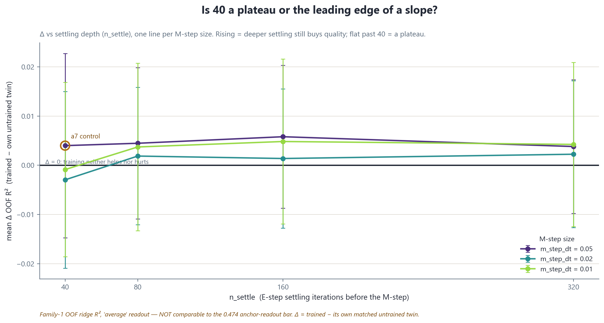
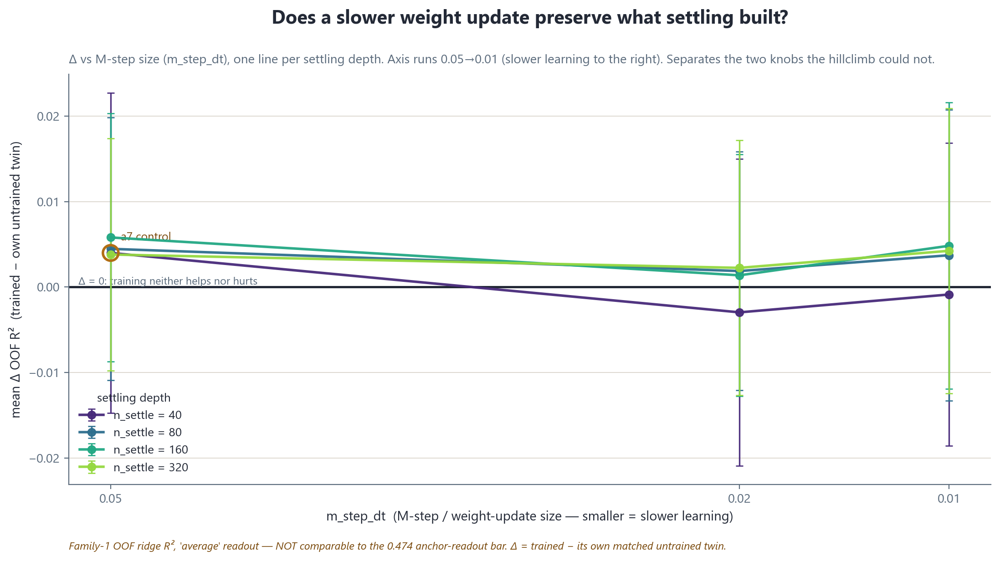
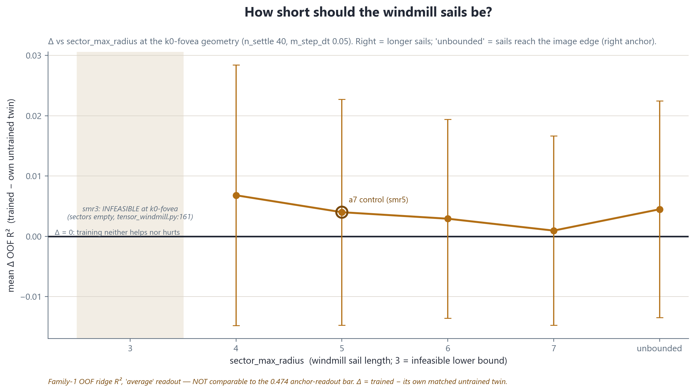
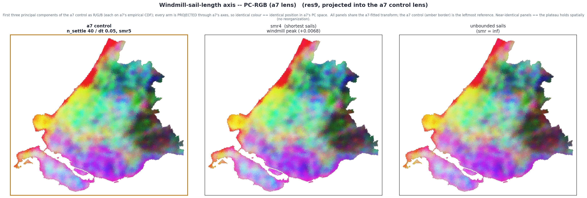
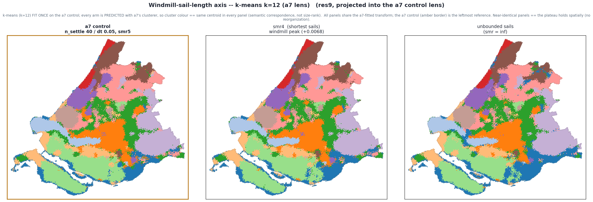
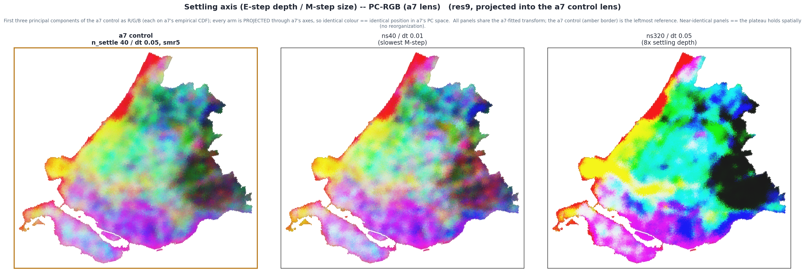
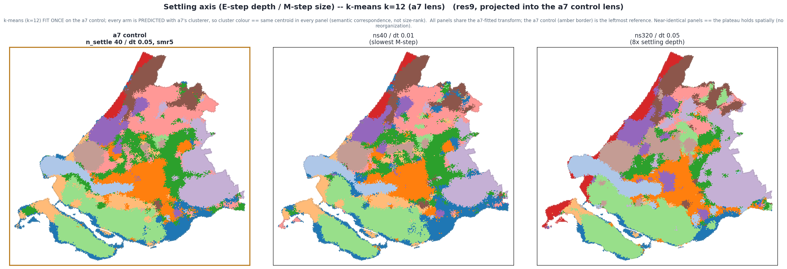

# Geo-MPC settling + windmill-bound sensitivity sweep — South Holland

**Status: FILLED (2026-07-21, session `twilight-whispering-brook`; header corrected 2026-07-27 by
`still-walking-willow` — the body was fully filled from the W3 aggregate
(`data/study_areas/south_holland/stage3_analysis/sensitivity_2026-07-20/sensitivity_results.{csv,json}`)
but this header still declared the prebuild-skeleton state).**
**Single source of truth**: this README. `latex/report.tex` mirrors it.

---

## The verdict, in five lines

1. **What we did.** Took the hillclimb winner **a7 `stack_0720`** (k0-fovea core 0,1,2,3, bounded
   sectors smr5, deep settling `n_settle 40` / `m_step_dt 0.05`) — the first geo-MPC arm ever to cross
   zero — and asked the two questions the hillclimb left open: **(1)** is 40/0.05 a *plateau* or the
   *leading edge of a slope*? **(2)** where does the windmill-sector bound stop helping? A settling
   grid (`n_settle ∈ {40,80,160,320}` × `m_step_dt ∈ {0.05,0.02,0.01}`) and a windmill-bound sweep
   (`sector_max_radius ∈ {4,5,6,7,unbounded}`), all at the a7 k0-fovea geometry, seed 42.
2. **The headline answer.** The settling gradient is a **flat noise floor — neither a plateau of genuine lift nor a slope**:
   the best settling cell reaches mean Δ **+0.0058** (trained − its own
   untrained twin, over the 8 non-circular targets), against a7's
   **+0.0040** anchor.
3. **How confident.** That best cell's spread across targets is ±**0.0145**
   (SD), **5** of 8 targets
   positive, paired **t = +1.13** (H₀: Δ = 0) →
   **not significant (p = 0.296 — and that is the single largest |t| anywhere in the swept space; every one of the 16 arms is n.s.)**. Honest framing up front: the a7 anchor was
   **+0.0040** at t = **+0.60**, statistically
   indistinguishable from zero.
4. **The windmill bound.** Along `sector_max_radius` at fixed 40/0.05, the peak is at
   **smr 4** (mean Δ +0.0068); the unbounded
   anchor sits at +0.0045. **smr3 is infeasible at k0-fovea** (see
   Warning C) and is reported as the empty lower bound of the axis.
5. **What it means / what's next.** 40/0.05 already sits at the noise-floor asymptote — deepening settling to ns320 (8× the compute) buys nothing, small `m_step_dt` at ns40 is if anything marginally negative, and the windmill-bound axis is equally flat; extra settling compute is not warranted — see
   [Open questions](#open-questions).

---

## Interpretive warnings — read before any number

*These are placed before the numbers on purpose. Every Δ, R², and t below is meaningless if read
against the wrong baseline family, readout mode, or an unmatched comparator.*

**A. All numbers are Family-1 OOF ridge probe scores.** Every R² and every Δ in this report is a
**Family-1** number: mean out-of-fold ridge R² over the downstream target battery, spatial 5-fold,
one shared canonical fold assignment
(`data/study_areas/south_holland/probes/fold_assignments_res9_anchor_k5_seed42.parquet`).
**Never mix these with Family-2 in-sample erosion-microtrace numbers** (the ridge tracker fit *during*
training to watch the representation erode; 0.5–0.86 by construction). Family-2 reads the *shape* of
erosion, never the *level* of quality. No Family-2 numbers appear in this report. If you bring one in,
it is not comparable to anything here.

**B. All numbers use the `average` readout — NOT comparable to the 0.474 anchor-readout bar.** Every
arm and every untrained twin here is read out with the **`average`** readout (fixation-averaged
core-disc latents), because that is what the trainer's inference path emits. The historical **0.474**
canonical bar was measured on the **`anchor`** readout — a *different embedding from the same weights*,
worth ~0.04 R² more on the untrained model. Within this report every comparison is average-vs-average,
so it is internally like-for-like. **The one thing you must not do is compare any arm here to the 0.474
anchor-readout bar.**

**C. smr3 is INFEASIBLE at the k0-fovea geometry.** With `core_radii = 0,1,2,3`, the largest core disc
is ring 3, so a `sector_max_radius ≤ 3` clips every sail *inside or at* the core and leaves the six
windmill sectors empty. The sampler validator refuses this
(`stage2_fusion/mpc/tensor_windmill.py:161` — sectors empty at `smr ≤ max(core_radii) = 3`). The
feasible windmill axis is therefore **{4, 5, 6, 7, unbounded}**; **smr3 is reported as the empty lower
bound**, never as a data point. (This is why the first chain kick aborted and was re-kicked with smr3
dropped — see [Provenance](#provenance).)

**D. Comparability trap — the 2026-07-06 ns40 parquet is NOT a baseline.** An older
`ns40` MPC parquet exists on disk from 2026-07-06. It **predates the windmill geometry** and has **no
matched untrained twin at its geometry**. It is *not* a baseline and *must never be cited as a
comparable* to any arm here. Every arm in this report is judged only against **its own** untrained twin
built at matching geometry AND matching settling params (see [Methods](#methods)).

---

## Mission (recorded)

Direct descendant of the 2026-07-20 hillclimb report's Affordance (c) — *"The calibration sweep — the
highest-value next experiment"* — and its Affordances (a)/(b) on windmill-bound and k0-fovea
canonicalization. The hillclimb established a7 as the first non-destructive arm and flagged that
`m_step_dt` / `n_settle` were tested at exactly **one** setting each and produced 81% of the total
improvement; nobody had looked at whether that was a plateau or a slope. This sweep answers that, plus
the where-does-the-sector-bound-stop question, in a single overnight serial chain.

Kapstok: `.claude/plans/2026-07-20-geo-mpc-sensitivity-overnight.md`;
ops surface: `.claude/plans/2026-07-20-geo-mpc-sensitivity-overnight.ops.md`.

---

## Methods

**16 arm-pairs.** 15 sensitivity arms + the a7 control, each paired with its own untrained twin:

- **Settling grid (11 new cells + a7 corner = 12 points).** At the a7 k0-fovea geometry
  (`--sector-max-radius 5 --core-radii 0,1,2,3`), sweep `n_settle ∈ {40,80,160,320}` ×
  `m_step_dt ∈ {0.05,0.02,0.01}`. The `(40, 0.05)` cell **is** a7 (folded in as the free control
  corner, not retrained). 12 grid points total.
- **Windmill-bound sweep (4 new cells + a7 corner = 5 points).** At fixed `n_settle 40` /
  `m_step_dt 0.05` and k0-fovea core, sweep `sector_max_radius ∈ {4,6,7,unbounded}`. `smr5` **is** a7
  (the shared corner). **smr3 is infeasible** (Warning C) — the axis is {4,5,6,7,unbounded}.

The a7 control is the shared corner of both blocks: it is the `(40, 0.05)` cell of the settling grid
**and** the `smr5` point of the windmill axis, so it anchors both curves.

**Matched-twin contract.** Every arm gets its **OWN** untrained-init twin, built at **matching geometry
(smr, core_radii) AND matching settling params (`n_settle`, `dt`) read authoritatively from the
checkpoint `config`** — not the run-tag, not the filename. This **retires the a6
`twin_settling_mismatch` anti-pattern** from the hillclimb (where a6 reused a2's twin built at a
different `n_settle`, making a6's Δ approximate). No twin is shared across arms that differ in any
parameter, so **every trained-minus-untrained Δ here is exact, not approximate**.

**Probe.** Shared-fold ridge over
`data/study_areas/south_holland/probes/fold_assignments_res9_anchor_k5_seed42.parquet`, reusing the
2026-07-07 matrix ridge command-builder + target registry, so scores are **protocol-identical** to the
2026-07-07 matrix and the 2026-07-20 hillclimb table. `n_anchors_effective` is asserted identical
across every arm (a `--limit-cells` confound raises loudly). Delta summaries are over the
**non-circular** target set (`poi_composition` excluded — partly circular with the POI input block).

**Inference.** In-process, geometry-faithful, frozen-weights, `average` readout — the sampler geometry
is reconstructed from each checkpoint's `config` (the sanctioned hillclimb-probes pattern), **not** via
`scripts/mpc/infer_south_holland.py` (which rebuilds the sampler without `core_radii` /
`sector_max_radius` and would crash the k0-fovea arms / silently mis-settle the bounded arms — see
[Open questions](#open-questions) D109).

---

## Figures

*Each figure carries a `*.provenance.yaml` sidecar (builder-regenerable, never copied) per
`.claude/rules/viz-discipline.md` §"Figure-creation discipline". Builder:
`scripts/one_off/2026-07-21-mpc-sensitivity-figures.py`.*

### Fig 1 — Δ vs `n_settle`, one line per `m_step_dt`

**What it means.** Each line asks: *holding the M-step size fixed, does settling the E-step deeper
before learning keep helping, or does it flatten?* A rising line = deeper settling is still buying
representation quality (a slope; more depth would help). A flat line past 40 = a plateau (40 was
already enough, extra settling is wasted compute). The horizontal rule at Δ = 0 is the boundary between
"training destroys the representation" (below) and "training adds something" (above). The a7 corner is
the leftmost point of the `m_step_dt = 0.05` line.

### Fig 2 — Δ vs `m_step_dt`, one line per `n_settle`

**What it means.** Each line asks: *holding the settling depth fixed, does a slower weight update
(smaller `m_step_dt`) preserve more of what settling built?* A line rising toward smaller `m_step_dt`
(right-to-left, since the axis runs 0.05 → 0.01) = slower learning helps; a flat line = the M-step size
is already fine at 0.05. Read together with Fig 1, this separates the two knobs the hillclimb could not
(they moved together in every hillclimb arm).

### Fig 3 — Δ vs `sector_max_radius` at k0-fovea (unbounded = right anchor)

**What it means.** *How short should the windmill sails be?* Moving right = longer sails (more
peripheral context per glimpse), with **`unbounded`** as the right anchor (sails reach the edge of the
anchor image). A peak at an interior smr = there is an optimal sail length; monotone toward unbounded =
bounding never helps. **smr3 is the empty lower bound** (infeasible at k0-fovea, Warning C) and is
drawn as an annotated gap, not a plotted point. The a7 corner sits at smr5.

---

## Results

*(Filled from `sensitivity_results.{csv,json}` in the W4 fill-in pass. All Δ = trained − own untrained
twin, mean over the 8 non-circular targets; `average` readout;
Family-1 OOF ridge.)*

### Settling grid — per-arm mean Δ

| n_settle \ m_step_dt | 0.05 | 0.02 | 0.01 |
|---|---|---|---|
| 40  | +0.0040 (a7 control) | −0.0030 | −0.0009 |
| 80  | +0.0045 | +0.0019 | +0.0037 |
| 160 | +0.0058 | +0.0014 | +0.0048 |
| 320 | +0.0038 | +0.0022 | +0.0042 |

### Windmill-bound axis — per-arm mean Δ

| sector_max_radius | 3 | 4 | 5 | 6 | 7 | unbounded |
|---|---|---|---|---|---|---|
| mean Δ | *infeasible* | +0.0068 | +0.0040 (a7 control) | +0.0029 | +0.0009 | +0.0045 |

### Honesty table — is the best cell's win real?

| arm | mean Δ | SD across targets | SE | t (H₀: Δ=0) | targets positive | best / worst target |
|---|---|---|---|---|---|---|
| a7 (control) | +0.0040 | 0.0187 | 0.0066 | +0.60 | 4 / 8 | +0.0372 / −0.0231 |
| sens_ns160_dt0.05 (best) | +0.0058 | 0.0145 | 0.0051 | +1.13 | 5 / 8 | vierkant +0.0269 / groen −0.0182 |

*(a7 row transcribed from the 2026-07-20 hillclimb; it is the shared control corner. Read the best-cell
sign honestly — |t| < 2 is a coin flip, not a constructive result.)*

---

## The maps — does the plateau hold spatially?

The curves say the **quality** plateau (every arm n.s.). The maps ask whether the plateau is also
**spatial** — whether deepening the settling E-step, slowing the M-step, or changing the windmill sail
length visibly *reorganizes* the learned representation over South Holland.

**The fit-once lens (read this before the panels).** All 16 sensitivity arms share the a7 k0-fovea
geometry, so every arm is 256-D in the *same* `MPC000..MPC255` readout layout. That lets us view every arm
through **one shared lens** — comparability across arms *is* the message here (deliberately unlike the
hillclimb map suite, where a1 at 192-D and a7 at 256-D were different spaces fit independently). We fit the
entire colour pipeline **once** on the a7 control — PCA(16), a per-PC empirical CDF for the PC-RGB scale,
and a `StandardScaler` + k-means (k=12) — then *project / predict* every other arm through that same fitted
state. So in **PC-RGB** an identical colour means an identical position in a7's PC space; in **k-means** a
cluster colour is the *same centroid* in every panel (true semantic correspondence, not the size-rank colour
matching the hillclimb suite used). Five arms, both axes; a7 is the shared reference (amber border,
leftmost). *Caveat:* arms are independently trained (seed 42, identical architecture and data; the settling
arms differ only in inference-time E-step depth / M-step size), so their latent frames descend from a common
initialization and are treated as approximately aligned. A fixed lens cannot fully separate genuine spatial
reorganization from latent-basis reorientation — but the shared-clusterer k-means is the robust cross-check:
if a rotation had scrambled an arm, a7's clusterer would return confetti, not a7's partition.

### Windmill-sail-length axis — a clean spatial plateau

Sail length changes nothing. smr4 (shortest feasible sails, the +0.0068 table peak), a7 (smr5), and
unbounded are visually indistinguishable in **both** PC-RGB (Fig S3) and the shared-clusterer k-means
(Fig S4) — the k=12 partition is reproduced almost hex-for-hex, only boundary speckle differs. This matches
the flat Δ-vs-`sector_max_radius` curve: the windmill axis is a clean spatial plateau.

### Settling axis — macro-skeleton preserved, deep settling reshuffles locally

The slowest-M-step arm (ns40 / dt0.01) stays close to a7. The 8×-settling-depth arm (ns320 / dt0.05) is the
one arm that visibly **moves**: in PC-RGB (Fig S1) the eastern hinterland reprojects (cyan / black), and
under a7's clusterer (Fig S2) some regions are reassigned (a red patch appears near the Den Haag coast, the
eastern lavender cluster grows). **Crucially, ns320 keeps a7's gross skeleton** — red NE strip, brown top,
orange centre, blue SE delta — it is *not* scrambled into confetti, which rules out a wholesale latent-basis
rotation. So the reshuffling is genuine-but-modest *local* reorganization. And it buys nothing downstream:
ns320 / dt0.05's mean Δ (+0.0038) is statistically identical to a7's (+0.0040), both n.s.

### What the maps add to the verdict

The quality plateau is real and holds across both axes. Spatially it is **uniform** on the windmill axis
(no reorganization) and **quality-neutral-with-modest-local-drift** on the settling axis. **Deep settling
*reorganizes* the embedding a little without *improving* it: 8× the settling compute produces at most
cosmetic, quality-neutral local reshuffling and zero probe-quality gain — the plateau, seen from the map.**

*Den Haag zoom deliberately not built:* the province-scale fit-once row already resolves the axis-level
verdict (windmill flat, settling modest local drift); a per-subset Den Haag refit would re-pose the same
comparability question at neighbourhood scale without changing it, and would trade away the clean shared
lens that carries the cross-arm message. Builder:
`scripts/one_off/2026-07-21-mpc-sensitivity-map-suite.py` (fit-once on a7, each figure with a
`*.provenance.yaml` sidecar; rows-in == rows-plotted asserted per panel, 12/12 = 34,302 anchor hexes).

---

## Open questions

*Carried from the ops plan. Each is surfaced, not decided.*

**(1) `infer_south_holland.py` geometry-fix still unlanded (D109). `[open|0d]` `[needs:stage2-fusion-architect]`**
`scripts/mpc/infer_south_holland.py` rebuilds its `WindmillGlimpseSampler` **without** passing
`core_radii` / `sector_max_radius`, so it reconstructs only the canonical geometry — it crashes on
k0-fovea checkpoints (10-stream weights vs 9-stream sampler) and silently mis-settles bounded-sector
checkpoints. This sweep worked around it with in-process inference (per AD-1). The durable ~2-line fix
(pass the checkpoint config's geometry) is a durable-producer behaviour change owned by stage2's lane.
Flagged by `deep-spinning-tide` (D109); that terminal closed out before landing it.

**(2) a7 sidecar `git_dirty: true` — attributed, not clean. `[open|0d]`**
The a7 control checkpoint's sidecar records `git_dirty: true` (the hillclimb chain carried uncommitted
peer-lane edits). Tonight's sensitivity cells ran under the AD-2 **code-path-scoped** git-dirty gate:
no dirty files under `scripts/ stage2_fusion/ stage1_modalities/ stage3_analysis/ utils/` at any cell
start; peer dirt in `.claude/**` + `reports/**` was recorded and attributed, not a STOP. See
[Provenance](#provenance).

**(3) Producer sidecar gap — `train_south_holland.py` does not stamp settling params. `[open|0d]` `[needs:stage2-fusion-architect]`**
`scripts/mpc/train_south_holland.py` stamps geometry (`core_radii`, `sector_max_radius`) into the
train sidecar `extra` but **NOT** `n_settle` / `m_step_dt`. The W3 probe runner works around this by
reading them **authoritatively from the checkpoint `config`** at inference and stamping them into the
output embedding sidecars (which become the normative source the aggregate reads back). Suggested fix
to stage2: stamp `n_settle` / `m_step_dt` into the train sidecar `extra` at the producer.

**(4) smr3 infeasibility at k0-fovea. `[open|0d]`**
Not a bug — a geometric consequence (Warning C). Reported as the empty lower bound of the windmill
axis. Whether the sampler should raise a clearer message, or whether the feasible axis should be
documented in the trainer's `--sector-max-radius` help, is a small stage2 nicety, not a blocker.

---

## Provenance

**Chain.** Kicked at **`f7ea56b`** (after the first-kick abort on smr3 infeasibility; matrix re-formed
as 15 RUN + 2 SKIP + 1 INFEASIBLE). Training chain: 15/15 RUN `rc=0`, ~5h total, seed 42, all cells.
Per-cell `git status --porcelain` snapshots live in the chain log for attribution.

**Probes.** W3 twin+probe runner at **`cdabf70`** — own untrained twin per arm from the checkpoint
`config`, in-process geometry-faithful inference, shared-fold ridge, idempotent (skip-if-exists per
embedding). Phase-structured: all inference first (32 passes = 16 arms × trained+twin), then all ridge
probes, then aggregate.

**AD-2 git-dirty gate (code-path-scoped).** The sidecar `git_dirty` field is a **global**-porcelain
signal; three peer terminals wrote scratchpads continuously overnight, so a global-clean gate was not
under this lane's control. The hard gate was refined to **no dirty files under `scripts/`,
`stage2_fusion/`, `stage1_modalities/`, `stage3_analysis/`, `utils/`** at kick and each cell start.
Peer dirt in `.claude/**` and `reports/**` is recorded, attributed, and disclosed here — not a STOP.
(This is why some sidecars carry `git_dirty: true` while the *code* that ran was clean; the sha
identifies the committed code ancestor.)

**Aggregate artifacts.**

| What | Where |
|---|---|
| Aggregate results | `data/study_areas/south_holland/stage3_analysis/sensitivity_2026-07-20/sensitivity_results.{csv,json}` |
| Arm + twin embeddings | `data/study_areas/south_holland/stage2_multimodal/mpc_cone_glimpse/sensitivity_2026-07-20/` |
| Checkpoints | `.../mpc_cone_glimpse/checkpoints/mpc_south_holland_res9_2022_seed42_sens_*.pt` (+ a7 `stack_0720`) |
| Chain log | `logs/` (per-cell porcelain snapshots) |
| Figures | `reports/2026-07-21-geo-mpc-sensitivity/figures/` (each with `*.provenance.yaml`) |

**Input artifacts** (all `region_id`-indexed, sidecars green, vintage 2022): AlphaEarth 64D + hex2vec
50D (**`filter_id: filter_v2`**, read from the sidecar not the filename) + roads 64D, concatenated to
178D and z-scored per block — identical to the hillclimb.

---

## Figures index

| Fig | File | Content |
|---|---|---|
| 1 | `figures/fig1_delta_vs_nsettle.png` | Δ vs `n_settle`, one line per `m_step_dt` (settling grid) |
| 2 | `figures/fig2_delta_vs_mstepdt.png` | Δ vs `m_step_dt`, one line per `n_settle` (settling grid) |
| 3 | `figures/fig3_delta_vs_smr_k0fovea.png` | Δ vs `sector_max_radius` at k0-fovea (unbounded = right anchor; smr3 = empty lower bound) |
| S1 | `figures/figS1_pcrgb.png` | Settling axis, PC-RGB in the a7 fit-once lens (a7 \| ns40/dt0.01 \| ns320/dt0.05) |
| S2 | `figures/figS2_kmeans.png` | Settling axis, shared-clusterer k-means k=12 in the a7 lens (same 3 arms) |
| S3 | `figures/figS3_pcrgb.png` | Windmill axis, PC-RGB in the a7 fit-once lens (a7 \| smr4 \| unbounded) |
| S4 | `figures/figS4_kmeans.png` | Windmill axis, shared-clusterer k-means k=12 in the a7 lens (same 3 arms) |

*Fig S1–S4 builder: `scripts/one_off/2026-07-21-mpc-sensitivity-map-suite.py` (fit-once on a7).*
