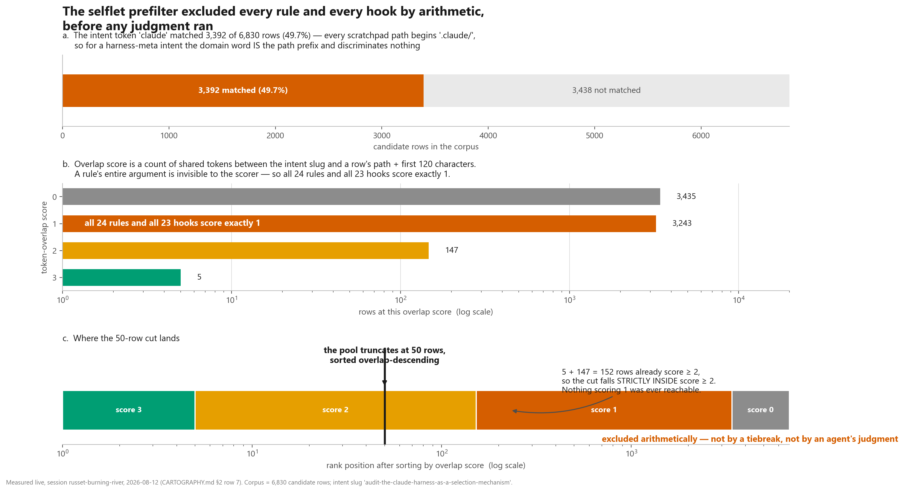
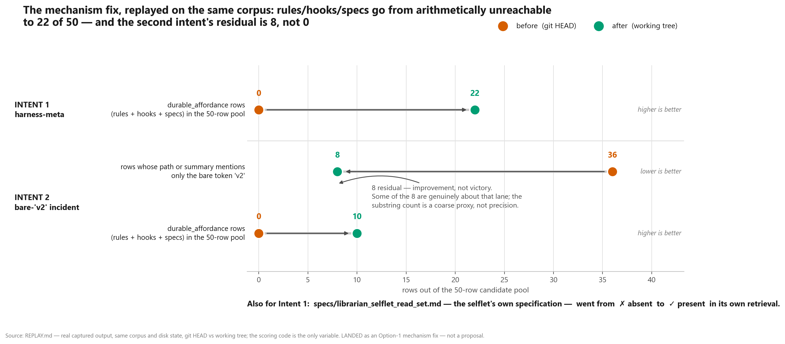
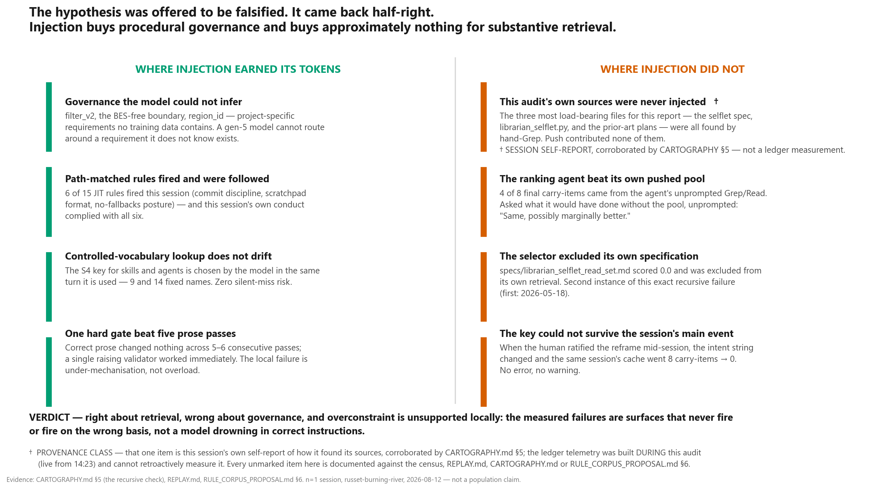

# The Harness as a Selection Mechanism — an empirical audit

**Session `russet-burning-river`, 2026-08-12.** Everything below was measured this session
against the live repository, with **one** exception that is labelled wherever it appears: the
"this audit's own sources were never injected" finding (Figure 5, right column, first item) is
this session's own **self-report**, corroborated by the cartography, not an instrument reading.
Figures are the report; the prose is the index to them.

The `.claude` harness — rules, hooks, skills, agent definitions, scratchpad indices — is far
larger than any context window. So something has to **select** what a session actually sees.
This audit asked three questions about that: **what selects, on what basis, and how well?**

The user offered a hypothesis to be **falsified**, not confirmed: *a current-generation model
routes around a lacking harness, so injecting all this context may be paying a tax for value
it does not deliver.* The answer came back genuinely two-sided, and Figure 5 shows both sides
at equal weight on purpose.

**Terms used throughout** (defined once, here):
- **Injection** — content the harness pushes into a session's context automatically, before the
  session asks for anything. Distinguished from content a session *fetches* for itself.
- **Selflet** — this project's memory-retrieval system. It ranks the project's own past traces
  (scratchpads, plans, specs, rules, hooks) against the session's stated intent and hands the
  top matches forward as **carry-items**.
- **Carry-item** — one ranked prior trace passed into a new session so it does not redo work.
- **Overlap score** — the selflet's first-stage relevance number: a count of word tokens shared
  between the intent phrase and a candidate row's file path plus its first 120 characters.
- **S0–S4** — a five-level typology of *how* a selection is made, from S0 (no criterion at all)
  to S4 (exact key lookup). Defined in the project's internal theory note
  `deepresearch/luhmann_selection_and_the_harness.md` §6 (private, not part of this public atlas).

**One caveat that applies to every token number in this report**: token counts are a labelled
**`chars/4` approximation** — no tokenizer is a dependency of this project. Line counts and
character counts are exact. Never read the approximation as a true token count.

---

## ⚠️ Awaiting your ratification

Three foundational questions surfaced by this audit are **written up but deliberately not
decided**. They change what the memory system *is*, which per this project's own
`.claude/rules/novel-research-escalate-dont-default.md` (private, not part of this public atlas)
is yours to close, not an agent's — including the agent that just gathered the evidence for them.

Full write-up with options laid out and none pre-selected: **[`PROPOSALS.md`](PROPOSALS.md)**.

| # | Question | Evidence in this report | Status |
|---|---|---|---|
| 1 | **Retrieval-on-demand (Option 3)** — should the harness stop *pushing* a pre-ranked memory pool at session entry, and instead expose memory as a tool the model *pulls* when it discovers mid-task that it needs something? | Figure 5, right column: the ranking agent's own search beat its pushed pool; this audit's own three key sources were never injected (**session self-report**, not a measurement — see Method). Counter-evidence in the left column: path-matched rules are a push mechanism that works. | **Not implemented. Not decided.** |
| 2 | **Cache-key semantics** — the memory cache is addressed by a slug of the intent string. When you ratified this session's reframe, the intent string changed and the same session's cache went 8 carry-items → 0. What *should* "the same request" mean when intent legitimately evolves mid-session? | Figure 4, S4 column (`selflet cache read`); PROPOSALS.md lays out three key designs. | **Key untouched this session. Three options, none pre-selected.** |
| 3 | **Should retention and protention share one selector?** Retention answers *"has this been done?"* (age is a weak signal). Protention answers *"is this still the goal?"* (age is a strong signal). They currently share one scorer, one sort, and one 50-slot quota. | Figure 1 (the shared quota is what the 50-row cut applies to). A per-source floor landed this session as mitigation; the architectural question is untouched. | **Mitigated, not resolved.** |

---

## Selected figures

Two of the audit's five original figures (injection cost by surface, the selector-type map) are
omitted from this public copy — one because its token counts are a same-day snapshot that goes
stale within hours, the other because it depends on a private internal theory note. The three
below stand on their own.

### Figure 1 — The selection funnel

**The memory selector threw away every rule and every hook in the project by arithmetic, before
any judgment ran.** Asked to find prior work relevant to a harness-meta intent, the selflet
scored 6,830 candidate rows; the intent word `claude` matched 3,392 of them (49.7%) and
discriminated nothing, because every scratchpad path already begins `.claude/`. Scores landed
`0 → 3,435 · 1 → 3,243 · 2 → 147 · 3 → 5`. The pool truncates at 50 rows sorted score-descending,
and 5 + 147 = 152 rows already scored ≥ 2 — so the cut fell *strictly inside* score ≥ 2. All 24
rule files and all 23 hook files in the corpus score exactly 1, because the scorer only ever sees a file's path plus its
first 120 characters: a rule's entire argument is invisible to the thing deciding whether the rule
is relevant. Measured live, 2026-08-12; source: [`CARTOGRAPHY.md`](CARTOGRAPHY.md) §2 row 7.

### Figure 3 — The fix, replayed

**The mechanism fix landed and was verified by replay, not by inspection — and its second result
is honestly short of a win.** Both the pre-fix (git `HEAD`) and post-fix (working tree) scorers
were run over the same corpus, same disk state, with the scoring code as the only variable. For
the harness-meta intent, rules + hooks + specs went from **0 of 50 rows to 22 of 50**, and
`specs/librarian_selflet_read_set.md` — the selflet's own specification, which had scored 0.0 and
been excluded from its own retrieval — now surfaces. For the 2026-08-07 bare-`v2` intent, rows
dominated by that one uninformative token dropped from 36 to **8, not 0**; some of the 8 genuinely
belong to that lane, and the substring count is a coarse proxy rather than a precision measure.
Improvement, not victory. Full captured output: [`REPLAY.md`](REPLAY.md).

### Figure 5 — The two-sided verdict

**The hypothesis was half-right, and the half it got wrong matters as much as the half it got
right.** Injection is doing real, verified work for *procedural governance*: 6 of 15 path-matched
rules fired this session and were in fact followed, and a model of any generation cannot route
around project-specific requirements it has no way of knowing exist (`filter_v2`, the BES-free
boundary, `region_id`). Injection did approximately **nothing** for *substantive retrieval*: the
three most load-bearing files for this very report were never pushed and were all found by hand —
**that item is the session's own self-report** (marked `†` in the figure, corroborated by
[`CARTOGRAPHY.md`](CARTOGRAPHY.md) §5), not a ledger measurement, because the ledger was built
*during* this audit and cannot retroactively instrument it. Alongside it, and documented in the
selflet's own written record: the ranking agent, asked unprompted what it would have done without
its pushed pool, answered *"Same, possibly marginally better."* Overconstraint — too many correct
instructions drowning the model — is **not supported locally**: correct prose changed nothing
across five to six consecutive passes, while a single hard gate worked immediately. The measured
failures are under-mechanisation, not overload. n=1 session; not a population claim.

---

## Landed vs proposed

Kept strictly separate. Landed means committed code; proposed means written up and waiting.

**Landed this session:**

| What | Where | Evidence |
|---|---|---|
| Selflet Stage-1 scoring fix (widened match surface, per-source floors, IDF weighting) | `.claude/hooks/librarian_selflet.py`, commit `1706759e` | Figure 3 / [`REPLAY.md`](REPLAY.md) |
| `/niche` aged-item injection un-broken | `.claude/hooks/user-prompt-submit.py`, commit `46360aff` | see defect 1 below |
| Injection-cost census (reporter only, no behaviour changed) | `.claude/ledger/digest/2026-08-12-injection-cost-census.{json,md}` | not reproduced in this public copy — a same-day token snapshot, excluded per the sync note above |

**Proposed, not implemented:** everything in [`PROPOSALS.md`](PROPOSALS.md) and every row of
[`RULE_CORPUS_PROPOSAL.md`](RULE_CORPUS_PROPOSAL.md). No rule file was modified by this audit.

## Two harness defects found

1. **The `/niche` aged-item injection was silently dead on the happy path.** A nested `import re`
   shadowed the module-level import for the whole function, so the scan that surfaces
   `[open|Nd]` / `[stale]` / `[escalated]` items raised `UnboundLocalError` **whenever the
   terminal's active plan was correctly configured** — and a fail-open wrapper swallowed it.
   An injection surface that fails invisibly, and specifically when set up correctly, is the worst
   available failure signature for a mechanism whose job is to stop things being forgotten.
   Reproduced, then fixed (`46360aff`).
2. **The `Explore` agent cannot satisfy the mandatory-scratchpad contract.** The protocol requires
   every working agent to write a dated scratchpad entry; the agent registry grants `Explore` no
   write tools. A dispatch to it this session correctly refused rather than fabricating a write,
   and its findings were lost. Work `Explore` does leaves no trace for any future retrieval to
   find, by construction. Unresolved.

## The companion documents

This README is the front door. The substance lives in four siblings, none of it duplicated here:

- **[`CARTOGRAPHY.md`](CARTOGRAPHY.md)** — the per-surface table. All 89 measured records grouped
  into 19 rows: trigger, selector chain with the binding link marked, corpus, audience, measured
  cost, whether discarded material is visible anywhere, and a verdict with cited evidence. Also
  §3, the named list of every point where selection is made by the dumbest available layer, and
  §5, the recursive check of this session against its own hypothesis.
- **[`RULE_CORPUS_PROPOSAL.md`](RULE_CORPUS_PROPOSAL.md)** — a *proposed* diff over all 24 rules,
  ordered by confidence, with the current external evidence on instruction density and long-context
  degradation, and an explicit section on what is genuinely unsettled.
- **[`PROPOSALS.md`](PROPOSALS.md)** — the three human-gated architectural questions summarised in
  the ratification table above.
- **[`REPLAY.md`](REPLAY.md)** — the captured before/after output behind Figure 3, including the
  honest reconciliation of the two intent slugs this session used.

Theory note: `deepresearch/luhmann_selection_and_the_harness.md` (private, not part of this public
atlas) — the S0–S4 typology and the diagnostic question "can the consumer see what was discarded?".

## Method and honesty gates

- Every figure number traces to the injection-cost census, `REPLAY.md`, `CARTOGRAPHY.md`, or the raw
  ledger, named in the figure's own footer.
- **The `.claude/ledger` telemetry went live at 14:23, mid-session, and its delta computation was
  validated on synthetic `Read` events.** It therefore instruments *future* sessions; it cannot
  retroactively measure this one. Two consequences, both already marked where they appear: the
  spawn count cited above is a **lower bound** (pre-14:23 spawns were never recorded), and the
  "never injected" finding in Figure 5 is a **session self-report** corroborated by
  `CARTOGRAPHY.md` §5, not an instrument reading. Nothing else in this report depends on that
  telemetry: the funnel counts (Figure 1) and the replay (Figure 3) come from the injection-cost
  census — a **separate reporter run** that measured files and captured payloads directly and
  merely *stores its output* under `.claude/ledger/digest/`. Those stand as measured.
- Token counts throughout are `chars/4`; line and character counts are exact. The census records a
  `token_method` and a `measurement_kind` (`exercised` = a real payload captured or a real
  subprocess run; `static` = file size under a confirmed mechanism) per record.
- Figures are regenerated, never copied: rebuild with
  `python scripts/one_off/2026-08-12-harness-audit-figures.py`. Provenance sidecar:
  [`figures/figures.provenance.yaml`](figures/figures.provenance.yaml).
- This is one session's measurement. The recursive check in `CARTOGRAPHY.md` §5 is n=1 and says so.
